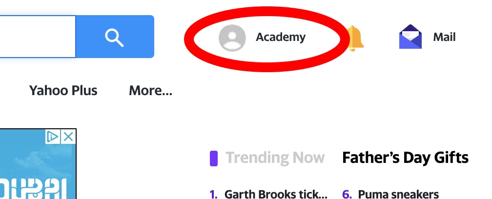

import Tabs from '@theme/Tabs';
import TabItem from '@theme/TabItem';

# Logging into a website {#logging-into-a-website}

**Understand the "login flow" - logging into a website, then maintaining a logged in status within different browser contexts for an efficient automation process.**

---

Whether it's auto-renewing a service, automatically sending a message on an interval, or automatically cancelling a Netflix subscription, one of the most popular things headless browsers are used for is automating things within a user's account on a certain website. Of course, automating anything on a user's account requires the automation of the login process as well. In this lesson, we'll be covering how to build a simple login flow from start to finish with Playwright or Puppeteer.

> In this lesson, we'll be using [yahoo.com](https://yahoo.com) as an example. Feel free to follow along using the academy Yahoo account credentials, or even deviate from the lesson a bit and try building a login flow for a different website of your choosing!

## Inputting credentials {#inputting-credentials}

The full logging in process on Yahoo goes like this:

1. Accept their cookies policy, then load the main page.
2. Click on the **Sign in** button and load the sign-in page.
3. Enter the username and click the button.
4. Enter the password and click the button, then load the main page again (but now logged in).

When we lay out the steps like this in [pseudocode](https://en.wikipedia.org/wiki/Pseudocode), it makes it significantly easier to translate over into code. Here's the four steps above loop in JavaScript:

<Tabs groupId="main">
<TabItem value="Playwright" label="Playwright">

```javascript
import { chromium } from 'playwright';

// Launch a browser and open a page
const browser = await chromium.launch({ headless: false });
const page = await browser.newPage();

await page.goto('https://www.yahoo.com/');

// Agree to the cookies terms, then click on the "Sign in" button
await page.click('button[name="agree"]');
await page.waitForSelector('a:has-text("Sign in")');

await page.click('a:has-text("Sign in")');
await page.waitForLoadState('load');

// Type in the username and continue forward
await page.type('input[name="username"]', 'YOUR-LOGIN-HERE');
await page.click('input[name="signin"]');

// Type in the password and continue forward
await page.type('input[name="password"]', 'YOUR-PASSWORD-HERE');
await page.click('button[name="verifyPassword"]');
await page.waitForLoadState('load');

// Wait for 10 seconds so we can see that we have in fact
// successfully logged in
await page.waitForTimeout(10000)

```

</TabItem>
<TabItem value="Puppeteer" label="Puppeteer">

```javascript
import puppeteer from 'puppeteer';

// Launch a browser and open a page
const browser = await puppeteer.launch({ headless: false });
const page = await browser.newPage();

await page.goto('https://www.yahoo.com/');

// Agree to the cookies terms, then click on the "Sign in" button
await Promise.all([page.waitForSelector('a[data-ylk*="sign-in"]'), page.click('button[name="agree"]')]);
await Promise.all([page.waitForNavigation(), page.click('a[data-ylk*="sign-in"]')]);

// Type in the username and continue forward
await page.type('input[name="username"]', 'YOUR-LOGIN-HERE');
await Promise.all([page.waitForNavigation(), page.click('input[name="signin"]')]);

// Type in the password and continue forward
await page.type('input[name="password"]', 'YOUR-PASSWORD-HERE');
await Promise.all([page.waitForNavigation(), page.click('button[name="verifyPassword"]')]);

// Wait for 10 seconds so we can see that we have in fact
// successfully logged in
await page.waitForTimeout(10000)

```

</TabItem>
</Tabs>

Great! If you're following along and you've replaced the placeholder credentials with your own, you should see that on the final navigated page, you're logged into your Yahoo account.



## Passing around cookies {#passing-around-cookies}

Now that we all know how to log into a website let's try and solve a more complex problem. Let's say that we want to send 3 different emails at the same exact time, all from the **Academy** Yahoo account.

Here is an object we'll create which represents the three different emails we want to send:

```js
const emailsToSend = [
    {
        to: 'abcdef123randomFakeEmail@gmail.com',
        subject: 'Hello',
        body: 'This is a message.',
    },
    {
        to: 'testingtesting12345903@aol.com',
        subject: 'Testing',
        body: 'I love the academy!'
    },
    {
        to: 'jimmyJohnBillyBob420@academy.net',
        subject: 'Apify is awesome!',
        body: 'Some content.'
    }
];
```

What we could do is log in 3 different times, then simply automate the sending of each email; however, this is extremely inefficient. When you log into a website, one of the main things that allows you to stay logged in and perform actions on your account is the [cookies](../../../glossary/concepts/http_cookies.md) stored in your browser. These cookies tell the website that you have been authenticated, and that you have the permissions required to modify your account.

With this knowledge of cookies, it can be concluded that we can just pass the cookies generated by the code above right into each new browser context that we use to send each email. That way, we won't have to run the login flow each time.

### Retrieving cookies {#retrieving-cookies}

First, we'll grab the cookies we generated:

<Tabs groupId="main">
<TabItem value="Playwright" label="Playwright">

```javascript
// Grab the cookies from the default browser context,
// which was used to log in
const cookies = await browser.contexts()[0].cookies();

```

</TabItem>
<TabItem value="Puppeteer" label="Puppeteer">

```javascript
// Grab the cookies from the page used to log in
const cookies = await page.cookies();

```

</TabItem>
</Tabs>

Notice that in Playwright, cookies are tied to a **BrowserContext**, while in Puppeteer they are tied to a **Page**.

### Passing cookies to a new browser context {#passing-cookies-to-new-contexts}

Remembering from the section above, we stored our cookies in a variable named **cookies**. These can now be directly passed into a new browser context like so:

<Tabs groupId="main">
<TabItem value="Playwright" label="Playwright">

```javascript
// Create a fresh non-persistent browser context
const sendEmailContext = await browser.newContext();
// Add the cookies from the previous one to this one so that
// we'll be logged into Yahoo without having to re-do the
// logging in automation
await sendEmailContext.addCookies(cookies);
const page2 = await sendEmailContext.newPage();

// Notice that we are logged in, even though we didn't
// go through the logging in process again!
await page2.goto('https://mail.yahoo.com/');
await page2.waitForTimeout(10000);

```

</TabItem>
<TabItem value="Puppeteer" label="Puppeteer">

```javascript
// Create a fresh non-persistent browser context
const sendEmailContext = await browser.createIncognitoBrowserContext();
// Create a new page on the new browser context and set its cookies
// to be the same ones from the page we used to log into the website.
const page2 = await sendEmailContext.newPage();
await page2.setCookie(...cookies);

// Notice that we are logged in, even though we didn't
// go through the logging in process again!
await page2.goto('https://mail.yahoo.com/');
await page2.waitForTimeout(10000);

```

</TabItem>
</Tabs>

### Completing the flow {#completing-the-flow}

Now that passing cookies around is out of the way, we can finally complete the goal at hand and send all three of these emails at once. This can be done by mapping through **emailsToSend**, creating an array of promises where each function creates a new browser context, adds the initial cookies, and sends the email.

<Tabs groupId="main">
<TabItem value="Playwright" label="Playwright">

```javascript
// Grab the cookies from the default browser context,
// which was used to log in
const cookies = await browser.contexts()[0].cookies();

await page.close();

// Create an array of promises, running the cookie passing
// and email sending logic each time
const promises = emailsToSend.map(({ to, subject, body }) =>
    (async () => {
        // Create a fresh non-persistent browser context
        const sendEmailContext = await browser.newContext();
        // Add the cookies from the previous one to this one so that
        // we'll be logged into Yahoo without having to re-do the
        // logging in automation
        await sendEmailContext.addCookies(cookies);
        const page2 = await sendEmailContext.newPage();

        await page2.goto('https://mail.yahoo.com/');

        // Compose an email
        await page2.click('a[aria-label="Compose"]');

        // Populate the fields with the details from the object
        await page2.type('input#message-to-field', to);
        await page2.type('input[data-test-id="compose-subject"]', subject);
        await page2.type('div[data-test-id="compose-editor-container"] div[contenteditable="true"]', body);

        // Send the email
        await page2.click('button[title="Send this email"]');

        await sendEmailContext.close();
    })()
);

// Wait for all emails to be sent
await Promise.all(promises);

```

</TabItem>
<TabItem value="Puppeteer" label="Puppeteer">

```javascript
// Create an array of promises, running the cookie passing
// and email sending logic each time
const promises = emailsToSend.map(({ to, subject, body }) =>
    (async () => {
        // Create a fresh non-persistent browser context
        const sendEmailContext = await browser.createIncognitoBrowserContext();
        // Create a new page on the new browser context and set its cookies
        // to be the same ones from the page we used to log into the website.
        const page2 = await sendEmailContext.newPage();
        await page2.setCookie(...cookies);

        await page2.goto('https://mail.yahoo.com/');

        // Compose an email
        await page2.click('a[aria-label="Compose"]');

        // Populate the fields with the details from the object
        await page2.type('input#message-to-field', to);
        await page2.type('input[data-test-id="compose-subject"]', subject);
        await page2.type('div[data-test-id="compose-editor-container"] div[contenteditable="true"]', body);

        // Send the email
        await page2.click('button[title="Send this email"]');

        await sendEmailContext.close();
    })()
);

// Wait for all emails to be sent
await Promise.all(promises);

```

</TabItem>
</Tabs>

## Final code overview {#final-code}

To sum up what we've built during this lesson:

1. Log into Yahoo.
2. Store the login cookies in a variable.
3. Concurrently create 3 new browser contexts and inject the cookies into each one.
4. Concurrently send 3 emails from the same account logged into in the first step.

Here's what the final code looks like:

<Tabs groupId="main">
<TabItem value="Playwright" label="Playwright">

```javascript
import { chromium } from 'playwright';

const emailsToSend = [
    {
        to: 'abcdef123randomFakeEmail@gmail.com',
        subject: 'Hello',
        body: 'This is a message.',
    },
    {
        to: 'testingtesting12345903@aol.com',
        subject: 'Testing',
        body: 'I love the academy!',
    },
    {
        to: 'jimmyJohnBillyBob420@academy.net',
        subject: 'Apify is awesome!',
        body: 'Some content.',
    },
];

const browser = await chromium.launch({ headless: false });
const page = await browser.newPage();

// Login logic
await page.goto('https://www.yahoo.com/');

await page.click('button[name="agree"]');
await page.waitForSelector('a:has-text("Sign in")');

await page.click('a:has-text("Sign in")');
await page.waitForLoadState('load');

await page.type('input[name="username"]', 'YOUR-LOGIN-HERE');
await page.click('input[name="signin"]');

await page.type('input[name="password"]', 'YOUR-PASSWORD-HERE');
await page.click('button[name="verifyPassword"]');
await page.waitForLoadState('load');

const cookies = await browser.contexts()[0].cookies();

await page.close();

// Email sending logic
const promises = emailsToSend.map(({ to, subject, body }) =>
    (async () => {
        const sendEmailContext = await browser.newContext();
        await sendEmailContext.addCookies(cookies);
        const page2 = await sendEmailContext.newPage();

        await page2.goto('https://mail.yahoo.com/');

        await page2.click('a[aria-label="Compose"]');

        await page2.type('input#message-to-field', to);
        await page2.type('input[data-test-id="compose-subject"]', subject);
        await page2.type('div[data-test-id="compose-editor-container"] div[contenteditable="true"]', body);

        await page2.click('button[title="Send this email"]');

        await sendEmailContext.close();
    })()
);

await Promise.all(promises);

await browser.close();

```

</TabItem>
<TabItem value="Puppeteer" label="Puppeteer">

```javascript
import puppeteer from 'puppeteer';

const emailsToSend = [
    {
        to: 'abcdef123randomFakeEmail@gmail.com',
        subject: 'Hello',
        body: 'This is a message.',
    },
    {
        to: 'testingtesting12345903@aol.com',
        subject: 'Testing',
        body: 'I love the academy!',
    },
    {
        to: 'jimmyJohnBillyBob420@academy.net',
        subject: 'Apify is awesome!',
        body: 'Some content.',
    },
];

const browser = await puppeteer.launch({ headless: false });
const page = await browser.newPage();

// Login logic
await page.goto('https://www.yahoo.com/');

await Promise.all([page.waitForSelector('a[data-ylk*="sign-in"]'), page.click('button[name="agree"]')]);
await Promise.all([page.waitForNavigation(), page.click('a[data-ylk*="sign-in"]')]);

await page.type('input[name="username"]', 'YOUR-LOGIN-HERE');
await Promise.all([page.waitForNavigation(), page.click('input[name="signin"]')]);

await page.type('input[name="password"]', 'YOUR-PASSWORD-HERE');
await Promise.all([page.waitForNavigation(), page.click('button[name="verifyPassword"]')]);

const cookies = await page.cookies();
await page.close();

// Email sending logic
const promises = emailsToSend.map(({ to, subject, body }) =>
    (async () => {
        const sendEmailContext = await browser.createIncognitoBrowserContext();
        const page2 = await sendEmailContext.newPage();
        await page2.setCookie(...cookies);

        await page2.goto('https://mail.yahoo.com/');

        await page2.click('a[aria-label="Compose"]');

        await page2.type('input#message-to-field', to);
        await page2.type('input[data-test-id="compose-subject"]', subject);
        await page2.type('div[data-test-id="compose-editor-container"] div[contenteditable="true"]', body);

        await page2.click('button[title="Send this email"]');

        await sendEmailContext.close();
    })()
);

await Promise.all(promises);

await browser.close();

```

</TabItem>
</Tabs>

## Next up {#next}

In the [next lesson](./paginating_through_results.md), you'll learn how to paginate through results on a website.
