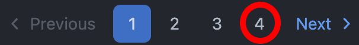

import Tabs from '@theme/Tabs';
import TabItem from '@theme/TabItem';

# Paginating through results {#paginating-through-results}

**Learn how to paginate through results on websites that use either pagination based on page numbers or dynamic lazy loading.**

---

If you're trying to [collect data](../executing_scripts/extracting_data.md) on a website that has millions, thousands, or even hundreds of results, it is very likely that they are paginating their results to reduce strain on their back-end as well as on the users loading and rendering the content.


## Page number-based pagination {#page-number-based-pagination}

At the time of writing this lesson, Facebook has [over a hundred repositories on GitHub](https://github.com/orgs/facebook/repositories). By default, GitHub lists repositories in descending order based on when they were last updated (the most recently updated ones are at the top of the list).

We want to scrape the titles, links, and descriptions of all of Facebook's repositories; however, GitHub only displays 30 repositories per page. This means we need to paginate through the results. Let's start by defining some variables:

```js
// This is where we'll store scraped data
const repositories = [];

// This will come handy when resolving relative links
const BASE_URL = 'https://github.com';

// We'll use this URL a couple of times within our code
const REPOSITORIES_URL = `${BASE_URL}/orgs/facebook/repositories`;
```

### Finding the last page {#finding-the-last-page}

Going through each page is easier if we know in advance when to stop. The good news is that GitHub's pagination is upfront about the number of the last page, so the total number of pages is available to us:



As Facebook adds repositories over time, the number you see in your browser might be different. Let's read the number now with the following code:

<Tabs groupId="main">
<TabItem value="Playwright" label="Playwright">

```js
import { chromium } from 'playwright';

const repositories = [];
const BASE_URL = 'https://github.com';
const REPOSITORIES_URL = `${BASE_URL}/orgs/facebook/repositories`;

const browser = await chromium.launch({ headless: false });
const firstPage = await browser.newPage();
await firstPage.goto(REPOSITORIES_URL);

const lastPageElement = firstPage.locator('a[aria-label*="Page "]:nth-last-child(2)');
const lastPageLabel = await lastPageElement.getAttribute('aria-label');
const lastPageNumber = Number(lastPageLabel.replace(/\D/g, ''));
console.log(lastPageNumber);

await browser.close();
```

</TabItem>
<TabItem value="Puppeteer" label="Puppeteer">

```js
import puppeteer from 'puppeteer';

const repositories = [];
const BASE_URL = 'https://github.com';
const REPOSITORIES_URL = `${BASE_URL}/orgs/facebook/repositories`;

const browser = await puppeteer.launch({ headless: false });
const firstPage = await browser.newPage();
await firstPage.goto(REPOSITORIES_URL);

const lastPageLabel = await firstPage.$eval(
    'a[aria-label*="Page "]:nth-last-child(2)',
    (element) => element.getAttribute('aria-label'),
);
const lastPageNumber = Number(lastPageLabel.replace(/\D/g, ''));
console.log(lastPageNumber);

await browser.close();
```

</TabItem>
</Tabs>

:::tip :nth-last-child

[Learn more](https://developer.mozilla.org/en-US/docs/Web/CSS/:nth-last-child) about the `:nth-last-child` pseudo-class. It works like `:nth-child`, but starts from the bottom of the parent element's children instead of from the top.

:::

When we run the code, it prints the total number of pages, which is `4` at the time of writing this lesson. Now let's scrape repositories from all the pages.

First, we'll add a function that can handle the data extraction for a single page and return an array of results. Then, to start, we'll run this function just for the first page:

<Tabs groupId="main">
<TabItem value="Playwright" label="Playwright">

```js
import { chromium } from 'playwright';
import * as cheerio from 'cheerio';

const repositories = [];
const BASE_URL = 'https://github.com';
const REPOSITORIES_URL = `${BASE_URL}/orgs/facebook/repositories`;

// Scrapes all repositories from a single page
const scrapeRepos = async (page) => {
    const $ = cheerio.load(await page.content());

    return [...$('.list-view-item')].map((item) => {
        const repoElement = $(item);
        return {
            title: repoElement.find('h4').text().trim(),
            description: repoElement.find('.repos-list-description').text().trim(),
            link: new URL(repoElement.find('h4 a').attr('href'), BASE_URL).href,
        };
    });
};

const browser = await chromium.launch({ headless: false });
const firstPage = await browser.newPage();
await firstPage.goto(REPOSITORIES_URL);

const lastPageElement = firstPage.locator('a[aria-label*="Page "]:nth-last-child(2)');
const lastPageLabel = await lastPageElement.getAttribute('aria-label');
const lastPageNumber = Number(lastPageLabel.replace(/\D/g, ''));

// Push all results from the first page to the repositories array
repositories.push(...(await scrapeRepos(firstPage)));

// Log the 30 repositories scraped from the first page
console.log(repositories);

await browser.close();
```

</TabItem>
<TabItem value="Puppeteer" label="Puppeteer">

```js
import puppeteer from 'puppeteer';
import * as cheerio from 'cheerio';

const repositories = [];
const BASE_URL = 'https://github.com';
const REPOSITORIES_URL = `${BASE_URL}/orgs/facebook/repositories`;

// Scrapes all repositories from a single page
const scrapeRepos = async (page) => {
    const $ = cheerio.load(await page.content());

    return [...$('.list-view-item')].map((item) => {
        const repoElement = $(item);
        return {
            title: repoElement.find('h4').text().trim(),
            description: repoElement.find('.repos-list-description').text().trim(),
            link: new URL(repoElement.find('h4 a').attr('href'), BASE_URL).href,
        };
    });
};

const browser = await puppeteer.launch({ headless: false });
const firstPage = await browser.newPage();
await firstPage.goto(REPOSITORIES_URL);

const lastPageLabel = await firstPage.$eval(
    'a[aria-label*="Page "]:nth-last-child(2)',
    (element) => element.getAttribute('aria-label'),
);
const lastPageNumber = Number(lastPageLabel.replace(/\D/g, ''));

// Push all results from the first page to the repositories array
repositories.push(...(await scrapeRepos(firstPage)));

// Log the 30 repositories scraped from the first page
console.log(repositories);

await browser.close();
```

</TabItem>
</Tabs>

If we run the code above, it outputs data about the first 30 repositories listed:

```text
$ node index.js
[
  {
    title: 'react-native',
    description: 'A framework for building native applications using React',
    link: 'https://github.com/facebook/react-native'
  },
  {
    title: 'fboss',
    description: 'Facebook Open Switching System Software for controlling network switches.',
    link: 'https://github.com/facebook/fboss'
  },
  ...
]
```

### Making a request for each results page {#making-a-request-for-each-results-page}

If we click around the pagination links, we can observe that all the URLs follow certain format. For example, we can find page number 2 at `https://github.com/orgs/facebook/repositories?page=2`.

That means we could construct URL for each page if we had an array of numbers with the same range as the pages. If `lastPageNumber` is `4`, the following code creates `[0, 1, 2, 3, 4]`:

```js
const array = Array(lastPageNumber + 1); // getting an array of certain size
const numbers = [...array.keys()]; // getting the keys (the actual numbers) as another array
```

Page `0` doesn't exist though and we've already scraped page `1`, so we need one more step to remove those:

```js
const pageNumbers = numbers.slice(2); // removes the first two numbers
```

To have our code examples shorter, we'll squash the above to a single line of code:

```js
const pageNumbers = [...Array(lastPageNumber + 1).keys()].slice(2);
```

Now let's scrape repositories for each of these numbers. We'll create promises for each request and collect results to a single `repositories` array:

```js
const pageNumbers = [...Array(lastPageNumber + 1).keys()].slice(2);
const promises = pageNumbers.map((pageNumber) => (async () => {
    const paginatedPage = await browser.newPage();

    // Construct the URL by setting the ?page=... parameter to value of pageNumber
    const url = new URL(REPOSITORIES_URL);
    url.searchParams.set('page', pageNumber);

    // Scrape the page
    await paginatedPage.goto(url.href);
    const results = await scrapeRepos(paginatedPage);

    // Push results to the repositories array
    repositories.push(...results);

    await paginatedPage.close();
})(),
);
await Promise.all(promises);

// For brievity logging just the count of repositories scraped
console.log(repositories.length);
```

:::caution Scaling to hundreds of requests

Using `Promise.all()` is okay for up to ten or maybe tens of requests, but won't work well for large numbers. When scraping hundreds or even thousands of pages, it's necessary to have more robust infrastructure in place, such as a request queue.

:::

### Final code {#final-pagination-code}

The code below puts all the bits together:

<Tabs groupId="main">
<TabItem value="Playwright" label="Playwright">

```js
import { chromium } from 'playwright';
import * as cheerio from 'cheerio';

const repositories = [];
const BASE_URL = 'https://github.com';
const REPOSITORIES_URL = `${BASE_URL}/orgs/facebook/repositories`;

// Scrapes all repositories from a single page
const scrapeRepos = async (page) => {
    const $ = cheerio.load(await page.content());

    return [...$('.list-view-item')].map((item) => {
        const repoElement = $(item);
        return {
            title: repoElement.find('h4').text().trim(),
            description: repoElement.find('.repos-list-description').text().trim(),
            link: new URL(repoElement.find('h4 a').attr('href'), BASE_URL).href,
        };
    });
};

const browser = await chromium.launch({ headless: false });
const firstPage = await browser.newPage();

await firstPage.goto(REPOSITORIES_URL);

const lastPageElement = firstPage.locator('a[aria-label*="Page "]:nth-last-child(2)');
const lastPageLabel = await lastPageElement.getAttribute('aria-label');
const lastPageNumber = Number(lastPageLabel.replace(/\D/g, ''));

// Push all results from the first page to the repositories array
repositories.push(...(await scrapeRepos(firstPage)));

await firstPage.close();

const pageNumbers = [...Array(lastPageNumber + 1).keys()].slice(2);
const promises = pageNumbers.map((pageNumber) => (async () => {
    const paginatedPage = await browser.newPage();

    // Construct the URL by setting the ?page=... parameter to value of pageNumber
    const url = new URL(REPOSITORIES_URL);
    url.searchParams.set('page', pageNumber);

    // Scrape the page
    await paginatedPage.goto(url.href);
    const results = await scrapeRepos(paginatedPage);

    // Push results to the repositories array
    repositories.push(...results);

    await paginatedPage.close();
})(),
);
await Promise.all(promises);

// For brievity logging just the count of repositories scraped
console.log(repositories.length);

await browser.close();
```

</TabItem>
<TabItem value="Puppeteer" label="Puppeteer">

```js
import puppeteer from 'puppeteer';
import * as cheerio from 'cheerio';

const repositories = [];
const BASE_URL = 'https://github.com';
const REPOSITORIES_URL = `${BASE_URL}/orgs/facebook/repositories`;

// Scrapes all repositories from a single page
const scrapeRepos = async (page) => {
    const $ = cheerio.load(await page.content());

    return [...$('.list-view-item')].map((item) => {
        const repoElement = $(item);
        return {
            title: repoElement.find('h4').text().trim(),
            description: repoElement.find('.repos-list-description').text().trim(),
            link: new URL(repoElement.find('h4 a').attr('href'), BASE_URL).href,
        };
    });
};

const browser = await puppeteer.launch({ headless: false });
const firstPage = await browser.newPage();

await firstPage.goto(REPOSITORIES_URL);

const lastPageLabel = await firstPage.$eval(
    'a[aria-label*="Page "]:nth-last-child(2)',
    (element) => element.getAttribute('aria-label'),
);
const lastPageNumber = Number(lastPageLabel.replace(/\D/g, ''));

// Push all results from the first page to the repositories array
repositories.push(...(await scrapeRepos(page)));

await firstPage.close();

const pageNumbers = [...Array(lastPageNumber + 1).keys()].slice(2);
const promises = pageNumbers.map((pageNumber) => (async () => {
    const paginatedPage = await browser.newPage();

    // Construct the URL by setting the ?page=... parameter to value of pageNumber
    const url = new URL(REPOSITORIES_URL);
    url.searchParams.set('page', pageNumber);

    // Scrape the page
    await paginatedPage.goto(url.href);
    const results = await scrapeRepos(paginatedPage);

    // Push results to the repositories array
    repositories.push(...results);

    await paginatedPage.close();
})(),
);
await Promise.all(promises);

// For brievity logging just the count of repositories scraped
console.log(repositories.length);

await browser.close();
```

</TabItem>
</Tabs>

At the time of writing this lesson, a summary at the top of the [listing page](https://github.com/orgs/facebook/repositories) claims that Facebook has 115 repositories. Whatever is the number you are seeing, it should be equal to the number you get if you run the program:

```text
$ node index.js
115
```

## Lazy-loading pagination {#lazy-loading-pagination}

Pagination based on page numbers is straightforward to automate, but many websites use [lazy-loading](https://en.wikipedia.org/wiki/Lazy_loading) instead.

> On websites with lazy-loading pagination, if [API scraping](../../api_scraping/index.md) is a viable option, it is a much better approach due to reliability and performance.

Take a moment to look at and scroll through the women's clothing section [on About You's website](https://www.aboutyou.com/c/women/clothing-20204). Notice that the items are loaded as you scroll, and that there are no page numbers. Because of how drastically different this pagination implementation is from the previous one, it also requires a different workflow to scrape.

We're going to scrape the brand and price from the first 75 results on the **About You** page linked above. Here's our basic setup:

<Tabs groupId="main">
<TabItem value="Playwright" label="Playwright">

```js
import { chromium } from 'playwright';

// Create an array where all scraped products will
// be pushed to
const products = [];

const browser = await chromium.launch({ headless: false });
const page = await browser.newPage();

await page.goto('https://www.aboutyou.com/c/women/clothing-20204');

await browser.close();
```

</TabItem>
<TabItem value="Puppeteer" label="Puppeteer">

```js
import puppeteer from 'puppeteer';

// Create an array where all scraped products will
// be pushed to
const products = [];

const browser = await puppeteer.launch({ headless: false });
const page = await browser.newPage();

await page.goto('https://www.aboutyou.com/c/women/clothing-20204');

await browser.close();
```

</TabItem>
</Tabs>

### Auto scrolling {#auto-scrolling}
<!-- vale off -->
Now, what we'll do is grab the height in pixels of a result item to have somewhat of a reference to how much we should scroll each time, as well as create a variable for keeping track of how many pixels have been scrolled.
<!-- vale on -->
```js
// Grab the height of result item in pixels, which will be used to scroll down
const itemHeight = await page.$eval('a[data-testid*="productTile"]', (elem) => elem.clientHeight);

// Keep track of how many pixels have been scrolled down
const totalScrolled = 0;
```

Then, within a `while` loop that ends once the length of the **products** array has reached 75, we'll run some logic that scrolls down the page and waits 1 second before running again.

<Tabs groupId="main">
<TabItem value="Playwright" label="Playwright">

```js
while (products.length < 75) {
    await page.mouse.wheel(0, itemHeight * 3);
    totalScrolled += itemHeight * 3;
    // Allow the products 1 second to load
    await page.waitForTimeout(1000);
}
```

</TabItem>
<TabItem value="Puppeteer" label="Puppeteer">

```js
while (products.length < 75) {
    await page.mouse.wheel({ deltaY: itemHeight * 3 });
    totalScrolled += itemHeight * 3;
    // Allow the products 1 second to load
    await page.waitForTimeout(1000);
}
```

</TabItem>
</Tabs>

This will work; however, what if we reach the bottom of the page and there are say, only 55 total products on the page? That would result in an infinite loop. Because of this edge case, we have to keep track of the constantly changing available scroll height on the page.

<Tabs groupId="main">
<TabItem value="Playwright" label="Playwright">

```js
while (products.length < 75) {
    const scrollHeight = await page.evaluate(() => document.body.scrollHeight);

    await page.mouse.wheel(0, itemHeight * 3);
    totalScrolled += itemHeight * 3;
    // Allow the products 1 second to load
    await page.waitForTimeout(1000);

    // Data extraction login will go here

    const innerHeight = await page.evaluate(() => window.innerHeight);

    // if the total pixels scrolled is equal to the true available scroll
    // height of the page, we've reached the end and should stop scraping.
    // even if we haven't reach our goal of 75 products.
    if (totalScrolled >= scrollHeight - innerHeight) {
        break;
    }
}
```

</TabItem>
<TabItem value="Puppeteer" label="Puppeteer">

```js
while (products.length < 75) {
    const scrollHeight = await page.evaluate(() => document.body.scrollHeight);

    await page.mouse.wheel({ deltaY: itemHeight * 3 });
    totalScrolled += itemHeight * 3;
    // Allow the products 1 second to load
    await page.waitForTimeout(1000);

    // Data extraction login will go here

    const innerHeight = await page.evaluate(() => window.innerHeight);

    // if the total pixels scrolled is equal to the true available scroll
    // height of the page, we've reached the end and should stop scraping.
    // even if we haven't reach our goal of 75 products.
    if (totalScrolled >= scrollHeight - innerHeight) {
        break;
    }
}
```

</TabItem>
</Tabs>

Now, the `while` loop will exit out if we've reached the bottom of the page.

> Generally, you'd want to create a utility function that handles this scrolling logic instead of putting all of the code directly into the while loop.

### Extracting data {#extracting-data}

Within the loop, we can grab hold of the total number of items on the page. To avoid extracting and pushing duplicate items to the **products** array, we can use the `.slice()` method to cut out the items we've already scraped.

```js
import * as cheerio from 'cheerio';

const $ = cheerio.load(await page.content());

// Grab the newly loaded items
const items = [...$('a[data-testid*="productTile"]')].slice(products.length);

const newItems = items.map((item) => {
    const elem = $(item);

    return {
        brand: elem.find('p[data-testid="brandName"]').text().trim(),
        price: elem.find('span[data-testid="finalPrice"]').text().trim(),
    };
});

products.push(...newItems);
```

### Final code {#final-lazy-loading-code}

With everything completed, this is what we're left with:

<Tabs groupId="main">
<TabItem value="Playwright" label="Playwright">

```js
import { chromium } from 'playwright';
import * as cheerio from 'cheerio';

const products = [];

const browser = await chromium.launch({ headless: false });
const page = await browser.newPage();

await page.goto('https://www.aboutyou.com/c/women/clothing-20204');

// Grab the height of result item in pixels, which will be used to scroll down
const itemHeight = await page.$eval('a[data-testid*="productTile"]', (elem) => elem.clientHeight);

// Keep track of how many pixels have been scrolled down
let totalScrolled = 0;

while (products.length < 75) {
    const scrollHeight = await page.evaluate(() => document.body.scrollHeight);

    await page.mouse.wheel(0, itemHeight * 3);
    totalScrolled += itemHeight * 3;
    // Allow the products 1 second to load
    await page.waitForTimeout(1000);

    const $ = cheerio.load(await page.content());

    // Grab the newly loaded items
    const items = [...$('a[data-testid*="productTile"]')].slice(products.length);

    const newItems = items.map((item) => {
        const elem = $(item);

        return {
            brand: elem.find('p[data-testid="brandName"]').text().trim(),
            price: elem.find('span[data-testid="finalPrice"]').text().trim(),
        };
    });

    products.push(...newItems);

    const innerHeight = await page.evaluate(() => window.innerHeight);

    // if the total pixels scrolled is equal to the true available scroll
    // height of the page, we've reached the end and should stop scraping.
    // even if we haven't reach our goal of 75 products.
    if (totalScrolled >= scrollHeight - innerHeight) {
        break;
    }
}

console.log(products.slice(0, 75));

await browser.close();
```

</TabItem>
<TabItem value="Puppeteer" label="Puppeteer">

```js
import puppeteer from 'puppeteer';
import * as cheerio from 'cheerio';

const products = [];

const browser = await puppeteer.launch({ headless: false });
const page = await browser.newPage();

await page.goto('https://www.aboutyou.com/c/women/clothing-20204');

// Grab the height of result item in pixels, which will be used to scroll down
const itemHeight = await page.$eval('a[data-testid*="productTile"]', (elem) => elem.clientHeight);

// Keep track of how many pixels have been scrolled down
let totalScrolled = 0;

while (products.length < 75) {
    const scrollHeight = await page.evaluate(() => document.body.scrollHeight);

    await page.mouse.wheel({ deltaY: itemHeight * 3 });
    totalScrolled += itemHeight * 3;
    // Allow the products 1 second to load
    await page.waitForTimeout(1000);

    const $ = cheerio.load(await page.content());

    // Grab the newly loaded items
    const items = [...$('a[data-testid*="productTile"]')].slice(products.length);

    const newItems = items.map((item) => {
        const elem = $(item);

        return {
            brand: elem.find('p[data-testid="brandName"]').text().trim(),
            price: elem.find('span[data-testid="finalPrice"]').text().trim(),
        };
    });

    products.push(...newItems);

    const innerHeight = await page.evaluate(() => window.innerHeight);

    // if the total pixels scrolled is equal to the true available scroll
    // height of the page, we've reached the end and should stop scraping.
    // even if we haven't reach our goal of 75 products.
    if (totalScrolled >= scrollHeight - innerHeight) {
        break;
    }
}

console.log(products.slice(0, 75));

await browser.close();
```

</TabItem>
</Tabs>

## Quick note {#quick-note}

The examples shown in this lesson are not the only ways to paginate through websites. They are here to serve as solid examples, but don't view them as the end-all be-all of scraping paginated websites. The methods you use and the algorithms you write might differ to various degrees based on what pages you're scraping and how your specific target website implemented pagination.

## Next up {#next}

We're actively working in expanding this section of the course, so stay tuned!
