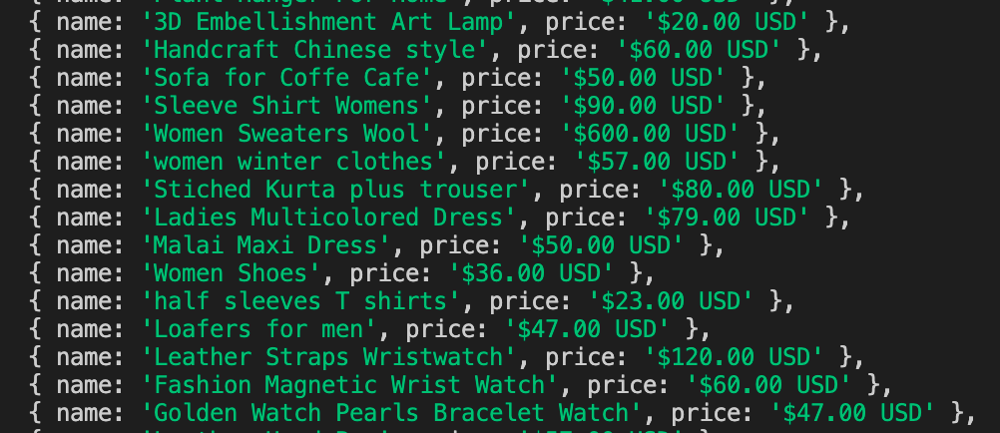

import Tabs from '@theme/Tabs';
import TabItem from '@theme/TabItem';

# Extracting data {#extracting-data}

**Learn how to extract data from a page with evaluate functions, then how to parse it by using a second library called Cheerio.**

---

Now that we know how to execute scripts on a page, we're ready to learn a bit about [data extraction](../../scraping_basics_javascript/data_extraction/index.md). In this lesson, we'll be scraping all the on-sale products from our [Fakestore](https://demo-webstore.apify.org/search/on-sale) website. Playwright & Puppeteer offer two main methods for data extraction:

1. Directly in `page.evaluate()` and other evaluate functions such as `page.$$eval()`.
2. In the Node.js context using a parsing library such as [Cheerio](https://www.npmjs.com/package/cheerio)

## Setup

Here is the base setup for our code, upon which we'll be building off of in this lesson:

<Tabs groupId="main">
<TabItem value="Playwright" label="Playwright">

```js
import { chromium } from 'playwright';

const browser = await chromium.launch({ headless: false });
const page = await browser.newPage();

await page.goto('https://demo-webstore.apify.org/search/on-sale');

// code will go here

await page.waitForTimeout(10000);

await browser.close();
```

</TabItem>
<TabItem value="Puppeteer" label="Puppeteer">

```js
import puppeteer from 'puppeteer';

const browser = await puppeteer.launch({ headless: false });
const page = await browser.newPage();

await page.goto('https://demo-webstore.apify.org/search/on-sale');

// code will go here

await page.waitForTimeout(10000);

await browser.close();
```

</TabItem>
</Tabs>

<!-- > Notice the slightly different syntax between Playwright and Puppeteer with `waitForLoadState('DOMContentLoaded')` and `waitForNavigation({ waitUntil: 'DOMContentLoaded' })`. Sometimes, the differences are fairly subtle like this, but later on we'll run into some more significant differences. -->

## Extracting from the browser context {#extracting-in-page-evaluate}

Whatever is returned from the callback function in `page.evaluate()` will be returned by the evaluate function, which means that we can set it to a variable like so:

```js
const products = await page.evaluate(() => ({ foo: 'bar' }));

console.log(products); // -> { foo: 'bar' }
```

We'll be returning a bunch of product objects from this function, which will be accessible back in our Node.js context after the promise has resolved. Let's now go ahead and write some data extraction code to collect each product:

```js
const products = await page.evaluate(() => {
    const productCards = Array.from(document.querySelectorAll('a[class*="ProductCard_root"]'));

    return productCards.map((element) => {
        const name = element.querySelector('h3[class*="ProductCard_name"]').textContent;
        const price = element.querySelector('div[class*="ProductCard_price"]').textContent;

        return {
            name,
            price,
        };
    });
});

console.log(products);
```

When we run this code, we see this logged to our console:



## Using jQuery {#using-jquery}

Working with `document.querySelector` is cumbersome and quite verbose, but with the `page.addScriptTag()` function and the latest [jQuery CDN link](https://releases.jquery.com/), we can inject jQuery into the current page to gain access to its syntactical sweetness:

```js
await page.addScriptTag({ url: 'https://code.jquery.com/jquery-3.6.0.min.js' });
```

This function will literally append a `<script>` tag to the `<head>` element of the current page, allowing access to jQuery's API when using `page.evaluate()` to run code in the browser context.

Now, since we're able to use jQuery, let's translate our vanilla JavaScript code within the `page.evaluate()` function to jQuery:

```js
await page.addScriptTag({ url: 'https://code.jquery.com/jquery-3.6.0.min.js' });

const products = await page.evaluate(() => {
    const productCards = Array.from($('a[class*="ProductCard_root"]'));

    return productCards.map((element) => {
        const card = $(element);

        const name = card.find('h3[class*="ProductCard_name"]').text();
        const price = card.find('div[class*="ProductCard_price"]').text();

        return {
            name,
            price,
        };
    });
});

console.log(products);
```

This will output the same exact result as the code in the previous section.

## Parsing in the Node.js context {#parsing-in-node-context}

One of the most popular parsing libraries for Node.js is [Cheerio](https://www.npmjs.com/package/cheerio), which can be used in tandem with Playwright and Puppeteer. It is extremely beneficial to parse the page's HTML in the Node.js context for a number of reasons:

- You can port the code between headless browser data extraction and plain HTTP data extraction
- You don't have to worry in which context you're working (which can sometimes be confusing)
- Errors are easier to handle when running in the base Node.js context

To install it, we can run the following command within your project's directory:

```shell
npm install cheerio
```

Then, we'll import the `load` function like so:

```js
import { load } from 'cheerio';
```

Finally, we can create a `Cheerio` object based on our page's current content like so:

```js
const $ = load(await page.content());
```

> It's important to note that this `$` object is static. If any content on the page changes, the `$` variable will not automatically be updated. It will need to be re-declared or re-defined.

Here's our full code so far:

<Tabs groupId="main">
<TabItem value="Playwright" label="Playwright">

```js
import { chromium } from 'playwright';
import { load } from 'cheerio';

const browser = await chromium.launch({ headless: false });
const page = await browser.newPage();

await page.goto('https://demo-webstore.apify.org/search/on-sale');

const $ = load(await page.content());

// code will go here

await browser.close();
```

</TabItem>
<TabItem value="Puppeteer" label="Puppeteer">

```js
import puppeteer from 'puppeteer';
import { load } from 'cheerio';

const browser = await puppeteer.launch({ headless: false });
const page = await browser.newPage();

await page.goto('https://demo-webstore.apify.org/search/on-sale');

const $ = load(await page.content());

// code will go here

await browser.close();
```

</TabItem>
</Tabs>

Now, to loop through all of the products, we'll make use of the `$` object and loop through them while safely in the server-side context rather than running the code in the browser. Notice that this code is nearly exactly the same as the jQuery code above - it is just not running inside of a `page.evaluate()` in the browser context.

```js
const $ = load(await page.content());

const productCards = Array.from($('a[class*="ProductCard_root"]'));

const products = productCards.map((element) => {
    const card = $(element);

    const name = card.find('h3[class*="ProductCard_name"]').text();
    const price = card.find('div[class*="ProductCard_price"]').text();

    return {
        name,
        price,
    };
});

console.log(products);
```

## Final code

Here's what our final optimized code looks like:

<Tabs groupId="main">
<TabItem value="Playwright" label="Playwright">

```js
import { chromium } from 'playwright';
import { load } from 'cheerio';

const browser = await chromium.launch({ headless: false });
const page = await browser.newPage();

await page.goto('https://demo-webstore.apify.org/search/on-sale');

const $ = load(await page.content());

const productCards = Array.from($('a[class*="ProductCard_root"]'));

const products = productCards.map((element) => {
    const card = $(element);

    const name = card.find('h3[class*="ProductCard_name"]').text();
    const price = card.find('div[class*="ProductCard_price"]').text();

    return {
        name,
        price,
    };
});

console.log(products);

await browser.close();
```

</TabItem>
<TabItem value="Puppeteer" label="Puppeteer">

```js
import puppeteer from 'puppeteer';
import { load } from 'cheerio';

const browser = await puppeteer.launch({ headless: false });
const page = await browser.newPage();

await page.goto('https://demo-webstore.apify.org/search/on-sale');

const $ = load(await page.content());

const productCards = Array.from($('a[class*="ProductCard_root"]'));

const products = productCards.map((element) => {
    const card = $(element);

    const name = card.find('h3[class*="ProductCard_name"]').text();
    const price = card.find('div[class*="ProductCard_price"]').text();

    return {
        name,
        price,
    };
});

console.log(products);

await browser.close();
```

</TabItem>
</Tabs>

## Next up {#next}

Our [next lesson](../reading_intercepting_requests.md) will be discussing something super cool - request interception and reading data from requests and responses. It's like using DevTools, except programmatically!
