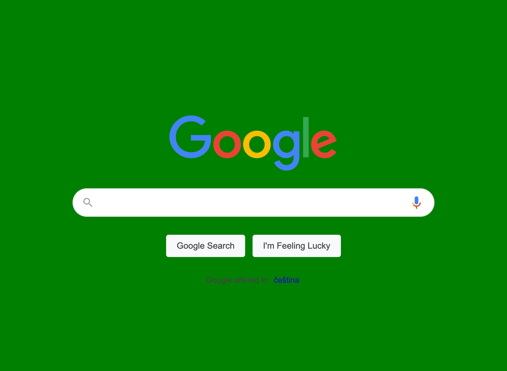
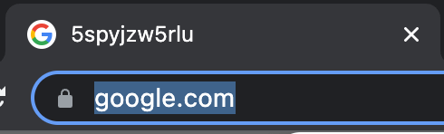

import Tabs from '@theme/Tabs';
import TabItem from '@theme/TabItem';

# Executing scripts {#executing-scripts}

**Understand the two different contexts which your code can be run in, and how to run custom scripts in the context of the browser.**

---

An important concept to understand when dealing with headless browsers is the **context** in which your code is being run. For example, if you try to use the native `fs` Node.js module (used in the previous lesson) while running code in the context of the browser, errors will be thrown saying that it is undefined. Similarly, if you are trying to use `document.querySelector()` or other browser-specific functions in the server-side Node.js context, errors will also be thrown.

;

Here is an example of a common mistake made by beginners to Puppeteer/Playwright:

```js
// This code is incorrect!
import { chromium } from 'playwright';

const browser = await chromium.launch({ headless: false });
const page = await browser.newPage();

// visit google
await page.goto('https://google.com/');

// change background to green
document.body.style.background = 'green';

await page.waitForTimeout(10000)

await browser.close();
```

When we try and run this, we get this error:

```text
ReferenceError: document is not defined
```

The reason this is happening is because we're trying to run browser-side code on the server-side where it is not supported. [`document`](https://developer.mozilla.org/en-US/docs/Web/API/Document) is a property of the browser [**Window**](https://developer.mozilla.org/en-US/docs/Web/API/Window) instance that holds the rendered website; therefore, this API is not available in Node.js. So how are we supposed to run code within the context of the browser?

## Running code in the context of the browser {#running-in-browser-context}

We will use `page.evaluate()` to run our code in the browser. This method takes a callback as its first parameter, which will be executed within the browser.

<Tabs groupId="main">
<TabItem value="Playwright" label="Playwright">

```javascript
import { chromium } from 'playwright';

const browser = await chromium.launch({ headless: false });
const page = await browser.newPage();

await page.goto('https://google.com/');

await page.evaluate(() => {
    document.body.style.background = 'green';
});

await page.waitForTimeout(10000)

await browser.close();

```
</TabItem>
<TabItem value="Puppeteer" label="Puppeteer">

```javascript
import puppeteer from 'puppeteer';

const browser = await puppeteer.launch({ headless: false });
const page = await browser.newPage();

await page.goto('https://google.com/');

await page.evaluate(() => {
    document.body.style.background = 'green';
});

await page.waitForTimeout(10000)

await browser.close();

```
</TabItem>
</Tabs>

Here's what we see in the automated browser when we run this code:



## Using variables in `page.evaluate()` {#using-variables-in-page-evaluate}

Within our code, we generate a `randomString` in the Node.js context:

```js
const randomString = Math.random().toString(36).slice(2);
```

Now, let's say we want to change the title of the document to be this random string. In order to use this `randomString` variable in the callback of our `page.evaluate()`, we'll have to pass in a second parameter containing the variable.

> It's best practice to make this second parameter an object, as you are usually passing more than one value in.

<Tabs groupId="main">
<TabItem value="Playwright" label="Playwright">

```javascript
import { chromium } from 'playwright';

const browser = await chromium.launch({ headless: false });
const page = await browser.newPage();

await page.goto('https://google.com/');

const randomString = Math.random().toString(36).slice(2);

await page.evaluate(({ randomString }) => {
    document.querySelector('title').textContent = randomString;
}, { randomString });

await page.waitForTimeout(10000)

await browser.close();

```
</TabItem>
<TabItem value="Puppeteer" label="Puppeteer">

```javascript
import puppeteer from 'puppeteer';

const browser = await puppeteer.launch({ headless: false });
const page = await browser.newPage();

await page.goto('https://google.com/');

const randomString = Math.random().toString(36).slice(2);

await page.evaluate(({ randomString }) => {
    document.querySelector('title').textContent = randomString;
}, { randomString });

await page.waitForTimeout(10000)

await browser.close();

```
</TabItem>
</Tabs>

Now, when we run this code, we can see the title change on the page's tab:



## Next up {#next}

The [next lesson](./injecting_code.md) will be a short one discussing two different ways of executing scripts on a page.
