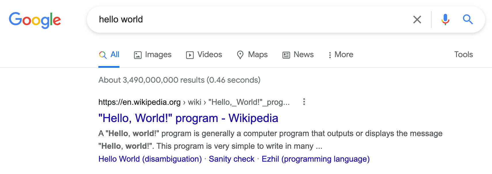

import Tabs from '@theme/Tabs';
import TabItem from '@theme/TabItem';

# Interacting with a page {#interacting-with-a-page}

**Learn how to programmatically do actions on a page such as clicking, typing, and pressing keys. Also, discover a common roadblock that comes up when automating.**

---

The **Page** object has whole boat-load of functions which can be used to interact with the loaded page. We're not going to go over every single one of them right now, but we _will_ use a few of the most common ones to add some functionality to our current project.

Let's say that we want to automate searching for **hello world** on Google, then click on the first result and log the title of the page to the console, then take a screenshot and write it it to the filesystem. In order to understand how we're going to automate this, let's break down how we would do it manually:

1. Click on the button which accepts Google's cookies policy (To see how it looks, open Google in an anonymous window.)
2. Type **hello world** into the search bar
3. Press **Enter**
4. Wait for the results page to load
5. Click on the first result
6. Read the title of the clicked result's loaded page
7. Screenshot the page

Though it seems complex, the wonderful **Page** API makes all of these actions extremely easy to perform.

## Clicking & pressing keys {#clicking-and-pressing-keys}

Let's first focus on the first 3 steps listed above. By using `page.click()` and the CSS selector of the element to click, we can click an element:

<Tabs groupId="main">
<TabItem value="Playwright" label="Playwright">

```JavaScript
// Click the "I agree" button
await page.click('button:has-text("I agree")');

```

</TabItem>
<TabItem value="Puppeteer" label="Puppeteer">

```JavaScript
// Click the "I agree" button
await page.click('button + button');

```

</TabItem>
</Tabs>

With `page.click()`, Puppeteer and Playwright actually drag the mouse and click, allowing the bot to act more human-like. This is different from programmatically clicking with `Element.click()` in vanilla client-side JavaScript.

Notice that in the Playwright example, we are using a different selector than in the Puppeteer example. This is because Playwright supports [many custom CSS selectors](https://playwright.dev/docs/selectors#text-selector), such as the **has-text** pseudo class. As a rule of thumb, using text selectors is much more preferable to using regular selectors, as they are much less likely to break. If Google makes the sibling above the **I agree** button a `<div>` element instead of a `<button>` element, our `button + button` selector will break. However, the button will always have the text **I agree**; therefore, `button:has-text("I agree")` is more reliable.

> If you're not already familiar with CSS selectors and how to find them, we recommend referring to [this lesson](../../web_scraping_for_beginners/data_extraction/using_devtools.md) in the **Web scraping for beginners** course.

Then, we can type some text into an input field with `page.type()`; passing a CSS selector as the first, and the string to input as the second parameter:

```js
// Type the query into the search box
await page.type('input[title="Search"]', 'hello world');
```

Finally, we can press a single key by accessing the `keyboard` property of `page` and calling the `press()` function on it:

```js
// Press enter
await page.keyboard.press('Enter');
```

So far, we've got this:

<Tabs groupId="main">
<TabItem value="Playwright" label="Playwright">

```javascript
import { chromium } from 'playwright';

const browser = await chromium.launch({ headless: false });

const page = await browser.newPage();

await page.goto('https://google.com/');

// Click the "I agree" button
await page.click('button:has-text("I agree")');

// Type the query into the search box
await page.type('input[title="Search"]', 'hello world');

// Press enter
await page.keyboard.press('Enter');

await page.waitForTimeout(10000)
await browser.close();

```

</TabItem>
<TabItem value="Puppeteer" label="Puppeteer">

```javascript
import puppeteer from 'puppeteer';

const browser = await puppeteer.launch({ headless: false });

const page = await browser.newPage();

await page.goto('https://google.com/');

// Click the "I agree" button
await page.click('button + button');

// Type the query into the search box
await page.type('input[title="Search"]', 'hello world');

// Press enter
await page.keyboard.press('Enter');

await page.waitForTimeout(10000)
await browser.close();

```

</TabItem>
</Tabs>

When we run it, we leave off on the results page:



Great! So now all we have to do is click the first result which matches the CSS selector `.g a`:

<Tabs groupId="main">
<TabItem value="Playwright" label="Playwright">

```javascript
import { chromium } from 'playwright';

const browser = await chromium.launch({ headless: false });

const page = await browser.newPage();

await page.goto('https://google.com/');

await page.click('button:has-text("I agree")');

await page.type('input[title="Search"]', 'hello world');

await page.keyboard.press('Enter');

// Click the first result
await page.click('.g a');

await page.waitForTimeout(10000)
await browser.close();

```

</TabItem>
<TabItem value="Puppeteer" label="Puppeteer">

```javascript
// This code will throw an error!
import puppeteer from 'puppeteer';

const browser = await puppeteer.launch({ headless: false });

const page = await browser.newPage();

await page.goto('https://google.com/');

await page.click('button + button');

await page.type('input[title="Search"]', 'hello world');

await page.keyboard.press('Enter');

// Click the first result
await page.click('.g a');

await page.waitForTimeout(10000)
await browser.close();

```

</TabItem>
</Tabs>

But wait, when we try to run the Puppeteer code, we run into this nasty error:

> The following error won't be present if you're following the Playwright examples. You'll learn why in the next lesson.

```text
/Users/me/Desktop/playwright-puppeteer/node_modules/puppeteer/lib/cjs/puppeteer/common/assert.js:26
        throw new Error(message);
              ^

Error: No node found for selector: .g a
    at assert (/Users/me/Desktop/playwright-puppeteer/node_modules/puppeteer/lib/cjs/puppeteer/common/assert.js:26:15)
...
```

We hit this error because we attempted to click an element that wasn't yet present on the page. The results page hadn't even loaded yet!

## Next up {#next}

In the [next lesson](./waiting.md), we'll be taking a look at how to **wait for** navigation, events, and content before resuming interactions.
