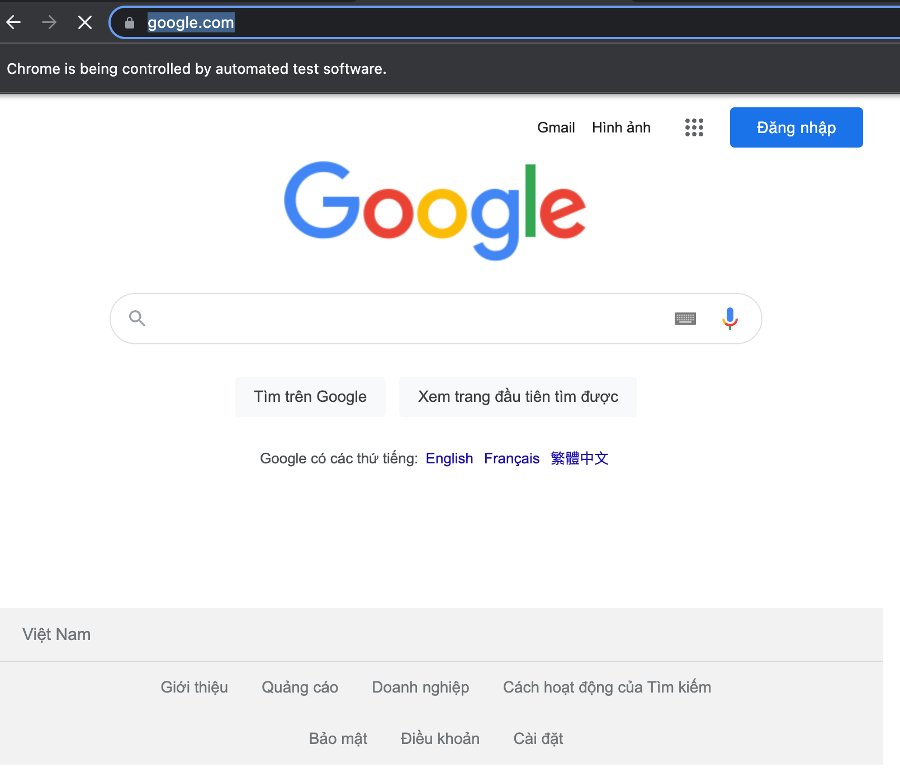

import Tabs from '@theme/Tabs';
import TabItem from '@theme/TabItem';

# Using proxies {#using-proxies}

**Understand how to use proxies in your Puppeteer and Playwright requests, as well as a couple of the most common use cases for proxies.**

---

[Proxies](../anti_scraping/mitigation/proxies.md) are a great way of appearing as if you are making requests from a different location. A common use case for proxies is to avoid [geolocation](../anti_scraping/techniques/geolocation.md) restrictions. For example your favorite TV show might not be available on Netflix in your country, but it might be available for Vietnamese Netflix watchers.

In this lesson, we'll be learning how to use proxies with Playwright and Puppeteer. This will be demonstrated with a Vietnamese proxy that we got by running [this](https://apify.com/mstephen190/proxy-scraper) proxy-scraping Actor on the Apify platform.

## Adding a proxy {#adding-a-proxy}

First, let's add our familiar boilerplate code for visiting Google and also create a variable called `proxy` which will point to our proxy server:

> Note that this proxy may no longer be working at the time of reading. If you don't have a proxy to use during this lesson, we recommend using Proxy Scraper for a list of free ones, or checking out [Apify proxy](https://apify.com/proxy)

<Tabs groupId="main">
<TabItem value="Playwright" label="Playwright">

```js
import { chromium } from 'playwright';

// our proxy server
const proxy = '103.214.9.13:3128';

const browser = await chromium.launch({ headless: false });
const page = await browser.newPage();
await page.goto('https://google.com');

await page.waitForTimeout(10000);
await browser.close();
```

</TabItem>
<TabItem value="Puppeteer" label="Puppeteer">

```js
import puppeteer from 'puppeteer';

// our proxy server
const proxy = '103.214.9.13:3128';

const browser = await puppeteer.launch({ headless: false });
const page = await browser.newPage();
await page.goto('https://google.com');

await page.waitForTimeout(10000);
await browser.close();
```

</TabItem>
</Tabs>

For both Puppeteer and Playwright, the proxy server's URL should be passed into the options of the `launch()` function; however, it's done a bit differently depending on which library you're using.

In Puppeteer, the server must be passed within the **--proxy-server** [Chromium command line argument](https://peter.sh/experiments/chromium-command-line-switches/), while in Playwright, it can be passed into the **proxy** option.

<Tabs groupId="main">
<TabItem value="Playwright" label="Playwright">

```js
import { chromium } from 'playwright';

const proxy = '103.214.9.13:3128';

const browser = await chromium.launch({
    headless: false,
    // Using the "proxy" option
    proxy: {
        // Pass in the server URL
        server: proxy,

    },
});
const page = await browser.newPage();
await page.goto('https://google.com');

await page.waitForTimeout(10000);
await browser.close();
```

</TabItem>
<TabItem value="Puppeteer" label="Puppeteer">

```js
import puppeteer from 'puppeteer';

const proxy = '103.214.9.13:3128';

// Using the "args" option, which is an array of Chromium command
// line switches, we pass the server URL in with "--proxy-server"
const browser = await puppeteer.launch({
    headless: false,
    args: [`--proxy-server=${proxy}`],
});
const page = await browser.newPage();
await page.goto('https://google.com');

await page.waitForTimeout(10000);
await browser.close();
```

</TabItem>
</Tabs>

And that's it! Now, when we visit Google, it's in Vietnamese. Depending on the country of your proxy, the language will vary.



> Note that in order to rotate through multiple proxies, you must retire a browser instance then create a new one to continue automating with a new proxy.

## Authenticating a proxy {#authenticating-a-proxy}

The proxy in the last activity didn't require a username and password, but let's say that this one does:

```text
proxy.example.com:3001
```

One might automatically assume that this would be the solution:

<Tabs groupId="main">
<TabItem value="Playwright" label="Playwright">

```js
// This code is wrong!
import { chromium } from 'playwright';

const proxy = 'proxy.example.com:3001';
const username = 'someUsername';
const password = 'password123';

const browser = await chromium.launch({
    headless: false,
    proxy: {
        server: `http://${username}:${password}@${proxy}`,

    },
});
```

</TabItem>
<TabItem value="Puppeteer" label="Puppeteer">

```js
// This code is wrong!
import puppeteer from 'puppeteer';

const proxy = 'proxy.example.com:3001';
const username = 'someUsername';
const password = 'password123';

const browser = await puppeteer.launch({
    headless: false,
    args: [`--proxy-server=http://${username}:${password}@${proxy}`],
});
```

</TabItem>
</Tabs>

However, authentication parameters need to be passed in separately in order to work. In Puppeteer, the username and password need to be passed to the `page.authenticate()` prior to any navigations being made, while in Playwright they can be passed to the **proxy** option object.

<Tabs groupId="main">
<TabItem value="Playwright" label="Playwright">

```js
import { chromium } from 'playwright';

const proxy = 'proxy.example.com:3001';
const username = 'someUsername';
const password = 'password123';

const browser = await chromium.launch({
    headless: false,
    proxy: {
        server: proxy,
        username,
        password,
    },
});
// Proxy will now be authenticated
```

</TabItem>
<TabItem value="Puppeteer" label="Puppeteer">

```js
import puppeteer from 'puppeteer';

const proxy = 'proxy.example.com:3001';
const username = 'someUsername';
const password = 'password123';

const browser = await puppeteer.launch({
    headless: false,
    args: [`--proxy-server=${proxy}`],
});

const page = await browser.newPage();

await page.authenticate({ username, password });
// Proxy will now be authenticated
```

</TabItem>
</Tabs>

## Next up {#next}

You already know how to launch a browser with various configurations, which means you're ready to [learn about browser contexts](./browser_contexts.md). Browser contexts can be used to automate multiple sessions at once with completely different configurations. You'll also learn how to emulate different devices, such as iPhones, iPads, and Androids.
