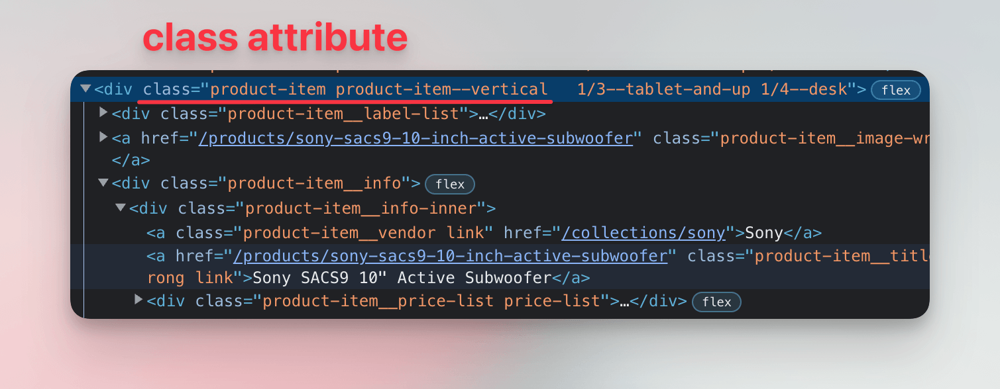
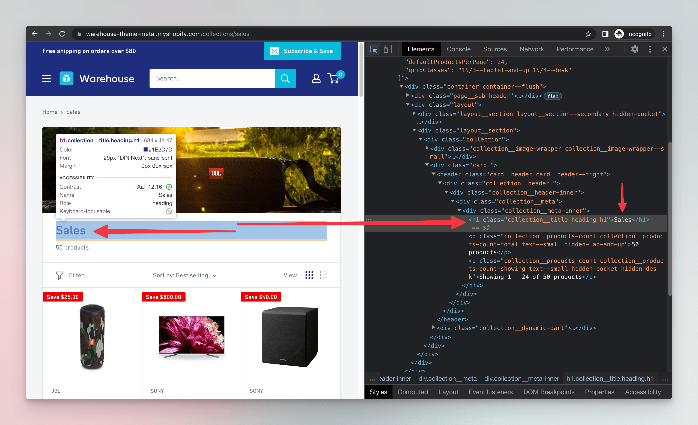

import LegacyJsCourseAdmonition from '@site/src/components/LegacyJsCourseAdmonition';
import Exercises from '../scraping_basics/_exercises.mdx';

<LegacyJsCourseAdmonition />

**In this lesson we'll look for products in the downloaded HTML. We'll use Cheerio to turn the HTML into objects which we can work with in our Node.js program.**

---

From lessons about browser DevTools we know that the HTML elements representing individual products have a `class` attribute which, among other values, contains `product-item`.



As a first step, let's try counting how many products are on the listing page.

## Processing HTML

After downloading, the entire HTML is available in our program as a string. We can print it to the screen or save it to a file, but not much more. However, since it's a string, could we use [string operations](https://developer.mozilla.org/en-US/docs/Web/JavaScript/Reference/Global_Objects/String#instance_methods) or [regular expressions](https://developer.mozilla.org/en-US/docs/Web/JavaScript/Guide/Regular_expressions) to count the products?

While somewhat possible, such an approach is tedious, fragile, and unreliable. To work with HTML, we need a robust tool dedicated to the task: an _HTML parser_. It takes a text with HTML markup and turns it into a tree of JavaScript objects.

:::info Why regex can't parse HTML

While [Bobince's infamous StackOverflow answer](https://stackoverflow.com/a/1732454/325365) is funny, it doesn't go very deep into the reasoning:

- In **formal language theory**, HTML's hierarchical, nested structure makes it a [context-free language](https://en.wikipedia.org/wiki/Context-free_language). **Regular expressions**, by contrast, match patterns in [regular languages](https://en.wikipedia.org/wiki/Regular_language), which are much simpler.
- Because of this difference, regex alone struggles with HTML's nested tags. On top of that, HTML has **complex syntax rules** and countless **edge cases**, which only add to the difficulty.

:::

We'll choose [Cheerio](https://cheerio.js.org/) as our parser, as it's a popular library which can process even non-standard, broken markup. This is useful for scraping, because real-world websites often contain all sorts of errors and discrepancies. In the project directory, we'll run the following to install the Cheerio package:

```text
$ npm install cheerio --save

added 123 packages, and audited 123 packages in 0s
...
```

:::tip Installing packages

Being comfortable around installing Node.js packages is a prerequisite of this course, but if you wouldn't say no to a recap, we recommend [An introduction to the npm package manager](https://nodejs.org/en/learn/getting-started/an-introduction-to-the-npm-package-manager) tutorial from the official Node.js documentation.

:::

Now let's import the package and use it for parsing the HTML. The `cheerio` module allows us to work with the HTML elements in a structured way. As a demonstration, we'll first get the `<h1>` element, which represents the main heading of the page.



We'll update our code to the following:

```js
import * as cheerio from 'cheerio';

const url = "https://warehouse-theme-metal.myshopify.com/collections/sales";
const response = await fetch(url);

if (response.ok) {
  const html = await response.text();
  const $ = cheerio.load(html);
  console.log($("h1"));
} else {
  throw new Error(`HTTP ${response.status}`);
}
```

Then let's run the program:

```text
$ node index.js
LoadedCheerio {
  '0': <ref *1> Element {
    parent: Element { ... },
    prev: Text { ... },
    next: Element { ... },
    startIndex: null,
    endIndex: null,
# highlight-next-line
    children: [ [Text] ],
# highlight-next-line
    name: 'h1',
    attribs: [Object: null prototype] { class: 'collection__title heading h1' },
    type: 'tag',
    namespace: 'http://www.w3.org/1999/xhtml',
    'x-attribsNamespace': [Object: null prototype] { class: undefined },
    'x-attribsPrefix': [Object: null prototype] { class: undefined }
  },
  length: 1,
  ...
}
```

Our code prints a Cheerio object. It's something like an array of all `h1` elements Cheerio can find in the HTML we gave it. It's the case that there's just one, so we can see only a single item in the selection.

The item has many properties, such as references to its parent or sibling elements, but most importantly, its name is `h1` and in the `children` property, it contains a single text element. Now let's print just the text. Let's change our program to the following:

```js
import * as cheerio from 'cheerio';

const url = "https://warehouse-theme-metal.myshopify.com/collections/sales";
const response = await fetch(url);

if (response.ok) {
  const html = await response.text();
  const $ = cheerio.load(html);
  // highlight-next-line
  console.log($("h1").text());
} else {
  throw new Error(`HTTP ${response.status}`);
}
```

Thanks to the nature of the Cheerio object we don't have to explicitly find the first element. Calling `.text()` combines texts of all elements in the selection. If we run our scraper again, it prints the text of the `h1` element:

```text
$ node index.js
Sales
```

:::note Dynamic websites

The Warehouse returns full HTML in its initial response, but many other sites add some content after the page loads or after user interaction. In such cases, what we'd see in DevTools could differ from `await response.text()` in Node.js. Learn how to handle these scenarios in our [API Scraping](../api_scraping/index.md) and [Puppeteer & Playwright](../puppeteer_playwright/index.md) courses.

:::

## Using CSS selectors

Cheerio's `$()` method runs a _CSS selector_ against a parsed HTML document and returns all the matching elements. It's like calling `document.querySelectorAll()` in browser DevTools.

Scanning through [usage examples](https://cheerio.js.org/docs/basics/selecting) will help us to figure out code for counting the product cards:

```js
import * as cheerio from 'cheerio';

const url = "https://warehouse-theme-metal.myshopify.com/collections/sales";
const response = await fetch(url);

if (response.ok) {
  const html = await response.text();
  const $ = cheerio.load(html);
  // highlight-next-line
  console.log($(".product-item").length);
} else {
  throw new Error(`HTTP ${response.status}`);
}
```

In CSS, `.product-item` selects all elements whose `class` attribute contains value `product-item`. We call `$()` with the selector and get back matching elements. Cheerio handles all the complexity of understanding the HTML markup for us. Then we use `.length` to count how many items there is in the selection.

```text
$ node index.js
24
```

That's it! We've managed to download a product listing, parse its HTML, and count how many products it contains. In the next lesson, we'll be looking for a way to extract detailed information about individual products.

:::info Cheerio and jQuery

The Cheerio documentation frequently mentions jQuery. Back when browsers were wildly inconsistent and basic DOM methods like `document.querySelectorAll()` didn't exist, jQuery was the most popular JavaScript framework for web development. It provided a consistent API that worked across all browsers.

Cheerio was designed to mimic jQuery's interface because nearly every developer knew jQuery at the time. jQuery worked in browsers, Cheerio in Node.js. While jQuery has largely faded from modern web development, we now learn its syntax specifically to use Cheerio for server-side HTML manipulation.

:::

---

<Exercises />

### Scrape F1 Academy teams

Print a total count of F1 Academy teams listed on this page:

```text
https://www.f1academy.com/Racing-Series/Teams
```

<details>
  <summary>Solution</summary>

  ```js
  import * as cheerio from 'cheerio';

  const url = "https://www.f1academy.com/Racing-Series/Teams";
  const response = await fetch(url);

  if (response.ok) {
    const html = await response.text();
    const $ = cheerio.load(html);
    console.log($(".teams-driver-item").length);
  } else {
    throw new Error(`HTTP ${response.status}`);
  }
  ```

</details>

### Scrape F1 Academy drivers

Use the same URL as in the previous exercise, but this time print a total count of F1 Academy drivers.

<details>
  <summary>Solution</summary>

  ```js
  import * as cheerio from 'cheerio';

  const url = "https://www.f1academy.com/Racing-Series/Teams";
  const response = await fetch(url);

  if (response.ok) {
    const html = await response.text();
    const $ = cheerio.load(html);
    console.log($(".driver").length);
  } else {
    throw new Error(`HTTP ${response.status}`);
  }
  ```

</details>
