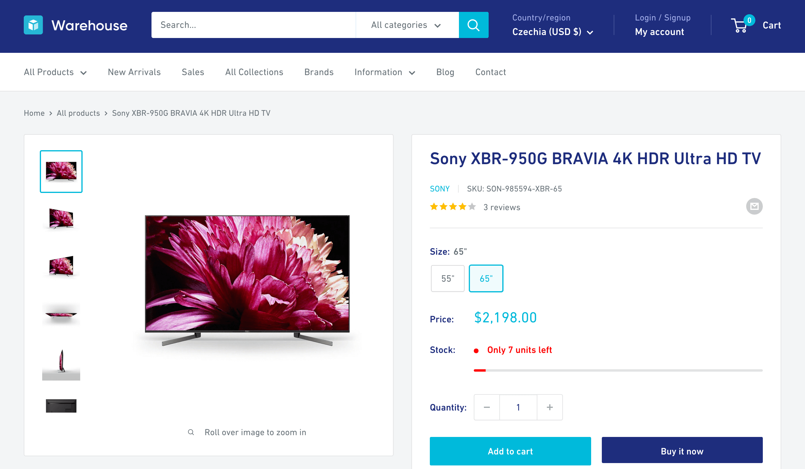
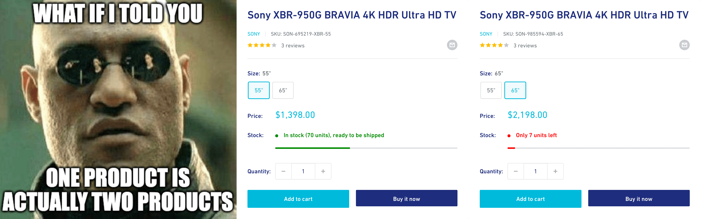

import LegacyJsCourseAdmonition from '@site/src/components/LegacyJsCourseAdmonition';
import Exercises from '../scraping_basics/\_exercises.mdx';

<LegacyJsCourseAdmonition />

**In this lesson, we'll follow links to individual product pages. We'll use the Fetch API to download them and Cheerio to process them.**

---

In previous lessons we've managed to download the HTML code of a single page, parse it with Cheerio, and extract relevant data from it. We'll do the same now for each of the products.

Thanks to the refactoring, we have functions ready for each of the tasks, so we won't need to repeat ourselves in our code. This is what you should see in your editor now:

```js
import * as cheerio from 'cheerio';
import { writeFile } from 'fs/promises';
import { AsyncParser } from '@json2csv/node';

async function download(url) {
    const response = await fetch(url);
    if (response.ok) {
        const html = await response.text();
        return cheerio.load(html);
    } else {
        throw new Error(`HTTP ${response.status}`);
    }
}

function parseProduct($productItem, baseURL) {
    const $title = $productItem.find('.product-item__title');
    const title = $title.text().trim();
    const url = new URL($title.attr('href'), baseURL).href;

    const $price = $productItem.find('.price').contents().last();
    const priceRange = { minPrice: null, price: null };
    const priceText = $price.text().trim().replace('$', '').replace('.', '').replace(',', '');

    if (priceText.startsWith('From ')) {
        priceRange.minPrice = parseInt(priceText.replace('From ', ''));
    } else {
        priceRange.minPrice = parseInt(priceText);
        priceRange.price = priceRange.minPrice;
    }

    return { url, title, ...priceRange };
}

function exportJSON(data) {
    return JSON.stringify(data, null, 2);
}

async function exportCSV(data) {
    const parser = new AsyncParser();
    return await parser.parse(data).promise();
}

const listingURL = 'https://warehouse-theme-metal.myshopify.com/collections/sales';
const $ = await download(listingURL);

const data = $('.product-item')
    .toArray()
    .map((element) => {
        const $productItem = $(element);
        // highlight-next-line
        const item = parseProduct($productItem, listingURL);
        return item;
    });

await writeFile('products.json', exportJSON(data));
await writeFile('products.csv', await exportCSV(data));
```

## Extracting vendor name

Each product URL points to a so-called _product detail page_, or PDP. If we open one of the product URLs in the browser, e.g. the one about [Sony XBR-950G BRAVIA](https://warehouse-theme-metal.myshopify.com/products/sony-xbr-65x950g-65-class-64-5-diag-bravia-4k-hdr-ultra-hd-tv), we can see that it contains a vendor name, [SKU](https://en.wikipedia.org/wiki/Stock_keeping_unit), number of reviews, product images, product variants, stock availability, description, and perhaps more.



Depending on what's valuable for our use case, we can now use the same techniques as in previous lessons to extract any of the above. As a demonstration, let's scrape the vendor name. In browser DevTools, we can see that the HTML around the vendor name has the following structure:

```html
<div class="product-meta">
    <h1 class="product-meta__title heading h1">Sony XBR-950G BRAVIA 4K HDR Ultra HD TV</h1>
    <div class="product-meta__label-list">...</div>
    <div class="product-meta__reference">
        <!-- highlight-next-line -->
        <a class="product-meta__vendor link link--accented" href="/collections/sony">
            <!-- highlight-next-line -->
            Sony
            <!-- highlight-next-line -->
        </a>
        <span class="product-meta__sku">
            SKU:
            <span class="product-meta__sku-number">SON-985594-XBR-65</span>
        </span>
    </div>
    <a href="#product-reviews" class="product-meta__reviews-badge link" data-offset="30">
        <div class="rating">
            <div class="rating__stars" role="img" aria-label="4.0 out of 5.0 stars">...</div>
            <span class="rating__caption">3 reviews</span>
        </div>
    </a>
    ...
</div>
```

It looks like using a CSS selector to locate the element with the `product-meta__vendor` class, and then extracting its text, should be enough to get the vendor name as a string:

```js
const vendor = $('.product-meta__vendor').text().trim();
```

But where do we put this line in our program?

## Crawling product detail pages

In the `.map()` loop, we're already going through all the products. Let's expand it to include downloading the product detail page, parsing it, extracting the vendor's name, and adding it to the item object.

First, we need to make the loop asynchronous so that we can use `await download()` for each product. We'll add the `async` keyword to the inner function and rename the collection to `promises`, since it will now store promises that resolve to items rather than the items themselves. We'll pass it to `await Promise.all()` to resolve all the promises and retrieve the actual items.

```js
const listingURL = 'https://warehouse-theme-metal.myshopify.com/collections/sales';
const $ = await download(listingURL);

// highlight-next-line
const promises = $('.product-item')
    .toArray()
    .map(async (element) => {
        const $productItem = $(element);
        const item = parseProduct($productItem, listingURL);
        return item;
    });
// highlight-next-line
const data = await Promise.all(promises);
```

The program behaves the same as before, but now the code is prepared to make HTTP requests from within the inner function. Let's do it:

```js
const listingURL = 'https://warehouse-theme-metal.myshopify.com/collections/sales';
const $ = await download(listingURL);

const promises = $('.product-item')
    .toArray()
    .map(async (element) => {
        const $productItem = $(element);
        const item = parseProduct($productItem, listingURL);

        // highlight-next-line
        const $p = await download(item.url);
        // highlight-next-line
        item.vendor = $p('.product-meta__vendor').text().trim();

        return item;
    });
const data = await Promise.all($promises.get());
```

We download each product detail page and parse its HTML using Cheerio. The `$p` variable is the root of a Cheerio object tree, similar to but distinct from the `$` used for the listing page. That's why we use `$p()` instead of `$p.find()`.

If we run the program now, it'll take longer to finish since it's making 24 more HTTP requests. But in the end, it should produce exports with a new field containing the vendor's name:

<!-- eslint-skip -->

```json title=products.json
[
  {
    "url": "https://warehouse-theme-metal.myshopify.com/products/jbl-flip-4-waterproof-portable-bluetooth-speaker",
    "title": "JBL Flip 4 Waterproof Portable Bluetooth Speaker",
    "minPrice": 7495,
    "price": 7495,
    "vendor": "JBL"
  },
  {
    "url": "https://warehouse-theme-metal.myshopify.com/products/sony-xbr-65x950g-65-class-64-5-diag-bravia-4k-hdr-ultra-hd-tv",
    "title": "Sony XBR-950G BRAVIA 4K HDR Ultra HD TV",
    "minPrice": 139800,
    "price": null,
    "vendor": "Sony"
  },
  ...
]
```

## Extracting price

Scraping the vendor's name is nice, but the main reason we started checking the detail pages in the first place was to figure out how to get a price for each product. From the product listing, we could only scrape the min price, and remember—we're building a Node.js app to track prices!

Looking at the [Sony XBR-950G BRAVIA](https://warehouse-theme-metal.myshopify.com/products/sony-xbr-65x950g-65-class-64-5-diag-bravia-4k-hdr-ultra-hd-tv), it's clear that the listing only shows min prices, because some products have variants, each with a different price. And different stock availability. And different SKUs…



In the next lesson, we'll scrape the product detail pages so that each product variant is represented as a separate item in our dataset.

---

<Exercises />

### Scrape calling codes of African countries

Scrape links to Wikipedia pages for all African states and territories. Follow each link and extract the _calling code_ from the info table. Print the URL and the calling code for each country. Start with this URL:

```text
https://en.wikipedia.org/wiki/List_of_sovereign_states_and_dependent_territories_in_Africa
```

Your program should print the following:

```text
https://en.wikipedia.org/wiki/Algeria +213
https://en.wikipedia.org/wiki/Angola +244
https://en.wikipedia.org/wiki/Benin +229
https://en.wikipedia.org/wiki/Botswana +267
https://en.wikipedia.org/wiki/Burkina_Faso +226
https://en.wikipedia.org/wiki/Burundi null
https://en.wikipedia.org/wiki/Cameroon +237
...
```

:::tip Need a nudge?

Locating cells in tables is sometimes easier if you know how to [filter](https://cheerio.js.org/docs/api/classes/Cheerio#filter) or [navigate up](https://cheerio.js.org/docs/api/classes/Cheerio#parent) in the HTML element tree.

:::

<details>
  <summary>Solution</summary>

```js
import * as cheerio from 'cheerio';

async function download(url) {
    const response = await fetch(url);
    if (response.ok) {
        const html = await response.text();
        return cheerio.load(html);
    } else {
        throw new Error(`HTTP ${response.status}`);
    }
}

const listingURL =
    'https://en.wikipedia.org/wiki/List_of_sovereign_states_and_dependent_territories_in_Africa';
const $ = await download(listingURL);

const $cells = $('.wikitable tr td:nth-child(3)');
const promises = $cells.toArray().map(async (element) => {
    const $nameCell = $(element);
    const $link = $nameCell.find('a').first();
    const countryURL = new URL($link.attr('href'), listingURL).href;

    const $c = await download(countryURL);
    const $label = $c('th.infobox-label')
        .filter((i, element) => $c(element).text().trim() == 'Calling code')
        .first();
    const callingCode = $label.parent().find('td.infobox-data').first().text().trim();

    console.log(`${countryURL} ${callingCode || null}`);
});
await Promise.all(promises);
```

</details>

### Scrape authors of F1 news articles

Scrape links to the Guardian's latest F1 news articles. For each article, follow the link and extract both the author's name and the article's title. Print the author's name and the title for all the articles. Start with this URL:

```text
https://www.theguardian.com/sport/formulaone
```

Your program should print something like this:

```text
Daniel Harris: Sports quiz of the week: Johan Neeskens, Bond and airborne antics
Colin Horgan: The NHL is getting its own Drive to Survive. But could it backfire?
Reuters: US GP ticket sales ‘took off’ after Max Verstappen stopped winning in F1
Giles Richards: Liam Lawson gets F1 chance to replace Pérez alongside Verstappen at Red Bull
PA Media: Lewis Hamilton reveals lifelong battle with depression after school bullying
...
```

:::tip Need a nudge?

- You can use [attribute selectors](https://developer.mozilla.org/en-US/docs/Web/CSS/Attribute_selectors) to select HTML elements based on their attribute values.
- Sometimes a person authors the article, but other times it's contributed by a news agency.

:::

<details>
  <summary>Solution</summary>

```js
import * as cheerio from 'cheerio';

async function download(url) {
    const response = await fetch(url);
    if (response.ok) {
        const html = await response.text();
        return cheerio.load(html);
    } else {
        throw new Error(`HTTP ${response.status}`);
    }
}

const listingURL = 'https://www.theguardian.com/sport/formulaone';
const $ = await download(listingURL);

const promises = $('#maincontent ul li')
    .toArray()
    .map(async (element) => {
        const $item = $(element);
        const $link = $item.find('a').first();
        const authorURL = new URL($link.attr('href'), listingURL).href;

        const $a = await download(authorURL);
        const title = $a('h1').text().trim();

        const author = $a('a[rel="author"]').text().trim();
        const address = $a('aside address').text().trim();

        console.log(`${author || address || null}: ${title}`);
    });
await Promise.all(promises);
```

</details>
