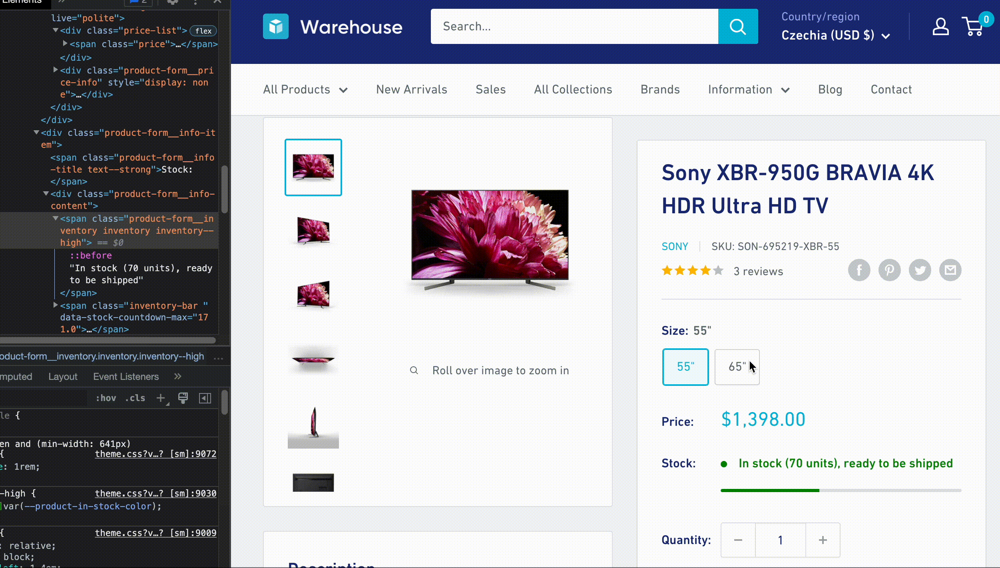

import CodeBlock from '@theme/CodeBlock';
import LegacyJsCourseAdmonition from '@site/src/components/LegacyJsCourseAdmonition';
import Exercises from '../scraping_basics/_exercises.mdx';
import JsLlmProjectsExercise from '!!raw-loader!roa-loader!./exercises/js_llm_projects.mjs';
import CnnSportsShortestArticleExercise from '!!raw-loader!roa-loader!./exercises/cnn_sports_shortest_article.mjs';

<LegacyJsCourseAdmonition />

**In this lesson, we'll scrape the product detail pages to represent each product variant as a separate item in our dataset.**

---

We'll need to figure out how to extract variants from the product detail page, and then change how we add items to the data list so we can add multiple items after scraping one product URL.

## Locating variants

First, let's extract information about the variants. If we go to [Sony XBR-950G BRAVIA](https://warehouse-theme-metal.myshopify.com/products/sony-xbr-65x950g-65-class-64-5-diag-bravia-4k-hdr-ultra-hd-tv) and open the DevTools, we can see that the buttons for switching between variants look like this:

```html
<div class="block-swatch-list">
  <div class="block-swatch">
    <input class="block-swatch__radio product-form__single-selector is-filled" type="radio" name="template--14851594125363__main-1916221128755-1" id="template--14851594125363__main-1916221128755-1-1" value="55&quot;" checked="" data-option-position="1">
    <label class="block-swatch__item" for="template--14851594125363__main-1916221128755-1-1" title="55&quot;">
    <!-- highlight-next-line -->
    <span class="block-swatch__item-text">55"</span>
    </label>
  </div>
  <div class="block-swatch">
    <input class="block-swatch__radio product-form__single-selector" type="radio" name="template--14851594125363__main-1916221128755-1" id="template--14851594125363__main-1916221128755-1-2" value="65&quot;" data-option-position="1">
    <label class="block-swatch__item" for="template--14851594125363__main-1916221128755-1-2" title="65&quot;">
    <!-- highlight-next-line -->
    <span class="block-swatch__item-text">65"</span>
    </label>
  </div>
</div>
```

Nice! We can extract the variant names, but we also need to extract the price for each variant. Switching the variants using the buttons shows us that the HTML changes dynamically. This means the page uses JavaScript to display this information.



If we can't find a workaround, we'd need our scraper to run browser JavaScript. That's not impossible. Scrapers can spin up their own browser instance and automate clicking on buttons, but it's slow and resource-intensive. Ideally, we want to stick to plain HTTP requests and Cheerio as much as possible.

After a bit of detective work, we notice that not far below the `block-swatch-list` there's also a block of HTML with a class `no-js`, which contains all the data!

```html
<div class="no-js product-form__option">
  <label class="product-form__option-name text--strong" for="product-select-1916221128755">Variant</label>
  <div class="select-wrapper select-wrapper--primary is-filled">
    <select id="product-select-1916221128755" name="id">
      <!-- highlight-next-line -->
      <option value="17550242349107" data-sku="SON-695219-XBR-55">
        <!-- highlight-next-line -->
        55" - $1,398.00
      </option>
      <!-- highlight-next-line -->
      <option value="17550242414643" data-sku="SON-985594-XBR-65" selected="selected">
        <!-- highlight-next-line -->
        65" - $2,198.00
      </option>
    </select>
  </div>
</div>
```

These elements aren't visible to regular visitors. They're there just in case browser JavaScript fails to work, otherwise they're hidden. This is a great find because it allows us to keep our scraper lightweight.

## Extracting variants

Using our knowledge of Cheerio, we can locate the `option` elements and extract the data we need. We'll loop over the options, extract variant names, and create a corresponding array of items for each product:

```js
const listingURL = "https://warehouse-theme-metal.myshopify.com/collections/sales";
const $ = await download(listingURL);

const promises = $(".product-item").toArray().map(async element => {
  const $productItem = $(element);
  const item = parseProduct($productItem, listingURL);

  const $p = await download(item.url);
  item.vendor = $p(".product-meta__vendor").text().trim();

  // highlight-start
  const $options = $p(".product-form__option.no-js option");
  const items = $options.toArray().map(optionElement => {
    const $option = $(optionElement);
    const variantName = $option.text().trim();
    return { variantName, ...item };
  });
  // highlight-end

  return item;
});
const data = await Promise.all(promises);
```

The CSS selector `.product-form__option.no-js` targets elements that have both the `product-form__option` and `no-js` classes. We then use the [descendant combinator](https://developer.mozilla.org/en-US/docs/Web/CSS/Descendant_combinator) to match all `option` elements nested within the `.product-form__option.no-js` wrapper.

We loop over the variants using `.map()` method to create an array of item copies for each `variantName`. We now need to pass all these items onward, but the function currently returns just one item per product. And what if there are no variants?

Let's adjust the loop so it returns a promise that resolves to an array of items instead of a single item. If a product has no variants, we'll return an array with a single item, setting `variantName` to `null`:

```js
const listingURL = "https://warehouse-theme-metal.myshopify.com/collections/sales";
const $ = await download(listingURL);

const promises = $(".product-item").toArray().map(async element => {
  const $productItem = $(element);
  const item = parseProduct($productItem, listingURL);

  const $p = await download(item.url);
  item.vendor = $p(".product-meta__vendor").text().trim();

  const $options = $p(".product-form__option.no-js option");
  const items = $options.toArray().map(optionElement => {
    const $option = $(optionElement);
    const variantName = $option.text().trim();
    return { variantName, ...item };
  });
  // highlight-next-line
  return items.length > 0 ? items : [{ variantName: null, ...item }];
});
// highlight-start
const itemLists = await Promise.all(promises);
const data = itemLists.flat();
// highlight-end
```

After modifying the loop, we also updated how we collect the items into the `data` array. Since the loop now produces an array of items per product, the result of `await Promise.all()` is an array of arrays. We use [`.flat()`](https://developer.mozilla.org/en-US/docs/Web/JavaScript/Reference/Global_Objects/Array/flat) to merge them into a single, non-nested array.

If we run the program now, we'll see 34 items in total. Some items don't have variants, so they won't have a variant name. However, they should still have a price set—our scraper should already have that info from the product listing page.

<!-- eslint-skip -->
```json title=products.json
[
  ...
  {
    "variantName": null,
    "url": "https://warehouse-theme-metal.myshopify.com/products/klipsch-r-120sw-powerful-detailed-home-speaker-set-of-1",
    "title": "Klipsch R-120SW Powerful Detailed Home Speaker - Unit",
    "minPrice": 32400,
    "price": 32400,
    "vendor": "Klipsch"
  },
  ...
]
```

Some products will break into several items, each with a different variant name. We don't know their exact prices from the product listing, just the min price. In the next step, we should be able to parse the actual price from the variant name for those items.

<!-- eslint-skip -->
```json title=products.json
[
  ...
  {
    "variantName": "Red - $178.00",
    "url": "https://warehouse-theme-metal.myshopify.com/products/sony-xb950-extra-bass-wireless-headphones-with-app-control",
    "title": "Sony XB-950B1 Extra Bass Wireless Headphones with App Control",
    "minPrice": 12800,
    "price": null,
    "vendor": "Sony"
  },
  {
    "variantName": "Black - $178.00",
    "url": "https://warehouse-theme-metal.myshopify.com/products/sony-xb950-extra-bass-wireless-headphones-with-app-control",
    "title": "Sony XB-950B1 Extra Bass Wireless Headphones with App Control",
    "minPrice": 12800,
    "price": null,
    "vendor": "Sony"
  },
  ...
]
```

Perhaps surprisingly, some products with variants will have the price field set. That's because the shop sells all variants of the product for the same price, so the product listing shows the price as a fixed amount, like _$74.95_, instead of _from $74.95_.

<!-- eslint-skip -->
```json title=products.json
[
  ...
  {
    "variantName": "Red - $74.95",
    "url": "https://warehouse-theme-metal.myshopify.com/products/jbl-flip-4-waterproof-portable-bluetooth-speaker",
    "title": "JBL Flip 4 Waterproof Portable Bluetooth Speaker",
    "minPrice": 7495,
    "price": 7495,
    "vendor": "JBL"
  },
  ...
]
```

## Parsing price

The items now contain the variant as text, which is good for a start, but we want the price to be in the `price` property. Let's introduce a new function to handle that:

```js
function parseVariant($option) {
  const [variantName, priceText] = $option
    .text()
    .trim()
    .split(" - ");
  const price = parseInt(
    priceText
      .replace("$", "")
      .replace(".", "")
      .replace(",", "")
  );
  return { variantName, price };
}
```

First, we split the text into two parts, then we parse the price as a number. This part is similar to what we already do for parsing product listing prices. The function returns an object we can merge with `item`.

## Saving price

Now, if we use our new function, we should finally get a program that can scrape exact prices for all products, even if they have variants. The whole code should look like this now:

```js
import * as cheerio from 'cheerio';
import { writeFile } from 'fs/promises';
import { AsyncParser } from '@json2csv/node';

async function download(url) {
  const response = await fetch(url);
  if (response.ok) {
    const html = await response.text();
    return cheerio.load(html);
  } else {
    throw new Error(`HTTP ${response.status}`);
  }
}

function parseProduct($productItem, baseURL) {
  const $title = $productItem.find(".product-item__title");
  const title = $title.text().trim();
  const url = new URL($title.attr("href"), baseURL).href;

  const $price = $productItem.find(".price").contents().last();
  const priceRange = { minPrice: null, price: null };
  const priceText = $price
    .text()
    .trim()
    .replace("$", "")
    .replace(".", "")
    .replace(",", "");

  if (priceText.startsWith("From ")) {
      priceRange.minPrice = parseInt(priceText.replace("From ", ""));
  } else {
      priceRange.minPrice = parseInt(priceText);
      priceRange.price = priceRange.minPrice;
  }

  return { url, title, ...priceRange };
}

async function exportJSON(data) {
  return JSON.stringify(data, null, 2);
}

async function exportCSV(data) {
  const parser = new AsyncParser();
  return await parser.parse(data).promise();
}

// highlight-start
function parseVariant($option) {
  const [variantName, priceText] = $option
    .text()
    .trim()
    .split(" - ");
  const price = parseInt(
    priceText
      .replace("$", "")
      .replace(".", "")
      .replace(",", "")
  );
  return { variantName, price };
}
// highlight-end

const listingURL = "https://warehouse-theme-metal.myshopify.com/collections/sales";
const $ = await download(listingURL);

const promises = $(".product-item").toArray().map(async element => {
  const $productItem = $(element);
  const item = parseProduct($productItem, listingURL);

  const $p = await download(item.url);
  item.vendor = $p(".product-meta__vendor").text().trim();

  const $options = $p(".product-form__option.no-js option");
  const items = $options.toArray().map(optionElement => {
    // highlight-next-line
    const variant = parseVariant($(optionElement));
    // highlight-next-line
    return { ...item, ...variant };
  });
  return items.length > 0 ? items : [{ variantName: null, ...item }];
});
const itemLists = await Promise.all(promises);
const data = itemLists.flat();

await writeFile('products.json', await exportJSON(data));
await writeFile('products.csv', await exportCSV(data));
```

Let's run the scraper and see if all the items in the data contain prices:

<!-- eslint-skip -->
```json title=products.json
[
  ...
  {
    "url": "https://warehouse-theme-metal.myshopify.com/products/sony-xb950-extra-bass-wireless-headphones-with-app-control",
    "title": "Sony XB-950B1 Extra Bass Wireless Headphones with App Control",
    "minPrice": 12800,
    "price": 17800,
    "vendor": "Sony",
    "variantName": "Red"
  },
  {
    "url": "https://warehouse-theme-metal.myshopify.com/products/sony-xb950-extra-bass-wireless-headphones-with-app-control",
    "title": "Sony XB-950B1 Extra Bass Wireless Headphones with App Control",
    "minPrice": 12800,
    "price": 17800,
    "vendor": "Sony",
    "variantName": "Black"
  },
  ...
]
```

Success! We managed to build a Node.js application for watching prices!

Is this the end? Maybe! In the next lesson, we'll use a scraping framework to build the same application, but with less code, faster requests, and better visibility into what's happening while we wait for the program to finish.

---

<Exercises />

### Build a scraper for watching JavaScript projects

You can build a scraper now, can't you? Let's build another one! From the [GitHub Topics](https://github.com/topics/) page, scrape information about projects that match the following criteria:

- Have the topic "LLM" (as in _large language model_)
- Updated within the last month (at most 30 days ago)

Print an array of the top 5 projects with the most stars. Each project should be represented by an object containing the following data:

- Name
- Description
- URL to the repository page
- Number of stars
- Date it was updated on

Your output should look something like this:

```js
[
  {
    name: 'anything-llm',
    url: 'https://github.com/Mintplex-Labs/anything-llm',
    description: 'The all-in-one Desktop & Docker AI application with built-in RAG, AI agents, No-code agent builder, MCP compatibility, and more.',
    stars: 53358,
    updatedOn: "2026-01-15"
  },
  {
    name: 'SillyTavern',
    url: 'https://github.com/SillyTavern/SillyTavern',
    description: 'LLM Frontend for Power Users.',
    stars: 22054,
    updatedOn: "2026-01-15"
  },
  ...
]
```

<details>
  <summary>Solution</summary>

  After inspecting the page, you'll notice that packages with the keyword "LLM" have a dedicated URL. Also, changing the language and sorting dropdowns results in a page with its own URL. We'll use that as our starting point, which saves us from having to scrape whole GitHub Topics and then filter by keyword or sort by the number of stars.

  Both the exact number of stars or the `updatedOn` date can be figured out from hidden attributes of some of the HTML elements, so we can save any additional requests.

  <CodeBlock language="js">{JsLlmProjectsExercise.code}</CodeBlock>
</details>

### Find the shortest CNN article which made it to the Sports homepage

Scrape the [CNN Sports](https://edition.cnn.com/sport) homepage. For each linked article, calculate its length in characters:

- Locate the element that holds the main content of the article.
- Use `.text()` to extract all the content as plain text.
- Use `.length` to calculate the character count.

Skip pages without text (like those that only have a video). Sort the results and print the URL of the shortest article that made it to the homepage.

At the time of writing, the shortest article on the CNN Sports homepage is [about a donation to the Augusta National Golf Club](https://edition.cnn.com/2024/10/03/sport/masters-donation-hurricane-helene-relief-spt-intl/), which is just 1,642 characters long.

<details>
  <summary>Solution</summary>
  <CodeBlock language="js">{CnnSportsShortestArticleExercise.code}</CodeBlock>
</details>
