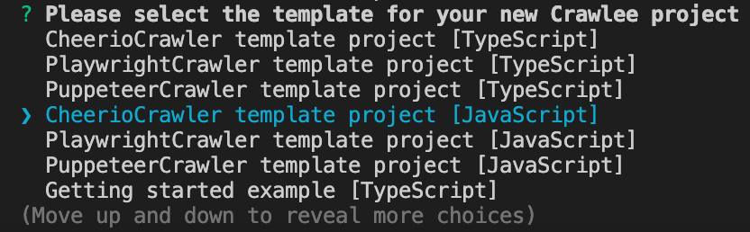

# Initialization & setting up

**When you extract links from a web page, you often end up with a lot of irrelevant URLs. Learn how to filter the links to only keep the ones you need.**

---

The Crawlee CLI speeds up the process of setting up a Crawlee project. Navigate to the directory you'd like your project's folder to live, then open up a terminal instance and run the following command:

```shell
npx crawlee create amazon-crawler
```

Once you run this command, you'll get prompted into a menu which you can navigate using your arrow keys. Each of these options will generate a different boilerplate code when selected. We're going to work with CheerioCrawler today, so we'll select the **CheerioCrawler template project** template, and then press **Enter**.



Once it's completed, open up the **amazon-crawler** folder that was generated by the `npx crawlee create` command. We're going to modify the **main.js** boilerplate to fit our needs:

```js
// main.js
import { CheerioCrawler, KeyValueStore, log } from 'crawlee';
import { router } from './routes.js';

// Grab our keyword from the input
const { keyword } = await KeyValueStore.getInput();

const crawler = new CheerioCrawler({
    requestHandler: router,

    // If you have access to Apify Proxy, you can use residential proxies and
    // high retry count which helps with blocking
    // If you don't, your local IP address will likely be fine for a few requests if you scrape slowly.
    // proxyConfiguration: await Actor.createProxyConfiguration({ groups: ['RESIDENTIAL'] }),
    // maxRequestRetries: 10,
});

log.info('Starting the crawl.');
await crawler.run([{
    // Turn the keyword into a link we can make a request with
    url: `https://www.amazon.com/s/ref=nb_sb_noss?url=search-alias%3Daps&field-keywords=${keyword}`,
    label: 'START',
    userData: {
        keyword,
    },
}]);
log.info('Crawl finished.');
```

```js
// routes.js
import { createCheerioRouter } from 'crawlee';

export const router = createCheerioRouter();

router.addDefaultHandler(({ log }) => {
    log.info('Route reached.');
});
```

Finally, we'll add the following input file to **INPUT.json** in the project's root directory (next to `package.json`, `node_modules` and others)

```json
{
  "keyword": "iphone"
}
```

> This is how we'll be inputting data into our scraper from now on. Don't worry though, from now on, we'll only need  to work in the **main.js** and **routes.js** files!

## Next up {#next}

Cool! We're ready. But [let's discuss a bit about modularity](./modularity.md) before moving forward!
