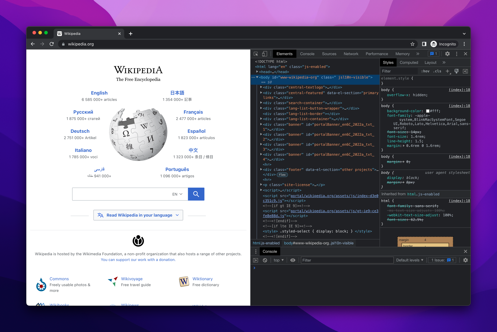
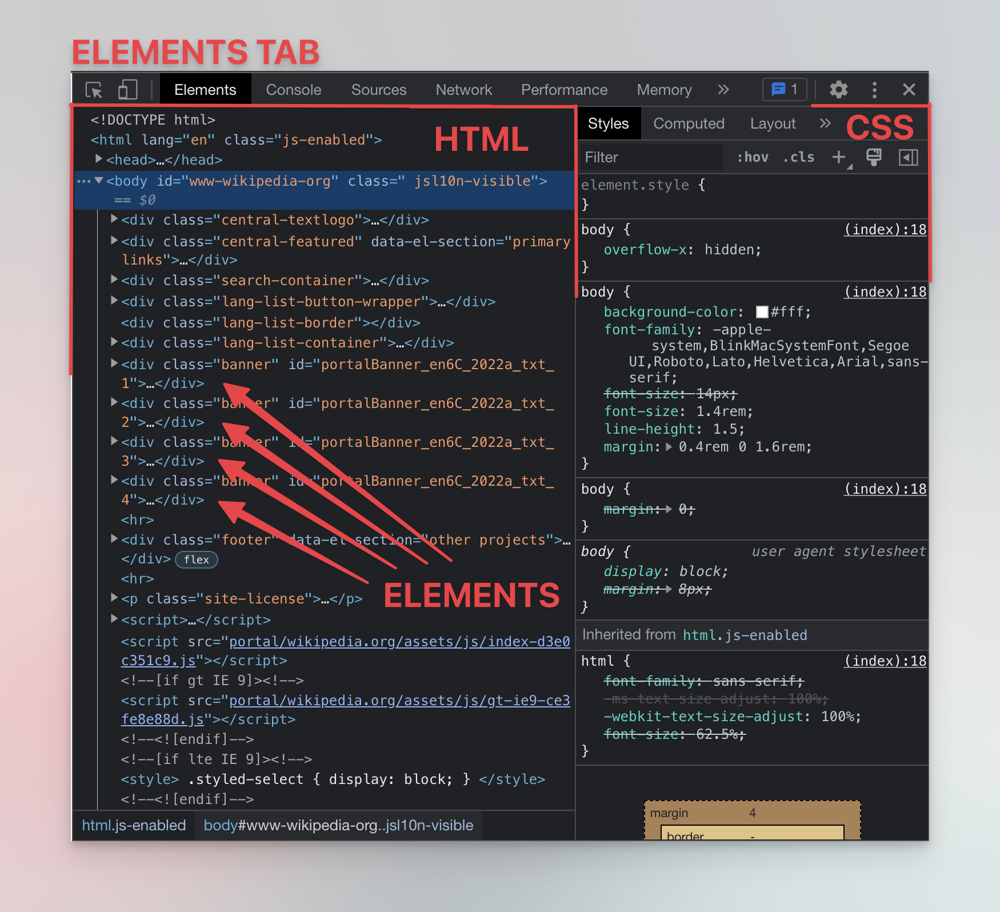
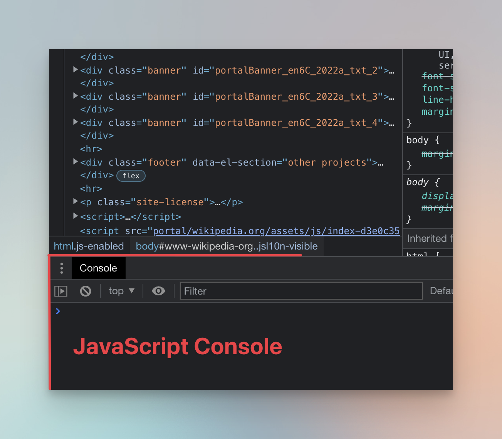
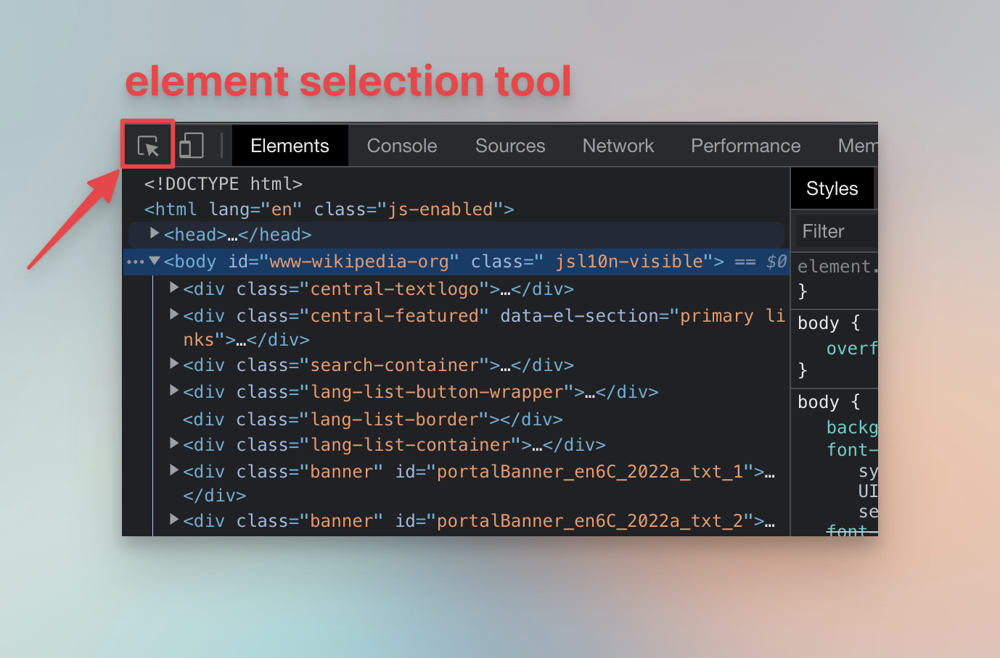
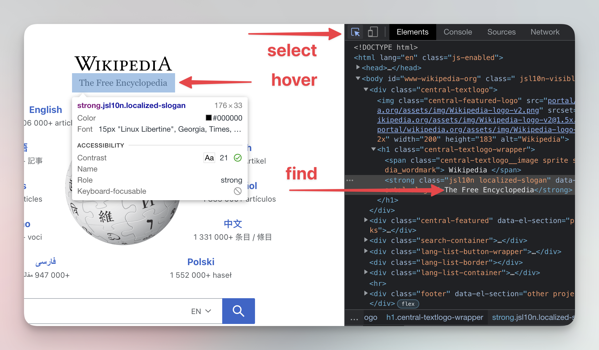
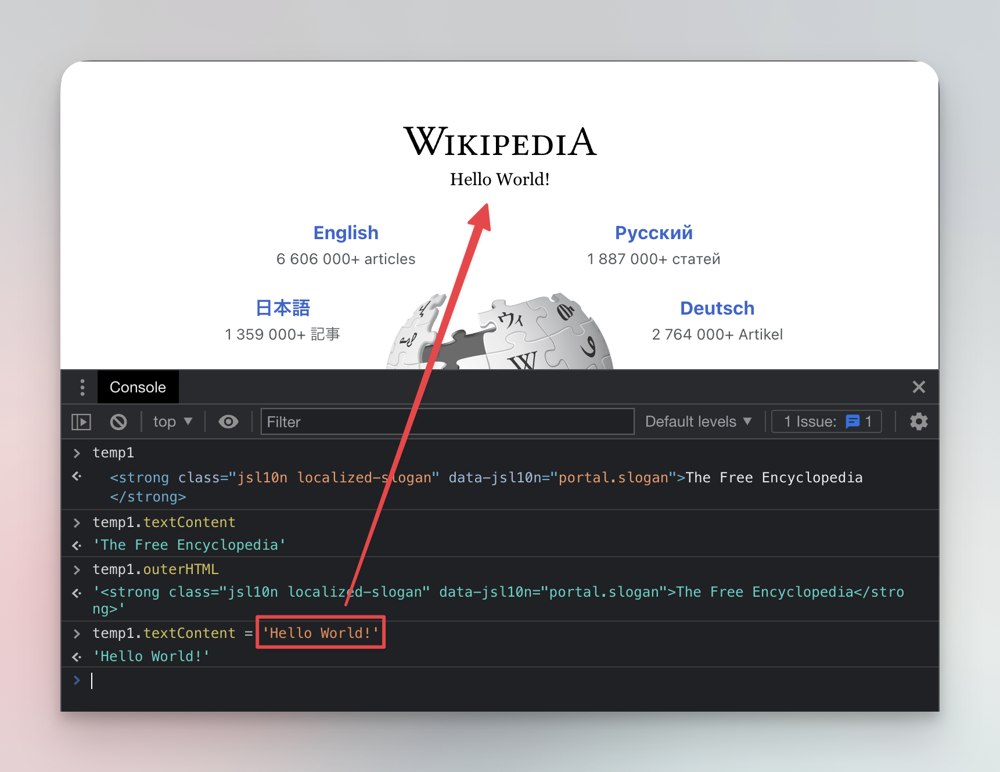

**Learn about browser DevTools, a valuable tool in the world of web scraping, and how you can use them to extract data from a website.**

---

Even though DevTools stands for developer tools, everyone can use them to inspect a website. Each major browser has its own DevTools. We will use Chrome DevTools as an example, but the advice is applicable to any browser, as the tools are extremely similar. To open Chrome DevTools, you can press **F12** or right-click anywhere in the page and choose **Inspect**. Now go to [Wikipedia](https://www.wikipedia.org/) and open your DevTools there.



## Elements tab {#elements-tab}

When you first open Chrome DevTools on Wikipedia, you will start on the Elements tab (In Firefox it's called the **Inspector**). You can use this tab to inspect the page's HTML on the left hand side, and its CSS on the right. The items in the HTML view are called [**elements**](../../../glossary/concepts/html_elements.md).



> On a screen that is narrow or has a small resolution, the CSS information can appear under the HTML tab, not on the right.

Each element is enclosed in an HTML tag. For example `<div>`, `<p>`, and `<span>` are all tags. When you add something inside of those tags, like `<p>Hello!</p>` you create an element. You can also see elements inside other elements in the **Elements** tab. This is called nesting, and it gives the page its structure.

At the bottom, there's the **JavaScript console**, which is a powerful tool which can be used to manipulate the website. If the console is not there, you can press **ESC** to toggle it. All of this might look super complicated at first, but don't worry, there's no need to understand everything yet - we'll walk you through all the important things you need to know.



## Selecting an element {#selecting-an-element}

In the top left corner of DevTools, there's a little arrow icon with a square.



Click it and then hover your mouse over **The Free Encyclopedia**, Wikipedia's subtitle. DevTools will show you information about the HTML element being hovered over. Now click the element. It will be selected in the **Elements** tab, which allows for further inspection of the element and its content.



## Interacting with an element {#interacting-with-elements}

After you select the subtitle element, right-click the highlighted element in the Elements tab to show a menu with available actions. For now, select **Store as global variable** (**Use in Console** in Firefox). You'll see that a new variable called `temp1` (`temp0` in Firefox) appeared in your DevTools Console. You can now use the Console to access the element's properties using JavaScript.

For example, if you wanted to scrape the text inside the element, you could use the `textContent` property to get it. Copy and paste (or type) the following command into your Console and press Enter. The text of your `temp1` element - The Free Encyclopedia - will display in the Console.

```js
temp1.textContent;
```

Now run this command to get the HTML of the element:

```js
temp1.outerHTML;
```

And finally, run the next command to change the text of the element.

```js
temp1.textContent = 'Hello World!';
```

By changing HTML elements from the Console, you can change what's displayed on the page. This change only happens on your own computer so don't worry, you haven't hacked Wikipedia.



> In JavaScript, the web page is called `document`. From the Console you can interact with it in many ways. Go through [document basics](https://developer.mozilla.org/en-US/docs/Web/API/Document_object_model/Using_the_Document_Object_Model) to learn more.

## Next up {#next}

In this lesson, we learned the absolute basics of interaction with a page using the DevTools. In the [next lesson](./using_devtools.md), you will learn how to extract data from it. We will extract data about the on-sale products on the [Warehouse store](https://warehouse-theme-metal.myshopify.com).

It isn't a real store, but a full-featured demo of a Shopify online store. And that is perfect for our purposes. Shopify is one of the largest e-commerce platforms in the world, and it uses all the latest technologies that a real e-commerce web application would use. Learning to scrape a Shopify store is useful, because you can immediately apply the learnings to millions of websites.
