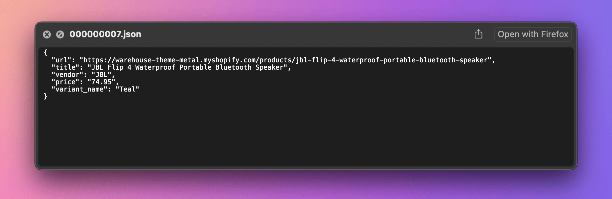

import Exercises from '../scraping_basics/_exercises.mdx';

**In this lesson, we'll rework our application for watching prices so that it builds on top of a scraping framework. We'll use Crawlee to make the program simpler, faster, and more robust.**

---

Before rewriting our code, let's point out several caveats in our current solution:

- _Hard to maintain:_ All the data we need from the listing page is also available on the product page. By scraping both, we have to maintain selectors for two HTML documents. Instead, we could scrape links from the listing page and process all data on the product pages.
- _Inconsiderate:_ The program sends all requests in parallel, which is efficient but inconsiderate to the target website and may result in us getting blocked.
- _No logging:_ The scraper gives no sense of progress, making it tedious to use. Debugging issues becomes even more frustrating without proper logs.
- _Boilerplate code:_ We implement downloading and parsing HTML, or exporting data to CSV, although we're not the first people to meet and solve these problems.
- _Prone to anti-scraping:_ If the target website implemented anti-scraping measures, a bare-bones program like ours would stop working.
- _Browser means rewrite:_ We got lucky extracting variants. If the website didn't include a fallback, we might have had no choice but to spin up a browser instance and automate clicking on buttons. Such a change in the underlying technology would require a complete rewrite of our program.
- _No error handling:_ The scraper stops if it encounters issues. It should allow for skipping problematic products with warnings or retrying downloads when the website returns temporary errors.

In this lesson, we'll address all of the above issues while keeping the code concise with the help of a scraping framework. We'll use [Crawlee](https://crawlee.dev/), not just because we created it, but because it's the most popular JavaScript framework for web scraping.

## Starting with Crawlee

First let's install the Crawlee package. The framework has a lot of dependencies, so expect the installation to take a while.

```text
$ npm install crawlee --save

added 123 packages, and audited 123 packages in 0s
...
```

Now let's use the framework to create a new version of our scraper. First, let's rename the `index.js` file to `oldindex.js`, so that we can keep peeking at the original implementation while working on the new one. Then, in the same project directory, we'll create a new, empty `index.js`. The initial content will look like this:

```js
import { CheerioCrawler } from 'crawlee';

const crawler = new CheerioCrawler({
    async requestHandler({ $, log }) {
        const title = $('title').text().trim();
        log.info(title);
    },
});

await crawler.run(['https://warehouse-theme-metal.myshopify.com/collections/sales']);
```

In the code, we do the following:

1. Import the necessary module.
1. Create a crawler object, which manages the scraping process. In this case, it's a `CheerioCrawler`, which requests HTML from websites and parses it with Cheerio. Other crawlers, such as `PlaywrightCrawler`, would be suitable if we wanted to scrape by automating a real browser.
1. Define an asynchronous `requestHandler` function. It receives a context object with Cheerio's `$` instance and a logger.
1. Extract the page title and log it.
1. Run the crawler on a product listing URL and await its completion.

Let's see what it does when we run it:

```text
$ node index.js
INFO  CheerioCrawler: Starting the crawler.
INFO  CheerioCrawler: Sales
INFO  CheerioCrawler: All requests from the queue have been processed, the crawler will shut down.
INFO  CheerioCrawler: Final request statistics: {"requestsFinished":1,"requestsFailed":0,"retryHistogram":[1],"requestAvgFailedDurationMillis":null,"requestAvgFinishedDurationMillis":388,"requestsFinishedPerMinute":131,"requestsFailedPerMinute":0,"requestTotalDurationMillis":388,"requestsTotal":1,"crawlerRuntimeMillis":458}
INFO  CheerioCrawler: Finished! Total 1 requests: 1 succeeded, 0 failed. {"terminal":true}
```

If our previous scraper didn't give us any sense of progress, Crawlee feeds us with perhaps too much information for the purposes of a small program. Among all the logging, notice the line with `Sales`. That's the page title! We managed to create a Crawlee scraper that downloads the product listing page, parses it with Cheerio, extracts the title, and prints it.

## Crawling product detail pages

The code is now less accessible to beginners, and the size of the program is about the same as if we worked without a framework. The tradeoff of using a framework is that primitive scenarios may become unnecessarily complex, while complex scenarios may become surprisingly primitive. As we rewrite the rest of the program, the benefits of using Crawlee will become more apparent.

For example, it takes only a few changes to the code to extract and follow links to all the product detail pages:

```js
import { CheerioCrawler } from 'crawlee';

const crawler = new CheerioCrawler({
    // highlight-start
    async requestHandler({ $, log, request, enqueueLinks }) {
      if (request.label === 'DETAIL') {
        log.info(request.url);
      } else {
        await enqueueLinks({ label: 'DETAIL', selector: '.product-list a.product-item__title' });
      }
    },
    // highlight-end
});

await crawler.run(['https://warehouse-theme-metal.myshopify.com/collections/sales']);
```

First, it's necessary to inspect the page in browser DevTools to figure out the CSS selector that allows us to locate links to all the product detail pages. Then we can use the `enqueueLinks()` method to find the links and add them to Crawlee's internal HTTP request queue. We tell the method to label all the requests as `DETAIL`.

For each request, Crawlee will run the same handler function. That's why now we need to check the label of the request being processed. For those labeled as `DETAIL`, we'll log the URL, otherwise we assume we're processing the listing page.

If we run the code, we should see how Crawlee first downloads the listing page and then makes parallel requests to each of the detail pages, logging their URLs along the way:

```text
$ node index.js
INFO  CheerioCrawler: Starting the crawler.
INFO  CheerioCrawler: https://warehouse-theme-metal.myshopify.com/products/sony-xbr55a8f-55-inch-4k-ultra-hd-smart-bravia-oled-tv
INFO  CheerioCrawler: https://warehouse-theme-metal.myshopify.com/products/klipsch-r-120sw-powerful-detailed-home-speaker-set-of-1
...
```

In the final stats, we can see that we made 25 requests (1 listing page + 24 product pages) in just a few seconds. What we cannot see is that these requests are not made all at once without planning, but are scheduled and sent in a way that doesn't overload the target server. And if they do, Crawlee can automatically retry them.

## Extracting data

The `CheerioCrawler` provides the handler with the `$` attribute, which contains the parsed HTML of the handled page. This is the same `$` object we used in our previous program. Let's locate and extract the same data as before:

```js
const crawler = new CheerioCrawler({
    async requestHandler({ $, request, enqueueLinks, log }) {
        if (request.label === 'DETAIL') {
            const item = {
                url: request.url,
                title: $('.product-meta__title').text().trim(),
                vendor: $('.product-meta__vendor').text().trim(),
            };
            log.info("Item scraped", item);
        } else {
            await enqueueLinks({ selector: '.product-list a.product-item__title', label: 'DETAIL' });
        }
    },
});
```

Now for the price. We're not doing anything new here—just copy-paste the code from our old scraper. The only change will be in the selector.

In `oldindex.js`, we look for `.price` within a `$productItem` object representing a product card. Here, we're looking for `.price` within the entire product detail page. It's better to be more specific so we don't accidentally match another price on the same page:

```js
const crawler = new CheerioCrawler({
    async requestHandler({ $, request, enqueueLinks, log }) {
        if (request.label === 'DETAIL') {
            // highlight-next-line
            const $price = $(".product-form__info-content .price").contents().last();
            const priceRange = { minPrice: null, price: null };
            const priceText = $price
                .text()
                .trim()
                .replace("$", "")
                .replace(".", "")
                .replace(",", "");

            if (priceText.startsWith("From ")) {
                priceRange.minPrice = parseInt(priceText.replace("From ", ""));
            } else {
                priceRange.minPrice = parseInt(priceText);
                priceRange.price = priceRange.minPrice;
            }

            const item = {
                url: request.url,
                title: $(".product-meta__title").text().trim(),
                vendor: $('.product-meta__vendor').text().trim(),
                ...priceRange,
            };
            log.info("Item scraped", item);
        } else {
            await enqueueLinks({ selector: '.product-list a.product-item__title', label: 'DETAIL' });
        }
    },
});
```

Finally, the variants. We can reuse the `parseVariant()` function as-is. In the handler, we'll take some inspiration from what we have in `oldindex.js`, but since we're just logging the items and don't need to return them, the loop can be simpler. First, in the item data, we'll set `variantName` to `null` as a default value. If there are no variants, we'll log the item data as-is. If there are variants, we'll parse each one, merge the variant data with the item data, and log each resulting object. The full program will look like this:

```js
import { CheerioCrawler } from 'crawlee';

function parseVariant($option) {
  const [variantName, priceText] = $option
    .text()
    .trim()
    .split(" - ");
  const price = parseInt(
    priceText
      .replace("$", "")
      .replace(".", "")
      .replace(",", "")
  );
  return { variantName, price };
}

const crawler = new CheerioCrawler({
    async requestHandler({ $, request, enqueueLinks, log }) {
        if (request.label === 'DETAIL') {
            const $price = $(".product-form__info-content .price").contents().last();
            const priceRange = { minPrice: null, price: null };
            const priceText = $price
                .text()
                .trim()
                .replace("$", "")
                .replace(".", "")
                .replace(",", "");

            if (priceText.startsWith("From ")) {
                priceRange.minPrice = parseInt(priceText.replace("From ", ""));
            } else {
                priceRange.minPrice = parseInt(priceText);
                priceRange.price = priceRange.minPrice;
            }

            const item = {
                url: request.url,
                title: $(".product-meta__title").text().trim(),
                vendor: $('.product-meta__vendor').text().trim(),
                ...priceRange,
                // highlight-next-line
                variantName: null,
            };

            // highlight-start
            const $variants = $(".product-form__option.no-js option");
            if ($variants.length === 0) {
              log.info("Item scraped", item);
            } else {
              for (const element of $variants.toArray()) {
                const variant = parseVariant($(element));
                log.info("Item scraped", { ...item, ...variant });
              }
            }
            // highlight-end
        } else {
            await enqueueLinks({ selector: '.product-list a.product-item__title', label: 'DETAIL' });
        }
    },
});

await crawler.run(['https://warehouse-theme-metal.myshopify.com/collections/sales']);
```

If we run this scraper, we should get the same data for the 24 products as before. Crawlee has saved us a lot of effort by managing downloading, parsing, and parallelization.

Crawlee doesn't do much to help with locating and extracting the data—that part of the code remains almost the same, framework or not. This is because the detective work of finding and extracting the right data is the core value of custom scrapers. With Crawlee, we can focus on just that while letting the framework take care of everything else.

## Saving data

Now that we're _letting the framework take care of everything else_, let's see what it can do about saving data. As of now, the product detail page handler logs each item as soon as it's ready. Instead, we can push the item to Crawlee's default dataset:

```js
const crawler = new CheerioCrawler({
  // highlight-next-line
  async requestHandler({ $, request, enqueueLinks, pushData, log }) {
    if (request.label === 'DETAIL') {
      ...

      const $variants = $(".product-form__option.no-js option");
      if ($variants.length === 0) {
        // highlight-next-line
        pushData(item);
      } else {
        for (const element of $variants.toArray()) {
          const variant = parseVariant($(element));
          // highlight-next-line
          pushData({ ...item, ...variant });
        }
      }
    } else {
        ...
    }
  },
});
```

That's it! If we run the program now, there should be a `storage` directory alongside the `index.js` file. Crawlee uses it to store its internal state. If we go to the `storage/datasets/default` subdirectory, we'll see over 30 JSON files, each representing a single item.



We can also export all the items to a single file of our choice. We'll do it at the end of the program, after the crawler has finished scraping:

```js
await crawler.run(['https://warehouse-theme-metal.myshopify.com/collections/sales']);
await crawler.exportData('dataset.json');
await crawler.exportData('dataset.csv');
```

After running the scraper again, there should be two new files in your directory, `dataset.json` and `dataset.csv`, containing all the data.

## Logging

Crawlee gives us stats about HTTP requests and concurrency, but once we started using `pushData()` instead of `log.info()`, we lost visibility into the pages we're crawling and the items we're saving. Let's add back some custom logging:

```js
import { CheerioCrawler } from 'crawlee';

function parseVariant($option) {
  const [variantName, priceText] = $option
    .text()
    .trim()
    .split(" - ");
  const price = parseInt(
    priceText
      .replace("$", "")
      .replace(".", "")
      .replace(",", "")
  );
  return { variantName, price };
}

const crawler = new CheerioCrawler({
    async requestHandler({ $, request, enqueueLinks, pushData, log }) {
        if (request.label === 'DETAIL') {
            // highlight-next-line
            log.info(`Product detail page: ${request.url}`);

            const $price = $(".product-form__info-content .price").contents().last();
            const priceRange = { minPrice: null, price: null };
            const priceText = $price
                .text()
                .trim()
                .replace("$", "")
                .replace(".", "")
                .replace(",", "");

            if (priceText.startsWith("From ")) {
                priceRange.minPrice = parseInt(priceText.replace("From ", ""));
            } else {
                priceRange.minPrice = parseInt(priceText);
                priceRange.price = priceRange.minPrice;
            }

            const item = {
                url: request.url,
                title: $(".product-meta__title").text().trim(),
                vendor: $('.product-meta__vendor').text().trim(),
                ...priceRange,
                variantName: null,
            };

            const $variants = $(".product-form__option.no-js option");
            if ($variants.length === 0) {
              // highlight-next-line
              log.info('Saving a product');
              pushData(item);
            } else {
              for (const element of $variants.toArray()) {
                const variant = parseVariant($(element));
                // highlight-next-line
                log.info('Saving a product variant');
                pushData({ ...item, ...variant });
              }
            }
        } else {
            // highlight-next-line
            log.info('Looking for product detail pages');
            await enqueueLinks({ selector: '.product-list a.product-item__title', label: 'DETAIL' });
        }
    },
});

await crawler.run(['https://warehouse-theme-metal.myshopify.com/collections/sales']);
// highlight-next-line
crawler.log.info('Exporting data');
await crawler.exportData('dataset.json');
await crawler.exportData('dataset.csv');
```

Depending on what we find helpful, we can tweak the logs to include more or less detail. Check the Crawlee docs on the [Log instance](https://crawlee.dev/js/api/core/class/Log) for more details on what you can do with it.

If we compare `index.js` and `oldindex.js` now, it's clear we've cut at least 20 lines of code compared to the original program, even with the extra logging we've added. Throughout this lesson, we've introduced features to match the old scraper's functionality, but at each phase, the code remained clean and readable. Plus, we've been able to focus on what's unique to the website we're scraping and the data we care about.

In the next lesson, we'll use a scraping platform to set up our application to run automatically every day.

---

<Exercises />

### Build a Crawlee scraper of F1 Academy drivers

Scrape information about all [F1 Academy](https://en.wikipedia.org/wiki/F1_Academy) drivers listed on the official [Drivers](https://www.f1academy.com/Racing-Series/Drivers) page. Each item you push to Crawlee's default dataset should include the following data:

- URL of the driver's f1academy.com page
- Name
- Team
- Nationality
- Date of birth (as a string in `YYYY-MM-DD` format)
- Instagram URL

If you export the dataset as JSON, it should look something like this:

<!-- eslint-skip -->
```json
[
  {
    "url": "https://www.f1academy.com/Racing-Series/Drivers/29/Emely-De-Heus",
    "name": "Emely De Heus",
    "team": "MP Motorsport",
    "nationality": "Dutch",
    "dob": "2003-02-10",
    "instagram_url": "https://www.instagram.com/emely.de.heus/",
  },
  {
    "url": "https://www.f1academy.com/Racing-Series/Drivers/28/Hamda-Al-Qubaisi",
    "name": "Hamda Al Qubaisi",
    "team": "MP Motorsport",
    "nationality": "Emirati",
    "dob": "2002-08-08",
    "instagram_url": "https://www.instagram.com/hamdaalqubaisi_official/",
  },
  ...
]
```

:::tip Need a nudge?

- The website uses `DD/MM/YYYY` format for the date of birth. You'll need to change the format to the ISO 8601 standard with dashes: `YYYY-MM-DD`
- To locate the Instagram URL, use the attribute selector `a[href*='instagram']`. Learn more about attribute selectors in the [MDN docs](https://developer.mozilla.org/en-US/docs/Web/CSS/Attribute_selectors).

:::

<details>
  <summary>Solution</summary>

  ```js
  import { CheerioCrawler } from 'crawlee';

  const crawler = new CheerioCrawler({
    async requestHandler({ $, request, enqueueLinks, pushData }) {
      if (request.label === 'DRIVER') {
        const info = {};
        for (const itemElement of $('.common-driver-info li').toArray()) {
          const name = $(itemElement).find('span').text().trim();
          const value = $(itemElement).find('h4').text().trim();
          info[name] = value;
        }
        const detail = {};
        for (const linkElement of $('.driver-detail--cta-group a').toArray()) {
          const name = $(linkElement).find('p').text().trim();
          const value = $(linkElement).find('h2').text().trim();
          detail[name] = value;
        });
        const [dobDay, dobMonth, dobYear] = info['DOB'].split("/");
        pushData({
          url: request.url,
          name: $('h1').text().trim(),
          team: detail['Team'],
          nationality: info['Nationality'],
          dob: `${dobYear}-${dobMonth}-${dobDay}`,
          instagram_url: $(".common-social-share a[href*='instagram']").attr('href'),
        });
      } else {
        await enqueueLinks({ selector: '.teams-driver-item a', label: 'DRIVER' });
      }
    },
  });

  await crawler.run(['https://www.f1academy.com/Racing-Series/Drivers']);
  await crawler.exportData('dataset.json');
  ```

</details>

### Use Crawlee to find the ratings of the most popular Netflix films

The [Global Top 10](https://www.netflix.com/tudum/top10) page has a table listing the most popular Netflix films worldwide. Scrape the movie names from this page, then search for each movie on [IMDb](https://www.imdb.com/). Assume the first search result is correct and retrieve the film's rating. Each item you push to Crawlee's default dataset should include the following data:

- URL of the film's IMDb page
- Title
- Rating

If you export the dataset as JSON, it should look something like this:

<!-- eslint-skip -->
```json
[
  {
    "url": "https://www.imdb.com/title/tt32368345/?ref_=fn_tt_tt_1",
    "title": "The Merry Gentlemen",
    "rating": "5.0/10"
  },
  {
    "url": "https://www.imdb.com/title/tt32359447/?ref_=fn_tt_tt_1",
    "title": "Hot Frosty",
    "rating": "5.4/10"
  },
  ...
]
```

To scrape IMDb data, you'll need to construct a `Request` object with the appropriate search URL for each movie title. The following code snippet gives you an idea of how to do this:

```js
import { CheerioCrawler, Request } from 'crawlee';
import { escape } from 'node:querystring';

const imdbSearchUrl = `https://www.imdb.com/find/?q=${escape(name)}&s=tt&ttype=ft`;
const request = new Request({ url: imdbSearchUrl, label: 'IMDB_SEARCH' });
```

Then use the `addRequests()` function to instruct Crawlee that it should follow an array of these manually constructed requests:

```js
async requestHandler({ ..., addRequests }) {
  ...
  await addRequests(requests);
},
```

:::tip Need a nudge?

When navigating to the first IMDb search result, you might find it helpful to know that `enqueueLinks()` accepts a `limit` option, letting you specify the max number of HTTP requests to enqueue.

:::

<details>
  <summary>Solution</summary>

  ```js
  import { CheerioCrawler, Request } from 'crawlee';
  import { escape } from 'node:querystring';

  const crawler = new CheerioCrawler({
    async requestHandler({ $, request, enqueueLinks, pushData, addRequests }) {
      if (request.label === 'IMDB') {
        // handle IMDB film page
        pushData({
          url: request.url,
          title: $('h1').text().trim(),
          rating: $("[data-testid='hero-rating-bar__aggregate-rating__score']").first().text().trim(),
        });
      } else if (request.label === 'IMDB_SEARCH') {
        // handle IMDB search results
        await enqueueLinks({ selector: '.find-result-item a', label: 'IMDB', limit: 1 });

      } else if (request.label === 'NETFLIX') {
        // handle Netflix table
        const $buttons = $('[data-uia="top10-table-row-title"] button');
        const requests = $buttons.toArray().map(buttonElement => {
          const name = $(buttonElement).text().trim();
          const imdbSearchUrl = `https://www.imdb.com/find/?q=${escape(name)}&s=tt&ttype=ft`;
          return new Request({ url: imdbSearchUrl, label: 'IMDB_SEARCH' });
        });
        await addRequests($requests.get());
      } else {
        throw new Error(`Unexpected request label: ${request.label}`);
      }
    },
  });

  await crawler.run(['https://www.netflix.com/tudum/top10']);
  await crawler.exportData('dataset.json');
  ```

</details>
