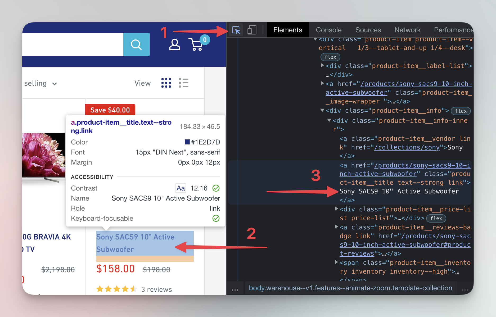
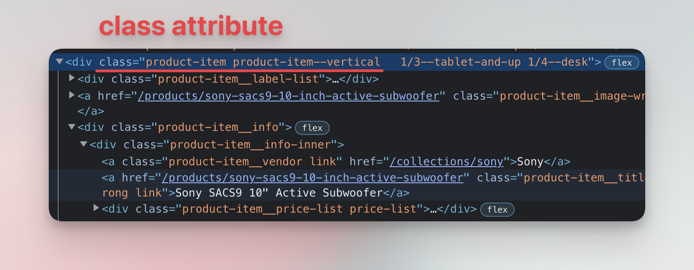
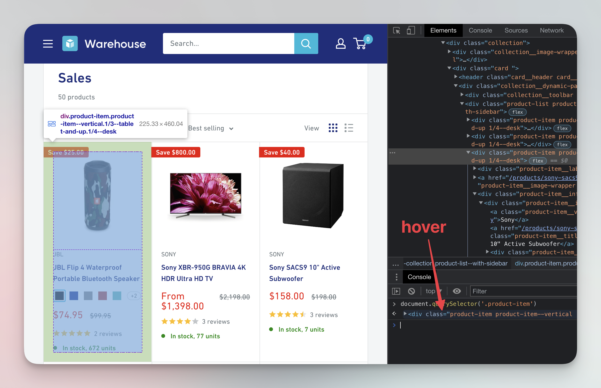
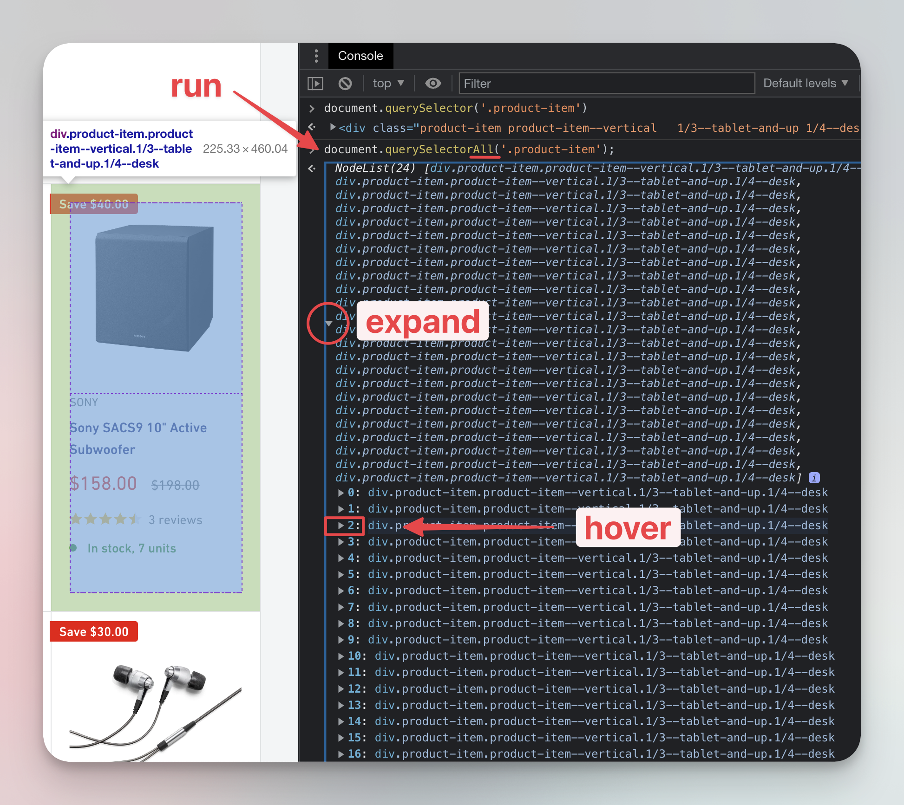
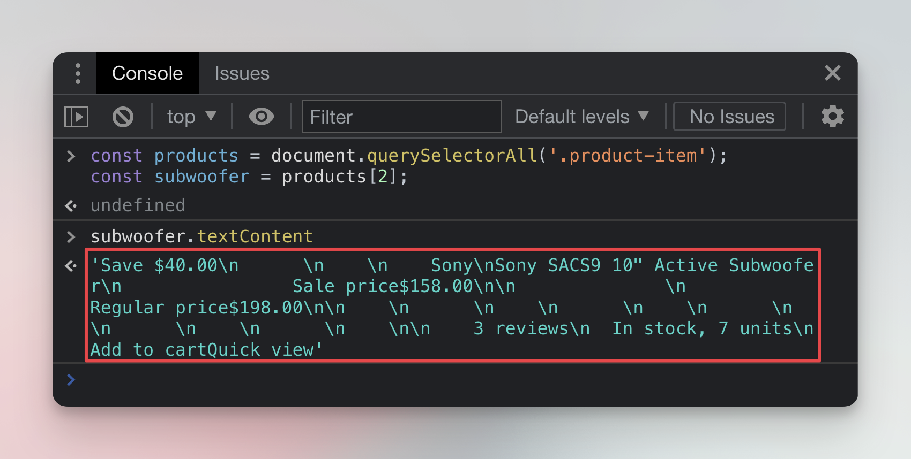
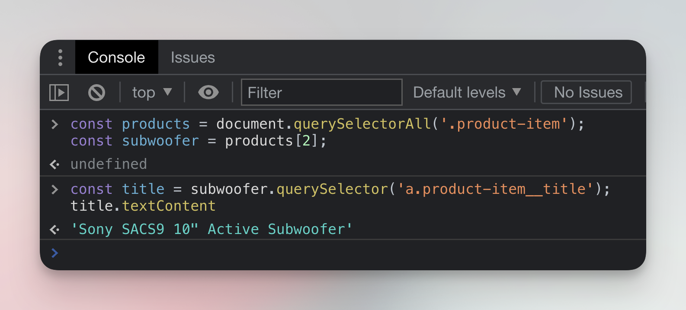
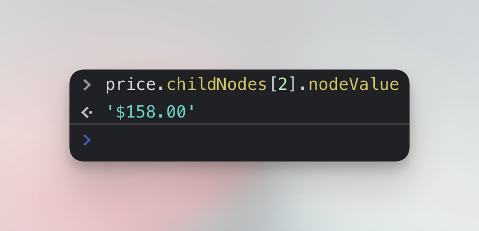
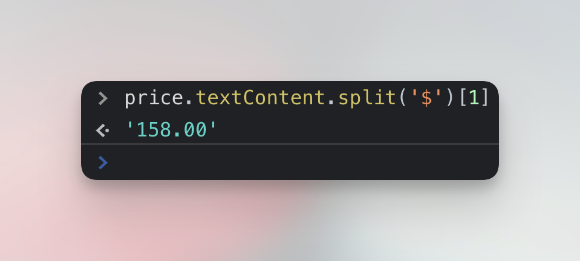

**Learn how to use browser DevTools, CSS selectors, and JavaScript via the DevTools console to extract data from a website.**

---

With the knowledge of the basics of DevTools we can finally try doing something more practical - extracting data from a website. Let's try collecting the on-sale products from the [Warehouse store](https://warehouse-theme-metal.myshopify.com/). We will use [CSS selectors](../../../glossary/concepts/css_selectors.md), JavaScript, and DevTools to achieve this task.

> **Why use a Shopify demo and not a real e-commerce store like Amazon?** Because real websites are usually bulkier, littered with promotions, and they change very often. Many have multiple versions of pages, and you never know in advance which one you will get. It will be important to learn how to deal with these challenges in the future, but for this beginner course, we want to have a light and stable environment.
>
> Some other courses use so-called scraping playgrounds or sandboxes. Those are websites made solely for the purpose of learning scraping. We find those too dumbed down and not representative of real websites. The Shopify demo is a full-featured, real-world website.

## Getting structured data from HTML {#getting-structured-data}

When you open up the [Sales section of Warehouse](https://warehouse-theme-metal.myshopify.com/collections/sales), you'll see that there's a grid of products on the page with names and pictures of products. We will learn how to extract all this information.


Open DevTools and select the name of the **Sony SACS9 Active Subwoofer**. When you click on it, it will get highlighted in the Elements tab.



Great, you have selected the element which contains the name of the subwoofer. Now we want to find all the elements that contain all the information about this subwoofer. Price, number of reviews, image and everything else you might need. We will use the **Elements** tab to do that. You can hover over the elements in the Elements tab, and they will get highlighted on the page as you move the mouse.

Start from the previously selected element with the subwoofer's name and move your mouse up, hovering over each element, until you find the one that highlights the entire product card. Alternatively, you can press the up arrow a few times to get the same result.

The element that contains all the information about the subwoofer is called a **parent element**, and all the nested elements, including the subwoofer's name, price and everything else, are **child elements**.


Now that we know how the parent element looks, we can extract its data, including the data of its children. Notice that the element has a `class` attribute with multiple values like `product-item` or `product-item--vertical`. Let's use those classes in the Console to extract data.



## Selecting elements in Console {#selecting-elements}

We know how to find an element manually using the DevTools, but that's not very useful for automated scraping. We need to tell the computer how to find it as well. We can do that using JavaScript and CSS selectors. The function to do that is called [`document.querySelector()`](../../../glossary/concepts/querying_css_selectors.md) and it will find the first element in the page's HTML matching the provided [CSS selector](../../../glossary/concepts/css_selectors.md).

For example `document.querySelector('div')` will find the first `<div>` element. And `document.querySelector('.my-class')` (notice the period `.`) will find the first element with the class `my-class`, such as `<div class="my-class">` or `<p class="my-class">`.

You can also combine selectors. `document.querySelector('p.my-class')` will find all `<p class="my-class">` elements, but no `<div class="my-class">`.

Let's try to use `document.querySelector()` to find the **Sony subwoofer**. Earlier we mentioned that the parent element of the subwoofer had, among others, the `product-item` class. We can use the class to look up the element. Copy or type (don't miss the period `.` in `.product-item`) the following function into the Console and press Enter.

```js
document.querySelector('.product-item');
```

It will produce a result like this, but it **won't be** the Sony subwoofer.


:::note About the missing semicolon

In the screenshot, there is a missing semicolon `;` at the end of the line. In JavaScript, semicolons are optional, so it makes no difference.

:::

When we look more closely by hovering over the result in the Console, we find that instead of the Sony subwoofer, we found a JBL Flip speaker. Why? Because earlier we explained that `document.querySelector('.product-item')` finds the **first element** with the `product-item` class, and the JBL speaker is the first product in the list.



We need a different function: [`document.querySelectorAll()`](../../../glossary/concepts/querying_css_selectors.md) (notice the `All` at the end). This function does not find only the first element, but all the elements that match the provided selector.

Run the following function in the Console:

```js
document.querySelectorAll('.product-item');
```

It will return a `NodeList` (a type of array) with many results. Expand the results by clicking the small arrow button and then hover over the third (number 2, indexing starts at 0) element in the list. You'll find that it's the Sony subwoofer we're looking for.



Naturally, this is the method we use mostly in web scraping, because we're usually interested in scraping all the products from a page, not just a single product.

:::note Elements or nodes?

The list is called a `NodeList`, because browsers understand a HTML document as a tree of nodes. Most of the nodes are HTML elements, but there can be also text nodes for plain text, and others.

:::

## How to choose good selectors {#choose-good-selectors}

Often you can select the same element with different CSS selectors. Try to choose selectors that are **simple**, **human-readable**, **unique** and **semantically connected** to the data. Selectors that meet these criteria are sometimes called **resilient selectors**, because they're the most reliable and least likely to change with website updates. If you can, avoid randomly generated attributes like `class="F4jsL8"`. They change often and without warning.

The `product-item` class is simple, human-readable, and semantically connected with the data. The subwoofer is one of the products. A product item. Those are strong signals that this is a good selector. It's also sufficiently unique in the website's context. If the selector was only an `item`, for example, there would be a higher chance that the website's developers would add this class to something unrelated. Like an advertisement. And it could break your extraction code.

## Extracting data from elements {#extraction-from-elements}

Now that we found the element, we can start poking into it to extract data. First, let's save the element to a variable so that we can work with it repeatedly. Run these commands in the Console:

```js
const products = document.querySelectorAll('.product-item');
const subwoofer = products[2];
```

> If you're wondering what an array is or what `products[2]` means, read the [JavaScript arrays basics](https://developer.mozilla.org/en-US/docs/Learn/JavaScript/First_steps/Arrays).

Now that we have the subwoofer saved in a variable, run another command in the Console to print its text:

```js
subwoofer.textContent;
```



As you can see, we were able to extract information about the subwoofer, but the format is still not very useful - there's a lot of content that we don't need. For further processing (ex. in a spreadsheet), we would like to have each piece of data as a separate field (column). To do that, we will look at the HTML structure in more detail.

### Finding child elements {#finding-child-elements}

In the [Getting structured data from HTML](#getting-structured-data) section, we were browsing the elements in the **Elements** tab to find the element that contains all the data. We can use the same approach to find the individual data points as well.

Start from the element that contains all data: `<div class="product-item...">` Then inspect all the elements nested within this element. You'll discover that:

- the product's name is an `<a>` element with the class `product-item__title`, and
- the price is held inside a `<span>` with the class `price`. Note that there are two prices. The sale price and the regular price. We want the sale price.

We will use this knowledge soon to extract the data.


### Selecting child elements {#selecting-child-elements}

The `document.querySelector()` function looks for a specific element in the whole HTML `document`, so if we called it with `h3`, it would find the first `<h3>` node in the `document`. But we can replace the `document` with any other parent element and the function will limit its search to child elements of the chosen parent.

Earlier we selected the parent element of the Sony subwoofer and saved it to a variable called `subwoofer`. Let's use this variable to search inside the subwoofer element and find the product's name and price.

Run two commands in the Console. The first will find the element with the subwoofer's name and save it to a variable called `title`. The second will extract the name and print it.

```js
const title = subwoofer.querySelector('a.product-item__title');
title.textContent;
```



Great! We found a way how to programmatically extract the name of the product. We're getting somewhere.

Next, run the following two commands in the Console.

```js
const price = subwoofer.querySelector('span.price');
price.textContent;
```


It worked, but the price was not alone in the result. We extracted it together with some extra text. This is very common in web scraping. Sometimes it's impossible to separate the data we need by element selection alone, and we have to clean the data using other methods.

### Cleaning extracted data {#cleaning-extracted-data}

When it comes to data cleaning, there are two main approaches you can take. It's beneficial to understand both, as one approach may be feasible in a given situation while the other is not.

1. Remove the elements that add noise to your data from the selection. Then extract the pre-cleaned data.
2. Extract the data with noise. Use [regular expressions](https://developer.mozilla.org/en-US/docs/Web/JavaScript/Guide/Regular_Expressions) or other text manipulation techniques to parse the data and keep only the parts we're interested in.

First, let's look at **removing the noise before extraction**. When you look closely at the element that contains the price, you'll see that it includes another `<span>` element with the text **Sale price**. This `<span>` is what adds noise to our data, and we have to get rid of it.


When we call `subwoofer.querySelector('span.price')` it selects the whole `<span class="price ...:>` element. Unfortunately, it also includes the `<span class="visually-hidden">` element that we're not interested in.

We can, however, use JavaScript to get only the actual text of the selected element, without any child elements. Run this command in the Console:

```js
price.childNodes[2].nodeValue;
```

Why the third child node? Because the first one represents the empty space before `<span class="visually-hidden"`, the second is the noise `<span>` itself and the third one is the price. In any case, we were able to extract the clean price.



The second option we have is to **take the noisy price data and clean it with string manipulation**. The data looks like this:

```text
\n                Sale price$158.00
```

This can be approached in a variety of ways. To start let's look at a naive solution:

```js
price.textContent.split('$')[1];
```



And there you go. Notice that this time we extracted the price without the `$` dollar sign. This could be desirable, because we wanted to convert the price from a string to a number, or not, depending on individual circumstances of the scraping project.

Which method to choose? Neither is the perfect solution. The first method could break if the website's developers change the structure of the `<span>` elements and the price will no longer be in the third position - a very small change that can happen at any moment.

The second method seems more reliable, but only until the website adds prices in other currency or decides to replace `$` with `USD`. It's up to you, the scraping developer to decide which of the methods will be more resilient on the website you scrape.

In production, we would probably use a regular expression like the following, or a specialized library for parsing prices from strings, but for this tutorial, we'll keep it simple.

```js
price.textContent.match(/((\d+,?)+.?(\d+)?)/)[0];
```

## Next up {#next}

This concludes our lesson on extracting and cleaning data using DevTools. Using CSS selectors, we were able to find the HTML element that contains data about our favorite Sony subwoofer and then extract the data. In the [next lesson](./devtools_continued.md), we will learn how to extract information not only about the subwoofer, but about all the products on the page.
