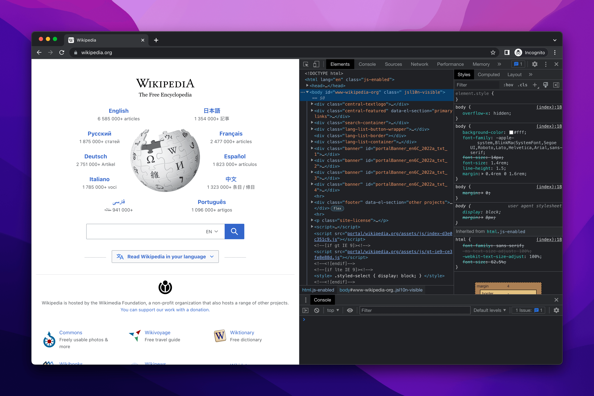
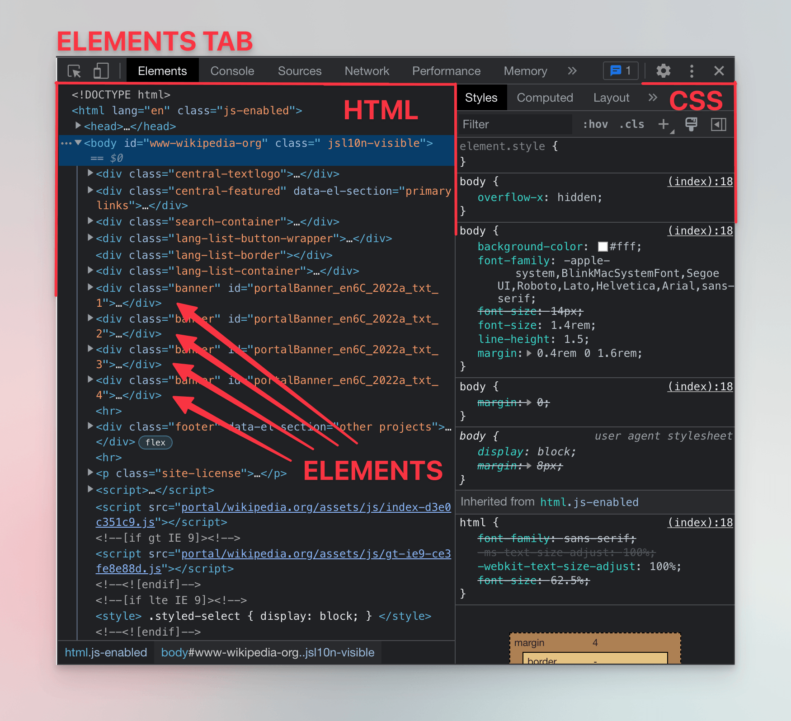
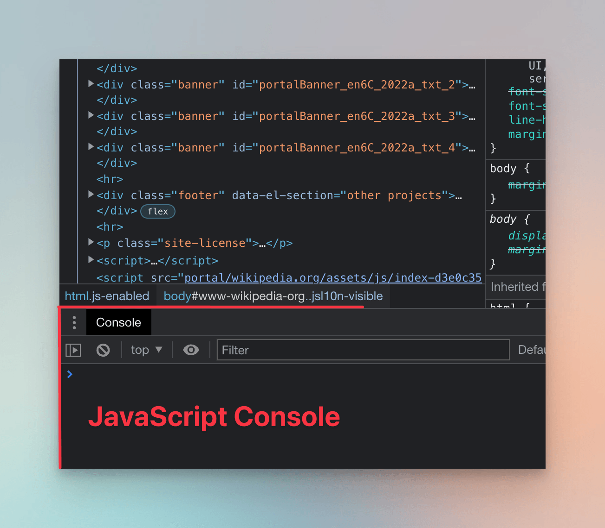
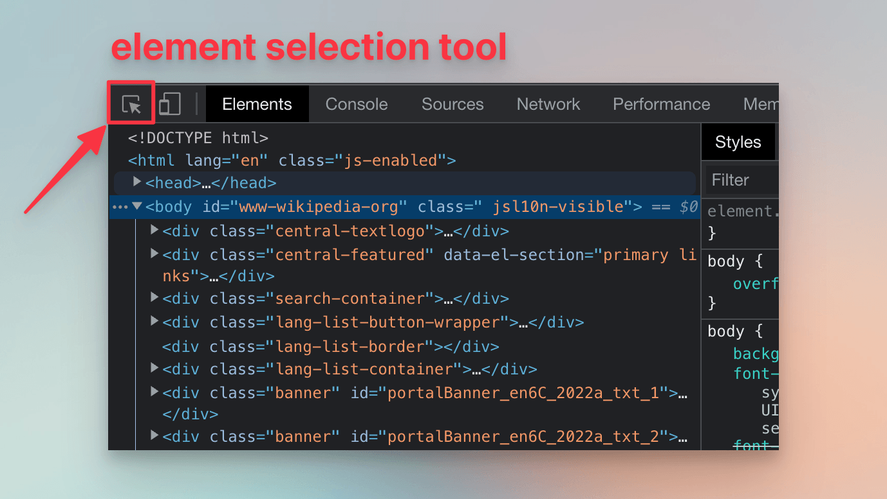
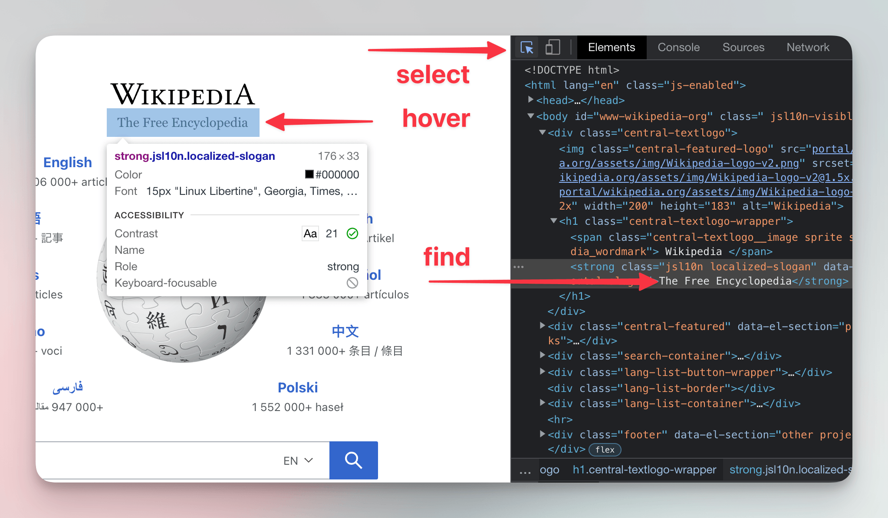

**In this lesson we'll use the browser tools for developers to inspect and manipulate the structure of an e-commerce website.**

---

A browser is the most complete tool for navigating websites. Scrapers are like automated browsers—and sometimes, they actually are automated browsers. The key difference? There's no user to decide where to go or eyes to see what's displayed. Everything has to be pre-programmed.

All modern browsers provide developer tools, or DevTools, for website developers to debug their work. We'll use them to understand how websites are structured and identify the behavior our scraper needs to mimic. Here's the typical workflow for creating a scraper:

1. Inspect the target website in DevTools to understand its structure and determine how to extract the required data.
1. Translate those findings into code.
1. If the scraper fails due to overlooked edge cases or, over time, due to website changes, go back to step 1.

Now let's spend some time figuring out what the detective work from step 1 is about.

## Opening DevTools

As of now, Google Chrome is the most popular browser, and many others use the same core. For that reason we'll focus on [Chrome DevTools](https://developer.chrome.com/docs/devtools) here, but the steps are similar in other browsers like Safari ([Web Inspector](https://developer.apple.com/documentation/safari-developer-tools/web-inspector)) or Firefox ([DevTools](https://firefox-source-docs.mozilla.org/devtools-user/)).

Let's peek behind the scenes of a real-world website, for example Wikipedia. Open the Google Chrome browser and visit [wikipedia.org](https://www.wikipedia.org/). Press **F12**, or right-click anywhere on the page and select **Inspect**.



Websites are made of three major technologies: HTML, CSS, and JavaScript. In the **Elements** tab, DevTools show HTML and CSS of the page currently loaded:



:::warning Screen adaptations

On narrow or low-resolution screens, DevTools might appear in a different configuration. For example, the section with CSS styles might appear below the HTML elements instead of in the right pane.

:::

Imagine [HTML](https://developer.mozilla.org/en-US/docs/Learn/HTML) as a firm frame which defines the structure of the page. Ordinary HTML element consists of an opening tag, closing tag, and attributes. Here is an `article` element with `id` attribute, which wraps `h1` and `p` elements, both containing text. Some of that text is emphasized by `em`.

```html
<article id="article-123">
  <h1 class="heading">First Level Heading</h1>
  <p>Paragraph with <em>emphasized text</em>.</p>
</article>
```

The HTML, a markup language, describes how all the pieces are organized, how they relate to each other, and what's their meaning. It doesn't say anything about what should be their shape and looks. That's where [CSS](https://developer.mozilla.org/en-US/docs/Learn/CSS), or styles, come handy - it's the velvet covering for the frame. In styles, we can select elements and assign rules which instruct the browser about their looks. Here we select all elements with `heading` in their `class` attribute, and set their text to be blue and uppercase.

```css
.heading {
  color: blue;
  text-transform: uppercase;
}
```

While HTML and CSS describe what should browser display, [JavaScript](https://developer.mozilla.org/en-US/docs/Learn/JavaScript) is a general-purpose programming language like Python, which allows the website creators to add interaction to the page.

In DevTools, there is a **Console** tab, which gives access to ad-hoc experimenting with JavaScript. If you can't see it, hit the **ESC** key, which opens or closes the console. Running commands in the console can manipulate the loaded page-we'll soon do just that.



## Selecting an element

In the top left corner of DevTools, find the icon with an arrow pointing to a square.



Hit the icon and hover your cursor over Wikipedia's subtitle, **The Free Encyclopedia**. As you move, DevTools will show you information about the HTML element under your cursor. Click on the subtitle. In the **Elements** tab, DevTools will highlight the HTML element which represents the subtitle.



The highlighted part should look something like this:

```html
<strong class="jsl10n localized-slogan" data-jsl10n="portal.slogan">
  The Free Encyclopedia
</strong>
```

If we were experienced creators of scrapers, our eyes would immediately see what's needed if we wanted to have a program which fetches Wikipedia's subtitle. It would need to download the source code of the page, find a `strong` element with `localized-slogan` in its `class` attribute, and extract its text.

:::tip HTML and whitespace

In HTML, whitespace isn't significant, i.e. it only makes the code readable. The following code snippets represent the same:

```html
<strong>
  The Free Encyclopedia
</strong>
```

```html
  <strong>The Free
Encyclopedia
</strong>
```

:::

## Interacting with an element

:::danger Work in Progress

This lesson is under development. Please read [Starting with browser DevTools](../scraping_basics_javascript/data_extraction/browser_devtools.md) in the meantime so you can follow the upcoming lessons.

:::
