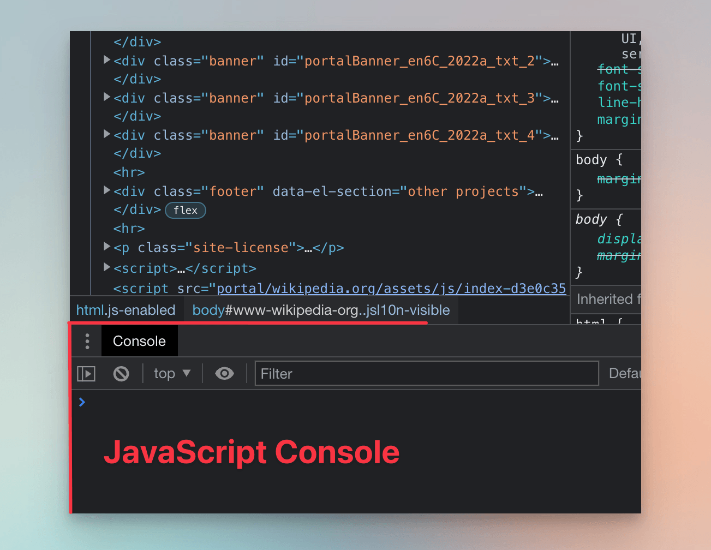
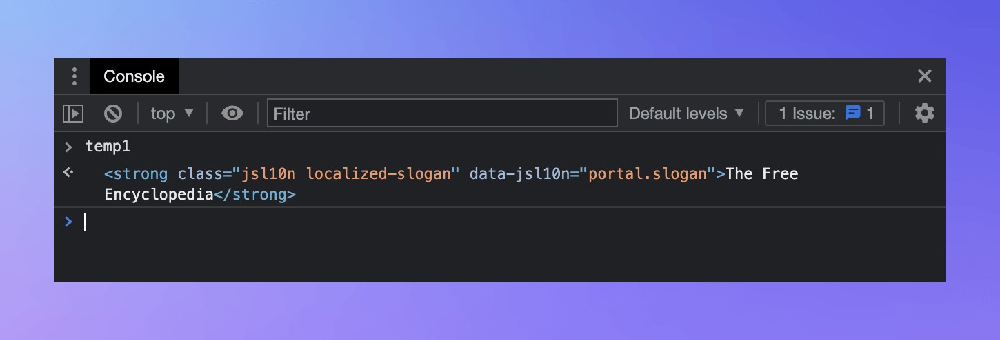
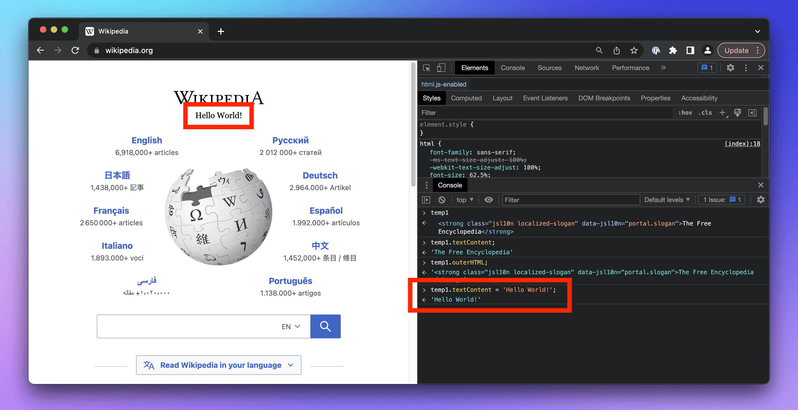
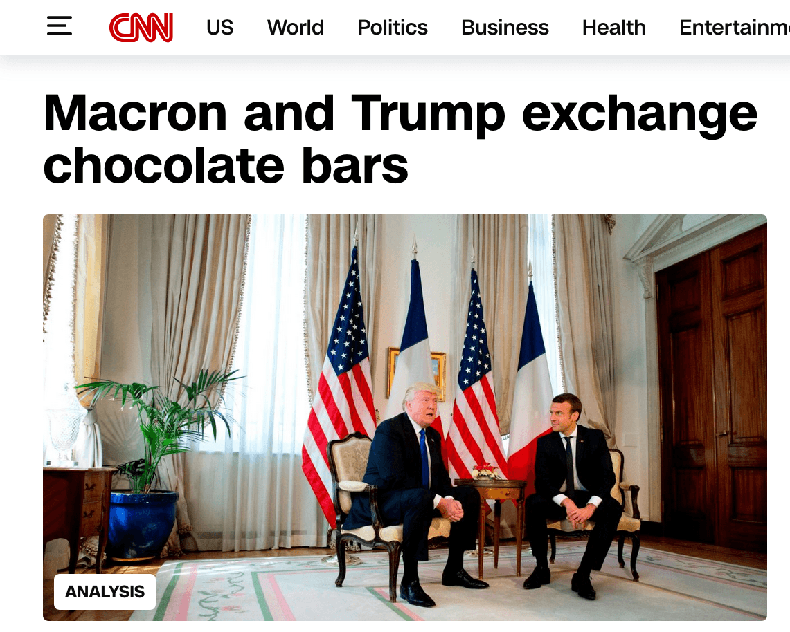

import Exercises from './_exercises.mdx';

**In this lesson we'll use the browser tools for developers to inspect and manipulate the structure of an e-commerce website.**

---

A browser is the most complete tool for navigating websites. Scrapers are like automated browsers—and sometimes, they actually are automated browsers. The key difference? There's no user to decide where to go or eyes to see what's displayed. Everything has to be pre-programmed.

All modern browsers provide developer tools, or DevTools, for website developers to debug their work. We'll use them to understand how websites are structured and identify the behavior our scraper needs to mimic. Here's the typical workflow for creating a scraper:

1. Inspect the target website in DevTools to understand its structure and determine how to extract the required data.
1. Translate those findings into code.
1. If the scraper fails due to overlooked edge cases or, over time, due to website changes, go back to step 1.

Now let's spend some time figuring out what the detective work from step 1 is about.

## Opening DevTools

Google Chrome is currently the most popular browser, and many others use the same core. That's why we'll focus on [Chrome DevTools](https://developer.chrome.com/docs/devtools) here. However, the steps are similar in other browsers like Safari ([Web Inspector](https://developer.apple.com/documentation/safari-developer-tools/web-inspector)) or Firefox ([DevTools](https://firefox-source-docs.mozilla.org/devtools-user/)).

Let's peek behind the scenes of a real-world website—say, Wikipedia. Open Google Chrome and visit [wikipedia.org](https://www.wikipedia.org/). Press **F12**, or right-click anywhere on the page and select **Inspect**.


Websites are built with three main technologies: HTML, CSS, and JavaScript. In the **Elements** tab, DevTools shows the HTML and CSS of the current page:


:::warning Screen adaptations

On smaller or low-resolution screens, DevTools might look different. For example, the CSS styles section might appear below the HTML elements instead of in the right pane.

:::

Think of [HTML](https://developer.mozilla.org/en-US/docs/Learn/HTML) as the frame that defines a page's structure. A basic HTML element includes an opening tag, a closing tag, and attributes. Here's an `article` element with an `id` attribute. It wraps `h1` and `p` elements, both containing text. Some text is emphasized using `em`.

```html
<article id="article-123">
  <h1 class="heading">First Level Heading</h1>
  <p>Paragraph with <em>emphasized text</em>.</p>
</article>
```

HTML, a markup language, describes how everything on a page is organized, how elements relate to each other, and what they mean. It doesn't define how elements should look—that's where [CSS](https://developer.mozilla.org/en-US/docs/Learn/CSS) comes in. CSS is like the velvet covering the frame. Using styles, we can select elements and assign rules that tell the browser how they should appear. For instance, we can style all elements with `heading` in their `class` attribute to make the text blue and uppercase.

```css
.heading {
  color: blue;
  text-transform: uppercase;
}
```

While HTML and CSS describe what the browser should display, [JavaScript](https://developer.mozilla.org/en-US/docs/Learn/JavaScript) is a general-purpose programming language that adds interaction to the page.

In DevTools, the **Console** tab allows ad-hoc experimenting with JavaScript. If you don't see it, press **ESC** to toggle the Console. Running commands in the Console lets you manipulate the loaded page—we’ll try this shortly.



## Selecting an element

In the top-left corner of DevTools, find the icon with an arrow pointing to a square.


Click the icon and hover your cursor over Wikipedia's subtitle, **The Free Encyclopedia**. As you move your cursor, DevTools will display information about the HTML element under it. Click on the subtitle. In the **Elements** tab, DevTools will highlight the HTML element that represents the subtitle.


The highlighted section should look something like this:

```html
<strong class="jsl10n localized-slogan" data-jsl10n="portal.slogan">
  The Free Encyclopedia
</strong>
```

If we were experienced creators of scrapers, our eyes would immediately spot what's needed to make a program that fetches Wikipedia's subtitle. The program would need to download the page's source code, find a `strong` element with `localized-slogan` in its `class` attribute, and extract its text.

:::tip HTML and whitespace

In HTML, whitespace isn't significant, i.e., it only makes the code readable. The following code snippets are equivalent:

```html
<strong>
  The Free Encyclopedia
</strong>
```

```html
  <strong>The Free
Encyclopedia
</strong>
```

:::

## Interacting with an element

We won't be creating Python scrapers just yet. Let's first get familiar with what we can do in the JavaScript console and how we can further interact with HTML elements on the page.

In the **Elements** tab, with the subtitle element highlighted, right-click the element to open the context menu. There, choose **Store as global variable**. The **Console** should appear, with a `temp1` variable ready.



The Console allows us to run JavaScript in the context of the loaded page, similar to Python's [interactive REPL](https://realpython.com/interacting-with-python/). We can use it to play around with elements.

For a start, let's access some of the subtitle's properties. One such property is `textContent`, which contains the text inside the HTML element. The last line in the Console is where your cursor is. Type the following and hit **Enter**:

```js
temp1.textContent;
```

The result should be `'The Free Encyclopedia'`. Now try this:

```js
temp1.outerHTML;
```

This should return the element's HTML tag as a string. Finally, run the next line to change the text of the element:

```js
temp1.textContent = 'Hello World!';
```

When you change elements in the Console, those changes reflect immediately on the page!



But don't worry—you haven't hacked Wikipedia. The change only happens in your browser. If you reload the page, your change will disappear. This, however, is an easy way to craft a screenshot with fake content—so screenshots shouldn't be trusted as evidence.

We're not here for playing around with elements, though—we want to create a scraper for an e-commerce website to watch prices. In the next lesson, we'll examine the website and use CSS selectors to locate HTML elements containing the data we need.

---

<Exercises />

### Find FIFA logo

Open the [FIFA website](https://www.fifa.com/) and use the DevTools to figure out the URL of FIFA's logo image file. Hint: You're looking for an [`img`](https://developer.mozilla.org/en-US/docs/Web/HTML/Element/img) element with a `src` attribute.

<details>
  <summary>Solution</summary>

  1. Go to [fifa.com](https://www.fifa.com/).
  1. Activate the element selection tool.
  1. Click on the logo.
  1. Send the highlighted element to the **Console** using the **Store as global variable** option from the context menu.
  1. In the console, type `temp1.src` and hit **Enter**.

  

</details>

### Make your own news

Open a news website, such as [CNN](https://cnn.com). Use the Console to change the headings of some articles.

<details>
  <summary>Solution</summary>

  1. Go to [cnn.com](https://cnn.com).
  1. Activate the element selection tool.
  1. Click on a heading.
  1. Send the highlighted element to the **Console** using the **Store as global variable** option from the context menu.
  1. In the console, type `temp1.textContent = 'Something something'` and hit **Enter**.

  

</details>
