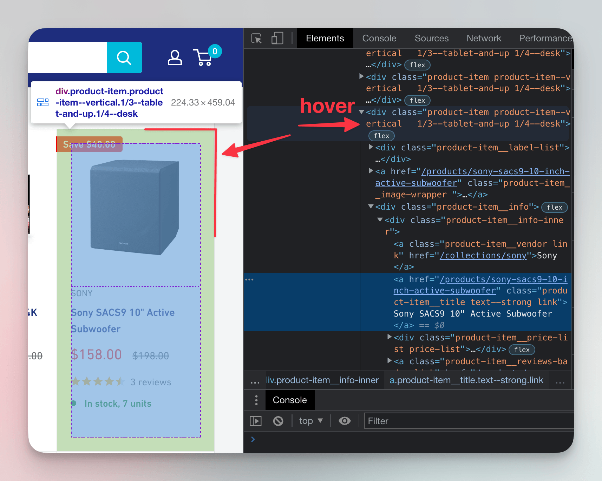
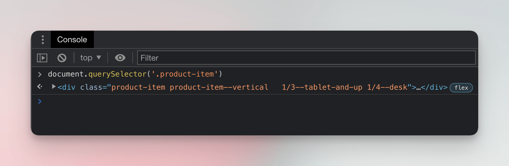
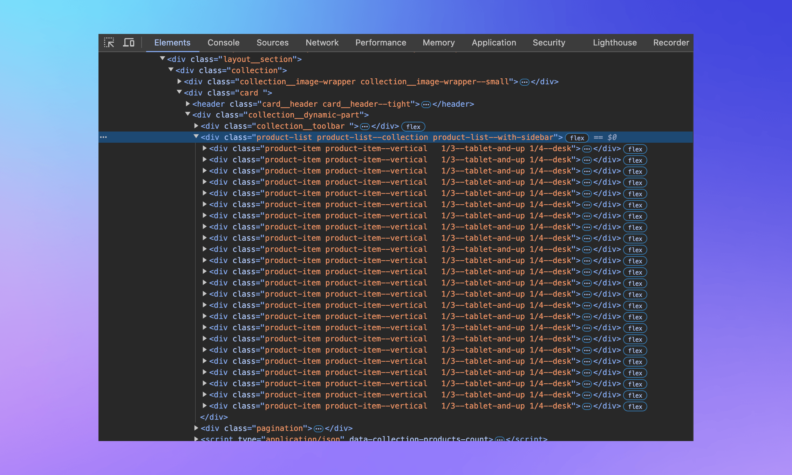
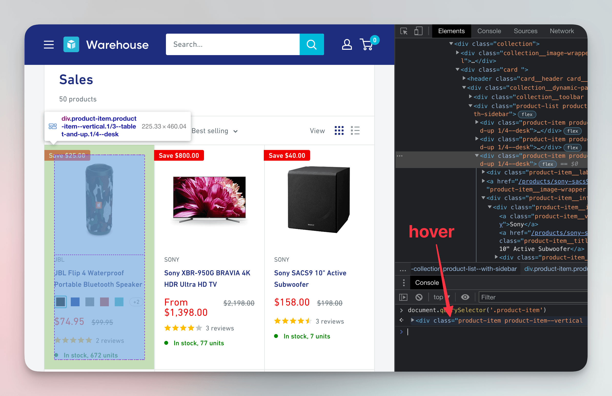
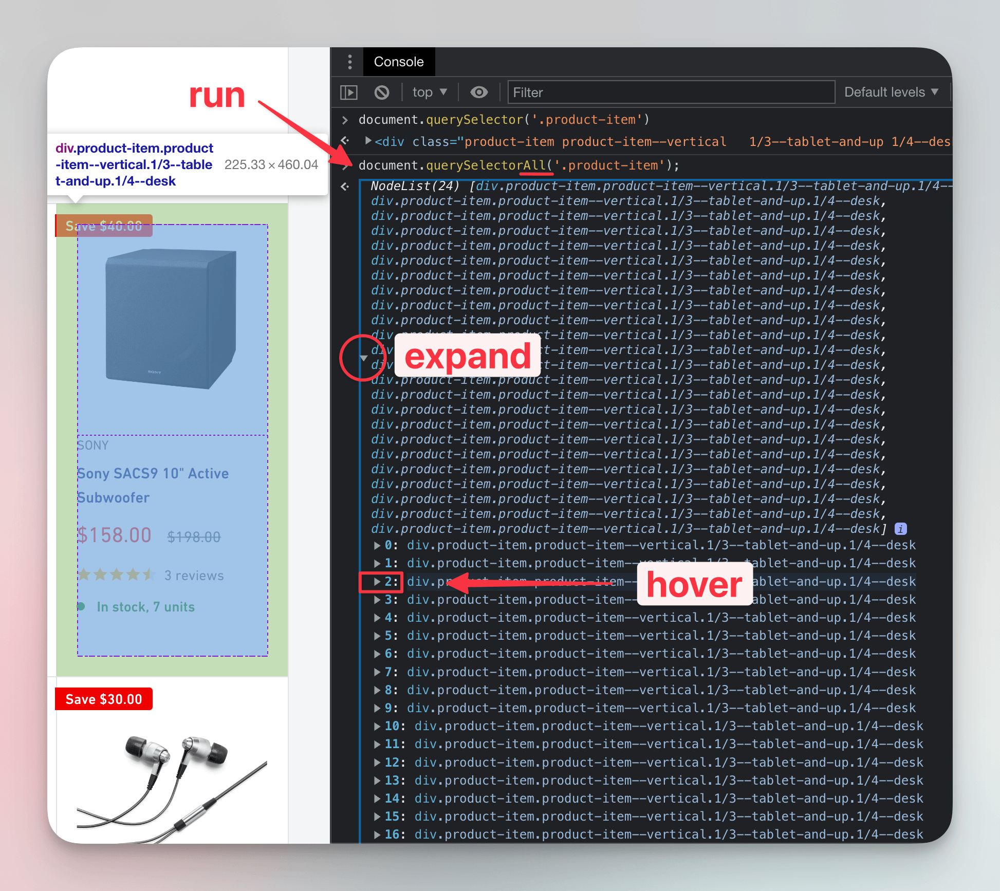
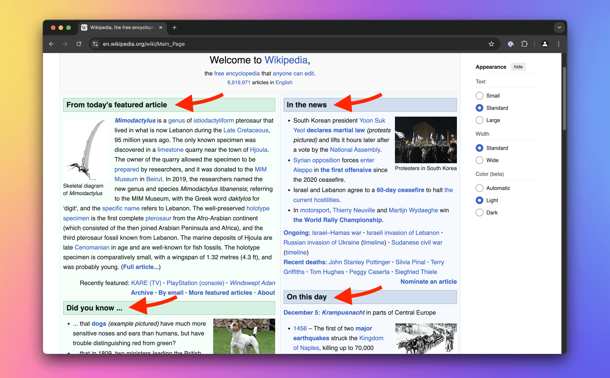
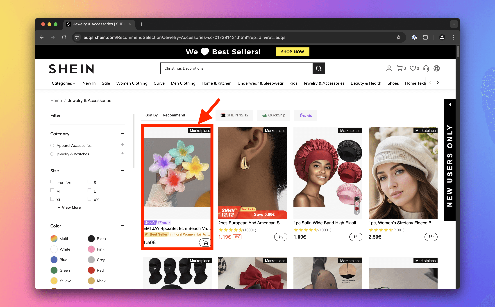
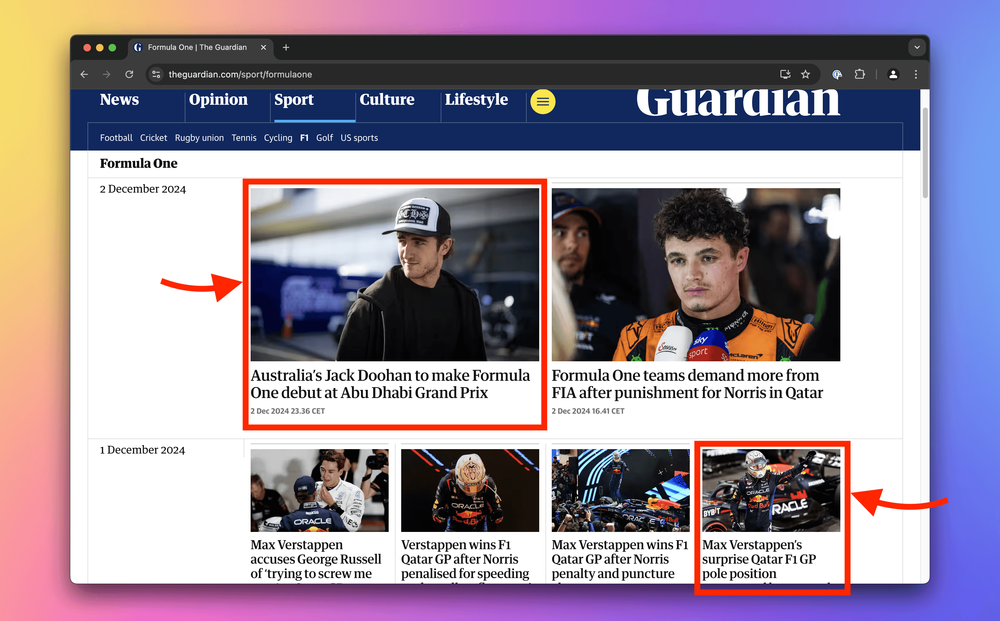

import Exercises from './_exercises.mdx';

**In this lesson we'll use the browser tools for developers to manually find products on an e-commerce website.**

---

Inspecting Wikipedia and tweaking its subtitle is fun, but let's shift gears and focus on building an app to track prices on an e-commerce site. As part of the groundwork, let's check out the site we'll be working with.

## Meeting the Warehouse store

Instead of artificial scraping playgrounds or sandboxes, we'll scrape a real e-commerce site. Shopify, a major e-commerce platform, has a demo store at [warehouse-theme-metal.myshopify.com](https://warehouse-theme-metal.myshopify.com/). It strikes a good balance between being realistic and stable enough for a tutorial. Our scraper will track prices for all products listed on the [Sales page](https://warehouse-theme-metal.myshopify.com/collections/sales).

:::info Balancing authenticity and stability

Live sites like Amazon are complex, loaded with promotions, frequently changing, and equipped with anti-scraping measures. While those challenges are manageable, they're advanced topics. For this beginner course, we're sticking to a lightweight, stable environment.

That said, we designed all the exercises to work with live websites. This means occasional updates might be needed, but we think it's worth it for a more authentic learning experience.

:::

## Finding a product card

As mentioned in the previous lesson, before building a scraper, we need to understand structure of the target page and identify the specific elements our program should extract. Let's figure out how to select details for each product on the [Sales page](https://warehouse-theme-metal.myshopify.com/collections/sales).


The page displays a grid of product cards, each showing a product's name and picture. Open DevTools and locate the name of the **Sony SACS9 Active Subwoofer**. Highlight it in the **Elements** tab by clicking on it.


Next, let's find all the elements containing details about this subwoofer—its price, number of reviews, image, and more.

In the **Elements** tab, move your cursor up from the `a` element containing the subwoofer's name. On the way, hover over each element until you highlight the entire product card. Alternatively, use the arrow-up key. The `div` element you land on is the **parent element**, and all nested elements are its **child elements**.



At this stage, we could use the **Store as global variable** option to send the element to the **Console**. While helpful for manual inspection, this isn't something a program can do.

Scrapers typically rely on [CSS selectors](https://developer.mozilla.org/en-US/docs/Web/CSS/CSS_selectors) to locate elements on a page, and these selectors often target elements based on their `class` attributes. The product card we highlighted has markup like this:

```html
<div class="product-item product-item--vertical 1/3--tablet-and-up 1/4--desk">
  ...
</div>
```

The `class` attribute can hold multiple values separated by whitespace. This particular element has four classes. Let's move to the **Console** and experiment with CSS selectors to locate this element.

## Programmatically locating a product card

Let's jump into the **Console** and write some JavaScript. Don't worry—you don't need to know the language, and yes, this is a helpful step on our journey to creating a scraper in Python.

In browsers, JavaScript represents the current page as the [`Document`](https://developer.mozilla.org/en-US/docs/Web/API/Document) object, accessible via `document`. This object offers many useful methods, including [`querySelector()`](https://developer.mozilla.org/en-US/docs/Web/API/Document/querySelector). This method takes a CSS selector as a string and returns the first HTML element that matches. Try typing this into the **Console**:

```js
document.querySelector('.product-item');
```

It will return the HTML element for the first product card in the listing:



:::note About the missing semicolon

In the screenshot, there is a missing semicolon `;` at the end of the line. In JavaScript, semicolons are optional, so it doesn't make a difference here.

:::

CSS selectors can get quite complex, but the basics are enough to scrape most of the Warehouse store. Let's cover two simple types and how they can combine.

The [type selector](https://developer.mozilla.org/en-US/docs/Web/CSS/Type_selectors) matches elements by tag name. For example, `h1` would match the highlighted element:

```html
<article>
  <!-- highlight-next-line -->
  <h1>Title</h1>
  <p>Paragraph.</p>
</article>
```

The [class selector](https://developer.mozilla.org/en-US/docs/Web/CSS/Class_selectors) matches elements based on their class attribute. For instance, `.heading` (note the dot) would match the following:

```html
<article>
  <h1>Title</h1>
  <!-- highlight-next-line -->
  <h2 class="heading">Subtitle</h2>
  <p>Paragraph</p>
  <p>
    <!-- highlight-next-line -->
    <strong class="heading">Heading</strong>
  </p>
</article>
```

You can combine selectors to narrow results. For example, `p.lead` matches `p` elements with the `lead` class, but not `p` elements without the class or elements with the class but a different tag name:

```html
<article>
  <!-- highlight-next-line -->
  <p class="lead">Lead paragraph.</p>
  <p>Paragraph</p>
  <section class="lead"><p>Paragraph</p></section>
</article>
```

How did we know `.product-item` selects a product card? By inspecting the markup of the product card element. After checking its classes, we chose the one that best fit our purpose. Testing in the **Console** confirmed it—selecting by the most descriptive class worked.

## Choosing good selectors

Multiple approaches often exist for creating a CSS selector that targets the element you want. Pick selectors that are simple, readable, unique, and semantically tied to the data. These are **resilient selectors**. They're the most reliable and likely to survive website updates. Avoid randomly generated attributes like `class="F4jsL8"`, as they tend to change without warning.

The product card has four classes: `product-item`, `product-item--vertical`, `1/3--tablet-and-up`, and `1/4--desk`. Only the first one checks all the boxes. A product card *is* a product item, after all. The others seem more about styling—defining how the element looks on the screen—and are probably tied to CSS rules.

This class is also unique enough in the page's context. If it were something generic like `item`, there'd be a higher risk that developers of the website might use it for unrelated elements. In the **Elements** tab, you can see a parent element `product-list` that contains all the product cards marked as `product-item`. This structure aligns with the data we're after.



## Locating all product cards

In the **Console**, hovering your cursor over objects representing HTML elements highlights the corresponding elements on the page. This way we can verify that when we query `.product-item`, the result represents the JBL Flip speaker—the first product card in the list.



But what if we want to scrape details about the Sony subwoofer we inspected earlier? For that, we need a method that selects more than just the first match: [`querySelectorAll()`](https://developer.mozilla.org/en-US/docs/Web/API/Document/querySelectorAll). As the name suggests, it takes a CSS selector string and returns all matching HTML elements. Type this into the **Console**:

```js
document.querySelectorAll('.product-item');
```

The returned value is a [`NodeList`](https://developer.mozilla.org/en-US/docs/Web/API/NodeList), a collection of nodes. Browsers understand an HTML document as a tree of nodes. Most nodes are HTML elements, but there are also text nodes for plain text, and others.

Expand the result by clicking the small arrow, then hover your cursor over the third element in the list. Indexing starts at 0, so the third element is at index 2. There it is—the product card for the subwoofer!



To save the subwoofer in a variable for further inspection, use index access with brackets, just like in Python lists (or JavaScript arrays):

```js
products = document.querySelectorAll('.product-item');
subwoofer = products[2];
```

Even though we're just playing with JavaScript in the browser's **Console**, we're inching closer to figuring out what our Python program will need to do. In the next lesson, we'll dive into accessing child elements and extracting product details.

---

<Exercises />

### Locate headings on Wikipedia's Main Page

On English Wikipedia's [Main Page](https://en.wikipedia.org/wiki/Main_Page), use CSS selectors in the **Console** to list the HTML elements representing headings of the colored boxes (including the grey ones).



<details>
  <summary>Solution</summary>

  1. Open the [Main Page](https://en.wikipedia.org/wiki/Main_Page).
  1. Activate the element selection tool in your DevTools.
  1. Click on several headings to examine the markup.
  1. Notice that all headings are `h2` tags with the `mp-h2` class.
  1. In the **Console**, execute `document.querySelectorAll('h2')`.
  1. At the time of writing, this selector returns 8 headings. Each corresponds to a box, and there are no other `h2` tags on the page. Thus, the selector is sufficient as is.

</details>

### Locate products on Shein

Go to Shein's [Jewelry & Accessories](https://shein.com/RecommendSelection/Jewelry-Accessories-sc-017291431.html) category. In the **Console**, use CSS selectors to list all HTML elements representing the products.



<details>
  <summary>Solution</summary>

  1. Visit the [Jewelry & Accessories](https://shein.com/RecommendSelection/Jewelry-Accessories-sc-017291431.html) page. Close any pop-ups or promotions.
  1. Activate the element selection tool in your DevTools.
  1. Click on the first product to inspect its markup. Repeat with a few others.
  1. Observe that all products are `section` tags with multiple classes, including `product-card`.
  1. Since `section` is a generic wrapper, focus on the `product-card` class.
  1. In the **Console**, execute `document.querySelectorAll('.product-card')`.
  1. At the time of writing, this selector returns 120 results, all representing products. No further narrowing is necessary.

</details>

### Locate articles on Guardian

Go to Guardian's [page about F1](https://www.theguardian.com/sport/formulaone). Use the **Console** to find all HTML elements representing the articles.

Hint: Learn about the [descendant combinator](https://developer.mozilla.org/en-US/docs/Web/CSS/Descendant_combinator).



<details>
  <summary>Solution</summary>

  1. Open the [page about F1](https://www.theguardian.com/sport/formulaone).
  1. Activate the element selection tool in your DevTools.
  1. Click on an article to inspect its structure. Check several articles, including the ones with smaller cards.
  1. Note that all articles are `li` tags, but their classes (e.g., `dcr-1qmyfxi`) are dynamically generated and unreliable.
  1. Using `document.querySelectorAll('li')` returns too many results, including unrelated items like navigation links.
  1. Inspect the page structure. The `main` element contains the primary content, including articles. Use the descendant combinator to target `li` elements within `main`.
  1. In the **Console**, execute `document.querySelectorAll('main li')`.
  1. At the time of writing, this selector returns 21 results. All appear to represent articles, so the solution works!

</details>
