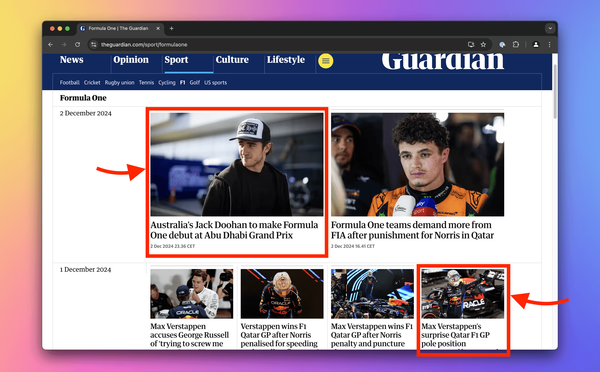

import Exercises from './_exercises.mdx';

**In this lesson we'll use the browser tools for developers to manually find products on an e-commerce website.**

---

Inspecting Wikipedia and changing its subtitle is cool, but we should focus on building an app to track prices on an e-commerce site. As part of the groundwork, let's check out the site we'll be working with.

## Meeting the Warehouse store

To keep things practical, we won't use artificial scraping playgrounds or sandboxes. Instead, we'll scrape a real e-commerce site. Shopify, a major e-commerce platform, has a demo store at [warehouse-theme-metal.myshopify.com](https://warehouse-theme-metal.myshopify.com/). It strikes a good balance between being realistic and stable enough for a tutorial. The scraper we're about to build will watch prices of all the products listed on the [Sales page](https://warehouse-theme-metal.myshopify.com/collections/sales).

:::info Balancing authenticity and stability

Live sites like Amazon are bulky, packed with promotions, change frequently, and have anti-scraping measures. While those challenges are manageable, they're advanced topics. For this beginner course, we're sticking to a lightweight and stable environment.

However, we deliberately designed all the exercises to work with live websites, even though it means we might need to update them occasionally—a trade-off we believe is worth it to give you a more authentic learning experience.

:::

## Finding a product card

As mentioned in the previous lesson, before we build a scraper, we need to have an idea about how the target page is structured and what elements exactly our program should be looking for. So let's figure out how it could select details for each of the products on the [Sales page](https://warehouse-theme-metal.myshopify.com/collections/sales).


On the page, there is a grid of product cards with names and pictures of products. Open DevTools and select the name of the **Sony SACS9 Active Subwoofer**. Highlight it in the **Elements** tab by clicking on it.


Now we'll find all elements that contain details about this subwoofer: price, number of reviews, image, and everything else.

In the **Elements** tab, move your cursor up from the `a` element containing the subwoofer's name, hovering over each element on the way, until you find the one that highlights the entire product card. You can achieve the same also by repeatedly pressing the arrow up on your keyboard. This `div` element we just found is a **parent element**, and all the elements nested inside are its **child elements**.


At this point we could use **Store as global variable** to send the element to the **Console**, but while this option is useful when manually inspecting the page, that's not something a program can do.

Most often, scrapers use [CSS selectors](https://developer.mozilla.org/en-US/docs/Web/CSS/CSS_selectors) to locate elements on the page. And most often, CSS selectors find HTML elements by according to what they contain in their `class` attributes. The product card element we highlighted has the following markup:

```html
<div class="product-item product-item--vertical 1/3--tablet-and-up 1/4--desk">
  ...
</div>
```

The `class` attribute can contain several values separated by whitespace. This element thus has four classes. Let's go to the **Console** and try to get a grip on the element using a CSS selector.

## Programmatically locating a product card

In the **Console**, we'll write some JavaScript now. Don't worry, you don't need to know the language, and yes, it's gonna be a useful step on our way to create a scraper in Python.

In the browser, JavaScript has the current page represented by the [`Document`](https://developer.mozilla.org/en-US/docs/Web/API/Document) object. It's accessible as `document`. This object has many useful methods, and one of them is [`querySelector()`](https://developer.mozilla.org/en-US/docs/Web/API/Document/querySelector). It takes a string with a CSS selector and returns the first HTML element matching the selector. Type the following to the **Console**:

```js
document.querySelector('.product-item');
```

It returns the HTML element representing the first product card in the listing:


:::note About the missing semicolon

In the screenshot, there is a missing semicolon `;` at the end of the line. In JavaScript, semicolons are optional, so it makes no difference.

:::

Many CSS selectors exist and can be even combined, potentially leading to rather complex queries. However, the two most basic selectors and their combination is enough to scrape most of the Warehouse store.

First, the [type selector](https://developer.mozilla.org/en-US/docs/Web/CSS/Type_selectors) allows to match by tag name. In the following example, `h1` would match the highlighted element:

```html
<article>
  <!-- highlight-next-line -->
  <h1>Title</h1>
  <p>Paragraph.</p>
</article>
```

Second, the [class selector](https://developer.mozilla.org/en-US/docs/Web/CSS/Class_selectors) allows to match by the `class` attribute. For example, `.heading` (mind the dot) would match the following:

```html
<article>
  <h1>Title</h1>
  <!-- highlight-next-line -->
  <h2 class="heading">Subtitle</h2>
  <p>Paragraph</p>
  <p>
    <!-- highlight-next-line -->
    <strong class="heading">Heading</strong>
  </p>
</article>
```

Combination of those two narrows down the results. For example, `p.lead` returns `p` elements with the `lead` class, but not those without nor elements with the `lead` class which have different tag names:

```html
<article>
  <!-- highlight-next-line -->
  <p class="lead">Lead paragraph.</p>
  <p>Paragraph</p>
  <section class="lead"><p>Paragraph</p></section>
</article>
```

How did we know that `.product-item` selects a product card? We've seen the markup of the product card element, where we could assess its classes and choose the one which fits our purpose the best. After trying out in the **Console**, it seems that selecting by the most descriptive class does the job.

## Choosing good selectors

Often there are multiple ways to construct a CSS selector that matches the element we want. Choose selectors that are simple, human-readable, unique, and semantically connected to the data. Those are **resilient selectors**. They're most reliable and most likely to survive through website udpates.

Randomly generated attributes, such as `class="F4jsL8"`, are the least suitable for scraping as they often change without warning.

The product card has four classes: `product-item`, `product-item--vertical`, `1/3--tablet-and-up`, `1/4--desk`. From those only the first one ticks all the boxes. Product card is a product item, indeed. The other ones seem to serve as instructions how the element should look like on the screen and are probably tied to some CSS rules.

It's also sufficiently unique within the context of the page. If the class was called just `item`, there would be a higher chance that the website's developers would add this class also to something unrelated. In the **Elements** tab it's apparent that there is a parent element `product-list`, which contains all the product cards are marked as `product-item`. That matches the structure we're after.


## Locating all product cards

When we look more closely at the result we've got by querying `.product-item`, we'll notice that the object represents the JBL Flip speaker, which is the first product card in the list. In the **Console**, hovering cursor over objects representing HTML elements highlights the elements on the page.


What if we want to scrape details about the Sony subwoofer we inspected earlier? To select more than the first element, we need a different method: [`querySelectorAll()`](https://developer.mozilla.org/en-US/docs/Web/API/Document/querySelectorAll). This one takes a string with a CSS selector and returns all matching HTML elements, as the name hints. Type the following to the **Console**:

```js
document.querySelectorAll('.product-item');
```

The returned value is a [`NodeList`](https://developer.mozilla.org/en-US/docs/Web/API/NodeList), a collection of nodes, as browsers understand a HTML document as a tree of nodes. Most of the nodes are HTML elements, but there can be also text nodes for plain text, and others.

Expand the result by clicking the small arrow and then hover your cursor over the third element in the list. Indexing starts at 0, so the third element has number 2. There it is, we found a product card for the subwoofer!


To save the subwoofer in a variable for further inspection, we can use index access with brackets, the same way as with Python lists (or JavaScript arrays):

```js
const products = document.querySelectorAll('.product-item');
const subwoofer = products[2];
```

Although we're playing around with JavaScript in **Console** of the browser, step-by-step we're getting closer to having an idea what our Python program will need to do. In the next lesson we'll see how to get to the child elements and extract details about a product.

---

<Exercises />

### Locate headings on Wikipedia's Main Page

On English Wikipedia's [Main Page](https://en.wikipedia.org/wiki/Main_Page), use CSS selectors in the **Console** to list HTML elements representing headings of the colored boxes (including the grey ones).


<details>
  <summary>Solution</summary>

  1. Go to the [Main Page](https://en.wikipedia.org/wiki/Main_Page).
  1. Activate the element selection tool.
  1. Click on several headings and see how the markup looks like.
  1. They all seem to be `h2` tags with a `mp-h2` class.
  1. In the **Console**, execute `document.querySelectorAll('h2')`.
  1. Inspecting the results, we see that such type selector is sufficient to deliver what we need. At the time of writing this lesson it returns 8 headings, each belonging to one of the boxes. Apparently, there are no other `h2` tags on the page, and we don't need to narrow down the selector.

</details>

### Locate products on Shein

Go to Shein's [Jewelry & Accessories](https://shein.com/RecommendSelection/Jewelry-Accessories-sc-017291431.html) category and in the **Console** use CSS selectors to list all HTML elements representing the products listed.


<details>
  <summary>Solution</summary>

  1. Go to the [Jewelry & Accessories](https://shein.com/RecommendSelection/Jewelry-Accessories-sc-017291431.html) page. Get through all the pop-up promotions.
  1. Activate the element selection tool.
  1. Click on the first product and see how the markup looks like. Click on several others and see what they have in common.
  1. They all seem to be `section` tags, each with many classes.
  1. As `section` is a vague wrapper for anything, we're looking at the classes. The `product-card` class looks most suitable.
  1. In the **Console**, execute `document.querySelectorAll('.product-card')`.
  1. At the time of writing this lesson it returns 120 results. Inspecting the results, we see that all of the results seem to represent the products listed, so there is no need to further narrow down the selector.

</details>

### Locate articles on Guardian

Go to Guardian's [page about F1](https://www.theguardian.com/sport/formulaone) and in the **Console** use CSS selectors to list all HTML elements representing the articles listed.

Hint: You may want to know about the [descendant combinator](https://developer.mozilla.org/en-US/docs/Web/CSS/Descendant_combinator).



<details>
  <summary>Solution</summary>

  1. Go to the [page about F1](https://www.theguardian.com/sport/formulaone) page.
  1. Activate the element selection tool.
  1. Click on the first article and see how the markup looks like. Click on several others, including the smaller ones, and see what they have in common.
  1. They all seem to be `li` tags, each with a class such as `dcr-1qmyfxi` which seems to be randomly generated.
  1. As `li` is a vague wrapper for any list item, and there are no suitable classes, we're in trouble.
  1. In the **Console**, execute `document.querySelectorAll('li')`. Indeed, it returns too many items, e.g. from the navigation of the page. We need to somehow narrow down the selector.
  1. After further inspection of the page structure, we notice that there is a `main` element, which works as a parent for all the main content of the page. With the help of the [descendant combinator](https://developer.mozilla.org/en-US/docs/Web/CSS/Descendant_combinator) we can narrow down the selector to only list items inside `main`.
  1. In the **Console**, execute `document.querySelectorAll('main li')`.
  1. At the time of writing this lesson it returns 21 results. Inspecting the results, we see that all of the results seem to represent the articles listed, so that seems like success!

</details>
