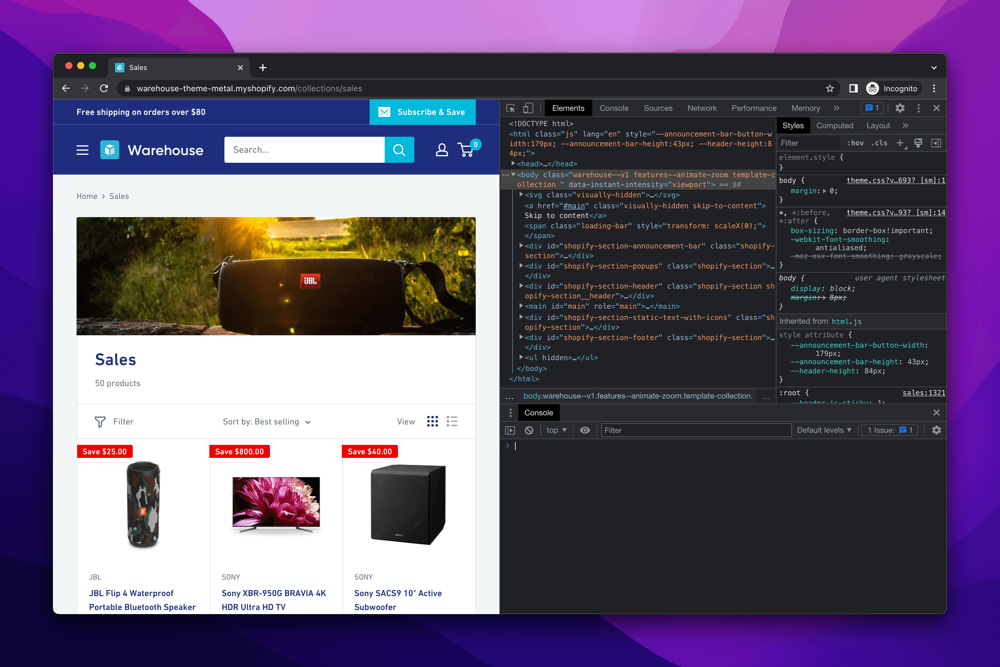
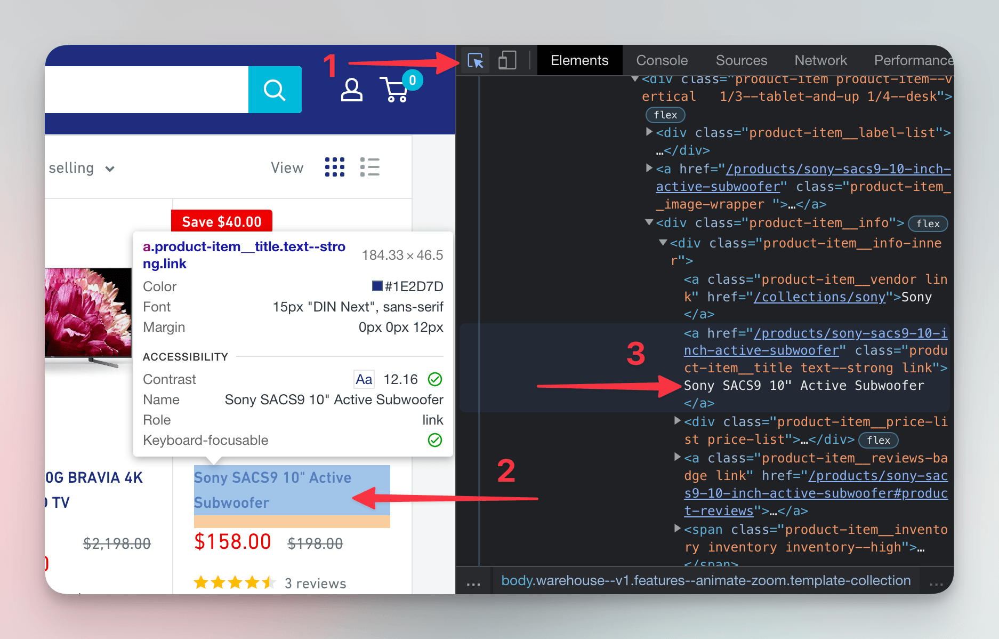

import Exercises from './_exercises.mdx';

**In this lesson we'll use the browser tools for developers to manually find products on an e-commerce website.**

---

Inspecting Wikipedia and changing its subtitle is cool, but we should focus on building an app to track prices on an e-commerce site. As part of the groundwork, let's check out the site we'll be working with.

## Meeting the Warehouse store

To keep things practical, we won't use artificial scraping playgrounds or sandboxes. Instead, we'll scrape a real e-commerce site. Shopify, a major e-commerce platform, has a demo store at [warehouse-theme-metal.myshopify.com](https://warehouse-theme-metal.myshopify.com/). It strikes a good balance between being realistic and stable enough for a tutorial. The scraper we're about to build will watch prices of all the products listed on the [Sales page](https://warehouse-theme-metal.myshopify.com/collections/sales).

:::info Balancing authenticity and stability

Live sites like Amazon are bulky, packed with promotions, change frequently, and have anti-scraping measures. While those challenges are manageable, they're advanced topics. For this beginner course, we're sticking to a lightweight and stable environment.

However, we deliberately designed all the exercises to work with live websites, even though it means we might need to update them occasionally—a trade-off we believe is worth it to give you a more authentic learning experience.

:::

## Finding a product card

As mentioned in the previous lesson, before we build a scraper, we need to have an idea about how the target page is structured and what elements exactly our program should be looking for. So let's figure out how it could select details for each of the products on the [Sales page](https://warehouse-theme-metal.myshopify.com/collections/sales).



On the page, there is a grid of product cards with names and pictures of products. Open DevTools and select the name of the **Sony SACS9 Active Subwoofer**. Highlight it in the **Elements** tab by clicking on it.



Now we'll find all elements that contain details about this subwoofer: price, number of reviews, image, and everything else.

In the **Elements** tab, move your cursor up from the `a` element containing the subwoofer's name, hovering over each element on the way, until you find the one that highlights the entire product card. You can achieve the same also by repeatedly pressing the arrow up on your keyboard. This `div` element we just found is a **parent element**, and all the elements nested inside are its **child elements**.


At this point we could use **Store as global variable** to send the element to the **Console**, but while this option is useful when manually inspecting the page, that's not something a program can do.

Most often, scrapers use [CSS selectors](https://developer.mozilla.org/en-US/docs/Web/CSS/CSS_selectors) to locate elements on the page. And most often, CSS selectors find HTML elements by according to what they contain in their `class` attributes. The product card element we highlighted has the following markup:

```html
<div class="product-item product-item--vertical 1/3--tablet-and-up 1/4--desk">
  ...
</div>
```

The `class` attribute can contain several values separated by whitespace. This element thus has four classes. Let's go to the **Console** and try to get a grip on the element using a CSS selector.

## Locating product cards programmatically

:::danger Work in Progress

Under development.

:::

## Choosing good selectors

:::danger Work in Progress

Under development.

:::

---

<Exercises />

:::danger Work in Progress

Under development.

:::
