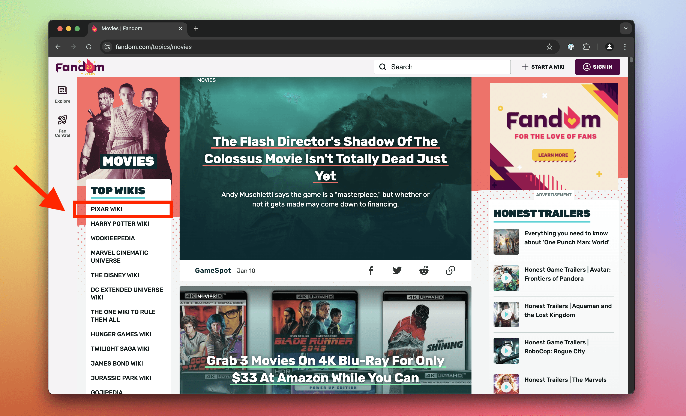

import Exercises from './_exercises.mdx';

**In this lesson we'll use the browser tools for developers to manually extract product data from an e-commerce website.**

---

In our pursuit to scrape products from the [Sales page](https://warehouse-theme-metal.myshopify.com/collections/sales), we've been able to locate parent elements containing relevant data. Now how do we extract the data?

## Finding product details

Previously, we've figured out how to save the subwoofer product card to a variable in the **Console**:

```js
products = document.querySelectorAll('.product-item');
subwoofer = products[2];
```

The product details are within the element as text, so maybe if we extract the text, we could work out the individual values?

```js
subwoofer.textContent;
```

That indeed outputs all the text, but in a form which would be hard to break down to relevant pieces.


We'll need to first locate relevant child elements and extract the data from each of them individually.

## Extracting title

We'll use the **Elements** tab of DevTools to inspect all child elements of the product card for the Sony subwoofer. We can see that the title of the product is inside an `a` element with several classes. From those the `product-item__title` seems like a great choice to locate the element.


JavaScript represents HTML elements as [Element](https://developer.mozilla.org/en-US/docs/Web/API/Element) objects. Among properties we've already played with, such as `textContent` or `outerHTML`, it also has the [`querySelector()`](https://developer.mozilla.org/en-US/docs/Web/API/Element/querySelector) method. Here the method looks for matches only within children of the element:

```js
title = subwoofer.querySelector('.product-item__title');
title.textContent;
```

Notice we're calling `querySelector()` on the `subwoofer` variable, not `document`. And just like this, we've scraped our first piece of data! We've extracted the product title:


## Extracting price

To figure out how to get the price, we'll use the **Elements** tab of DevTools again. We notice there are two prices, a regular price and a sale price. For the purposes of watching prices we'll need the sale price. Both are `span` elements with the `price` class.


We could either rely on the fact that the sale price is likely to be always the one which is highlighted, or that it's always the first price. For now we'll rely on the later and we'll let `querySelector()` to simply return the first result:

```js
price = subwoofer.querySelector('.price');
price.textContent;
```

It works, but the price isn't alone in the result. Before we'd use such data, we'd need to do some **data cleaning**:


But for now that's okay. We're just testing the waters now, so that we have an idea about what our scraper will need to do. Once we'll get to extracting prices in Python, we'll figure out how to get the values as numbers.

In the next lesson, we'll start with our Python project. First we'll be figuring out how to download the Sales page without browser and make it accessible in a Python program.

---

<Exercises />

### Extract the price of IKEA's most expensive artificial plant

At IKEA's [Artificial plants & flowers listing](https://www.ikea.com/se/en/cat/artificial-plants-flowers-20492/), use CSS selectors and HTML elements manipulation in the **Console** to extract the price of the most expensive artificial plant (sold in Sweden, as you'll be browsing their Swedish offer). Before opening DevTools, use your judgment to adjust the page to make the task as straightforward as possible. Finally, use JavaScript's [`parseInt()`](https://developer.mozilla.org/en-US/docs/Web/JavaScript/Reference/Global_Objects/parseInt) function to convert the price text into a number.

<details>
  <summary>Solution</summary>

  1. Open the [Artificial plants & flowers listing](https://www.ikea.com/se/en/cat/artificial-plants-flowers-20492/).
  1. Sort the products by price, from high to low, so the most expensive plant appears first in the listing.
  1. Activate the element selection tool in your DevTools.
  1. Click on the price of the first and most expensive plant.
  1. Notice that the price is structured into two elements, with the integer separated from the currency, under a class named `plp-price__integer`. This structure is convenient for extracting the value.
  1. In the **Console**, execute `document.querySelector('.plp-price__integer')`. This returns the element representing the first price in the listing. Since `document.querySelector()` returns the first matching element, it directly selects the most expensive plant's price.
  1. Save the element in a variable by executing `price = document.querySelector('.plp-price__integer')`.
  1. Convert the price text into a number by executing `parseInt(price.textContent)`.
  1. At the time of writing, this returns `699`, meaning [699 SEK](https://www.google.com/search?q=699%20sek).

</details>

### Extract the name of the top wiki on Fandom Movies

On Fandom's [Movies page](https://www.fandom.com/topics/movies), use CSS selectors and HTML element manipulation in the **Console** to extract the name of the top wiki. Use JavaScript's [`trim()`](https://developer.mozilla.org/en-US/docs/Web/JavaScript/Reference/Global_Objects/String/trim) method to remove white space around the name.



<details>
  <summary>Solution</summary>

  1. Open the [Movies page](https://www.fandom.com/topics/movies).
  1. Activate the element selection tool in your DevTools.
  1. Click on the list item for the top Fandom wiki in the category.
  1. Notice that it has a class `topic_explore-wikis__link`.
  1. In the **Console**, execute `document.querySelector('.topic_explore-wikis__link')`. This returns the element representing the top list item. They use the selector only for the **Top Wikis** list, and because `document.querySelector()` returns the first matching element, you're almost done.
  1. Save the element in a variable by executing `item = document.querySelector('.topic_explore-wikis__link')`.
  1. Get the element's text without extra white space by executing `item.textContent.trim()`. At the time of writing, this returns `"Pixar Wiki"`.

</details>

### Extract details about the first post on Guardian's F1 news

On the Guardian's [F1 news page](https://www.theguardian.com/sport/formulaone), use CSS selectors and HTML manipulation in the **Console** to extract details about the first post. Specifically, extract its title, lead paragraph, and URL of the associated photo.


<details>
  <summary>Solution</summary>

  1. Open the [F1 news page](https://www.theguardian.com/sport/formulaone).
  1. Activate the element selection tool in your DevTools.
  1. Click on the first post.
  1. Notice that the markup does not provide clear, reusable class names for this task. The structure uses generic tags and randomized classes, requiring you to rely on the element hierarchy and order instead.
  1. In the **Console**, execute `post = document.querySelector('#maincontent ul li')`. This returns the element representing the first post.
  1. Extract the post's title by executing `post.querySelector('h3').textContent`.
  1. Extract the lead paragraph by executing `post.querySelector('span div').textContent`.
  1. Extract the photo URL by executing `post.querySelector('img').src`.

</details>
