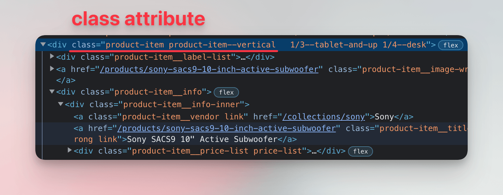
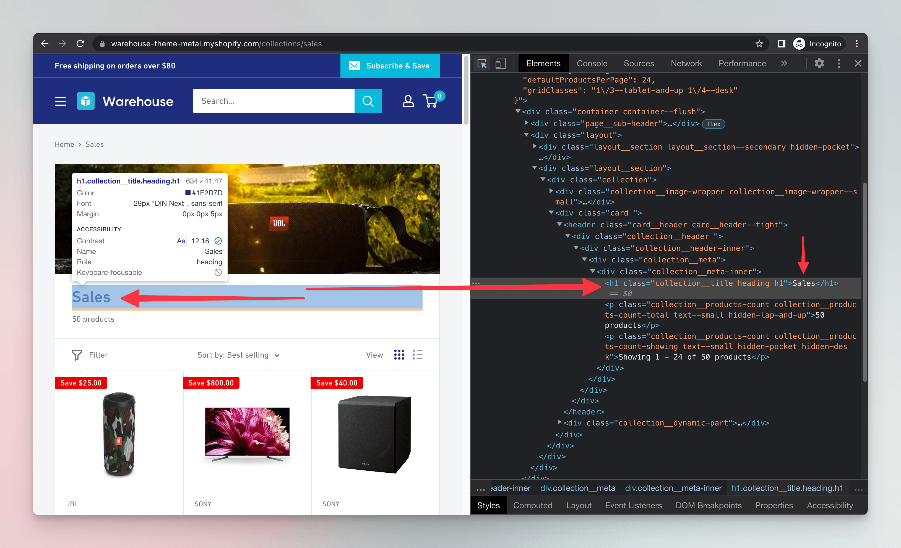

import Exercises from './_exercises.mdx';

**In this lesson we'll look for products in the downloaded HTML. We'll use BeautifulSoup to turn the HTML into objects which we can work with in our Python program.**

---

From lessons about browser DevTools we know that the HTML elements representing individual products have a `class` attribute which, among other values, contains `product-item`.



As a first step, let's try counting how many products are on the listing page.

## Processing HTML

After downloading, the entire HTML is available in our program as a string. We can print it to the screen or save it to a file, but not much more. However, since it's a string, could we use [string operations](https://docs.python.org/3/library/stdtypes.html#string-methods) or [regular expressions](https://docs.python.org/3/library/re.html) to count the products?

While somewhat possible, such an approach is tedious, fragile, and unreliable. To work with HTML, we need a robust tool dedicated to the task: an _HTML parser_. It takes a text with HTML markup and turns it into a tree of Python objects.

:::info Why regex can't parse HTML

While [Bobince's infamous StackOverflow answer](https://stackoverflow.com/a/1732454/325365) is funny, it doesn't go much into explaining. In formal language theory, HTML's hierarchical and nested structure makes it a [context-free language](https://en.wikipedia.org/wiki/Context-free_language). Regular expressions match patterns in [regular languages](https://en.wikipedia.org/wiki/Regular_language), which are much simpler. This difference makes it hard for a regex to handle HTML's nested tags. HTML's complex syntax rules and various edge cases also add to the difficulty.

:::

We'll choose [Beautiful Soup](https://beautiful-soup-4.readthedocs.io/) as our parser, as it's a popular library renowned for its ability to process even non-standard, broken markup. This is useful for scraping, because real-world websites often contain all sorts of errors and discrepancies.

```text
$ pip install beautifulsoup4
...
Successfully installed beautifulsoup4-4.0.0 soupsieve-0.0
```

Now let's use it for parsing the HTML. The `BeautifulSoup` object allows us to work with the HTML elements in a structured way. As a demonstration, we'll first get the `<h1>` element, which represents the main heading of the page.



Update your code to the following:

```py
import httpx
from bs4 import BeautifulSoup

url = "https://warehouse-theme-metal.myshopify.com/collections/sales"
response = httpx.get(url)
response.raise_for_status()

html_code = response.text
soup = BeautifulSoup(html_code, "html.parser")
print(soup.select("h1"))
```

Let's run the program:

```text
$ python main.py
[<h1 class="collection__title heading h1">Sales</h1>]
```

Our code lists all `h1` elements it can find on the page. It's the case that there's just one, so in the result we can see a list with a single item. What if we want to print just the text? Let's change the end of the program to the following:

```py
headings = soup.select("h1")
first_heading = headings[0]
print(first_heading.text)
```

If we run our scraper again, it prints the text of the first `h1` element:

```text
$ python main.py
Sales
```

## Using CSS selectors

Beautiful Soup's `.select()` method runs a _CSS selector_ against a parsed HTML document and returns all the matching elements. It's like calling `document.querySelectorAll()` in browser DevTools.

Scanning through [usage examples](https://beautiful-soup-4.readthedocs.io/en/latest/#css-selectors) will help us to figure out code for counting the product cards:

```py
import httpx
from bs4 import BeautifulSoup

url = "https://warehouse-theme-metal.myshopify.com/collections/sales"
response = httpx.get(url)
response.raise_for_status()

html_code = response.text
soup = BeautifulSoup(html_code, "html.parser")
products = soup.select(".product-item")
print(len(products))
```

In CSS, `.product-item` selects all elements whose `class` attribute contains value `product-item`. We call `soup.select()` with the selector and get back a list of matching elements. Beautiful Soup handles all the complexity of understanding the HTML markup for us. On the last line, we use `len()` to count how many items there is in the list.

```text
$ python main.py
24
```

That's it! We've managed to download a product listing, parse its HTML, and count how many products it contains. In the next lesson, we'll be looking for a way to extract detailed information about individual products.

---

<Exercises />

### Scrape F1 teams

Print a total count of F1 teams listed on this page:

```text
https://www.formula1.com/en/teams
```

<details>
  <summary>Solution</summary>

  ```py
  import httpx
  from bs4 import BeautifulSoup

  url = "https://www.formula1.com/en/teams"
  response = httpx.get(url)
  response.raise_for_status()

  html_code = response.text
  soup = BeautifulSoup(html_code, "html.parser")
  print(len(soup.select(".group")))
  ```

</details>

### Scrape F1 drivers

Use the same URL as in the previous exercise, but this time print a total count of F1 drivers.

<details>
  <summary>Solution</summary>

  ```py
  import httpx
  from bs4 import BeautifulSoup

  url = "https://www.formula1.com/en/teams"
  response = httpx.get(url)
  response.raise_for_status()

  html_code = response.text
  soup = BeautifulSoup(html_code, "html.parser")
  print(len(soup.select(".f1-team-driver-name")))
  ```

</details>
