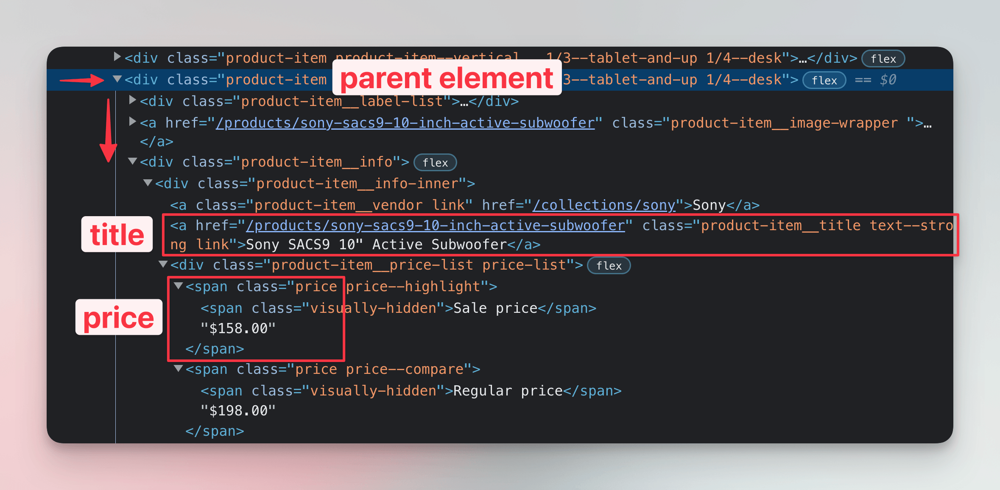

**In this lesson we'll locate product data in the downloaded HTML. We'll use BeautifulSoup to find those HTML elements which contain details about each product, such as title or price.**

---

In the previous lesson we've managed to print text of the page's main heading or count how many products is in the listing. Let's combine those two—what happens if we print `.text` for each product card?

```python
import httpx
from bs4 import BeautifulSoup

url = "https://warehouse-theme-metal.myshopify.com/collections/sales"
response = httpx.get(url)
response.raise_for_status()

html_code = response.text
soup = BeautifulSoup(html_code, "html.parser")
for product in soup.select(".product-item"):
    print(product.text)
```

Well, it definitely prints _something_…

```text
$ python main.py
Save $25.00


JBL
JBL Flip 4 Waterproof Portable Bluetooth Speaker


Black

+7


Blue

+6


Grey
...
```

To get details about each product in a structured way, we'll need a different approach.

## Locating child elements

As in the browser DevTools lessons, we need to change the code so that it locates child elements for each product card.



We should be looking for elements which have the `product-item__title` and `price` classes. We already know how that translates to CSS selectors:

```python
import httpx
from bs4 import BeautifulSoup

url = "https://warehouse-theme-metal.myshopify.com/collections/sales"
response = httpx.get(url)
response.raise_for_status()

html_code = response.text
soup = BeautifulSoup(html_code, "html.parser")
for product in soup.select(".product-item"):
    titles = product.select('.product-item__title')
    first_title = titles[0].text

    prices = product.select('.price')
    first_price = prices[0].text

    print(first_title, first_price)
```

Let's run the program now:

```text
$ python main.py
JBL Flip 4 Waterproof Portable Bluetooth Speaker
Sale price$74.95
Sony XBR-950G BRAVIA 4K HDR Ultra HD TV
Sale priceFrom $1,398.00
Sony SACS9 10" Active Subwoofer
Sale price$158.00
Sony PS-HX500 Hi-Res USB Turntable
Sale price$398.00
...
```

There's still some room for improvement, but it's already much better!

## Locating a single element

Often, we want to assume in our code that a certain element exists only once. It's a bit tedious to work with lists when you know you're looking for a single element. For this purpose, Beautiful Soup offers a `.select_one()` method. Like `document.querySelector()` in browser DevTools, it returns just one result or none. Let's simplify our code!

```python
import httpx
from bs4 import BeautifulSoup

url = "https://warehouse-theme-metal.myshopify.com/collections/sales"
response = httpx.get(url)
response.raise_for_status()

html_code = response.text
soup = BeautifulSoup(html_code, "html.parser")
for product in soup.select(".product-item"):
    title = product.select_one('.product-item__title').text
    price = product.select_one('.price').text
    print(title, price)
```

This program does the same as the one we already had, but its code is more concise.

## Precisely locating price

In the output we can see that the price isn't located precisely. For each product, our scraper also prints the text `Sale price`. Let's look at the HTML structure again. Each bit containing the price looks like this:

```html
<span class="price">
  <span class="visually-hidden">Sale price</span>
  $74.95
</span>
```
When translated to a tree of Python objects, the element with class `price` will contain several nodes:

- Textual node with white space,
- a `span` HTML element,
- a textual node representing the actual amount and possibly also white space.

We can use Beautiful Soup's `.contents` property to access individual nodes. It returns a list of nodes like this:

```
['\n', <span class="visually-hidden">Sale price</span>, '$74.95']
```

It seems like we can read the last element to get the actual amount from a list like the above. Let's fix our program:

```python
import httpx
from bs4 import BeautifulSoup

url = "https://warehouse-theme-metal.myshopify.com/collections/sales"
response = httpx.get(url)
response.raise_for_status()

html_code = response.text
soup = BeautifulSoup(html_code, "html.parser")
for product in soup.select(".product-item"):
    title = product.select_one('.product-item__title').text
    price = product.select_one('.price').contents[-1]
    print(title, price)
```

If we run our program now, it should print prices just as the actual amounts:

```text
$ python main.py
JBL Flip 4 Waterproof Portable Bluetooth Speaker $74.95
Sony XBR-950G BRAVIA 4K HDR Ultra HD TV From $1,398.00
Sony SACS9 10" Active Subwoofer $158.00
Sony PS-HX500 Hi-Res USB Turntable $398.00
...
```

Great! We have managed to use CSS selectors and walk the HTML tree to get a list of product titles and prices. But wait a second—what's `From $1,398.00`? One does not simply scrape a price! We'll need to clean that. But that's a job for the next lesson, which is about extracting data.
