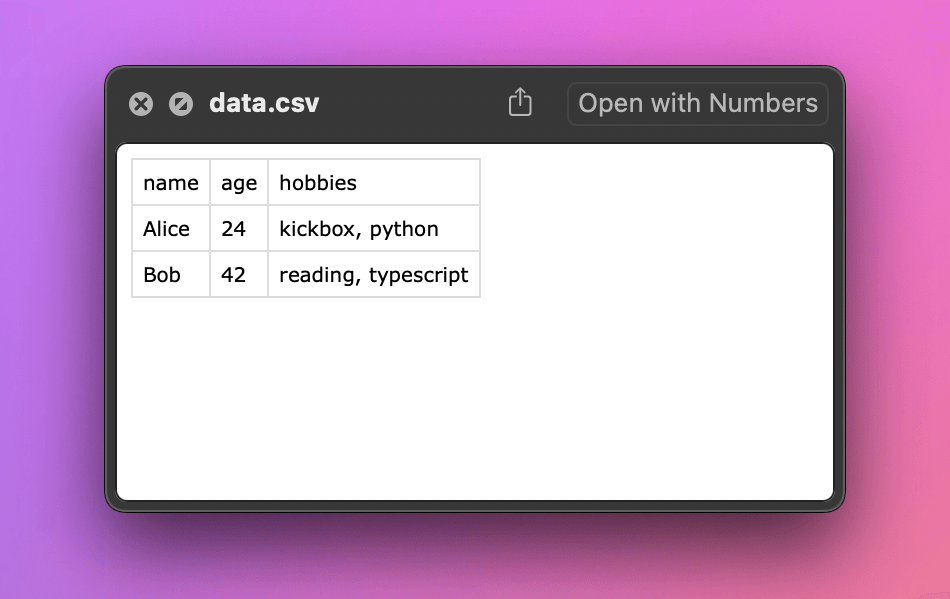
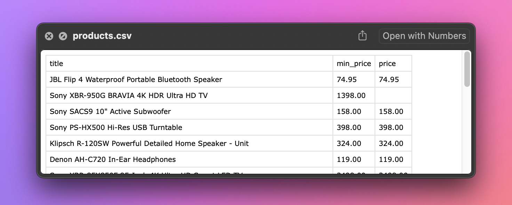

import Exercises from './_exercises.mdx';
import Details from '@theme/Details';

**In this lesson, we'll save the data we scraped in the popular formats, such as CSV or JSON. We'll use Python's standard library to export the files.**

---

We managed to scrape data about products and print them, with each product separated by a new line, and each field separated by the `|` character. That's already a structured text that someone could parse, i.e., read programmatically.

```text
$ python main.py
JBL Flip 4 Waterproof Portable Bluetooth Speaker | 74.95 | 74.95
Sony XBR-950G BRAVIA 4K HDR Ultra HD TV | 1398.00 | None
...
```

However, the format of the text is rather _ad-hoc_ and does not adhere to any specific standard that others could follow. It's unclear what to do if a product title already contains the `|` character, or how to represent multi-line product descriptions. No ready-made library can handle all the parsing.

We should use widely popular formats that have well-defined solutions for all the corner cases and which other programs can read without much effort. Two such formats are CSV (_Comma-separated values_) and JSON (_JavaScript Object Notation_).

## Collecting data

To export data in a certain format, we first need to store it all in one variable. Let's make three changes to our program:

```py
from decimal import Decimal
import httpx
from bs4 import BeautifulSoup

url = "https://warehouse-theme-metal.myshopify.com/collections/sales"
response = httpx.get(url)
response.raise_for_status()

html_code = response.text
soup = BeautifulSoup(html_code, "html.parser")

# highlight-next-line
data = []
for product in soup.select(".product-item"):
    title = product.select_one(".product-item__title").text.strip()

    price_text = (
        product
        .select_one(".price")
        .contents[-1]
        .strip()
        .replace("$", "")
        .replace(",", "")
    )
    if price_text.startswith("From "):
        min_price = Decimal(price_text.removeprefix("From "))
        price = None
    else:
        min_price = Decimal(price_text)
        price = min_price

    # highlight-next-line
    data.append({"title": title, "min_price": min_price, "price": price})

# highlight-next-line
print(data)
```

Before looping over the products, we prepare an empty list. Then, instead of printing each line, we append the data of each product to the list in the form of a Python dictionary. At the end of the program, we print the entire list.

```text
$ python main.py
[{'title': 'JBL Flip 4 Waterproof Portable Bluetooth Speaker', 'min_price': Decimal('74.95'), 'price': Decimal('74.95')}, {'title': 'Sony XBR-950G BRAVIA 4K HDR Ultra HD TV', 'min_price': Decimal('1398.00'), 'price': None}, ...]
```

:::tip Pretty print

If you find the complex data structures printed by `print()` difficult to read, try using [`pp()`](https://docs.python.org/3/library/pprint.html#pprint.pp) from the `pprint` module instead.

:::

## Saving data as CSV

The CSV format is popular among data analysts, because a wide range of tools can import it, including all spreadsheets apps like LibreOffice Calc, Microsoft Excel, Apple Numbers, or Google Sheets.

In Python it's convenient to read or write CSV files, thanks to the [`csv`](https://docs.python.org/3/library/csv.html) standard library module. Let's open Python's interactive REPL and first try a small example to understand the basic ergonomics:

```py
>>> import csv
>>> with open("data.csv", "w") as file:
...     writer = csv.DictWriter(file, fieldnames=["name", "age", "hobbies"])
...     writer.writeheader()
...     writer.writerow({"name": "Alice", "age": 24, "hobbies": "kickbox, Python"})
...     writer.writerow({"name": "Bob", "age": 42, "hobbies": "reading, TypeScript"})
...
```

We first opened a new file for writing and create a `DictWriter()` instance with expected field names. We let it to write the header row first, and then add two more rows holding actual data. The code produced a `data.csv` file in the same directory where we're at with the REPL. It has the following contents:

```csv filename=data.csv
name,age,hobbies
Alice,24,"kickbox, Python"
Bob,42,"reading, TypeScript"
```

In the CSV format, if values contain commas, we should put them inside quotes. You can notice that the writer automatically took care of it.

When browsing the directory on macOS we can see a nice preview of the file's contents, which is a proof that the file is correct and any other programs would understand it, too. If you're on a different operating system, try to open the file with whatever spreadsheets program you have.



Now that's nice, but we didn't want Alice, Bob, kickbox, and TypeScript. We want a CSV containing `Sony XBR-950G BRAVIA 4K HDR Ultra HD TV`, right? Let's do this! First, let's add `csv` to our imports:

```py
from decimal import Decimal
import httpx
from bs4 import BeautifulSoup
# highlight-next-line
import csv
```

Then instead of printing the data, we'll end our program with an export to CSV:

```py
with open("products.csv", "w") as file:
    writer = csv.DictWriter(file, fieldnames=["title", "min_price", "price"])
    writer.writeheader()
    for row in data:
        writer.writerow(row)
```

If we run our scraper now, it gives us no output at all, but creates `products.csv` in current working directory, which holds all the data about the listed products.



## Saving data as JSON

TODO

---

<Exercises />
