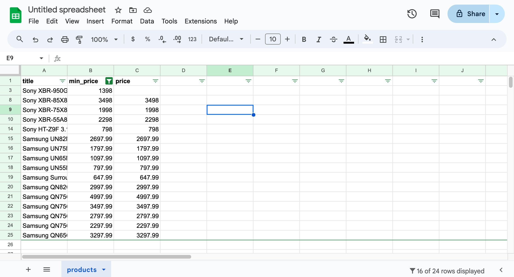

**In this lesson, we'll save the data we scraped in the popular formats, such as CSV or JSON. We'll use Python's standard library to export the files.**

---

We managed to scrape data about products and print it, with each product separated by a new line and each field separated by the `|` character. This already produces structured text that can be parsed, i.e., read programmatically.

```text
$ python main.py
JBL Flip 4 Waterproof Portable Bluetooth Speaker | 74.95 | 74.95
Sony XBR-950G BRAVIA 4K HDR Ultra HD TV | 1398.00 | None
...
```

However, the format of this text is rather _ad hoc_ and does not adhere to any specific standard that others could follow. It's unclear what to do if a product title already contains the `|` character or how to represent multi-line product descriptions. No ready-made library can handle all the parsing.

We should use widely popular formats that have well-defined solutions for all the corner cases and that other programs can read without much effort. Two such formats are CSV (_Comma-separated values_) and JSON (_JavaScript Object Notation_).

## Collecting data

Producing results line by line is an efficient approach to handling large datasets, but to simplify this lesson, we'll store all our data in one variable. This'll take three changes to our program:

```py
from decimal import Decimal
import httpx
from bs4 import BeautifulSoup

url = "https://warehouse-theme-metal.myshopify.com/collections/sales"
response = httpx.get(url)
response.raise_for_status()

html_code = response.text
soup = BeautifulSoup(html_code, "html.parser")

# highlight-next-line
data = []
for product in soup.select(".product-item"):
    title = product.select_one(".product-item__title").text.strip()

    price_text = (
        product
        .select_one(".price")
        .contents[-1]
        .strip()
        .replace("$", "")
        .replace(",", "")
    )
    if price_text.startswith("From "):
        min_price = Decimal(price_text.removeprefix("From "))
        price = None
    else:
        min_price = Decimal(price_text)
        price = min_price

    # highlight-next-line
    data.append({"title": title, "min_price": min_price, "price": price})

# highlight-next-line
print(data)
```

Before looping over the products, we prepare an empty list. Then, instead of printing each line, we append the data of each product to the list in the form of a Python dictionary. At the end of the program, we print the entire list at once.

```text
$ python main.py
[{'title': 'JBL Flip 4 Waterproof Portable Bluetooth Speaker', 'min_price': Decimal('74.95'), 'price': Decimal('74.95')}, {'title': 'Sony XBR-950G BRAVIA 4K HDR Ultra HD TV', 'min_price': Decimal('1398.00'), 'price': None}, ...]
```

:::tip Pretty print

If you find the complex data structures printed by `print()` difficult to read, try using [`pp()`](https://docs.python.org/3/library/pprint.html#pprint.pp) from the `pprint` module instead.

:::

## Saving data as CSV

The CSV format is popular among data analysts because a wide range of tools can import it, including spreadsheets apps like LibreOffice Calc, Microsoft Excel, Apple Numbers, and Google Sheets.

In Python, it's convenient to read and write CSV files, thanks to the [`csv`](https://docs.python.org/3/library/csv.html) standard library module. Let's open Python's interactive REPL and try a small example to understand the basic usage:

```py
>>> import csv
>>> with open("data.csv", "w") as file:
...     writer = csv.DictWriter(file, fieldnames=["name", "age", "hobbies"])
...     writer.writeheader()
...     writer.writerow({"name": "Alice", "age": 24, "hobbies": "kickbox, Python"})
...     writer.writerow({"name": "Bob", "age": 42, "hobbies": "reading, TypeScript"})
...
```

We first opened a new file for writing and created a `DictWriter()` instance with the expected field names. We instructed it to write the header row first and then added two more rows containing actual data. The code produced a `data.csv` file in the same directory where we're running the REPL. It has the following contents:

```csv filename=data.csv
name,age,hobbies
Alice,24,"kickbox, Python"
Bob,42,"reading, TypeScript"
```

In the CSV format, if values contain commas, we should enclose them in quotes. You can see that the writer automatically handled this.

When browsing the directory on macOS, we can see a nice preview of the file's contents, which proves that the file is correct and that other programs can read it as well. If you're using a different operating system, try opening the file with any spreadsheet program you have.


Now that's nice, but we didn't want Alice, Bob, kickbox, or TypeScript. What we actually want is a CSV containing `Sony XBR-950G BRAVIA 4K HDR Ultra HD TV`, right? Let's do this! First, let's add `csv` to our imports:

```py
from decimal import Decimal
import httpx
from bs4 import BeautifulSoup
# highlight-next-line
import csv
```

Next, instead of printing the data, we'll finish the program by exporting it to CSV. Replace `print(data)` with the following:

```py
with open("products.csv", "w") as file:
    writer = csv.DictWriter(file, fieldnames=["title", "min_price", "price"])
    writer.writeheader()
    for row in data:
        writer.writerow(row)
```

If we run our scraper now, it won't display any output, but it will create a `products.csv` file in the current working directory, which contains all the data about the listed products.


## Saving data as JSON

The JSON format is popular primarily among developers. We use it for storing data, configuration files, or as a way to transfer data between programs (e.g., APIs). Its origin stems from the syntax of objects in the JavaScript programming language, which is similar to the syntax of Python dictionaries.

In Python, there's a [`json`](https://docs.python.org/3/library/json.html) standard library module, which is so straightforward that we can start using it in our code right away. We'll need to begin with imports:

```py
from decimal import Decimal
import httpx
from bs4 import BeautifulSoup
import csv
# highlight-next-line
import json
```

Next, let’s append one more export to the source code of our scraper:

```py
with open("products.json", "w") as file:
    json.dump(data, file)
```

That’s it! If we run the program now, it should also create a `products.json` file in the current working directory:

```text
$ python main.py
Traceback (most recent call last):
  ...
    raise TypeError(f'Object of type {o.__class__.__name__} '
TypeError: Object of type Decimal is not JSON serializable
```

Ouch! JSON supports integers and floating-point numbers, but there's no guidance on how to handle `Decimal`. To maintain precision, it's common to store monetary values as strings in JSON files. But this is a convention, not a standard, so we need to handle it manually. We'll pass a custom function to `json.dump()` to serialize objects that it can't handle directly:

```py
def serialize(obj):
    if isinstance(obj, Decimal):
        return str(obj)
    raise TypeError("Object not JSON serializable")

with open("products.json", "w") as file:
    json.dump(data, file, default=serialize)
```

Now the program should work as expected, producing a JSON file with the following content:

<!-- eslint-skip -->
```json filename=products.json
[{"title": "JBL Flip 4 Waterproof Portable Bluetooth Speaker", "min_price": "74.95", "price": "74.95"}, {"title": "Sony XBR-950G BRAVIA 4K HDR Ultra HD TV", "min_price": "1398.00", "price": null}, ...]
```

If you skim through the data, you'll notice that the `json.dump()` function handled some potential issues, such as escaping double quotes found in one of the titles by adding a backslash:

```json
{"title": "Sony SACS9 10\" Active Subwoofer", "min_price": "158.00", "price": "158.00"}
```

:::tip Pretty JSON

While a compact JSON file without any whitespace is efficient for computers, it can be difficult for humans to read. You can pass `indent=2` to `json.dump()` for prettier output.

Also, if your data contains non-English characters, set `ensure_ascii=False`. By default, Python encodes everything except [ASCII](https://en.wikipedia.org/wiki/ASCII), which means it would save [Bún bò Nam Bô](https://vi.wikipedia.org/wiki/B%C3%BAn_b%C3%B2_Nam_B%E1%BB%99) as `B\\u00fan b\\u00f2 Nam B\\u00f4`.

:::

---

## Exercises

In this lesson, you learned how to create export files in two formats. The following challenges are designed to help you empathize with the people who'd be working with them.

### Process your CSV

Open the `products.csv` file in a spreadsheet app. Use the app to find all products with a min price greater than $500.

<details>
  <summary>Solution</summary>

  Let's use [Google Sheets](https://www.google.com/sheets/about/), which is free to use. After logging in with a Google account:

  1. Go to **File > Import**, choose **Upload**, and select the file. Import the data using the default settings. You should see a table with all the data.
  2. Select the header row. Go to **Data > Create filter**.
  3. Use the filter icon that appears next to `min_price`. Choose **Filter by condition**, select **Greater than**, and enter **500** in the text field. Confirm the dialog. You should see only the filtered data.

  

</details>

### Process your JSON

Write a new Python program that reads `products.json`, finds all products with a min price greater than $500, and prints each one using [`pp()`](https://docs.python.org/3/library/pprint.html#pprint.pp).

<details>
  <summary>Solution</summary>

  ```py
  import json
  from pprint import pp
  from decimal import Decimal

  with open("products.json", "r") as file:
      products = json.load(file)

  for product in products:
      if Decimal(product["min_price"]) > 500:
          pp(product)
  ```

</details>
