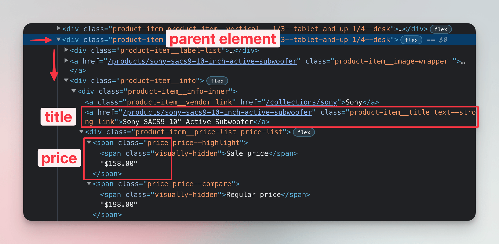

import Exercises from './_exercises.mdx';

**In this lesson, we'll locate and extract links to individual product pages. We'll use BeautifulSoup to find the relevant bits of HTML.**

---

The previous lesson concludes our effort to create a scraper. Our program now downloads HTML, locates and extracts data from the markup, and saves the data in a structured and reusable way.

For some use cases, this is already enough! In other cases, though, scraping just one page is hardly useful. The data is spread across the website, over several pages.

## Crawling websites

We'll use a technique called crawling, i.e. following links to scrape multiple pages. The algorithm goes like this:

1. Visit the start URL.
1. Extract new URLs (and data), and save them.
1. Visit one of the newly found URLs and save data and/or more URLs from it.
1. Repeat steps 2 and 3 until you have everything you need.

This will help us figure out the actual prices of products, as right now, for some, we're only getting the min price. Implementing the algorithm will require quite a few changes to our code, though.

## Restructuring code

Over the course of the previous lessons, the code of our program grew to almost 50 lines containing downloading, parsing, and exporting:

```py
import httpx
from bs4 import BeautifulSoup
from decimal import Decimal
import csv
import json

url = "https://warehouse-theme-metal.myshopify.com/collections/sales"
response = httpx.get(url)
response.raise_for_status()

html_code = response.text
soup = BeautifulSoup(html_code, "html.parser")

data = []
for product in soup.select(".product-item"):
    title = product.select_one(".product-item__title").text.strip()

    price_text = (
        product
        .select_one(".price")
        .contents[-1]
        .strip()
        .replace("$", "")
        .replace(",", "")
    )
    if price_text.startswith("From "):
        min_price = Decimal(price_text.removeprefix("From "))
        price = None
    else:
        min_price = Decimal(price_text)
        price = min_price

    data.append({"title": title, "min_price": min_price, "price": price})

with open("products.csv", "w") as file:
    writer = csv.DictWriter(file, fieldnames=["title", "min_price", "price"])
    writer.writeheader()
    for row in data:
        writer.writerow(row)

def serialize(obj):
    if isinstance(obj, Decimal):
        return str(obj)
    raise TypeError("Object not JSON serializable")

with open("products.json", "w") as file:
    json.dump(data, file, default=serialize)
```

Let's introduce several functions to make the whole thing easier to digest. First, we can turn the beginning of our program into this `download()` function, which takes a URL and returns a `BeautifulSoup` instance:

```py
def download(url):
    response = httpx.get(url)
    response.raise_for_status()

    html_code = response.text
    return BeautifulSoup(html_code, "html.parser")
```

Next, we can put parsing into a `parse_product()` function, which takes the product item element and returns the dictionary with data:

```py
def parse_product(product):
    title = product.select_one(".product-item__title").text.strip()

    price_text = (
        product
        .select_one(".price")
        .contents[-1]
        .strip()
        .replace("$", "")
        .replace(",", "")
    )
    if price_text.startswith("From "):
        min_price = Decimal(price_text.removeprefix("From "))
        price = None
    else:
        min_price = Decimal(price_text)
        price = min_price

    return {"title": title, "min_price": min_price, "price": price}
```

Now the CSV export. We'll make a small change here. Having to specify the field names is not ideal. What if we add more field names in the parsing function? We'd always have to remember to go and edit the export function as well. If we could figure out the field names in place, we'd remove this dependency. One way would be to infer the field names from the dictionary keys of the first row:

```py
def export_csv(file, data):
    # highlight-next-line
    fieldnames = list(data[0].keys())
    writer = csv.DictWriter(file, fieldnames=fieldnames)
    writer.writeheader()
    for row in data:
        writer.writerow(row)
```

:::note Fragile code

The code above assumes the `data` variable contains at least one item, and that all the items have the same keys. This isn't robust and could break, but in our program, this isn't a problem, and omitting these corner cases allows us to keep the code examples more succinct.

:::

The last function we'll add will take care of the JSON export. For better readability of the JSON export, let's make a small change here too and set the indentation level to two spaces:

```py
def export_json(file, data):
    def serialize(obj):
        if isinstance(obj, Decimal):
            return str(obj)
        raise TypeError("Object not JSON serializable")

    # highlight-next-line
    json.dump(data, file, default=serialize, indent=2)
```

Now let's put it all together:

```py
import httpx
from bs4 import BeautifulSoup
from decimal import Decimal
import csv
import json

def download(url):
    ...

def parse_product(product):
    ...

def export_csv(file, data):
    ...

def export_json(file, data):
    ...

listing_url = "https://warehouse-theme-metal.myshopify.com/collections/sales"
soup = download(listing_url)
data = [parse_product(product) for product in soup.select(".product-item")]

with open("products.csv", "w") as file:
    export_csv(file, data)

with open("products.json", "w") as file:
    export_json(file, data)
```

The program is much easier to read now. With the `parse_product()` function handy, we could also replace the convoluted loop with a [list comprehension](https://docs.python.org/3/tutorial/datastructures.html#list-comprehensions).

:::tip Refactoring

We turned the whole program upside down, and at the same time, we didn't make any actual changes! This is [refactoring](https://en.wikipedia.org/wiki/Code_refactoring): improving the structure of existing code without changing its behavior.


:::

## Extracting links

With everything in place, we can now start working on a scraper that also scrapes the product pages. For that, we'll need the links to those pages. Let's open the browser DevTools and remind ourselves of the structure of a single product item:



Several methods exist for transitioning from one page to another, but the most common is a link tag, which looks like this:

```html
<a href="https://example.com">Text of the link</a>
```

In DevTools, we can see that each product title is, in fact, also a link tag. We already locate the titles, so that makes our task easier. We just need to edit the code so that it extracts not only the text of the element but also the `href` attribute. Beautiful Soup elements support accessing attributes as if they were dictionary keys:

```py
def parse_product(product):
    title_element = product.select_one(".product-item__title")
    title = title_element.text.strip()
    url = title_element["href"]

    ...

    return {"title": title, "min_price": min_price, "price": price, "url": url}
```

In the code above, we've also added the URL to the dictionary returned by the function. If we run the scraper now, it should produce exports where each product contains a link to its product page:

<!-- eslint-skip -->
```json title=products.json
[
  {
    "title": "JBL Flip 4 Waterproof Portable Bluetooth Speaker",
    "min_price": "74.95",
    "price": "74.95",
    "url": "/products/jbl-flip-4-waterproof-portable-bluetooth-speaker"
  },
  {
    "title": "Sony XBR-950G BRAVIA 4K HDR Ultra HD TV",
    "min_price": "1398.00",
    "price": null,
    "url": "/products/sony-xbr-65x950g-65-class-64-5-diag-bravia-4k-hdr-ultra-hd-tv"
  },
  ...
]
```

Hmm, but that isn't what we wanted! Where is the beginning of each URL? It turns out the HTML contains so-called relative links.

## Turning relative links into absolute

Browsers reading the HTML know the base address and automatically resolve such links, but we'll have to do this manually. The function [`urljoin`](https://docs.python.org/3/library/urllib.parse.html#urllib.parse.urljoin) from Python's standard library will help us. Let's add it to our imports first:

```py
import httpx
from bs4 import BeautifulSoup
from decimal import Decimal
import csv
import json
# highlight-next-line
from urllib.parse import urljoin
```

Next, we'll change the `parse_product()` function so that it also takes the base URL as an argument and then joins it with the relative URL to the product page:

```py
# highlight-next-line
def parse_product(product, base_url):
    title_element = product.select_one(".product-item__title")
    title = title_element.text.strip()
    # highlight-next-line
    url = urljoin(base_url, title_element["href"])

    ...

    return {"title": title, "min_price": min_price, "price": price, "url": url}
```

Now we'll pass the base URL to the function in the main body of our program:

```py
listing_url = "https://warehouse-theme-metal.myshopify.com/collections/sales"
soup = download(listing_url)
# highlight-next-line
data = [parse_product(product, listing_url) for product in soup.select(".product-item")]
```

When we run the scraper now, we should see full URLs in our exports:

<!-- eslint-skip -->
```json title=products.json
[
  {
    "title": "JBL Flip 4 Waterproof Portable Bluetooth Speaker",
    "min_price": "74.95",
    "price": "74.95",
    "url": "https://warehouse-theme-metal.myshopify.com/products/jbl-flip-4-waterproof-portable-bluetooth-speaker"
  },
  {
    "title": "Sony XBR-950G BRAVIA 4K HDR Ultra HD TV",
    "min_price": "1398.00",
    "price": null,
    "url": "https://warehouse-theme-metal.myshopify.com/products/sony-xbr-65x950g-65-class-64-5-diag-bravia-4k-hdr-ultra-hd-tv"
  },
  ...
]
```

Ta-da! We've managed to get links leading to the product pages. In the next lesson, we'll crawl these URLs so that we can gather more details about the products in our dataset.

---

<Exercises />

### TODO

TODO

### TODO

TODO

### TODO

TODO
