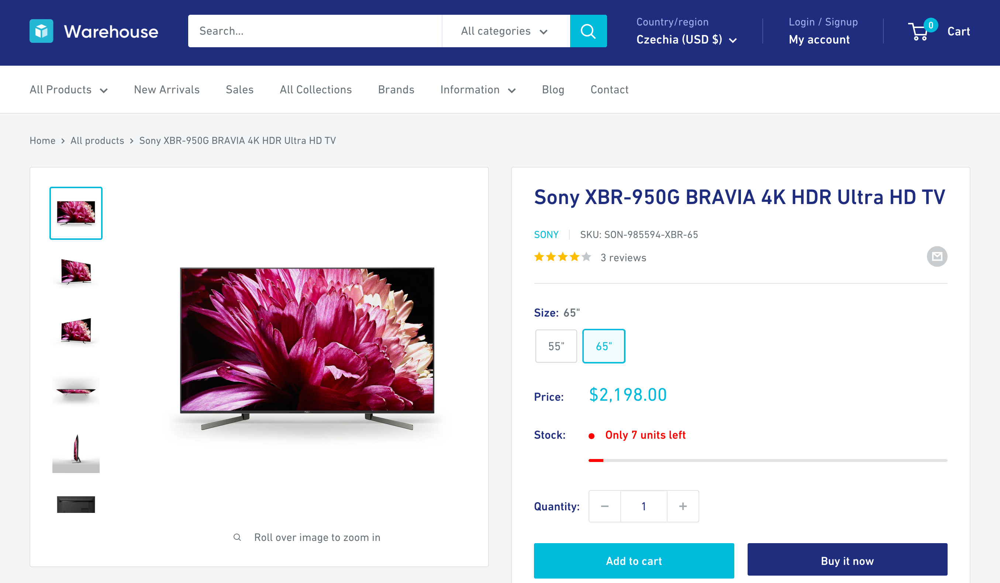
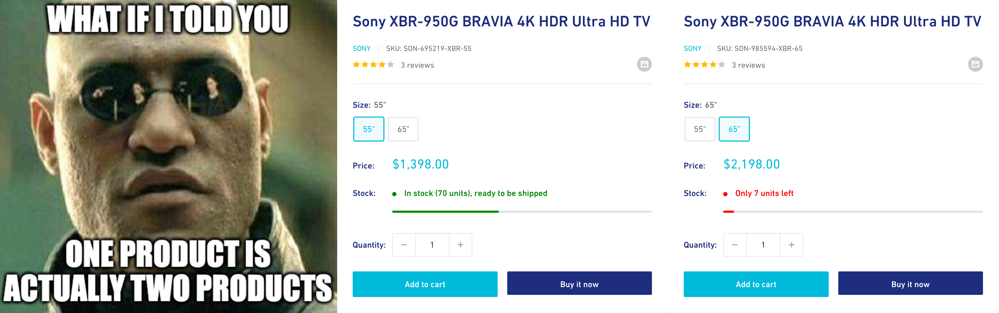

import Exercises from './_exercises.mdx';

**In this lesson, we'll follow links to individual product pages. We'll use HTTPX to download them and BeautifulSoup to process them.**

---

In previous lessons we've managed to download the HTML code of a single page, parse it with BeautifulSoup, and extract relevant data from it. We'll do the same now for each of the products.

Thanks to the refactoring, we have functions ready for each of the tasks, so we won't need to repeat ourselves in our code. This is what you should see in your editor now:

```py
import httpx
from bs4 import BeautifulSoup
from decimal import Decimal
import csv
import json
from urllib.parse import urljoin

def download(url):
    response = httpx.get(url)
    response.raise_for_status()

    html_code = response.text
    return BeautifulSoup(html_code, "html.parser")

def parse_product(product, base_url):
    title_element = product.select_one(".product-item__title")
    title = title_element.text.strip()
    url = urljoin(base_url, title_element["href"])

    price_text = (
        product
        .select_one(".price")
        .contents[-1]
        .strip()
        .replace("$", "")
        .replace(",", "")
    )
    if price_text.startswith("From "):
        min_price = Decimal(price_text.removeprefix("From "))
        price = None
    else:
        min_price = Decimal(price_text)
        price = min_price

    return {"title": title, "min_price": min_price, "price": price, "url": url}

def export_csv(file, data):
    fieldnames = list(data[0].keys())
    writer = csv.DictWriter(file, fieldnames=fieldnames)
    writer.writeheader()
    for row in data:
        writer.writerow(row)

def export_json(file, data):
    def serialize(obj):
        if isinstance(obj, Decimal):
            return str(obj)
        raise TypeError("Object not JSON serializable")

    json.dump(data, file, default=serialize, indent=2)

listing_url = "https://warehouse-theme-metal.myshopify.com/collections/sales"
listing_soup = download(listing_url)

data = []
for product in listing_soup.select(".product-item"):
    item = parse_product(product, listing_url)
    data.append(item)

with open("products.csv", "w") as file:
    export_csv(file, data)

with open("products.json", "w") as file:
    export_json(file, data)
```

## Extracting vendor name

Each product URL points to a so-called _product detail page_, or PDP. If we open one of the product URLs in the browser, e.g. the one about [Sony XBR-950G BRAVIA](https://warehouse-theme-metal.myshopify.com/products/sony-xbr-65x950g-65-class-64-5-diag-bravia-4k-hdr-ultra-hd-tv), we can see that it contains a vendor name, [SKU](https://en.wikipedia.org/wiki/Stock_keeping_unit), number of reviews, product images, product variants, stock availability, description, and perhaps more.



Depending on what's valuable for our use case, we can now use the same techniques as in previous lessons to extract any of the above. As a demonstration, let's scrape the vendor name. In browser DevTools, we can see that the HTML around the vendor name has the following structure:

```html
<div class="product-meta">
  <h1 class="product-meta__title heading h1">
    Sony XBR-950G BRAVIA 4K HDR Ultra HD TV
  </h1>
  <div class="product-meta__label-list">
    ...
  </div>
  <div class="product-meta__reference">
    <!-- highlight-next-line -->
    <a class="product-meta__vendor link link--accented" href="/collections/sony">
        <!-- highlight-next-line -->
        Sony
    <!-- highlight-next-line -->
    </a>
    <span class="product-meta__sku">
      SKU:
      <span class="product-meta__sku-number">SON-985594-XBR-65</span>
    </span>
  </div>
  <a href="#product-reviews" class="product-meta__reviews-badge link" data-offset="30">
    <div class="rating">
      <div class="rating__stars" role="img" aria-label="4.0 out of 5.0 stars">
        ...
      </div>
      <span class="rating__caption">3 reviews</span>
    </div>
  </a>
  ...
</div>
```

It looks like using a CSS selector to locate the element with the `product-meta__vendor` class, and then extracting its text, should be enough to get the vendor name as a string:

```py
vendor = product_soup.select_one(".product-meta__vendor").text.strip()
```

But where do we put this line in our program?

## Crawling product detail pages

In the `data` loop we're already going through all the products. Let's expand it to include downloading the product detail page, parsing it, extracting the vendor's name, and adding it as a new key in the item's dictionary:

```py
...

listing_url = "https://warehouse-theme-metal.myshopify.com/collections/sales"
listing_soup = download(listing_url)

data = []
for product in listing_soup.select(".product-item"):
    item = parse_product(product, listing_url)
    # highlight-next-line
    product_soup = download(item["url"])
    # highlight-next-line
    item["vendor"] = product_soup.select_one(".product-meta__vendor").text.strip()
    data.append(item)

...
```

If we run the program now, it'll take longer to finish since it's making 24 more HTTP requests. But in the end, it should produce exports with a new field containing the vendor's name:

<!-- eslint-skip -->
```json title=products.json
[
  {
    "title": "JBL Flip 4 Waterproof Portable Bluetooth Speaker",
    "min_price": "74.95",
    "price": "74.95",
    "url": "https://warehouse-theme-metal.myshopify.com/products/jbl-flip-4-waterproof-portable-bluetooth-speaker",
    "vendor": "JBL"
  },
  {
    "title": "Sony XBR-950G BRAVIA 4K HDR Ultra HD TV",
    "min_price": "1398.00",
    "price": null,
    "url": "https://warehouse-theme-metal.myshopify.com/products/sony-xbr-65x950g-65-class-64-5-diag-bravia-4k-hdr-ultra-hd-tv",
    "vendor": "Sony"
  },
  ...
]
```

## Extracting price

Scraping the vendor's name is nice, but the main reason we started checking the detail pages in the first place was to figure out how to get a price for each product. From the product listing, we could only scrape the min price, and remember—we’re building a Python app to track prices!

Looking at the [Sony XBR-950G BRAVIA](https://warehouse-theme-metal.myshopify.com/products/sony-xbr-65x950g-65-class-64-5-diag-bravia-4k-hdr-ultra-hd-tv), it's clear that the listing only shows min prices, because some products have variants, each with a different price. And different stock availability. And different SKUs…



In the next lesson, we'll scrape the product detail pages so that each product variant is represented as a separate item in our dataset.

---

<Exercises />

### Scrape calling codes of African countries

This is a follow-up to an exercise from the previous lesson, so feel free to reuse your code. Scrape links to Wikipedia pages for all African states and territories. Follow each link and extract the _calling code_ from the info table. Print the URL and the calling code for each country. Start with this URL:

```text
https://en.wikipedia.org/wiki/List_of_sovereign_states_and_dependent_territories_in_Africa
```

Your program should print the following:

```text
https://en.wikipedia.org/wiki/Algeria +213
https://en.wikipedia.org/wiki/Angola +244
https://en.wikipedia.org/wiki/Benin +229
https://en.wikipedia.org/wiki/Botswana +267
https://en.wikipedia.org/wiki/Burkina_Faso +226
https://en.wikipedia.org/wiki/Burundi None
https://en.wikipedia.org/wiki/Cameroon +237
...
```

Hint: Locating cells in tables is sometimes easier if you know how to [navigate up](https://beautiful-soup-4.readthedocs.io/en/latest/index.html#going-up) in the HTML element soup.

<details>
  <summary>Solution</summary>

  ```py
  import httpx
  from bs4 import BeautifulSoup
  from urllib.parse import urljoin

  def download(url):
      response = httpx.get(url)
      response.raise_for_status()
      return BeautifulSoup(response.text, "html.parser")

  def parse_calling_code(soup):
      for label in soup.select("th.infobox-label"):
          if label.text.strip() == "Calling code":
              data = label.parent.select_one("td.infobox-data")
              return data.text.strip()
      return None

  listing_url = "https://en.wikipedia.org/wiki/List_of_sovereign_states_and_dependent_territories_in_Africa"
  listing_soup = download(listing_url)
  for name_cell in listing_soup.select(".wikitable tr td:nth-child(3)"):
      link = name_cell.select_one("a")
      country_url = urljoin(listing_url, link["href"])
      country_soup = download(country_url)
      calling_code = parse_calling_code(country_soup)
      print(country_url, calling_code)
  ```

</details>

### Scrape authors of F1 news articles

This is a follow-up to an exercise from the previous lesson, so feel free to reuse your code. Scrape links to the Guardian's latest F1 news articles. For each article, follow the link and extract both the author's name and the article's title. Print the author's name and the title for all the articles. Start with this URL:

```text
https://www.theguardian.com/sport/formulaone
```

Your program should print something like this:

```text
Daniel Harris: Sports quiz of the week: Johan Neeskens, Bond and airborne antics
Colin Horgan: The NHL is getting its own Drive to Survive. But could it backfire?
Reuters: US GP ticket sales ‘took off’ after Max Verstappen stopped winning in F1
Giles Richards: Liam Lawson gets F1 chance to replace Pérez alongside Verstappen at Red Bull
PA Media: Lewis Hamilton reveals lifelong battle with depression after school bullying
...
```

Hints:

- You can use [attribute selectors](https://developer.mozilla.org/en-US/docs/Web/CSS/Attribute_selectors) to select HTML elements based on their attribute values.
- Sometimes a person authors the article, but other times it's contributed by a news agency.

<details>
  <summary>Solution</summary>

  ```py
  import httpx
  from bs4 import BeautifulSoup
  from urllib.parse import urljoin

  def download(url):
      response = httpx.get(url)
      response.raise_for_status()
      return BeautifulSoup(response.text, "html.parser")

  def parse_author(article_soup):
      link = article_soup.select_one('aside a[rel="author"]')
      if link:
          return link.text.strip()
      address = article_soup.select_one('aside address')
      if address:
          return address.text.strip()
      return None

  listing_url = "https://www.theguardian.com/sport/formulaone"
  listing_soup = download(listing_url)
  for item in listing_soup.select("#maincontent ul li"):
      link = item.select_one("a")
      article_url = urljoin(listing_url, link["href"])
      article_soup = download(article_url)
      title = article_soup.select_one("h1").text.strip()
      author = parse_author(article_soup)
      print(f"{author}: {title}")
  ```

</details>
