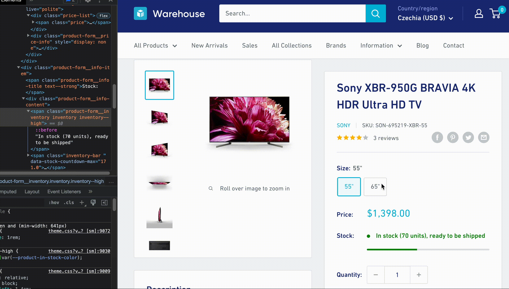

import Exercises from './_exercises.mdx';

**In this lesson, we'll scrape the product detail pages to represent each product variant as a separate item in our dataset.**

---

We'll need to figure out how to extract variants from the product detail page, and then change how we add items to the data list so we can add multiple items after scraping one product URL.

## Locating variants

First, let's extract information about the variants. If we go to [Sony XBR-950G BRAVIA](https://warehouse-theme-metal.myshopify.com/products/sony-xbr-65x950g-65-class-64-5-diag-bravia-4k-hdr-ultra-hd-tv) and open the DevTools, we can see that the buttons for switching between variants look like this:

```html
<div class="block-swatch-list">
  <div class="block-swatch">
    <input class="block-swatch__radio product-form__single-selector is-filled" type="radio" name="template--14851594125363__main-1916221128755-1" id="template--14851594125363__main-1916221128755-1-1" value="55&quot;" checked="" data-option-position="1">
    <label class="block-swatch__item" for="template--14851594125363__main-1916221128755-1-1" title="55&quot;">
    <!-- highlight-next-line -->
    <span class="block-swatch__item-text">55"</span>
    </label>
  </div>
  <div class="block-swatch">
    <input class="block-swatch__radio product-form__single-selector" type="radio" name="template--14851594125363__main-1916221128755-1" id="template--14851594125363__main-1916221128755-1-2" value="65&quot;" data-option-position="1">
    <label class="block-swatch__item" for="template--14851594125363__main-1916221128755-1-2" title="65&quot;">
    <!-- highlight-next-line -->
    <span class="block-swatch__item-text">65"</span>
    </label>
  </div>
</div>
```

Nice! We can extract the variant names, but we also need to extract the price for each variant. Switching the variants using the buttons shows us that the HTML changes dynamically. This means the page uses JavaScript to display information about the variants.



If we can't find a workaround, we'd need our scraper to run JavaScript. That's not impossible. Scrapers can spin up their own browser instance and automate clicking on buttons, but it's slow and resource-intensive. Ideally, we want to stick to plain HTTP requests and Beautiful Soup as much as possible.

After a bit of detective work, we notice that not far below the `block-swatch-list` there's also a block of HTML with a class `no-js`, which contains all the data!

```html
<div class="no-js product-form__option">
  <label class="product-form__option-name text--strong" for="product-select-1916221128755">Variant</label>
  <div class="select-wrapper select-wrapper--primary is-filled">
    <select id="product-select-1916221128755" name="id">
      <!-- highlight-next-line -->
      <option value="17550242349107" data-sku="SON-695219-XBR-55">
        <!-- highlight-next-line -->
        55" - $1,398.00
      </option>
      <!-- highlight-next-line -->
      <option value="17550242414643" data-sku="SON-985594-XBR-65" selected="selected">
        <!-- highlight-next-line -->
        65" - $2,198.00
      </option>
    </select>
  </div>
</div>
```

These elements aren't visible to regular visitors. They're there just in case JavaScript fails to work, otherwise they're hidden. This is a great find because it allows us to keep our scraper lightweight.

## Extracting variants

Using our knowledge of Beautiful Soup, we can locate the options and extract the data we need:

```py
...

listing_url = "https://warehouse-theme-metal.myshopify.com/collections/sales"
listing_soup = download(listing_url)

data = []
for product in listing_soup.select(".product-item"):
    item = parse_product(product, listing_url)
    product_soup = download(item["url"])
    vendor = product_soup.select_one(".product-meta__vendor").text.strip()

    if variants := product_soup.select(".product-form__option.no-js option"):
        for variant in variants:
            data.append(item | {"variant_name": variant.text.strip()})
    else:
        item["variant_name"] = None
        data.append(item)

...
```

The CSS selector `.product-form__option.no-js` matches elements with both `product-form__option` and `no-js` classes. Then we're using the [descendant combinator](https://developer.mozilla.org/en-US/docs/Web/CSS/Descendant_combinator) to match all `option` elements somewhere inside the `.product-form__option.no-js` wrapper.

Python dictionaries are mutable, so if we assigned the variant with `item["variant_name"] = ...`, we'd always overwrite the values. Instead of saving an item for each variant, we'd end up with the last variant repeated several times. To avoid this, we create a new dictionary for each variant and merge it with the `item` data before adding it to `data`. If we don't find any variants, we add the `item` as is, leaving the `variant_name` key empty.

:::tip Python syntax you might not know

Since Python 3.8, you can use `:=` to simplify checking if an assignment resulted in a non-empty value. It's called an _assignment expression_ or _walrus operator_. You can learn more about it in the [docs](https://docs.python.org/3/reference/expressions.html#assignment-expressions) or in the [proposal document](https://peps.python.org/pep-0572/).

Since Python 3.9, you can use `|` to merge two dictionaries. If the [docs](https://docs.python.org/3/library/stdtypes.html#dict) aren't clear enough, check out the [proposal document](https://peps.python.org/pep-0584/) for more details.

:::

If you run the program, you should see 34 items in total. Some items don't have variants, so they won't have a variant name. However, they should still have a price set—our scraper should already have that info from the product listing page.

<!-- eslint-skip -->
```json title=products.json
[
  ...
  {
    "variant_name": null,
    "title": "Klipsch R-120SW Powerful Detailed Home Speaker - Unit",
    "min_price": "324.00",
    "price": "324.00",
    "url": "https://warehouse-theme-metal.myshopify.com/products/klipsch-r-120sw-powerful-detailed-home-speaker-set-of-1",
    "vendor": "Klipsch"
  },
  ...
]
```

Some products will break into several items, each with a different variant name. We don't know their exact prices from the product listing, just the min price. In the next step, we should be able to parse the actual price from the variant name for those items.

<!-- eslint-skip -->
```json title=products.json
[
  ...
  {
    "variant_name": "Red - $178.00",
    "title": "Sony XB-950B1 Extra Bass Wireless Headphones with App Control",
    "min_price": "128.00",
    "price": null,
    "url": "https://warehouse-theme-metal.myshopify.com/products/sony-xb950-extra-bass-wireless-headphones-with-app-control",
    "vendor": "Sony"
  },
  {
    "variant_name": "Black - $178.00",
    "title": "Sony XB-950B1 Extra Bass Wireless Headphones with App Control",
    "min_price": "128.00",
    "price": null,
    "url": "https://warehouse-theme-metal.myshopify.com/products/sony-xb950-extra-bass-wireless-headphones-with-app-control",
    "vendor": "Sony"
  },
  ...
]
```

Perhaps surprisingly, some products with variants will have the price field set. That's because the shop sells all variants of the product for the same price, so the product listing shows the price as a fixed amount, like _$74.95_, instead of _from $74.95_.

<!-- eslint-skip -->
```json title=products.json
[
  ...
  {
    "variant_name": "Red - $74.95",
    "title": "JBL Flip 4 Waterproof Portable Bluetooth Speaker",
    "min_price": "74.95",
    "price": "74.95",
    "url": "https://warehouse-theme-metal.myshopify.com/products/jbl-flip-4-waterproof-portable-bluetooth-speaker",
    "vendor": "JBL"
  },
  ...
]
```

## Parsing price

The items now contain the variant as text, which is good for a start, but we want the price to be in the `price` key. Let's introduce a new function to handle that:

```py
def parse_variant(variant):
    text = variant.text.strip()
    name, price_text = text.split(" - ")
    price = Decimal(
        price_text
        .replace("$", "")
        .replace(",", "")
    )
    return {"variant_name": name, "price": price}
```

First, we split the text into two parts, then we parse the price as a decimal number. This part is similar to what we already do for parsing product listing prices. The function returns a dictionary we can merge with `item`.

## Saving price

Now, if we use our new function, we should finally get a program that can scrape exact prices for all products, even if they have variants. The whole code should look like this now:

```py
import httpx
from bs4 import BeautifulSoup
from decimal import Decimal
import csv
import json
from urllib.parse import urljoin

def download(url):
    response = httpx.get(url)
    response.raise_for_status()

    html_code = response.text
    return BeautifulSoup(html_code, "html.parser")

def parse_product(product, base_url):
    title_element = product.select_one(".product-item__title")
    title = title_element.text.strip()
    url = urljoin(base_url, title_element["href"])

    price_text = (
        product
        .select_one(".price")
        .contents[-1]
        .strip()
        .replace("$", "")
        .replace(",", "")
    )
    if price_text.startswith("From "):
        min_price = Decimal(price_text.removeprefix("From "))
        price = None
    else:
        min_price = Decimal(price_text)
        price = min_price

    return {"title": title, "min_price": min_price, "price": price, "url": url}

def parse_variant(variant):
    text = variant.text.strip()
    name, price_text = text.split(" - ")
    price = Decimal(
        price_text
        .replace("$", "")
        .replace(",", "")
    )
    return {"variant_name": name, "price": price}

def export_csv(file, data):
    fieldnames = list(data[0].keys())
    writer = csv.DictWriter(file, fieldnames=fieldnames)
    writer.writeheader()
    for row in data:
        writer.writerow(row)

def export_json(file, data):
    def serialize(obj):
        if isinstance(obj, Decimal):
            return str(obj)
        raise TypeError("Object not JSON serializable")

    json.dump(data, file, default=serialize, indent=2)

listing_url = "https://warehouse-theme-metal.myshopify.com/collections/sales"
listing_soup = download(listing_url)

data = []
for product in listing_soup.select(".product-item"):
    item = parse_product(product, listing_url)
    product_soup = download(item["url"])
    vendor = product_soup.select_one(".product-meta__vendor").text.strip()

    if variants := product_soup.select(".product-form__option.no-js option"):
        for variant in variants:
            # highlight-next-line
            data.append(item | parse_variant(variant))
    else:
        item["variant_name"] = None
        data.append(item)

with open("products.csv", "w") as file:
    export_csv(file, data)

with open("products.json", "w") as file:
    export_json(file, data)
```

Run the scraper and see for yourself if all the items in the data contain prices:

<!-- eslint-skip -->
```json title=products.json
[
  ...
  {
    "variant_name": "Red",
    "title": "Sony XB-950B1 Extra Bass Wireless Headphones with App Control",
    "min_price": "128.00",
    "price": "178.00",
    "url": "https://warehouse-theme-metal.myshopify.com/products/sony-xb950-extra-bass-wireless-headphones-with-app-control",
    "vendor": "Sony"
  },
  {
    "variant_name": "Black",
    "title": "Sony XB-950B1 Extra Bass Wireless Headphones with App Control",
    "min_price": "128.00",
    "price": "178.00",
    "url": "https://warehouse-theme-metal.myshopify.com/products/sony-xb950-extra-bass-wireless-headphones-with-app-control",
    "vendor": "Sony"
  },
  ...
]
```

Success! We managed to build a Python application for watching prices!

Is this the end? Maybe! In the next lesson, we'll use a scraping framework to build the same application, but with less code, faster requests, and better visibility into what's happening while we wait for the program to finish.

---

<Exercises />

### Build a scraper for watching Python jobs

You're able to build a scraper now, aren't you? Let's build another one! Python's official website has a [job board](https://www.python.org/jobs/). Scrape the job postings that match the following criteria:

- Tagged as "Database"
- Posted within the last 60 days

For each job posting found, use [`pp()`](https://docs.python.org/3/library/pprint.html#pprint.pp) to print a dictionary containing the following data:

- Job title
- Company
- URL to the job posting
- Date of posting

Your output should look something like this:

```py
{'title': 'Senior Full Stack Developer',
 'company': 'Baserow',
 'url': 'https://www.python.org/jobs/7705/',
 'posted_on': datetime.date(2024, 9, 16)}
{'title': 'Senior Python Engineer',
 'company': 'Active Prime',
 'url': 'https://www.python.org/jobs/7699/',
 'posted_on': datetime.date(2024, 9, 5)}
...
```

You can find everything you need for working with dates and times in Python's [`datetime`](https://docs.python.org/3/library/datetime.html) module, including `date.today()`, `datetime.fromisoformat()`, `datetime.date()`, and `timedelta()`.

<details>
  <summary>Solution</summary>

  After inspecting the job board, you'll notice that job postings tagged as "Database" have a dedicated URL. We'll use that as our starting point, which saves us from having to scrape and check the tags manually.

  ```py
  from pprint import pp
  import httpx
  from bs4 import BeautifulSoup
  from urllib.parse import urljoin
  from datetime import datetime, date, timedelta

  today = date.today()
  jobs_url = "https://www.python.org/jobs/type/database/"
  response = httpx.get(jobs_url)
  response.raise_for_status()
  soup = BeautifulSoup(response.text, "html.parser")

  for job in soup.select(".list-recent-jobs li"):
      link = job.select_one(".listing-company-name a")

      time = job.select_one(".listing-posted time")
      posted_at = datetime.fromisoformat(time["datetime"])
      posted_on = posted_at.date()
      posted_ago = today - posted_on

      if posted_ago <= timedelta(days=60):
          title = link.text.strip()
          company = list(job.select_one(".listing-company-name").stripped_strings)[-1]
          url = urljoin(jobs_url, link["href"])
          pp({"title": title, "company": company, "url": url, "posted_on": posted_on})
  ```

</details>

### Find the shortest CNN article which made it to the Sports homepage

Scrape the [CNN Sports](https://edition.cnn.com/sport) homepage. For each linked article, calculate its length in characters:

- Locate the element that holds the main content of the article.
- Use [`get_text()`](https://beautiful-soup-4.readthedocs.io/en/latest/index.html#get-text) to extract all the content as plain text.
- Use `len()` to calculate the character count.

Skip pages without text (like those that only have a video). Sort the results and print the URL of the shortest article that made it to the homepage.

At the time of writing, the shortest article on the CNN Sports homepage is [about a donation to the Augusta National Golf Club](https://edition.cnn.com/2024/10/03/sport/masters-donation-hurricane-helene-relief-spt-intl/), which is just 1,642 characters long.

<details>
  <summary>Solution</summary>

  ```py
  import httpx
  from bs4 import BeautifulSoup
  from urllib.parse import urljoin

  def download(url):
      response = httpx.get(url)
      response.raise_for_status()
      return BeautifulSoup(response.text, "html.parser")

  listing_url = "https://edition.cnn.com/sport"
  listing_soup = download(listing_url)

  data = []
  for card in listing_soup.select(".layout__main .card"):
      link = card.select_one(".container__link")
      article_url = urljoin(listing_url, link["href"])
      article_soup = download(article_url)
      if content := article_soup.select_one(".article__content"):
          length = len(content.get_text())
          data.append((length, article_url))

  data.sort()
  shortest_item = data[0]
  item_url = shortest_item[1]
  print(item_url)
  ```

</details>
