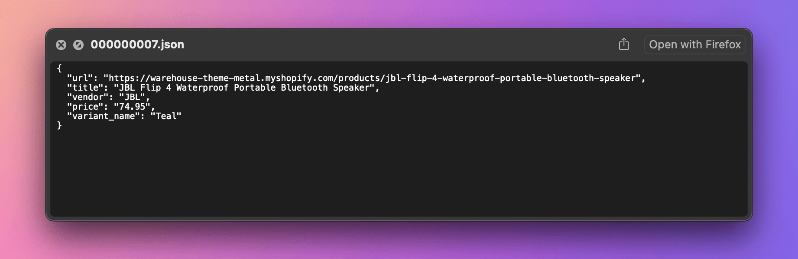

import Exercises from './_exercises.mdx';

**In this lesson, we'll rework our application for watching prices so that it builds on top of a scraping framework. We'll use Crawlee to make the program simpler, faster, and more robust.**

---

Before rewriting our code, let's point out several caveats in our current solution:

- **Hard to maintain:** All the data we need from the listing page is also available on the product page. By scraping both, we have to maintain selectors for two HTML documents. Instead, we could scrape links from the listing page and process all data on the product pages.
- **Slow:** The program runs sequentially, which is generously considerate toward the target website, but extremely inefficient.
- **No logging:** The scraper gives no sense of progress, making it tedious to use. Debugging issues becomes even more frustrating without proper logs.
- **Boilerplate code:** We implement downloading and parsing HTML, or exporting data to CSV, although we're not the first people to meet and solve these problems.
- **Prone to anti-scraping:** If the target website implemented anti-scraping measures, a bare-bones program like ours would stop working.
- **Browser means rewrite:** We got lucky extracting variants. If the website didn't include a fallback, we might have had no choice but to spin up a browser instance and automate clicking on buttons. Such a change in the underlying technology would require a complete rewrite of our program.
- **No error handling:** The scraper stops if it encounters issues. It should allow for skipping problematic products with warnings or retrying downloads when the website returns temporary errors.

In this lesson, we'll tackle all the above issues while keeping the code concise thanks to a scraping framework.

:::info Why Crawlee and not Scrapy

From the two main open-source options for Python, [Scrapy](https://scrapy.org/) and [Crawlee](https://crawlee.dev/python/), we chose the latter—not just because we're the company financing its development.

We genuinely believe beginners to scraping will like it more, since it allows to create a scraper with less code and less time spent reading docs. Scrapy's long history ensures it's battle-tested, but it also means its code relies on technologies that aren't really necessary today. Crawlee, on the other hand, builds on modern Python features like asyncio and type hints.

:::

## Installing Crawlee

When starting with the Crawlee framework, we first need to decide which approach to downloading and parsing we prefer. We want the one based on BeautifulSoup, so let's install the `crawlee` package with the `beautifulsoup` extra specified in brackets. The framework has a lot of dependencies, so expect the installation to take a while.

```text
$ pip install crawlee[beautifulsoup]
...
Successfully installed Jinja2-0.0.0 ... ... ... crawlee-0.0.0 ... ... ...
```

## Running Crawlee

Now let's use the framework to create a new version of our scraper. In the same project directory where our `main.py` file lives, create a file `newmain.py`. This way, we can keep peeking at the original implementation while working on the new one. The initial content will look like this:

```py title="newmain.py"
import asyncio
from crawlee.beautifulsoup_crawler import BeautifulSoupCrawler

async def main():
    crawler = BeautifulSoupCrawler()

    @crawler.router.default_handler
    async def handle_listing(context):
        print(context.soup.title.text.strip())

    await crawler.run(["https://warehouse-theme-metal.myshopify.com/collections/sales"])

if __name__ == '__main__':
    asyncio.run(main())
```

In the code, we do the following:

1. We perform imports and specify an asynchronous `main()` function.
1. Inside, we first create a crawler. The crawler objects control the scraping. This particular crawler is of the BeautifulSoup flavor.
1. In the middle, we give the crawler a nested asynchronous function `handle_listing()`. Using a Python decorator (that line starting with `@`), we tell it to treat it as a default handler. Handlers take care of processing HTTP responses. This one finds the title of the page in `soup` and prints its text without whitespace.
1. The function ends with running the crawler with the product listing URL. We await the crawler to finish its work.
1. The last two lines ensure that if we run the file as a standalone program, Python's asynchronous machinery will run our `main()` function.

Don't worry if this involves a lot of things you've never seen before. For now, you don't need to know exactly how [`asyncio`](https://docs.python.org/3/library/asyncio.html) works or what decorators do. Let's stick to the practical side and see what the program does when executed:

```text
$ python newmain.py
[crawlee.beautifulsoup_crawler._beautifulsoup_crawler] INFO  Current request statistics:
┌───────────────────────────────┬──────────┐
│ requests_finished             │ 0        │
│ requests_failed               │ 0        │
│ retry_histogram               │ [0]      │
│ request_avg_failed_duration   │ None     │
│ request_avg_finished_duration │ None     │
│ requests_finished_per_minute  │ 0        │
│ requests_failed_per_minute    │ 0        │
│ request_total_duration        │ 0.0      │
│ requests_total                │ 0        │
│ crawler_runtime               │ 0.010014 │
└───────────────────────────────┴──────────┘
[crawlee._autoscaling.autoscaled_pool] INFO  current_concurrency = 0; desired_concurrency = 2; cpu = 0; mem = 0; event_loop = 0.0; client_info = 0.0
Sales
[crawlee._autoscaling.autoscaled_pool] INFO  Waiting for remaining tasks to finish
[crawlee.beautifulsoup_crawler._beautifulsoup_crawler] INFO  Final request statistics:
┌───────────────────────────────┬──────────┐
│ requests_finished             │ 1        │
│ requests_failed               │ 0        │
│ retry_histogram               │ [1]      │
│ request_avg_failed_duration   │ None     │
│ request_avg_finished_duration │ 0.308998 │
│ requests_finished_per_minute  │ 185      │
│ requests_failed_per_minute    │ 0        │
│ request_total_duration        │ 0.308998 │
│ requests_total                │ 1        │
│ crawler_runtime               │ 0.323721 │
└───────────────────────────────┴──────────┘
```

If our previous scraper didn't give us any sense of progress, Crawlee feeds us with perhaps too much information for the purposes of a small program. Among all the logging, notice the line `Sales`. That's the page title! We managed to create a Crawlee scraper that downloads the product listing page, parses it with BeautifulSoup, extracts the title, and prints it.

:::tip Asynchronous code and decorators

You don't need to be an expert in asynchronous programming or decorators to finish this lesson, but you might find yourself curious for more details. If so, check out [Async IO in Python: A Complete Walkthrough](https://realpython.com/async-io-python/) and [Primer on Python Decorators](https://realpython.com/primer-on-python-decorators/).

:::

## Crawling product detail pages

The code now features advanced Python concepts, so it's less accessible to beginners, and the size of the program is about the same as if we worked without a framework. The tradeoff of using a framework is that primitive scenarios may become unnecessarily complex, while complex scenarios may become surprisingly primitive. As we rewrite the rest of the program, the benefits of using Crawlee will become more apparent.

For example, it takes a single line of code to extract and follow links to products. Three more lines, and we have parallel processing of all the product detail pages:

```py
import asyncio
from crawlee.beautifulsoup_crawler import BeautifulSoupCrawler

async def main():
    crawler = BeautifulSoupCrawler()

    @crawler.router.default_handler
    async def handle_listing(context):
        # highlight-next-line
        await context.enqueue_links(label="DETAIL", selector=".product-list a.product-item__title")

    # highlight-next-line
    @crawler.router.handler("DETAIL")
    # highlight-next-line
    async def handle_detail(context):
        # highlight-next-line
        print(context.request.url)

    await crawler.run(["https://warehouse-theme-metal.myshopify.com/collections/sales"])

if __name__ == '__main__':
    asyncio.run(main())
```

First, it's necessary to inspect the page in browser DevTools to figure out the CSS selector that allows us to locate links to all the product detail pages. Then we can use the `enqueue_links()` method to find the links and add them to Crawlee's internal HTTP request queue. We tell the method to label all the requests as `DETAIL`.

Below that, we give the crawler another asynchronous function, `handle_detail()`. We again inform the crawler that this function is a handler using a decorator, but this time it's not a default one. This handler will only take care of HTTP requests labeled as `DETAIL`. For now, all it does is print the request URL.

If we run the code, we should see how Crawlee first downloads the listing page and then makes parallel requests to each of the detail pages, printing their URLs along the way:

```text
$ python newmain.py
[crawlee.beautifulsoup_crawler._beautifulsoup_crawler] INFO  Current request statistics:
┌───────────────────────────────┬──────────┐
...
└───────────────────────────────┴──────────┘
[crawlee._autoscaling.autoscaled_pool] INFO  current_concurrency = 0; desired_concurrency = 2; cpu = 0; mem = 0; event_loop = 0.0; client_info = 0.0
https://warehouse-theme-metal.myshopify.com/products/sony-xbr-65x950g-65-class-64-5-diag-bravia-4k-hdr-ultra-hd-tv
https://warehouse-theme-metal.myshopify.com/products/jbl-flip-4-waterproof-portable-bluetooth-speaker
https://warehouse-theme-metal.myshopify.com/products/sony-sacs9-10-inch-active-subwoofer
https://warehouse-theme-metal.myshopify.com/products/sony-ps-hx500-hi-res-usb-turntable
...
[crawlee._autoscaling.autoscaled_pool] INFO  Waiting for remaining tasks to finish
[crawlee.beautifulsoup_crawler._beautifulsoup_crawler] INFO  Final request statistics:
┌───────────────────────────────┬──────────┐
│ requests_finished             │ 25       │
│ requests_failed               │ 0        │
│ retry_histogram               │ [25]     │
│ request_avg_failed_duration   │ None     │
│ request_avg_finished_duration │ 0.349434 │
│ requests_finished_per_minute  │ 318      │
│ requests_failed_per_minute    │ 0        │
│ request_total_duration        │ 8.735843 │
│ requests_total                │ 25       │
│ crawler_runtime               │ 4.713262 │
└───────────────────────────────┴──────────┘
```

In the final stats, you can see that we made 25 requests (1 listing page + 24 product pages) in less than 5 seconds. Your numbers might differ, but regardless, it should be much faster than making the requests sequentially.

## Extracting data

The BeautifulSoup crawler provides handlers with the `context.soup` attribute, which contains the parsed HTML of the handled page. This is the same `soup` object we used in our previous program. Let's locate and extract the same data as before:

```py
async def main():
    ...

    @crawler.router.handler("DETAIL")
    async def handle_detail(context):
        item = {
            "url": context.request.url,
            "title": context.soup.select_one(".product-meta__title").text.strip(),
            "vendor": context.soup.select_one(".product-meta__vendor").text.strip(),
        }
        print(item)
```

Now for the price. We're not doing anything new here—just import `Decimal` and copy-paste the code from our old scraper.

The only change will be in the selector. In `main.py`, we looked for `.price` within a `product_soup` object representing a product card. Now, we're looking for `.price` within the entire product detail page. It's better to be more specific so we don't accidentally match another price on the same page:

```py
async def main():
    ...

    @crawler.router.handler("DETAIL")
    async def handle_detail(context):
        price_text = (
            context.soup
            # highlight-next-line
            .select_one(".product-form__info-content .price")
            .contents[-1]
            .strip()
            .replace("$", "")
            .replace(",", "")
        )
        item = {
            "url": context.request.url,
            "title": context.soup.select_one(".product-meta__title").text.strip(),
            "vendor": context.soup.select_one(".product-meta__vendor").text.strip(),
            "price": Decimal(price_text),
        }
        print(item)
```

Finally, the variants. We can reuse the `parse_variant()` function as-is, and in the handler we'll again take inspiration from what we had in `main.py`. The full program will look like this:

```py
import asyncio
from decimal import Decimal
from crawlee.beautifulsoup_crawler import BeautifulSoupCrawler

async def main():
    crawler = BeautifulSoupCrawler()

    @crawler.router.default_handler
    async def handle_listing(context):
        await context.enqueue_links(selector=".product-list a.product-item__title", label="DETAIL")

    @crawler.router.handler("DETAIL")
    async def handle_detail(context):
        price_text = (
            context.soup
            .select_one(".product-form__info-content .price")
            .contents[-1]
            .strip()
            .replace("$", "")
            .replace(",", "")
        )
        item = {
            "url": context.request.url,
            "title": context.soup.select_one(".product-meta__title").text.strip(),
            "vendor": context.soup.select_one(".product-meta__vendor").text.strip(),
            "price": Decimal(price_text),
            "variant_name": None,
        }
        if variants := context.soup.select(".product-form__option.no-js option"):
            for variant in variants:
                print(item | parse_variant(variant))
        else:
            print(item)

    await crawler.run(["https://warehouse-theme-metal.myshopify.com/collections/sales"])

def parse_variant(variant):
    text = variant.text.strip()
    name, price_text = text.split(" - ")
    price = Decimal(
        price_text
        .replace("$", "")
        .replace(",", "")
    )
    return {"variant_name": name, "price": price}

if __name__ == '__main__':
    asyncio.run(main())
```

If you run this scraper, you should get the same data for the 24 products as before. Crawlee has saved us a lot of effort by managing downloading, parsing, and parallelization. The code is also cleaner, with two separate and labeled handlers.

Crawlee doesn't do much to help with locating and extracting the data—that part of the code remains almost the same, framework or not. This is because the detective work of finding and extracting the right data is the core value of custom scrapers. With Crawlee, you can focus on just that while letting the framework take care of everything else.

## Saving data

When we're at _letting the framework take care of everything else_, let's take a look at what it can do about saving data. As of now the product detail page handler prints each item as soon as the item is ready. Instead, we can push the item to Crawlee's default dataset:

```py
async def main():
    ...

    @crawler.router.handler("DETAIL")
    async def handle_detail(context):
        price_text = (
            ...
        )
        item = {
            ...
        }
        if variants := context.soup.select(".product-form__option.no-js option"):
            for variant in variants:
                # highlight-next-line
                await context.push_data(item | parse_variant(variant))
        else:
            # highlight-next-line
            await context.push_data(item)
```

That's it! If you run the program now, there should be a `storage` directory alonside the `newmain.py` file. Crawlee uses it to store its internal state. If you go to the `storage/datasets/default` subdirectory, you'll see over 30 JSON files, each representing a single item.



We can also export all the items to a single file of our choice. We'll do it at the end of the `main()` function, after the crawler has finished scraping:

```py
async def main():
    ...

    await crawler.run(["https://warehouse-theme-metal.myshopify.com/collections/sales"])
    # highlight-next-line
    await crawler.export_data_json(path='dataset.json', ensure_ascii=False, indent=2)
    # highlight-next-line
    await crawler.export_data_csv(path='dataset.csv')
```

After running the scraper again, there should be two new files in your directory, `dataset.json` and `dataset.csv`, containing all the data. If you peek into the JSON file, it should have indentation.

## Logging

Crawlee gives us stats about HTTP requests and concurrency, but we don't get much visibility into the pages we're crawling or the items we're saving. Let's add some custom logging:

```py
import asyncio
from decimal import Decimal
from crawlee.beautifulsoup_crawler import BeautifulSoupCrawler

async def main():
    crawler = BeautifulSoupCrawler()

    @crawler.router.default_handler
    async def handle_listing(context):
        # highlight-next-line
        context.log.info("Looking for product detail pages")
        await context.enqueue_links(selector=".product-list a.product-item__title", label="DETAIL")

    @crawler.router.handler("DETAIL")
    async def handle_detail(context):
        # highlight-next-line
        context.log.info(f"Product detail page: {context.request.url}")
        price_text = (
            context.soup
            .select_one(".product-form__info-content .price")
            .contents[-1]
            .strip()
            .replace("$", "")
            .replace(",", "")
        )
        item = {
            "url": context.request.url,
            "title": context.soup.select_one(".product-meta__title").text.strip(),
            "vendor": context.soup.select_one(".product-meta__vendor").text.strip(),
            "price": Decimal(price_text),
            "variant_name": None,
        }
        if variants := context.soup.select(".product-form__option.no-js option"):
            for variant in variants:
                # highlight-next-line
                context.log.info("Saving a product variant")
                await context.push_data(item | parse_variant(variant))
        else:
            # highlight-next-line
            context.log.info("Saving a product")
            await context.push_data(item)

    await crawler.run(["https://warehouse-theme-metal.myshopify.com/collections/sales"])

    # highlight-next-line
    crawler.log.info("Exporting data")
    await crawler.export_data_json(path='dataset.json', ensure_ascii=False, indent=2)
    await crawler.export_data_csv(path='dataset.csv')

def parse_variant(variant):
    text = variant.text.strip()
    name, price_text = text.split(" - ")
    price = Decimal(
        price_text
        .replace("$", "")
        .replace(",", "")
    )
    return {"variant_name": name, "price": price}

if __name__ == '__main__':
    asyncio.run(main())
```

Depending on what we find helpful, we can tweak the logs to include more or less detail. The `context.log` or `crawler.log` objects are just [standard Python loggers](https://docs.python.org/3/library/logging.html).

Even with the extra logging we've added, we've managed to cut at least 20 lines of code compared to the original program. Throughout this lesson, we've been adding features to match the old scraper's functionality, but the new code is still clean and readable. Plus, we've been able to focus on what's unique to the website we're scraping and the data we care about, while the framework manages the rest.

In the next lesson, we'll use a scraping platform to set up our application to run automatically every day.

---

<Exercises />

### Build a Crawlee scraper of F1 Academy drivers

Scrape information about all [F1 Academy](https://en.wikipedia.org/wiki/F1_Academy) drivers listed on the official [Drivers](https://www.f1academy.com/Racing-Series/Drivers) page. Each item you push to Crawlee's default dataset should include the following data:

- URL of the driver's f1academy.com page
- Name
- Team
- Nationality
- Date of birth (as a `date()` object)
- Instagram URL

If you export the dataset as JSON, it should look something like this:

<!-- eslint-skip -->
```json
[
  {
    "url": "https://www.f1academy.com/Racing-Series/Drivers/29/Emely-De-Heus",
    "name": "Emely De Heus",
    "team": "MP Motorsport"
    "nationality": "Dutch",
    "dob": "2003-02-10",
    "instagram_url": "https://www.instagram.com/emely.de.heus/",
  },
  {
    "url": "https://www.f1academy.com/Racing-Series/Drivers/28/Hamda-Al-Qubaisi",
    "name": "Hamda Al Qubaisi",
    "team": "MP Motorsport"
    "nationality": "Emirati",
    "dob": "2002-08-08",
    "instagram_url": "https://www.instagram.com/hamdaalqubaisi_official/",
  },
  ...
]
```

Hints:

- Use Python's `datetime.strptime(text, "%d/%m/%Y").date()` to parse dates in the `DD/MM/YYYY` format. Check out the [docs](https://docs.python.org/3/library/datetime.html#datetime.datetime.strptime) for more details.
- To locate the Instagram URL, use the attribute selector `a[href*='instagram']`. Learn more about attribute selectors in the [MDN docs](https://developer.mozilla.org/en-US/docs/Web/CSS/Attribute_selectors).

<details>
  <summary>Solution</summary>

  ```py
  import asyncio
  from datetime import datetime

  from crawlee.beautifulsoup_crawler import BeautifulSoupCrawler

  async def main():
      crawler = BeautifulSoupCrawler()

      @crawler.router.default_handler
      async def handle_listing(context):
          await context.enqueue_links(selector=".teams-driver-item a", label="DRIVER")

      @crawler.router.handler("DRIVER")
      async def handle_driver(context):
          info = {}
          for row in context.soup.select(".common-driver-info li"):
              name = row.select_one("span").text.strip()
              value = row.select_one("h4").text.strip()
              info[name] = value

          detail = {}
          for row in context.soup.select(".driver-detail--cta-group a"):
              name = row.select_one("p").text.strip()
              value = row.select_one("h2").text.strip()
              detail[name] = value

          await context.push_data({
              "url": context.request.url,
              "name": context.soup.select_one("h1").text.strip(),
              "team": detail["Team"],
              "nationality": info["Nationality"],
              "dob": datetime.strptime(info["DOB"], "%d/%m/%Y").date(),
              "instagram_url": context.soup.select_one(".common-social-share a[href*='instagram']").get("href"),
          })

      await crawler.run(["https://www.f1academy.com/Racing-Series/Drivers"])
      await crawler.export_data_json(path='dataset.json', ensure_ascii=False, indent=2)

  if __name__ == '__main__':
      asyncio.run(main())
  ```

</details>

### Use Crawlee to find the ratings of the most popular Netflix films

The [Global Top 10](https://www.netflix.com/tudum/top10) page has a table listing the most popular Netflix films worldwide. Scrape the movie names from this page, then search for each movie on [IMDb](https://www.imdb.com/). Assume the first search result is correct and retrieve the film's rating. Each item you push to Crawlee's default dataset should include the following data:

- URL of the film's imdb.com page
- Title
- Rating

If you export the dataset as JSON, it should look something like this:

<!-- eslint-skip -->
```json
[
  {
    "url": "https://www.imdb.com/title/tt32368345/?ref_=fn_tt_tt_1",
    "title": "The Merry Gentlemen",
    "rating": "5.0/10"
  },
  {
    "url": "https://www.imdb.com/title/tt32359447/?ref_=fn_tt_tt_1",
    "title": "Hot Frosty",
    "rating": "5.4/10"
  },
  ...
]
```

To scrape IMDb data, you'll need to construct a `Request` object with the appropriate search URL for each movie title. The following code snippet gives you an idea of how to do this:

```py
...
from urllib.parse import quote_plus

async def main():
    ...

    @crawler.router.default_handler
    async def handle_netflix_table(context):
        requests = []
        for name_cell in context.soup.select(...):
            name = name_cell.text.strip()
            imdb_search_url = f"https://www.imdb.com/find/?q={quote_plus(name)}&s=tt&ttype=ft"
            requests.append(Request.from_url(imdb_search_url, label="..."))
        await context.add_requests(requests)

    ...
...
```

When navigating to the first search result, you might find it helpful to know that `context.enqueue_links()` accepts a `limit` keyword argument, letting you specify the max number of HTTP requests to enqueue.

<details>
  <summary>Solution</summary>

  ```py
  import asyncio
  from urllib.parse import quote_plus

  from crawlee import Request
  from crawlee.beautifulsoup_crawler import BeautifulSoupCrawler

  async def main():
      crawler = BeautifulSoupCrawler()

      @crawler.router.default_handler
      async def handle_netflix_table(context):
          requests = []
          for name_cell in context.soup.select(".list-tbl-global .tbl-cell-name"):
              name = name_cell.text.strip()
              imdb_search_url = f"https://www.imdb.com/find/?q={quote_plus(name)}&s=tt&ttype=ft"
              requests.append(Request.from_url(imdb_search_url, label="IMDB_SEARCH"))
          await context.add_requests(requests)

      @crawler.router.handler("IMDB_SEARCH")
      async def handle_imdb_search(context):
          await context.enqueue_links(selector=".find-result-item a", label="IMDB", limit=1)

      @crawler.router.handler("IMDB")
      async def handle_imdb(context):
          rating_selector = "[data-testid='hero-rating-bar__aggregate-rating__score']"
          rating_text = context.soup.select_one(rating_selector).text.strip()
          await context.push_data({
              "url": context.request.url,
              "title": context.soup.select_one("h1").text.strip(),
              "rating": rating_text,
          })

      await crawler.run(["https://www.netflix.com/tudum/top10"])
      await crawler.export_data_json(path='dataset.json', ensure_ascii=False, indent=2)

  if __name__ == '__main__':
      asyncio.run(main())
  ```

</details>
