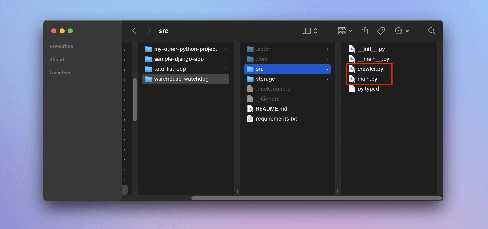
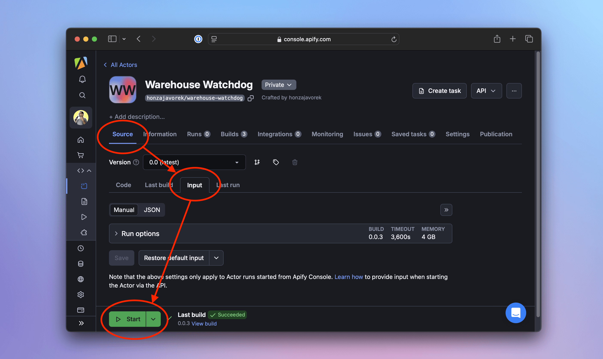
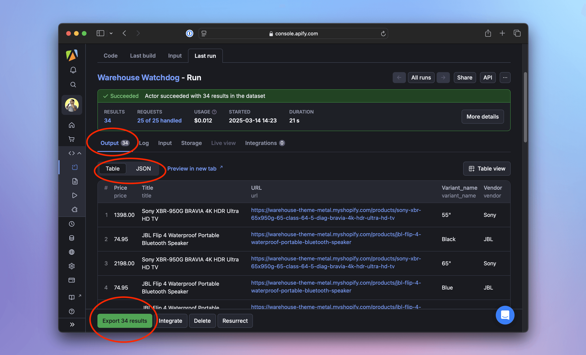
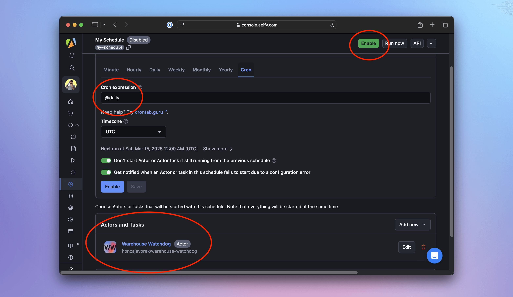
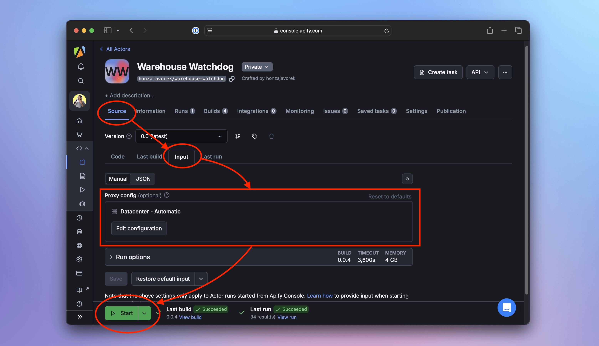

**In this lesson, we'll deploy our application to a scraping platform that automatically runs it daily. We'll also use the platform's API to retrieve and work with the results.**

---

Before starting with a scraping platform, let's highlight a few caveats in our current setup:

- _User-operated:_ We have to run the scraper ourselves. If we're tracking price trends, we'd need to remember to run it daily. And if we want alerts for big discounts, manually running the program isn't much better than just checking the site in a browser every day.
- _No monitoring:_ If we have a spare server or a Raspberry Pi lying around, we could use [cron](https://en.wikipedia.org/wiki/Cron) to schedule it. But even then, we'd have little insight into whether it ran successfully, what errors or warnings occurred, how long it took, or what resources it used.
- _Manual data management:_ Tracking prices over time means figuring out how to organize the exported data ourselves. Processing the data could also be tricky since different analysis tools often require different formats.
- _Anti-scraping risks:_ If the target website detects our scraper, they can rate-limit or block us. Sure, we could run it from a coffee shop's Wi-Fi, but eventually, they'd block that too—risking seriously annoying the barista.

In this lesson, we'll use a platform to address all of these issues. Generic cloud platforms like [GitHub Actions](https://github.com/features/actions) can work for simple scenarios. But platforms dedicated to scraping, like [Apify](https://apify.com/), offer extra features such as monitoring scrapers, managing retrieved data, and overcoming anti-scraping measures.

:::info Why Apify

Scraping platforms come in many varieties, offering a wide range of tools and approaches. As the course authors, we're obviously a bit biased toward Apify—we think it's both powerful and complete.

That said, the main goal of this lesson is to show how deploying to _any platform_ can make life easier. Plus, everything we cover here fits within [Apify's free tier](https://apify.com/pricing).

:::

## Registering

First, let's [create a new Apify account](https://console.apify.com/sign-up). You'll go through a few checks to confirm you're human and your email is valid—annoying but necessary to prevent abuse of the platform.

Apify serves both as an infrastructure where to privately deploy and run own scrapers, and as a marketplace, where anyone can offer their ready scrapers to others for rent. But let's hold off on exploring the Apify Store for now.

## Getting access from the command line

To control the platform from our machine and send the code of our program there, we'll need the Apify CLI. On macOS, we can install the CLI using [Homebrew](https://brew.sh), otherwise we'll first need [Node.js](https://nodejs.org/en/download).

After following the [Apify CLI installation guide](https://docs.apify.com/cli/docs/installation), we'll verify that we installed the tool by printing its version:

```text
$ apify --version
apify-cli/0.0.0 system-arch00 node-v0.0.0
```

Now let's connect the CLI with the cloud platform using our account from previous step:

```text
$ apify login
...
Success: You are logged in to Apify as user1234!
```

## Starting a real-world project

Until now, we've kept our scrapers simple, each with just a single Python module like `main.py`, and we've added dependencies only by installing them with `pip` inside a virtual environment.

If we sent our code to a friend, they wouldn't know what to install to avoid import errors. The same goes for deploying to a cloud platform.

To share our project, we need to package it. The best way is following the official [Python Packaging User Guide](https://packaging.python.org/), but for this course, we'll take a shortcut with the Apify CLI.

Change to a directory where you start new projects in your terminal. Then, run the following command:

`$ apify create warehouse-watchdog --template=python-crawlee-beautifulsoup`

it will create a new subdirectory called `warehouse-watchdog` for the new project, containing all the necessary files:

```text
Info: Python version 0.0.0 detected.
Info: Creating a virtual environment in ...
...
Success: Actor 'warehouse-watchdog' was created. To run it, run "cd warehouse-watchdog" and "apify run".
Info: To run your code in the cloud, run "apify push" and deploy your code to Apify Console.
Info: To install additional Python packages, you need to activate the virtual environment in the ".venv" folder in the actor directory.

## Adjusting the template

Inside the `warehouse-watchdog` directory, we should see a `src` subdirectory containing several Python files, including `main.py`. This is a sample BeautifulSoup scraper provided by the template.

The file contains a single asynchronous function, `main()`. At the beginning, it handles [input](https://docs.apify.com/platform/actors/running/input-and-output#input), then passes that input to a small crawler built on top of the Crawlee framework.

Every program that runs on the Apify platform first needs to be packaged as a so-called [Actor](https://apify.com/actors)—a standardized container with designated places for input and output. Crawlee scrapers automatically connect their default dataset to the Actor output, but input must be handled explicitly in the code.



We'll now adjust the template so that it runs our program for watching prices. As the first step, we'll create a new empty file, `crawler.py`, inside the `warehouse-watchdog/src` directory. Then, we'll fill this file with final, unchanged code from the previous lesson:

```py title=warehouse-watchdog/src/crawler.py
import asyncio
from decimal import Decimal
from crawlee.crawlers import BeautifulSoupCrawler

async def main():
    crawler = BeautifulSoupCrawler()

    @crawler.router.default_handler
    async def handle_listing(context):
        context.log.info("Looking for product detail pages")
        await context.enqueue_links(selector=".product-list a.product-item__title", label="DETAIL")

    @crawler.router.handler("DETAIL")
    async def handle_detail(context):
        context.log.info(f"Product detail page: {context.request.url}")
        price_text = (
            context.soup
            .select_one(".product-form__info-content .price")
            .contents[-1]
            .strip()
            .replace("$", "")
            .replace(",", "")
        )
        item = {
            "url": context.request.url,
            "title": context.soup.select_one(".product-meta__title").text.strip(),
            "vendor": context.soup.select_one(".product-meta__vendor").text.strip(),
            "price": Decimal(price_text),
            "variant_name": None,
        }
        if variants := context.soup.select(".product-form__option.no-js option"):
            for variant in variants:
                context.log.info("Saving a product variant")
                await context.push_data(item | parse_variant(variant))
        else:
            context.log.info("Saving a product")
            await context.push_data(item)

    await crawler.run(["https://warehouse-theme-metal.myshopify.com/collections/sales"])

    crawler.log.info("Exporting data")
    await crawler.export_data_json(path='dataset.json', ensure_ascii=False, indent=2)
    await crawler.export_data_csv(path='dataset.csv')

def parse_variant(variant):
    text = variant.text.strip()
    name, price_text = text.split(" - ")
    price = Decimal(
        price_text
        .replace("$", "")
        .replace(",", "")
    )
    return {"variant_name": name, "price": price}

if __name__ == '__main__':
    asyncio.run(main())
```

Now, let's replace the contents of `warehouse-watchdog/src/main.py` with this:

```py title=warehouse-watchdog/src/main.py
from apify import Actor
from .crawler import main as crawl

async def main():
    async with Actor:
        await crawl()
```

We import our scraper as a function and await the result inside the Actor block. Unlike the sample scraper, the one we made in the previous lesson doesn't expect any input data, so we can omit the code that handles that part.

Next, we'll change to the `warehouse-watchdog` directory in our terminal and verify that everything works locally before deploying the project to the cloud:

```text
$ apify run
Run: /Users/course/Projects/warehouse-watchdog/.venv/bin/python3 -m src
[apify] INFO  Initializing Actor...
[apify] INFO  System info ({"apify_sdk_version": "0.0.0", "apify_client_version": "0.0.0", "crawlee_version": "0.0.0", "python_version": "0.0.0", "os": "xyz"})
[BeautifulSoupCrawler] INFO  Current request statistics:
┌───────────────────────────────┬──────────┐
│ requests_finished             │ 0        │
│ requests_failed               │ 0        │
│ retry_histogram               │ [0]      │
│ request_avg_failed_duration   │ None     │
│ request_avg_finished_duration │ None     │
│ requests_finished_per_minute  │ 0        │
│ requests_failed_per_minute    │ 0        │
│ request_total_duration        │ 0.0      │
│ requests_total                │ 0        │
│ crawler_runtime               │ 0.016736 │
└───────────────────────────────┴──────────┘
[crawlee._autoscaling.autoscaled_pool] INFO  current_concurrency = 0; desired_concurrency = 2; cpu = 0; mem = 0; event_loop = 0.0; client_info = 0.0
[BeautifulSoupCrawler] INFO  Looking for product detail pages
[BeautifulSoupCrawler] INFO  Product detail page: https://warehouse-theme-metal.myshopify.com/products/jbl-flip-4-waterproof-portable-bluetooth-speaker
[BeautifulSoupCrawler] INFO  Saving a product variant
[BeautifulSoupCrawler] INFO  Saving a product variant
...
```

## Updating the Actor configuration

The Actor configuration from the template tells the platform to expect input, so we need to update that before running our scraper in the cloud.

Inside `warehouse-watchdog`, there's a directory called `.actor`. Within it, we'll edit the `input_schema.json` file, which looks like this by default:

```json title=warehouse-watchdog/src/.actor/input_schema.json
{
    "title": "Python Crawlee BeautifulSoup Scraper",
    "type": "object",
    "schemaVersion": 1,
    "properties": {
        "start_urls": {
            "title": "Start URLs",
            "type": "array",
            "description": "URLs to start with",
            "prefill": [
                { "url": "https://apify.com" }
            ],
            "editor": "requestListSources"
        }
    },
    "required": ["start_urls"]
}
```

:::tip Hidden dot files

On some systems, `.actor` might be hidden in the directory listing because it starts with a dot. Use your editor's built-in file explorer to locate it.

:::

We'll remove the expected properties and the list of required ones. After our changes, the file should look like this:

```json title=warehouse-watchdog/src/.actor/input_schema.json
{
    "title": "Python Crawlee BeautifulSoup Scraper",
    "type": "object",
    "schemaVersion": 1,
    "properties": {}
}
```

:::danger Trailing commas in JSON

Make sure there's no trailing comma after `{}`, or the file won't be valid JSON.

:::

## Deploying the scraper

Now we can proceed to deployment:

```text
$ apify push
Info: Created Actor with name warehouse-watchdog on Apify.
Info: Deploying Actor 'warehouse-watchdog' to Apify.
Run: Updated version 0.0 for Actor warehouse-watchdog.
Run: Building Actor warehouse-watchdog
...
Actor build detail https://console.apify.com/actors/a123bCDefghiJkLMN#/builds/0.0.1
? Do you want to open the Actor detail in your browser? (Y/n)
```

After opening the link in our browser, assuming we're logged in, we'll see the **Source** screen on the Actor's detail page. We'll go to the **Input** tab of that screen. We won't change anything—just hit **Start**, and we should see logs similar to what we see locally, but this time our scraper will be running in the cloud.



When the run finishes, the interface will turn green. On the **Output** tab, we can preview the results as a table or JSON. We can even export the data to formats like CSV, XML, Excel, RSS, and more.



:::info Accessing data programmatically

You don't need to click buttons to download the data. You can also retrieve it using Apify's API, the `apify datasets` CLI command, or the Python SDK. Learn more in the [Dataset docs](https://docs.apify.com/platform/storage/dataset).

:::

## Running the scraper periodically

Now that our scraper is deployed, let's automate its execution. In the Apify web interface, we'll go to [Schedules](https://console.apify.com/schedules). Click **Create new**, review the periodicity (default: daily), and specify the Actor to run. Then click **Enable**—that's it!

From now on, the Actor will execute daily. We can inspect each run, view logs, check collected data, [monitor stats and charts](https://docs.apify.com/platform/monitoring), and even set up alerts.



## Adding support for proxies

If monitoring shows that our scraper frequently fails to reach the Warehouse Shop website, it's likely being blocked. To avoid this, we can [configure proxies](https://docs.apify.com/platform/proxy) so our requests come from different locations, reducing the chances of detection and blocking.

Proxy configuration is a type of Actor input, so let's start by reintroducing the necessary code. We'll update `warehouse-watchdog/src/main.py` like this:

```py title=warehouse-watchdog/src/main.py
from apify import Actor
from .crawler import main as crawl

async def main():
    async with Actor:
        input_data = await Actor.get_input()

        if actor_proxy_input := input_data.get("proxyConfig"):
            proxy_config = await Actor.create_proxy_configuration(actor_proxy_input=actor_proxy_input)
        else:
            proxy_config = None

        await crawl(proxy_config)
```

Next, we'll add `proxy_config` as an optional parameter in `warehouse-watchdog/src/crawler.py`. Thanks to the built-in integration between Apify and Crawlee, we only need to pass it to `BeautifulSoupCrawler()`, and the class will handle the rest:

```py title=warehouse-watchdog/src/crawler.py
import asyncio
from decimal import Decimal
from crawlee.crawlers import BeautifulSoupCrawler

# highlight-next-line
async def main(proxy_config = None):
    # highlight-next-line
    crawler = BeautifulSoupCrawler(proxy_configuration=proxy_config)
    # highlight-next-line
    crawler.log.info(f"Using proxy: {'yes' if proxy_config else 'no'}")

    @crawler.router.default_handler
    async def handle_listing(context):
        context.log.info("Looking for product detail pages")
        await context.enqueue_links(selector=".product-list a.product-item__title", label="DETAIL")

    ...
```

Finally, we'll modify the Actor configuration in `warehouse-watchdog/src/.actor/input_schema.json` to include the `proxyConfig` input parameter:

```json title=warehouse-watchdog/src/.actor/input_schema.json
{
    "title": "Python Crawlee BeautifulSoup Scraper",
    "type": "object",
    "schemaVersion": 1,
    "properties": {
        "proxyConfig": {
            "title": "Proxy config",
            "description": "Proxy configuration",
            "type": "object",
            "editor": "proxy",
            "prefill": {
                "useApifyProxy": true,
                "apifyProxyGroups": []
            },
            "default": {
                "useApifyProxy": true,
                "apifyProxyGroups": []
            }
        }
    }
}
```

To verify everything works, we'll run the scraper locally. We'll use the `apify run` command again, but this time with the `--purge` option to ensure we're not reusing data from a previous run:

```text
$ apify run --purge
Info: All default local stores were purged.
Run: /Users/course/Projects/warehouse-watchdog/.venv/bin/python3 -m src
[apify] INFO  Initializing Actor...
[apify] INFO  System info ({"apify_sdk_version": "0.0.0", "apify_client_version": "0.0.0", "crawlee_version": "0.0.0", "python_version": "0.0.0", "os": "xyz"})
[BeautifulSoupCrawler] INFO  Using proxy: no
[BeautifulSoupCrawler] INFO  Current request statistics:
┌───────────────────────────────┬──────────┐
│ requests_finished             │ 0        │
│ requests_failed               │ 0        │
│ retry_histogram               │ [0]      │
│ request_avg_failed_duration   │ None     │
│ request_avg_finished_duration │ None     │
│ requests_finished_per_minute  │ 0        │
│ requests_failed_per_minute    │ 0        │
│ request_total_duration        │ 0.0      │
│ requests_total                │ 0        │
│ crawler_runtime               │ 0.014976 │
└───────────────────────────────┴──────────┘
[crawlee._autoscaling.autoscaled_pool] INFO  current_concurrency = 0; desired_concurrency = 2; cpu = 0; mem = 0; event_loop = 0.0; client_info = 0.0
[BeautifulSoupCrawler] INFO  Looking for product detail pages
[BeautifulSoupCrawler] INFO  Product detail page: https://warehouse-theme-metal.myshopify.com/products/jbl-flip-4-waterproof-portable-bluetooth-speaker
[BeautifulSoupCrawler] INFO  Saving a product variant
[BeautifulSoupCrawler] INFO  Saving a product variant
...
```

In the logs, we should see `Using proxy: no`, because local runs don't include proxy settings. All requests will be made from our own location, just as before. Now, let's update the cloud version of our scraper with `apify push`:

```text
$ apify push
Info: Deploying Actor 'warehouse-watchdog' to Apify.
Run: Updated version 0.0 for Actor warehouse-watchdog.
Run: Building Actor warehouse-watchdog
(timestamp) ACTOR: Found input schema referenced from .actor/actor.json
...
? Do you want to open the Actor detail in your browser? (Y/n)
```

Back in the Apify console, go to the **Source** screen and switch to the **Input** tab. You'll see the new **Proxy config** option, which defaults to **Datacenter - Automatic**.



Leave it as is and click **Start**. This time, the logs should show `Using proxy: yes`, as the scraper uses proxies provided by the platform:

```text
(timestamp) ACTOR: Pulling Docker image of build o6vHvr5KwA1sGNxP0 from repository.
(timestamp) ACTOR: Creating Docker container.
(timestamp) ACTOR: Starting Docker container.
(timestamp) [apify] INFO  Initializing Actor...
(timestamp) [apify] INFO  System info ({"apify_sdk_version": "0.0.0", "apify_client_version": "0.0.0", "crawlee_version": "0.0.0", "python_version": "0.0.0", "os": "xyz"})
(timestamp) [BeautifulSoupCrawler] INFO  Using proxy: yes
(timestamp) [BeautifulSoupCrawler] INFO  Current request statistics:
(timestamp) ┌───────────────────────────────┬──────────┐
(timestamp) │ requests_finished             │ 0        │
(timestamp) │ requests_failed               │ 0        │
(timestamp) │ retry_histogram               │ [0]      │
(timestamp) │ request_avg_failed_duration   │ None     │
(timestamp) │ request_avg_finished_duration │ None     │
(timestamp) │ requests_finished_per_minute  │ 0        │
(timestamp) │ requests_failed_per_minute    │ 0        │
(timestamp) │ request_total_duration        │ 0.0      │
(timestamp) │ requests_total                │ 0        │
(timestamp) │ crawler_runtime               │ 0.036449 │
(timestamp) └───────────────────────────────┴──────────┘
(timestamp) [crawlee._autoscaling.autoscaled_pool] INFO  current_concurrency = 0; desired_concurrency = 2; cpu = 0; mem = 0; event_loop = 0.0; client_info = 0.0
(timestamp) [crawlee.storages._request_queue] INFO  The queue still contains requests locked by another client
(timestamp) [BeautifulSoupCrawler] INFO  Looking for product detail pages
(timestamp) [BeautifulSoupCrawler] INFO  Product detail page: https://warehouse-theme-metal.myshopify.com/products/jbl-flip-4-waterproof-portable-bluetooth-speaker
(timestamp) [BeautifulSoupCrawler] INFO  Saving a product variant
...
```

## Congratulations!

You've reached the end of the course—congratulations! 🎉 Together, we've built a program that:

- Crawls a shop and extracts product and pricing data
- Exports the results in several formats
- Uses a concise code, thanks to a scraping framework
- Runs on a cloud platform with monitoring and alerts
- Executes periodically without manual intervention, collecting data over time
- Uses proxies to avoid being blocked

We hope this serves as a solid foundation for your next scraping project. Perhaps you'll even [start publishing scrapers](https://docs.apify.com/platform/actors/publishing) for others to use—for a fee? 😉
