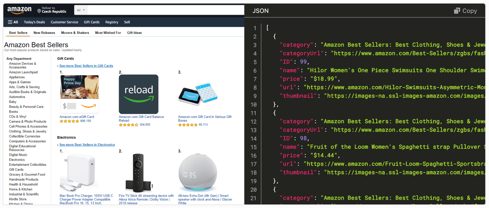

import DocCardList from '@theme/DocCardList';

**Learn how to use Python to extract information from websites in this practical course, starting from the absolute basics.**

---

:::danger Work in progress

This course is incomplete. As we work on adding new lessons, we would love to hear your feedback. Comment right here under each page or [file a GitHub Issue](https://github.com/apify/apify-docs/issues) to discuss a problem.

:::

In this course we'll use Python to create an application for watching prices. It'll be able to scrape all product pages of an e-commerce website and record prices. Data from several runs of such program would be useful for seeing trends in price changes, detecting discounts, etc.

<!--
TODO image of warehouse with some CVS or JSON exported, similar to sources/academy/webscraping/scraping_basics_javascript/images/beginners-data-collection.png, which is for some reason the same as sources/academy/webscraping/scraping_basics_javascript/images/beginners-data-extraction.png
-->

## What you'll do

- Inspect pages using browser DevTools.
- Download web pages using the HTTPX library.
- Extract data from web pages using the Beautiful Soup library.
- Save extracted data in various formats, e.g. CSV which MS Excel or Google Sheets can open.
- Follow links programmatically (crawling).
- Save time and effort with frameworks, such as Crawlee, and scraping platforms, such as Apify.

## Who this course is for

Anyone with basic knowledge of developing programs in Python who wants to start with web scraping can take this course. The course does not expect you to have any prior knowledge of web technologies or scraping.

## Requirements

- A macOS, Linux, or Windows machine with a web browser and Python installed.
- Familiarity with Python basics: variables, conditions, loops, functions, strings, lists, dictionaries, files, classes, and exceptions.
- Comfort with importing from the Python standard library, using virtual environments, and installing dependencies with `pip`.
- Familiarity with running commands in Terminal (macOS/Linux) or Command Prompt (Windows).

## You may want to know

Let's explore the key reasons to take this course. What is web scraping good for, and what career opportunities does it enable for you?

### Why learn scraping

The internet is full of useful data, but most of it isn't offered in a structured way that's easy to process programmatically. That's why you need scraping, a set of approaches to download websites and extract data from them.

Scraper development is also a fun and challenging way to learn web development, web technologies, and understand the internet. You'll reverse-engineer websites, understand how they work internally, discover what technologies they use, and learn how they communicate with servers. You'll also master your chosen programming language and core programming concepts. Understanding web scraping gives you a head start in learning web technologies such as HTML, CSS, JavaScript, frontend frameworks (like React or Next.js), HTTP, REST APIs, GraphQL APIs, and more.

### Why build your own scrapers

Scrapers are programs specifically designed to mine data from the internet. Point-and-click or no-code scraping solutions do exist, but they only take you so far. While simple to use, they lack the flexibility and optimization needed to handle advanced cases. Only custom-built scrapers can tackle more difficult challenges. And unlike ready-made solutions, they can be fine-tuned to perform tasks more efficiently, at a lower cost, or with greater precision.

### Why become a scraper dev

As a scraper developer, you are not limited by whether certain data is available programmatically through an official API—the entire web becomes your API! Here are some things you can do if you understand scraping:

- Improve your productivity by building personal tools, such as your own real estate or rare sneakers watchdog.
- Companies can hire you to build custom scrapers mining data important for their business.
- Become an invaluable asset to data journalism, data science, or nonprofit teams working to make the world a better place.
- You can publish your scrapers on platforms like the [Apify Store](https://apify.com/store) and earn money by renting them out to others.

### Why learn with Apify

We are [Apify](https://apify.com), a web scraping and automation platform. We do our best to build this course on top of open source technologies. That means what you learn applies to any scraping project, and you'll be able to run your scrapers on any computer. We will show you how scraping platforms can simplify your life, but those lessons are optional and designed to fit within our [free tier](https://apify.com/pricing).

## Course content

<DocCardList />
