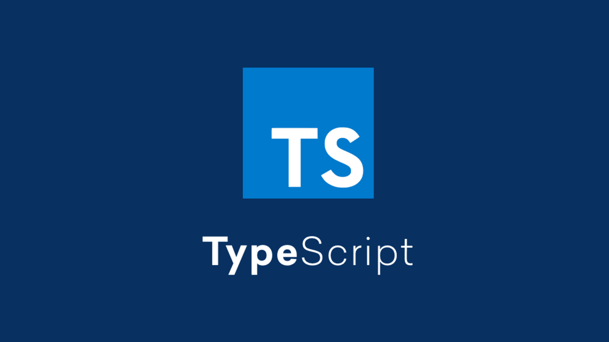
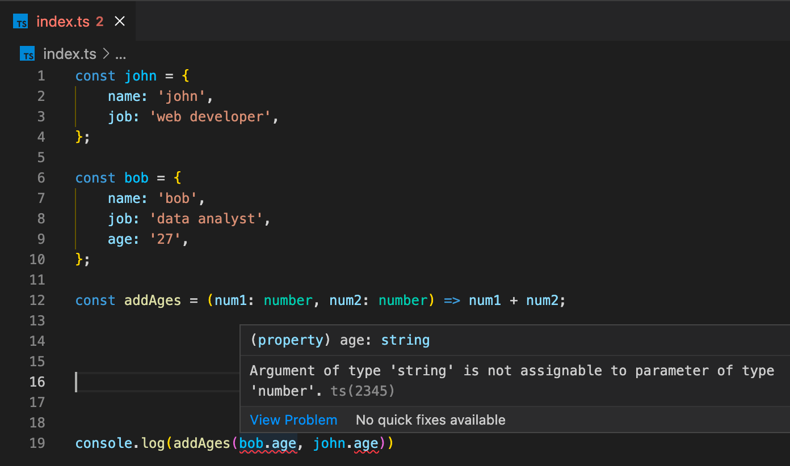

# Switching to TypeScript {#switching-to-typescript}

**In this course, learn what TypeScript is, why you should use it instead of vanilla JavaScript, and how to start using it in your own projects.**

---

As the world of JavaScript moves forward, [TypeScript](https://www.typescriptlang.org/) continues to become more popular. More companies than ever before are using TypeScript in their codebases, and are heavily preferring it over vanilla JavaScript. But why? What is TypeScript, and why is is so great for developers?



## What is TypeScript? {#what-is-typescript}

If you're familiar with the fundamentals of any programming language (JavaScript included), then you're familiar with the concept of **types**. String, boolean, array, object, number - these are all types. What TypeScript does is bring [type safety](https://en.wikipedia.org/wiki/Type_safety) to JavaScript, which is normally a [dynamically typed](https://developer.mozilla.org/en-US/docs/Glossary/Dynamic_typing) and [interpreted](https://www.geeksforgeeks.org/difference-between-compiled-and-interpreted-language/) programming language. This means that if you have declare a variable like this: `const foo = 'bar'`, then later try to access the non-existent property of `foo.baz`, you'll only know about the error once it happens during runtime.

To sum everything said up above, here's a code example written in JavaScript that has a couple of problems with it:

```js
const john = {
    name: 'john',
    job: 'web developer',
};

const bob = {
    name: 'bob',
    job: 'data analyst',
    age: '27',
};

const addAges = (num1, num2) => num1 + num2;

console.log(addAges(bob.age, john.age));
```

This code doesn't actually throw an error, but it does output `27undefined`. That's not good. The first issue is that `john.age` is **undefined**, and the second issue is that `bob.age` is a string and must be converted to a number to work properly in the `addAges` function. Despite these two significant mistakes, JavaScript doesn't tell us at all about them and lets the code run with bugs.

With TypeScript, these types of issues stick out like a sore thumb, and depending on your configurations, the [compiler](https://www.techtarget.com/whatis/definition/compiler#:~:text=A%20compiler%20is%20a%20special,as%20Java%20or%20C%2B%2B.) will refuse to compile it until they have been fixed.



This means that when using TS (a popular acronym for "TypeScript") on a large project, you'll run into much less runtime errors and catch the majority of them during the development process.

## What are the advantages of using TypeScript? {#advantages-of-typescript}

1. The ability to **optionally** [statically type](https://developer.mozilla.org/en-US/docs/Glossary/Static_typing) your variables and functions.
2. [Type Inference](https://www.typescriptlang.org/docs/handbook/type-inference.html), which provides you the benefits of using types, but without having to actually statically type anything. For example, if you create a variable like this: `let num = 5`, TypeScript will automatically infer that `num` is of a **number** type.
3. Access to the newest features in JavaScript before they are officially supported everywhere.
4. Fantastic support with [IntelliSense](https://en.wikipedia.org/wiki/Intelligent_code_completion) and epic autocomplete when writing functions, accessing object properties, etc. Most modern IDEs have TypeScript support.
5. Access to exclusive TypeScript features such as [Enums](https://www.typescriptlang.org/docs/handbook/enums.html).
<!-- and [Decorators](https://www.typescriptlang.org/docs/handbook/decorators.html). -->

## How different is TypeScript from JavaScript? {#how-different-is-it}

Think of it this way: Javascript **IS** Typescript, but TypeScript isn't JavaScript. All JavaScript code is valid TypeScript code, which means that you can pretty much turn any **.js** file into a **.ts** file and it'll still work just the same after being compiled. It also means that to learn TypeScript, you aren't going to have to learn a whole new programming language if you already know JavaScript.

So, what are the differences? Well, there's really just one: TypeScript files cannot be run directly. They must first be compiled into regular JavaScript.

## Ready to get started? {#first}

Now that you're familiar with what TypeScript is and aware of its many advantages, let's [get started](./installation.md) in our TS journey by installing the TypeScript compiler (super easy) and writing our first line of code in a **.ts** file.
