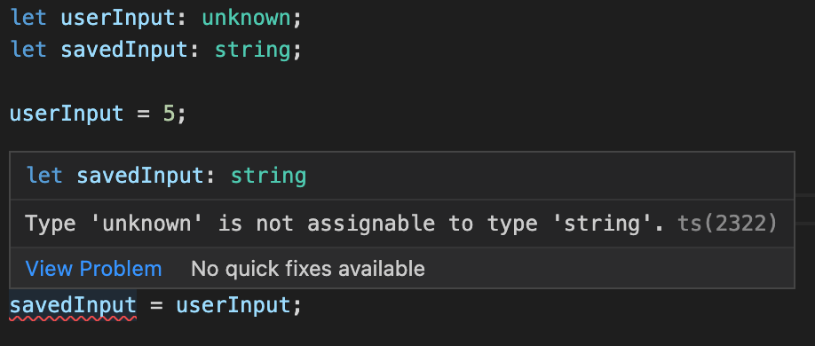

# Unknown & type assertions {#unknown-and-type-assertions}

**Understand the "unknown" and "any" types, as well as how to use type guards to make your code safer and type assertions to avoid common TypeScript compiler errors.**

---

Two types we haven't discussed yer are `any` and `unknown`

## Let's talk about "any" {#the-any-type}

In the first [**Using types**](./using_types.md) lesson, you were briefly exposed to the `any` type, which is a special type used to represent all possible JavaScript values. By using this type, you basically tell TypeScript that you don't care, and that you want to be able to do anything with that value, even if it might cause a runtime error. Take a look at this example:

<!-- eslint-disable -->
```ts
// Create a variable that TypeScript will completely ignore.
// Absolutely anything can be stored in here.
let userInput: any;

// Create a variable that can only hold strings
let savedInput: string;

// Set the user input to equal a number. This is fine, because
// it can be any time.
userInput = 5;

// Set the "savedInput" to be the value of "userInput". Stored in
// "userInput" is a number, but since we told TypeScript that it's
// "any" type, an error is not thrown.
savedInput = userInput;
```

Sometimes, `any` can be useful; however, in 99% of cases it is best to avoid it as it can lead to logical errors just like the one above.

## Why "unknown" is better {#the-unknown-type}

Just like `any`, the `unknown` type is also a special type that represents all possible JavaScript value, and all types are assignable to it. The big difference is that the TypeScript compiler won't allow any operation on values typed as `unknown`. To see this in action, we just have to change the type of `userInput` in the above code snippet from `any` to `unknown`.



Even this will result in the same error:

<!-- eslint-disable -->
```ts
// This results in a compiler error!
let userInput: unknown;
let savedInput: string;

userInput = 'hello world!';

savedInput = userInput;
```

## Type guards {#type-guards}

In order to make the code above not throw any compiler errors, we can use a [type guard](https://www.typescriptlang.org/docs/handbook/advanced-types.html), which is just a check that happens at runtime to ensure that the type is in fact what it should be.

<!-- eslint-disable -->
```ts
let userInput: unknown;
let savedInput: string;

userInput = 5;

// This if statement is called a "type guard"
// No more error! TypeScript is smart enough to understand
// what this if statement is doing, and removes the error
if (typeof userInput === 'string') {
    savedInput = userInput;
}
```

This works, and in fact, it's the most optimal solution for this use case. But what if we were 100% sure that the value stored in `userInput` was a string? Thats when **type assertions** come in handy.

## Type assertions {#type-assertions}

Despite the fancy name, [type assertions](https://www.typescriptlang.org/docs/handbook/2/everyday-types.html#type-assertions) are a simple concept based around a single keyword: `as`. We usually use this on values that we can't control the return type of, or values that we're sure have a certain type, but TypeScript needs a bit of help understanding that.

<!-- eslint-disable -->
```ts
let userInput: unknown;
let savedInput: string;

userInput = 'hello world!';

// No more error! We've told TypeScript to treat "userInput"
// as a string, despite the fact that its original type is
// the "unknown" type
savedInput = userInput as string;
```

## Non-null assertion {#non-null-assertion}

You might already be familiar with [optional chaining](https://developer.mozilla.org/en-US/docs/Web/JavaScript/Reference/Operators/Optional_chaining) in JavaScript (`?.` syntax). TypeScript adds a new operator with a similar syntax that uses an exclamation mark instead (`!.`), which automatically removes `null` and `undefined` from a value's type - essentially asserting that you are certain it will never be `null` or `undefined`.

Consider this snippet:

```ts
let job: undefined | string;

const chars = job.split('');
```

TypeScript will yell at you when trying to compile this code, stating that **Object is possibly 'undefined'**, which is true. To assert that `job` will not be `undefined` in this case, we can add an exclamation mark before the dot.

```ts
let job: undefined | string;

const chars = job!.split('');
```

This operator is called the [non-null assertion operator](https://www.typescriptlang.org/docs/handbook/2/everyday-types.html#non-null-assertion-operator-postfix-).

## Final thoughts {#final-thoughts}

Even though you've learned about them in the same lesson, type guards and type assertions are inherently very different things with different use cases.

**Type guards** make a runtime check of whether or not a value passes a check that determines that it can be safely used as a certain type. They are great when dealing with values that might hold inconsistent data types (such as user input) where you aren't 100% sure if a certain property will exist.

**Type assertions** tell TypeScript to take a value of one type and to treat it as if it were another type. No runtime checks are made. A common use case is asserting the response body of an API call (usually has the `any` type depending on what you're using to fetch the data) to a custom type to receive TypeScript support on the data.

Oftentimes, these features are used in tandem.

## Next up {#next}

We've now got all the knowledge we need to build a real project in TypeScript, which we're going to do very soon. But, there's one important thing we have to do before writing the code for our project - configure the compiler and understand watch mode. Learn all this in the [next lesson](./watch_mode_and_tsconfig.md)!
