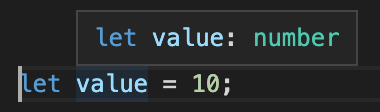
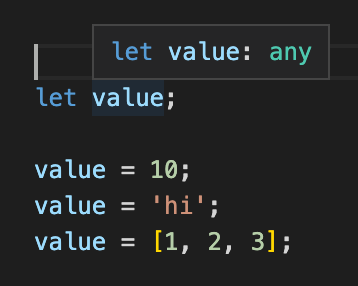
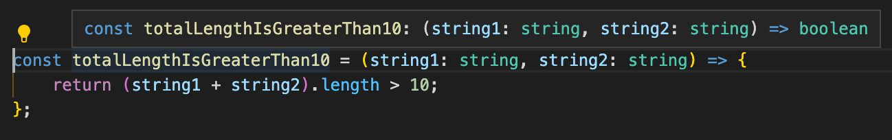

# Using types {#using-types}

**Dip your toes into using types with TypeScript by learning about the core types offered by the language, and how to define variables and functions with them.**

---

In the previous lesson, we got a rough idea of how types are used by utilizing the `number` type in a function's parameters. The `number` type is one of TypeScript's three core types.

## Core types

| Name      | Example                 | Description                                                  |
| --------- | ----------------------- | ------------------------------------------------------------ |
| `number`  | `1`, `5.3`, `-10`       | All numbers. No differentiation between integers and floats. |
| `string`  | `'hi'`, `"hello world"` | All text values.                                             |
| `boolean` | `true`, `false`         | Just these two. No "truthy" or "falsy" values.               |

## With variables {#with-variables}

Just because we're writing TS files doesn't mean we need to explicitly define the type of every single value/parameter though. We'll create a new file called **using-types.ts** and create a basic variable:

```ts
let value = 10;
```

When hovering over the variable, we see that TypeScript was smart enough to infer that the data type stored in `value` should always be a number.



Attempting to reassign `value` to be a type other than a number will result in a compiler error.

But what if we want to declare the variable with no initial value, then change it later?

```ts
let value;

value = 10;
```

TypeScript can't automatically infer the type of the variable when we don't provide it an initial value, so it automatically uses the `any` type.

> Note: Avoid using the `any` type as much as possible. It completely defeats the purpose of using TypeScript in the first place, as it removes the benefits of TS.

Because of this, we can set `value` to be absolutely anything without receiving any compiler errors.



To resolve this, we can annotate the variable by adding a colon (`:`) after the name followed by the name of the type we'd like to be tied to the variable.

```ts
let value: number;

// Totally ok
value = 10;

// This will throw a compiler error
value = 'hello academy!';
```

To allow for the `value` variable to hold multiple different types, we can use a [union type](https://www.typescriptlang.org/docs/handbook/unions-and-intersections.html). It works just the same was as the **or** (`||`) operator in JavaScript, but only uses one pipe (`|`) character and only works with types and type annotations.

```ts
// "value" can hold either a number or a string
let value: number | string;

// Totally ok
value = 10;

// Totally ok
value = 'hello academy!';

// This will throw a compiler error, because we didn't include
// number arrays in our union type.
value = [1, 2, 3]
```

Later in this course, we'll be getting more into union types.

## With functions {#with-functions}

With functions, you can define the types of both the parameters and the return type. Here's a basic function:

```ts
const totalLengthIsGreaterThan10 = (string1, string2) => {
    // Returns true if the total length of both strings is greater
    // than 10, and false if it's less than 10.
    return (string1 + string2).length > 10;
};
```

Just like with the parameters in the function from last lesson, and similar to variables, these parameters can be annotated with a colon (`:`) and a type name. In this case, we are expecting two strings into this function.

```ts
const totalLengthIsGreaterThan10 = (string1: string, string2: string) => {
    return (string1 + string2).length > 10;
};
```

The return value of this function is a boolean, which TypeScript has intelligently inferred.



Despite the correct inference, if we wanted to explicitly annotate this function's return type, we could. Return type annotations go after the parentheses (`()`) where the function's parameters are defined.

```ts
const totalLengthIsGreaterThan10 = (string1: string, string2: string): boolean => {
    return (string1 + string2).length > 10;
};
```

For non-arrow functions, the type annotation syntax is the exact same:

```ts
function totalLengthIsGreaterThan10(string1: string, string2: string): boolean {
    return (string1 + string2).length > 10;
}
```

## Next up {#next}

[Next up](./using_types_continued.md), we'll discuss a few more basic types supported in TypeScript and how to use them.
