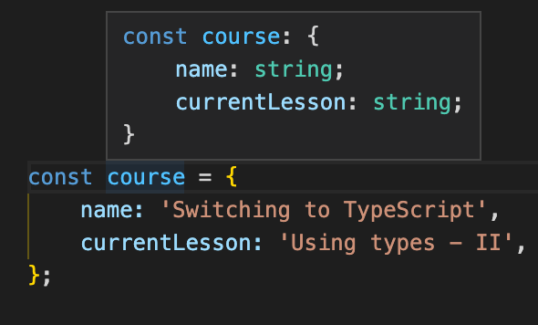
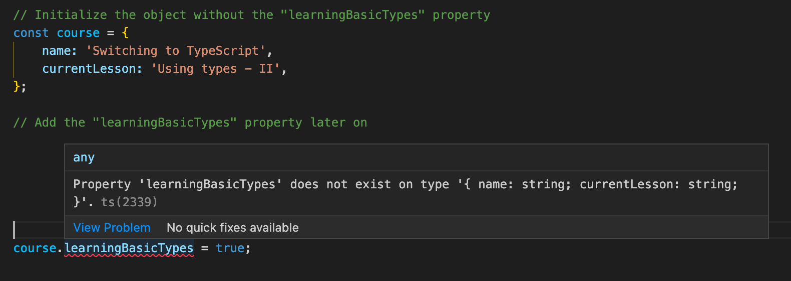
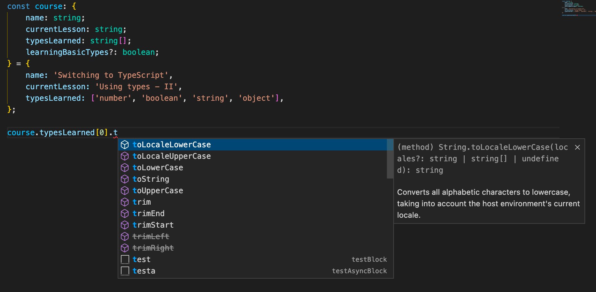
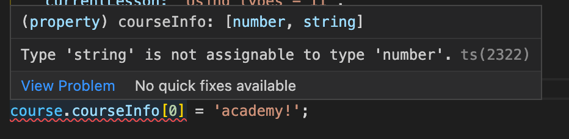

# Using types (continued) {#using-types-continued}

**Continue learning about the core types in TypeScript. In this second part lesson, learn how to use and define object types, array types, and tuples.**

---

Now that you're (hopefully) fairly comfortable with strings, booleans, and numbers in TypeScript, we can start discussing the more complex types supported by the language.

| Name     | Example                        | Description                                                                          |
| -------- | ------------------------------ | ------------------------------------------------------------------------------------ |
| `object` | `{ name: 'academy' }`          | Any JavaScript object. More specific types are possible.                             |
| `Array`  | `[1, 2, 3]`, `['a', 'b', 'c']` | Any JavaScript array. Types can be flexible or strict (regarding the element types). |
| `Tuple`  | `[1, 2]`                       | A fixed-length array.                                                                |

## Objects {#objects}

By now, you're already familiar with what type inference is. Even when creating objects, TypeScript will do its best to infer what that object's type is. For example, TS automatically infers correctly that this object is an object with `name` and `currentLesson` properties, both strings:



Notice that the value showed in the popup when hovering over the `course` variable looks very much like a regular JavaScript object; however, it is not an object at all - instead, it is an object **type**.

> Object types differ slightly in syntax from regular JavaScript objects. Firstly, the properties are separated by semicolons (`;`) instead of commas. Also, instead of being key-value pairs like objects, object types are key-**type** pairs.

This inference from TypeScript is totally valid and correct; however, what if we want to add a new property to the `course` object after it's been initialized?



So what's the problem? The problem is that we didn't tell TypeScript that the `course` object can have a property called `learningBasicTypes` of a boolean type in the variable's initial state, which is what TypeScript's inference is based off of. Because of this, we have to write our own custom object type.

Just as we did before when assigning types like `number` and `string` to variables, we'll annotate the variable's type with a colon (`:`) followed by the type. However, instead of using a basic type name such as `boolean` or `number`, we'll put a custom object type there instead.

```ts
const course: {
    name: string;
    currentLesson: string;
} = {
    name: 'Switching to TypeScript',
    currentLesson: 'Using types - II',
};
```

> We know, this looks extremely weird at first, but by the end of the course you'll be super comfortable with this syntax. And, a bit later on in the course, you'll learn how to define object types separate from the variable to improve code readability.

### Optional properties {#optional-properties}

Finally, we'll add an optional property to our object type with a key of `learningBasicTypes` and a type of `boolean`. Properties become optional by adding a question mark (`?`) before the colon (`?`) after the property name.

```ts
// Initialize the object without the "learningBasicTypes" property
const course: {
    name: string;
    currentLesson: string;
    // Add the "learningBasicTypes" property to the object's type.
    // This property can be either undefined or boolean
    learningBasicTypes?: boolean;
} = {
    name: 'Switching to TypeScript',
    currentLesson: 'Using types - II',
};

// Add the "learningBasicTypes" property later on
course.learningBasicTypes = true;
```

What this question mark does is tells TypeScript that the property doesn't necessarily have to exist on the `course` object (it can be undefined), but if it does exist, it must be a boolean.

## Arrays {#arrays}

Defining arrays is quite straightforward. We'll first add a `typesLearned` property to our `course` object:

```ts
const course2 = {
    name: 'Switching to TypeScript',
    currentLesson: 'Using types - II',
    typesLearned: ['number', 'boolean', 'string', 'object'],
};
```

Then, in the type definition, we can add a `typesLearned` key. Then, by simply writing the type that the array's elements are followed by two square brackets (`[]`), we can form an array type.

```ts
const course: {
    name: string;
    currentLesson: string;
    // By adding square brackets at the end, we tell TypeScript
    // that "typesLearned" is not a string, but an array of strings
    typesLearned: string[];
    learningBasicTypes?: boolean;
} = {
    name: 'Switching to TypeScript',
    currentLesson: 'Using types - II',
    typesLearned: ['number', 'boolean', 'string', 'object'],
};
```

Some of the benefits of TypeScript can be seen when accessing one of the properties on the `course.typesLearned` array. Since we told TypeScript that it's an array of strings, it confidently knows that each of those properties are going to have the methods on the [String prototype](https://developer.mozilla.org/en-US/docs/Web/JavaScript/Reference/Global_Objects/String#instance_methods), so it will autocomplete methods such as `.slice()`, `.toUpperCase()`, and `.slice()`.



Nice!

## Tuples {#tuples}

The **Tuple** type is a special type that is not in vanilla JavaScript, but is supported in other programming languages - including TypeScript. It is almost the same thing as an array; however tuples have a fixed length that cannot be changed, and each element at each index has a specific type. Don't worry, this type is much easier to understand in practice.

Let's add a final property to our epic `course` object called `courseInfo`. This property will hold an array where the first value corresponds to this course's number in the Apify academy, and the value in the second position describes the level of this course.

```ts
const course = {
    name: 'Switching to TypeScript',
    currentLesson: 'Using types - II',
    typesLearned: ['number', 'boolean', 'string', 'object'],
    courseInfo: [7, 'advanced'],
};
```

Here's one way we could define this property's type:

```ts
const course: {
    name: string;
    currentLesson: string;
    typesLearned: string[];
    // an array of numbers or strings
    courseInfo: (number | string)[];
    learningBasicTypes?: boolean;
} = {
    name: 'Switching to TypeScript',
    currentLesson: 'Using types - II',
    typesLearned: ['number', 'boolean', 'string', 'object'],
    courseInfo: [7, 'advanced'],
};
```

This is actually how TypeScript infers the type of `courseInfo` as well. It tells the compiler that `courseInfo` is an array of any length that can hold both numbers and strings. However, we want to be more specific than that in this case. The length of `courseInfo` should always going to be 2, the first value should always be a number, and second one always a string. We should use a tuple instead.

```ts
const course: {
    name: string;
    currentLesson: string;
    typesLearned: string[];
    // an array with 2 elements. courseInfo[0] is a string,
    // while courseInfo[0] is a number
    courseInfo: [number, string];
    learningBasicTypes?: boolean;
} = {
    name: 'Switching to TypeScript',
    currentLesson: 'Using types - II',
    typesLearned: ['number', 'boolean', 'string', 'object'],
    courseInfo: [7, 'advanced'],
};
```

By placing types inside of the square brackets in a specific order, we tell TypeScript that the property is not of an array type, but a tuple instead. So, when we try to reassign the properties to an incorrect data type, we get an error.



## Next up {#next}

Whew! Nice job learning about the core types in TypeScript. The next lesson is lighter than the last two, but still super important. [Let's learn](./enums.md) about the `enum` keyword!
