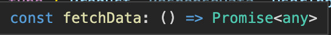
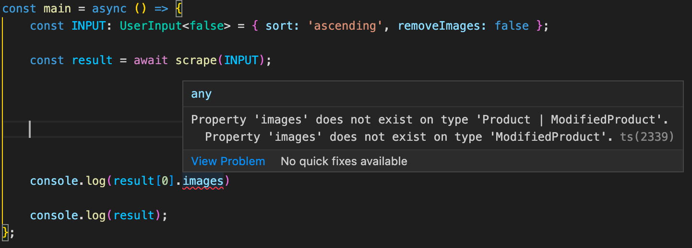
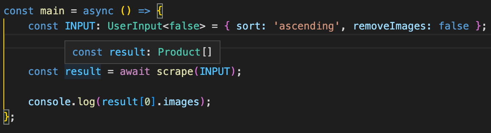

# Mini-project {#mini-project}

**Build an entire project in TypeScript using concepts learned in this course. Also, learn about two more advanced TypeScript features.**

---

You're here! If you made it this far, that means that you've familiarized yourself with all the core concepts in TypeScript (and some of the more advanced ones too). We're going to scrape product data from [this API endpoint](https://dummyjson.com/products), and then manipulate it based on user input.

## Project overview {#project-overview}

Here's a rundown of what our project should be able to do:

1. Accept an object with two properties as its input. The **sort** property defines how to sort the data, and can be either **ascending** or **descending**. **removeImages** determines whether or not the images array should be removed from each product.
2. Fetch the data and get full TypeScript support on the response object (no `any`!).
3. Sort and modify the data, receiving TypeScript support for the new modified data.

We'll be using a single external package called [**Axios**](https://www.npmjs.com/package/axios) to fetch the data from the API, which can be installed with the following command:

```shell
npm i axios
```

## Writing types {#writing-types}

Especially when writing a scraper, it's extremely helpful to write out your data types before even writing a single line of logic. When you understand the data types your program is going to be working with, it's much easier to think how **how** it will work with them.

### Defining object types for API responses {#defining-object-types-for-api-responses}

Our Dummy JSON API returns an array of products that look like this:

```json
{
    "id": 1,
    "title": "iPhone 9",
    "description": "An apple mobile which is nothing like apple",
    "price": 549,
    "discountPercentage": 12.96,
    "rating": 4.69,
    "stock": 94,
    "brand": "Apple",
    "category": "smartphones",
    "thumbnail": "https://dummyjson.com/image/i/products/1/thumbnail.jpg",
    "images": [
        "https://dummyjson.com/image/i/products/1/1.jpg",
        "https://dummyjson.com/image/i/products/1/2.jpg",
        "https://dummyjson.com/image/i/products/1/3.jpg",
        "https://dummyjson.com/image/i/products/1/4.jpg",
        "https://dummyjson.com/image/i/products/1/thumbnail.jpg"
    ]
}
```

Let's write an object type for a product in a new file called **types.ts**:

```ts
// types.ts
export interface Product {
    id: number;
    title: string;
    description: string;
    price: number;
    discountPercentage: number;
    rating: number;
    stock: number;
    brand: string;
    category: string;
    thumbnail: string;
    images: string[];
}
```

Great! In the response, the array of products is stored under a key named **products**, so we'll create a `ResponseData` type to represent this as well:

```ts
// types.ts

// ...
export interface ResponseData {
    products: Product[];
}
```

> Notice that we are `export`ing these so that they can be used back in **index.ts** later on.

### Defining output types {#defining-output-types}

Luckily for us, we'll be outputting an array of `Product`s, for which we've already written a type. However, the user will have an option to modify each product by removing the **images** property from each one. We need to create a new `ModifiedProduct` that has all the same properties as `Product` **EXCEPT** for **images**.

For this, we can use a [utility type](https://www.typescriptlang.org/docs/handbook/utility-types.html) called `Omit`, which is natively available in TypeScript.

```ts
// types.ts

// ...
export type ModifiedProduct = Omit<Product, 'images'>;
```

This type takes in some arguments (a [generic](https://www.typescriptlang.org/docs/handbook/2/generics.html), as they are called in TS), notated with `<>`. The first one is the type to remove the property from, in our case it's `Product`, and the second is the property to remove.

### Defining input types {#defining-input-types}

The user of our scraper will have to provide some input. First, we'll use an enum to define the types of sorting we want to support:

```ts
// types.ts

// ...
export enum SortOrder {
    ASC = 'ascending',
    DESC = 'descending',
}
```

And finally, we'll create a `UserInput` type which takes in an argument (a generic type).

```ts
// types.ts

// ...
export interface UserInput<RemoveImages extends boolean = boolean> {
    sort: 'ascending' | 'descending';
    removeImages: RemoveImages;
}
```

But hold on a minute, we didn't even learn about generics in this course!

#### Quick chat about generics {#generics}

"Generics" is just a fancy term for arguments that can be passed into a type. Just like regular JavaScript function arguments, they can be passed in and anything can be done with them. Let's break it down:

```ts
// We can give "RemoveImages" any name, as it is just representative of an argument that will be passed into.

// "RemoveImages" can't be just any type. It must EXTEND a boolean, meaning it must be either true or false.

// By using the "=" sign, we make "RemoveImages" an optional type argument. It will default to the "boolean" type.
export interface UserInput<RemoveImages extends boolean = boolean> {
    sort: 'ascending' | 'descending';
    // The type passed in is being set as the type for the "removeImages" property
    removeImages: RemoveImages;
}
```

Using this generic allows us to go a step further in how specific we are being by adding the ability to literally specify whether or not **removeImages** is `true` or `false`. A bit later, you'll see why we want this functionality.

> We recommend reading up on generics [in the TypeScript documentation](https://www.typescriptlang.org/docs/handbook/2/generics.html) to fully understand this slightly more advanced concept.

### Final types.ts file {#final-types}

```ts
// types.ts
export interface Product {
    id: number;
    title: string;
    description: string;
    price: number;
    discountPercentage: number;
    rating: number;
    stock: number;
    brand: string;
    category: string;
    thumbnail: string;
    images: string[];
}

export interface ResponseData {
    products: Product[];
}

export type ModifiedProduct = Omit<Product, 'images'>;

// Usually, you'd have this in a file holding constants
export enum SortOrder {
    ASC = 'ascending',
    DESC = 'descending',
}

export interface UserInput<RemoveImages extends boolean = boolean> {
    sort: 'ascending' | 'descending';
    removeImages: RemoveImages;
}
```

## Fetching the data {#fetching-the-data}

First, let's go ahead and import **axios** and write our fetching function.

```ts
// index.ts
import axios from 'axios';

const fetchData = async () => {
    const { data } = await axios('https://dummyjson.com/products?limit=100');

    return data;
};
```

Easy enough, right? Well, not really. Let's take a look at how TypeScript interprets the function by hovering over it.



We're returning a promise of any type out of this function. This is where we can use [type assertions](./unknown_and_type_assertions.md) to help TypeScript understand that this response takes the shape of our `ResponseData` type.

```ts
// index.ts
import axios from 'axios';

// You don't need to add the word "type" after the "import" keyword when
// importing types, but it can help improve code readability and also prevent
// classes from being used normally if they're imported as just a type.
import type { ResponseData } from './types';

const fetchData = async () => {
    const { data } = await axios('https://dummyjson.com/products?limit=100');

    return data as ResponseData;
};
```

Now, the return type is `Promise<ResponseData>` - much better! Because of this small change, we'll receive full TypeScript support (and IDE autocomplete) on the return value of `fetchData`.

## Sorting the data {#sorting-the-data}

Now, we'll write a function that will sort an array of products.

```ts
// index.ts

// ...

// Take in an array of products, as well as the order in which they should be sorted
const sortData = (products: Product[], order: SortOrder) => {
    // Logic will go here
};
```

Since we `SortOrder` ahead of time, we know exactly which cases we need to handle. This is just one example of how writing key important types and constants prior to writing any code can be beneficial.

```ts
// index.ts
// ...
import { SortOrder } from './types';

import type { ResponseData, Product } from './types';
// ...
const sortData = (products: Product[], order: SortOrder) => {
    switch (order) {
        // Handle ascending and descending sorting
        case SortOrder.ASC:
            return [...products].sort((a, b) => a.price - b.price);
        case SortOrder.DESC:
            return [...products].sort((a, b) => b.price - a.price);
        // If for whatever reason the value provided isn't in our SortOrder
        // enum, just return the products as they were
        default:
            return products;
    }
};
```

## Putting the pieces together {#putting-the-pieces-together}

Because of the abstractions we've made with the `fetchData` and `sortData` functions, we can now write another small function called `scrape` which will do the following:

1. Take in an object matching the `UserInput` type.
2. Fetch the data with the `fetchData` function.
3. Sort it with the `sortData` function.
4. Remove the images from each product (if requested by the user).

```ts
// index.ts
// ...
import { SortOrder } from './types';

import type { ResponseData, Product, UserInput, ModifiedProduct } from './types';
// ...

// Return a promise of either a "Product" array, or a "ModifiedProduct" array
async function scrape(input: UserInput): Promise<Product[] | ModifiedProduct[]> {
    // Fetch the data
    const data = await fetchData();

    // Sort the products based on the input's "sort" property. We have
    // to cast it to "SortOrder" because despite being equal, technically
    // the string "ascending" isn't the same type as SortOrder.ASC
    const sorted = sortData(data.products, input.sort as SortOrder);

    // If the user wants to remove images, map through each product removing
    // the images and return the result
    if (input.removeImages) {
        return sorted.map((item) => {
            const { images, ...rest } = item;

            return rest;
        });
    }

    // Otherwise, just return the sorted products
    return sorted;
}
```

## Running the scraper {#running-the-scraper}

Finally, we'll create a new function called `main` which will initialize the input, call the `scrape` function, and return the result.

```ts
// index.ts

// ...
const main = async () => {
    const INPUT: UserInput<true> = { sort: 'ascending', removeImages: true };

    const result = await scrape(INPUT);

    console.log(result);
};
```

And that's it! Well, not quite. We are unable to access the **images** property on `result[0]`, which makes total sense. However, even if we switch **removeImages** in the `INPUT` variable to `false`, we still get an error when trying to access that property, even though we know that it hasn't been filtered out.



This is because we haven't been specific enough. The `scrape` function can return two different data types (either `Product[]` or `ModifiedProduct[]`), and because `ModifiedProduct` doesn't have an **images** property, TypeScript freaks out and says that you shouldn't be trying to access it. This can be fixed with **overloads**.

## Let's talk about overloads {#lets-talk-about-overloads}

[Overloads](https://www.tutorialsteacher.com/typescript/function-overloading) come in handy when you've written a function that returns different things based on what types of arguments were passed into it.

We need to tell TypeScript that the `scrape` function returns a `Product[]` when the input has a type of `UserInput<true>`, but a `ModifiedProduct[]` when the input has a type of `UserInput<false>`. This can be done by declaring the function multiple types with different parameter types and specifying the return type for each one.

```ts
// index.ts

// ...
// If "removeImages" is true, a ModifiedProduct array will be returned
async function scrape(input: UserInput<true>): Promise<ModifiedProduct[]>;
// If false, a normal product array is returned
async function scrape(input: UserInput<false>): Promise<Product[]>;
// The main function declaration, which accepts all types in the declarations above.
// Notice that it has no explicit return type, since they are defined in the
// overloads above.
async function scrape(input: UserInput) {
    const data = await fetchData();

    const sorted = sortData(data.products, input.sort as SortOrder);

    if (input.removeImages) {
        return sorted.map((item) => {
            const { images, ...rest } = item;

            return rest;
        });
    }

    return sorted;
}
```

Now, we can access `result[0].images` on the return value of `scrape` if **removeImages** was false without any compiler errors being thrown. But, if we switch **removeImages** to true, TypeScript will yell at us.



## Final code {#final-code}

```ts
// index.ts
import axios from 'axios';
import { SortOrder } from './types';

import type { ResponseData, Product, UserInput, ModifiedProduct } from './types';

const fetchData = async () => {
    const { data } = await axios('https://dummyjson.com/products?limit=100');

    return data as ResponseData;
};

const sortData = (products: Product[], order: SortOrder) => {
    switch (order) {
        case SortOrder.ASC:
            return [...products].sort((a, b) => a.price - b.price);
        case SortOrder.DESC:
            return [...products].sort((a, b) => b.price - a.price);
        default:
            return products;
    }
};

async function scrape(input: UserInput<true>): Promise<ModifiedProduct[]>;
async function scrape(input: UserInput<false>): Promise<Product[]>;
async function scrape(input: UserInput) {
    const data = await fetchData();

    const sorted = sortData(data.products, input.sort as SortOrder);

    if (input.removeImages) {
        return sorted.map((item) => {
            const { images, ...rest } = item;

            return rest;
        });
    }

    return sorted;
}

const main = async () => {
    const INPUT: UserInput<false> = { sort: 'ascending', removeImages: false };

    const result = await scrape(INPUT);

    console.log(result[0].images);
};

main();
```

```ts
// types.ts
export interface Product {
    id: number;
    title: string;
    description: string;
    price: number;
    discountPercentage: number;
    rating: number;
    stock: number;
    brand: string;
    category: string;
    thumbnail: string;
    images: string[];
}

export interface ResponseData {
    products: Product[];
}

export type ModifiedProduct = Omit<Product, 'images'>;

export enum SortOrder {
    ASC = 'ascending',
    DESC = 'descending',
}

export interface UserInput<RemoveImages extends boolean = boolean> {
    sort: 'ascending' | 'descending';
    removeImages: RemoveImages;
}
```

## Wrap up {#wrap-up}

Nice work! You've reached the end of our **Switching to TypeScript** course, which means that you're ready to start building your own projects in TypeScript. We haven't covered every single TypeScript feature in this course, but you have learned about and used all of the language's most important features.

Congrats! 🎉
