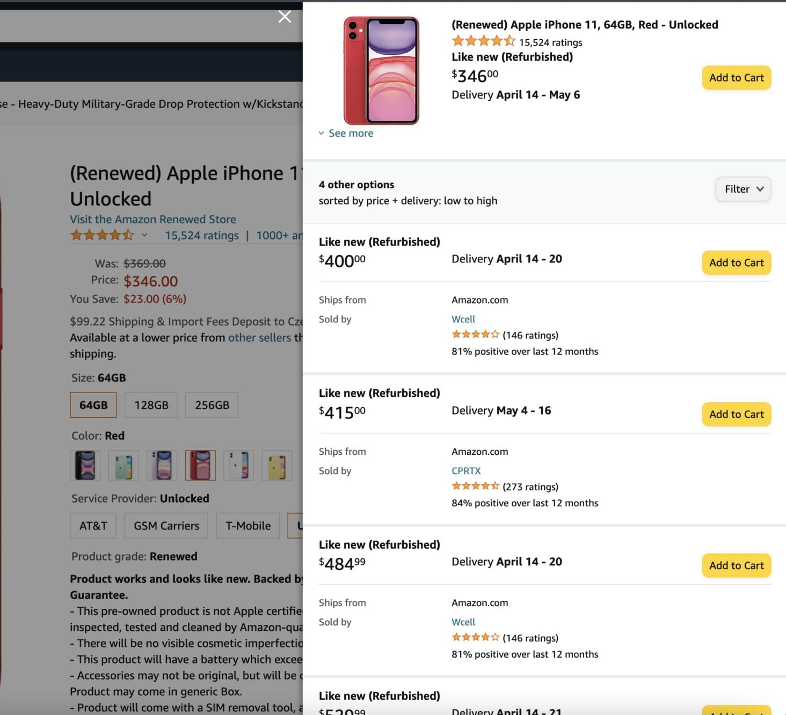

# Challenge

**Test your knowledge acquired in the previous sections of this course by building an Amazon scraper using Crawlee's CheerioCrawler!**

---

Before moving onto the other courses in the academy, we recommend following along with this section, as it combines everything you've learned in the previous lessons into one cohesive project that helps you prove to yourself that you've thoroughly understood the material.

We recommend that you make sure you've gone through both the [data extraction](../data_extraction/index.md) and [crawling](../crawling/index.md) sections of this course to ensure the smoothest development process.

## Learning 🧠 {#learning}

Before continuing, it is highly recommended to do the following:

- Look over [how to build a crawler in Crawlee](https://crawlee.dev/docs/introduction/first-crawler) and ideally **code along**.
- Read [this short article](https://help.apify.com/en/articles/1829103-request-labels-and-how-to-pass-data-to-other-requests) about [**request labels**](https://crawlee.dev/api/core/class/Request#label) (this will be extremely useful later on).
- Check out [this tutorial](../../../tutorials/node_js/dealing_with_dynamic_pages.md) about dynamic pages.
- Read about the [RequestQueue](https://crawlee.dev/api/core/class/RequestQueue).

## Our task {#our-task}

On Amazon, we can use this link to get to the results page of any product we want:

```text
https://www.amazon.com/s/ref=nb_sb_noss?url=search-alias%3Daps&field-keywords=KEYWORD
```

Our crawler's input will look like this:

```json
{
    "keyword": "iphone"
}
```

The goal at hand is to scrape all of the products from the first page of results for whatever keyword was provided (for our test case, it will be **iphone**), then to scrape each offer of each product, and push the results to the dataset. For context, the offers for a product look like this:



In the end, we'd like our final output to look something like this:

```json
[
    {
        "title": "Apple iPhone 6 a1549 16GB Space Gray Unlocked (Certified Refurbished)",
        "asin": "B07P6Y7954",
        "itemUrl": "https://www.amazon.com/Apple-iPhone-Unlocked-Certified-Refurbished/dp/B00YD547Q6/ref=sr_1_2?s=wireless&ie=UTF8&qid=1539772626&sr=1-2&keywords=iphone",
        "description": "What's in the box: Certified Refurbished iPhone 6 Space Gray 16GB Unlocked , USB Cable/Adapter. Comes in a Generic Box with a 1 Year Limited Warranty.",
        "keyword": "iphone",
        "seller name": "Blutek Intl",
        "offer": "$162.97"
    },
    {
        "title": "Apple iPhone 6 a1549 16GB Space Gray Unlocked (Certified Refurbished)",
        "asin": "B07P6Y7954",
        "itemUrl": "https://www.amazon.com/Apple-iPhone-Unlocked-Certified-Refurbished/dp/B00YD547Q6/ref=sr_1_2?s=wireless&ie=UTF8&qid=1539772626&sr=1-2&keywords=iphone",
        "description": "What's in the box: Certified Refurbished iPhone 6 Space Gray 16GB Unlocked , USB Cable/Adapter. Comes in a Generic Box with a 1 Year Limited Warranty.",
        "keyword": "iphone",
        "sellerName": "PLATINUM DEALS",
        "offer": "$169.98"
    },
    {
        "...": "..."
    }
]

```

> The `asin` is the ID of the product, which is data present on the Amazon website.

Each of the items in the dataset will represent a scraped offer, and will have the same `title`, `asin`, `itemUrl`, and `description`. The offer-specific fields will be `sellerName` and `offer`.

<!-- After the scrape has completed, we'll programmatically call a [public actor which sends emails](https://apify.com/apify/send-mail) to send ourselves an email with a publicly viewable link to the actor's final dataset. -->

## First up {#next}

From this course, you should have all the knowledge to build this scraper by yourself. Give it a try, then come back to compare your scraper with our solution.

Let's start off this section easy by [initializing and setting up](./initializing_and_setting_up.md) our project with the Crawlee CLI (don't worry, no additional install is required).
