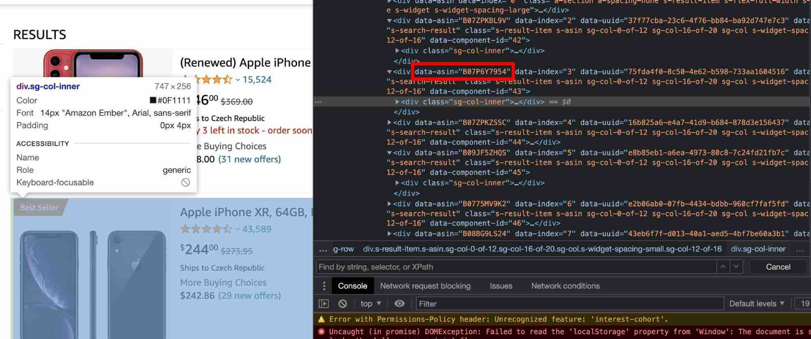

# Modularity

**Before you build your first web scraper with Crawlee, it is important to understand the concept of modularity in programming.**

---

Now that we've gotten our first request going, the first challenge is going to be selecting all of the resulting products on the page. Back in the browser, we'll use the DevTools hover tool to inspect a product.



**Bingo!** Each product seems to have a `data-asin` attribute, which includes the ASIN (product ID) data we want. Now, we can select each of these elements with this selector: `div > div[data-asin]:not([data-asin=""])`. Then, we'll scrape some data about each product, and push a request to the main product page so we can grab hold of the description.

But, before we start scraping, let's pause to talk a bit about the important concept of **modularity**. You may have noticed the **src** folder inside of your project, which by default has a **routes.js** file in it. We're going to use this to create modularized functions which can then be conditionally executed by our crawler.

```js
// routes.js
import { createCheerioRouter } from 'crawlee';
import { BASE_URL } from './constants.js';

export const router = createCheerioRouter();

router.addDefaultHandler(({ log }) => {
    log.info('Route reached.');
});

// Add a handler to our router to handle requests with the 'START' label
router.addHandler('START', async ({ $, crawler, request }) => {
    const { keyword } = request.userData;

    const products = $('div > div[data-asin]:not([data-asin=""])');

    // loop through the resulting products
    for (const product of products) {
        const element = $(product);
        const titleElement = $(element.find('.a-text-normal[href]'));

        const url = `${BASE_URL}${titleElement.attr('href')}`;

        // scrape some data from each and to a request
        // to the crawler for its page
        await crawler.addRequests([{
            url,
            label: 'PRODUCT',
            userData: {
                // Pass the scraped data about the product to the next
                // request so that it can be used there
                data: {
                    title: titleElement.first().text().trim(),
                    asin: element.attr('data-asin'),
                    itemUrl: url,
                    keyword,
                },
            },
        }]);
    }
});

router.addHandler('PRODUCT', ({ log }) => log.info('on a product page!'));
```

Also notice that we are importing `BASE_URL` from **constants.js**. Here is what that file looks like:

```js
// constants.js
export const BASE_URL = 'https://www.amazon.com';
```

And here is what our **main.js** file currently looks like:

```js
// main.js
import { CheerioCrawler, log } from 'crawlee';
import { router } from './routes.js';
import { BASE_URL } from './constants.js';

const { keyword = 'iphone' } = (await KeyValueStore.getInput()) ?? {};

const crawler = new CheerioCrawler({
    requestHandler: router,
});

await crawler.addRequests([
    {
        // Use BASE_URL here instead
        url: `${BASE_URL}/s/ref=nb_sb_noss?url=search-alias%3Daps&field-keywords=${keyword}`,
        label: 'START',
        userData: {
            keyword,
        },
    },
])

log.info('Starting the crawl.');
await crawler.run();
log.info('Crawl finished.');
```

One of the main reasons we **modularize** our code is to prevent massive and difficult to read files by separating concerns into separate files. In our **main.js** file, we're  handling the initialization, configuration, and running of our crawler. In **routes.js**, we determine how the crawler should handle different routes, and in **consts.js** we define non-changing values that will be used throughout the project.

Organized code makes everyone happy, including you - the one developing the scraper! Spaghetti is super awesome, [but not when it comes to programming](https://www.urbandictionary.com/define.php?term=spaghetti+code) 🍝

This can even be optimized further by putting our `label` items into **constants.js**, like so:

```js
// constants.js
export const BASE_URL = 'https://www.amazon.com';

export const labels = {
    START: 'START',
    PRODUCT: 'PRODUCT',
    OFFERS: 'OFFERS',
};
```

Then, the labels can be used by importing `labels` and accessing `labels.START`, `labels.PRODUCT`, or `labels.OFFERS`.

This is not necessary, but it is best practice, as it can prevent dumb typos that can cause nasty bugs 🐞 For the rest of this lesson, all of the examples using labels will be using the imported versions.

> If you haven't already read the **Best practices** lesson in the **Web scraping for beginners** course, please [give it a read](../best_practices.md).

## Next up {#next}

Now that we've gotten that out of the way, we can finally continue with our Amazon scraper. [Let's do it](./scraping_amazon.md)!
