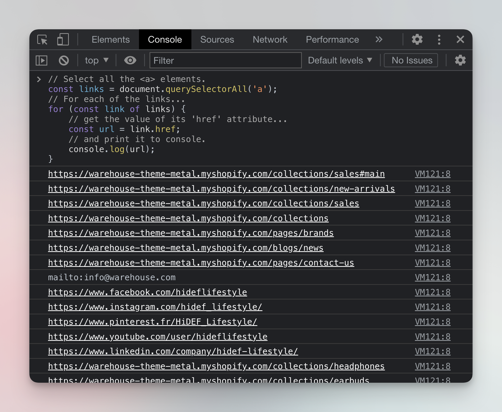

# Finding links {#finding-links}

**Learn what a link looks like in HTML and how to find and extract their URLs when web scraping using both DevTools and Node.js.**

---

There are many kinds of links on the internet, which we'll cover in the advanced Academy courses. For now, let's think of links as [HTML anchor elements](https://developer.mozilla.org/en-US/docs/Web/HTML/Element/a) with `<a>` tags. A typical link looks like this:

```HTML
<a href="https://example.com">This is a link to example.com</a>
```

On a webpage, the link above will look like this: [This is a link to example.com](https://example.com) When you click it, your browser will navigate to the URL in the `<a>` tag's `href` attribute (`https://example.com`).

> `href` means **H**ypertext **REF**erence. You don't need to remember this - just know that `href` typically means some sort of link.

## Extracting links 🔗 {#extracting-links}

So, if a link is just an HTML element, and the URL is just an attribute, this means that we can extract links exactly the same way as we extracted data.💡 Easy!

To test this theory in the browser, we can try running the following code in our DevTools console on any website.

```js
// Select all the <a> elements.
const links = document.querySelectorAll('a');
// For each of the links...
for (const link of links) {
    // get the value of its 'href' attribute...
    const url = link.href;
    // and print it to console.
    console.log(url);
}
```

Go to the [Warehouse store Sales category](https://warehouse-theme-metal.myshopify.com/collections/sales), open the DevTools Console, paste the above code and run it.



**_Boom_** 💥, all the links from the page have now been printed to the console. Most of the links point to other parts of the website, but some links lead to other domains like facebook.com or instagram.com.

## Extracting link URLs in Node.js {#Extracting-links-in-node}

DevTools Console is a fun playground, but Node.js is way more useful. Let's create a new file in our project called **crawler.js** and add some basic crawling code. We'll start with code that's very similar to the scraper we built in [Basics of data extraction](../data_extraction/node_js_scraper.md).

```js
// crawler.js
import { gotScraping } from 'got-scraping';
import cheerio from 'cheerio';

const storeUrl = 'https://warehouse-theme-metal.myshopify.com/collections/sales';

const response = await gotScraping(storeUrl);
const html = response.body;

const $ = cheerio.load(html);

// ------- new code below

const links = $('a');

for (const link of links) {
    const url = $(link).attr('href');
    console.log(url);
}
```

Aside from importing libraries and downloading HTML, we load the HTML into Cheerio and then use it to retrieve all the `<a>` elements. After that, we iterate over the collected links and print their `href` attributes, which we access using the [`.attr()`](https://cheerio.js.org/docs/api/classes/Cheerio#attr) method.

When you run the above code, you'll see quite a lot of links in the terminal. Some of them may look weird because they don't start with the regular **<https://>** protocol. We'll learn what to do with them next.

## Next Up {#next}

The [next lesson](./filtering_links.md) will teach you how to select and filter links, so that your crawler will always work only with valid and useful URLs.
