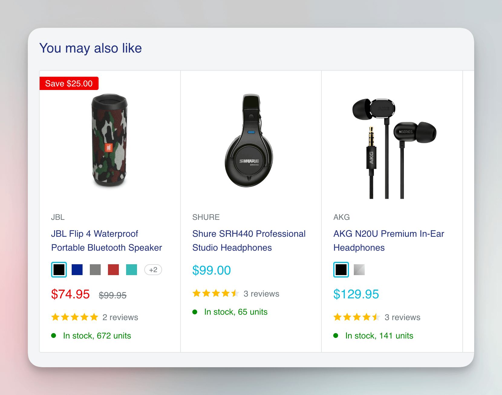

import Tabs from '@theme/Tabs';
import TabItem from '@theme/TabItem';

# Headless browsers {#headless-browser}

**Learn how to scrape the web with a headless browser using only a few lines of code. Chrome, Firefox, Safari, Edge - all are supported.**

---

A headless browser is simply a browser that runs without a user interface (UI). This means that it's normally controlled by automated scripts. Headless browsers are very popular in scraping because they can help you render JavaScript or programmatically behave like a human user to prevent blocking. The two most popular libraries for controlling headless browsers are [Puppeteer](https://pptr.dev/) and [Playwright](https://playwright.dev/). **Crawlee** supports both.

## Building a Playwright scraper {#playwright-scraper}

> We'll focus on Playwright today, as it was developed by the same team that created Puppeteer, and it's a more modern library with extra features and better documentation.

Building a Playwright scraper with Crawlee is extremely easy. To show you how easy it really is, we'll reuse the Cheerio scraper code from the previous lesson. By changing only a few lines of code, we'll turn it into a full headless scraper.

First, we must install Playwright into our project. It's not included in Crawlee, because it's quite large thanks to bundling all the browsers.

```shell
npm install playwright
```

After Playwright installs, we can proceed with updating the scraper code. Let's create a new file called `browser.js` and put the new code there. As always, the comments in the example describe changes in the code. Everything else is the same as before.

```js title=browser.js
// First, import PlaywrightCrawler instead of CheerioCrawler
import { PlaywrightCrawler, Dataset } from 'crawlee';

const crawler = new PlaywrightCrawler({
    // Second, tell the browser to run with visible UI,
    // so that we can see what's going on.
    headless: false,
    // Third, replace $ with parseWithCheerio function.
    requestHandler: async ({ parseWithCheerio, request, enqueueLinks }) => {
        console.log(`Fetching URL: ${request.url}`)

        if (request.label === 'start-url') {
            await enqueueLinks({
                selector: 'a.product-item__title',
            });
            return;
        }

        // Fourth, parse the browser's page with Cheerio.
        const $ = await parseWithCheerio();

        const title = $('h1').text().trim();
        const vendor = $('a.product-meta__vendor').text().trim();
        const price = $('span.price').contents()[2].nodeValue;
        const reviewCount = parseInt($('span.rating__caption').text());
        const description = $('div[class*="description"] div.rte').text().trim();

        await Dataset.pushData({
            title,
            vendor,
            price,
            reviewCount,
            description,
        });
    },
});

await crawler.addRequests([{
    url: 'https://warehouse-theme-metal.myshopify.com/collections/sales',
    label: 'start-url',
}]);

await crawler.run();
```

When you run the code with `node browser.js`, you'll see a browser window open and then the individual pages getting scraped, each in a new browser tab.

So, that's it. In 4 lines of code we transformed our crawler from a static HTTP crawler to a headless browser crawler. The crawler now runs exactly the same as before, but using a Chromium browser instead of plain HTTP requests. This simply is not possible without Crawlee.

Using Playwright in combination with Cheerio like this is only one of many ways how you can utilize Playwright (and Puppeteer) with Crawlee. In the advanced courses of the Academy, we will go deeper into using headless browsers for scraping and web automation (RPA) use cases.

## Running in headless mode {#running-headless}

We said that headless browsers didn't have a UI, but while scraping with the above scraper code, you could definitely see the browser. That's because we added the `headless: false` option. This is useful for debugging and seeing what's going on in the browser. Once your scraper is complete, you can remove the line and the crawler will run without a UI.

You can also switch between headless and headful (with UI) using the [`CRAWLEE_HEADLESS`](https://crawlee.dev/docs/guides/configuration#crawlee_headless) environment variable. This allows you to change the mode without touching your code.

<Tabs groupId="main">
<TabItem value="MacOS/Linux" label="MacOS/Linux">

```shell
CRAWLEE_HEADLESS=1 node browser.js
```

</TabItem>
<TabItem value="Windows CMD" label="Windows CMD">

```shell
set CRAWLEE_HEADLESS=1 && node browser.js
```

</TabItem>
<TabItem value="Windows Powershell" label="Windows Powershell">

```shell
$env:CRAWLEE_HEADLESS=1; & node browser.js
```

</TabItem>
</Tabs>

## Dynamically loaded data {#dynamic-data}

One of the important benefits of using a browser is that it allows you to easily extract data that's dynamically loaded, such as data that's only fetched after a user scrolls or interacts with the page. In our case, it's the "**You may also like**" section of the product detail pages. Those products aren't available in the initial HTML, but the browser loads them later using an API.



:::tip

We discuss dynamic data at length in the [How to scrape dynamic pages](../../../tutorials/node_js/dealing_with_dynamic_pages.md) tutorial, and we also have a special lesson dedicated to it in our [Puppeteer & Playwright course](../../puppeteer_playwright/page/waiting.md).

:::

If we added an appropriate selector to our original `CheerioCrawler` code, it would not extract the information, but browser automatically fetches and renders this extra data.

Let's add this new extractor to our code. It collects the names of the recommended products.

```js title=browser.js
// ...
const recommendedProducts = $('.product-recommendations a.product-item__title')
    .map((i, el) => $(el).text().trim())
    .toArray();
// ...
await Dataset.pushData({
    // ...
    recommendedProducts,
});
```

And here's the complete, runnable code:

```js title=browser.js
import { PlaywrightCrawler, Dataset } from 'crawlee';

const crawler = new PlaywrightCrawler({
    // We removed the headless: false option to hide the browser windows.
    requestHandler: async ({ parseWithCheerio, request, enqueueLinks }) => {
        console.log(`Fetching URL: ${request.url}`)

        if (request.label === 'start-url') {
            await enqueueLinks({
                selector: 'a.product-item__title',
            });
            return;
        }

        // Fourth, parse the browser's page with Cheerio.
        const $ = await parseWithCheerio();

        const title = $('h1').text().trim();
        const vendor = $('a.product-meta__vendor').text().trim();
        const price = $('span.price').contents()[2].nodeValue;
        const reviewCount = parseInt($('span.rating__caption').text());
        const description = $('div[class*="description"] div.rte').text().trim();
        // We added one more extractor to get all the recommended products.
        const recommendedProducts = $('.product-recommendations a.product-item__title')
            .map((i, el) => $(el).text().trim())
            .toArray();

        await Dataset.pushData({
            title,
            vendor,
            price,
            reviewCount,
            description,
            // And we saved the extracted product names.
            recommendedProducts,
        });
    },
});

await crawler.addRequests([{
    url: 'https://warehouse-theme-metal.myshopify.com/collections/sales',
    label: 'start-url',
}]);

await crawler.run();
```

When you run the code, you'll find the recommended product names correctly extracted in the dataset files. If you tried the same with our earlier `CheerioCrawler` code, you would find the `recommendedProducts` array empty in your results. That's because Cheerio can't make the API call to retrieve the additional data, like a browser can.

## Next up {#next}

We learned how to scrape with Cheerio and Playwright, but how do we export the data for further processing? Let's learn that in the [next and final lesson](./exporting_data.md) of the Basics of crawling section.
