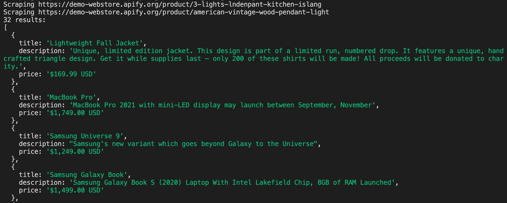

# Scraping data {#scraping-data}

**Learn how to add data extraction logic to your crawler, which will allow you to extract data from all the websites you crawled.**

---

At the [very beginning of the course](../index.md), we learned that the term web scraping usually means a combined process of data extraction and crawling. And this is exactly what we'll do in this lesson. We will take the code we built in the previous lesson and in the [Basics of data collection](../data_extraction/node_continued.md) section, and we will combine that into a web scraper.

## Quick review of earlier's code {#review-code}

Here's a quick reminder of earlier's data extraction code:

```js
// main.js
import { gotScraping } from 'got-scraping';
import cheerio from 'cheerio';

const response = await gotScraping('https://demo-webstore.apify.org/search/on-sale');
const html = response.body;

const $ = cheerio.load(html);
const products = $('a[href*="/product/"]');

const results = [];

for (const product of products) {
    const element = $(product);

    const title = element.find('h3').text();
    const price = element.find('div[class*="price"]').text();

    results.push({
        title,
        price,
    });
}

console.log(results);
```

For comparison, here's a refresher of the crawling code we just wrote in the last lesson:

```js
// crawler.js
import { gotScraping } from 'got-scraping';
import cheerio from 'cheerio';

const WEBSITE_URL = 'https://demo-webstore.apify.org/';

const response = await gotScraping('https://demo-webstore.apify.org/');
const html = response.body;
const $ = cheerio.load(html);

const productLinks = $('a[href*="/product/"]');

const productsToScrape = [];
for (const link of productLinks) {
    const relativeUrl = $(link).attr('href');
    const absoluteUrl = new URL(relativeUrl, WEBSITE_URL);
    productsToScrape.push(absoluteUrl.href);
}

for (const link of productsToScrape) {
    try {
        const productResponse = await gotScraping(link);
        const productHTML = productResponse.body;
        const $$ = cheerio.load(productHTML);
        const productPageTitle = $$('h3').text();
        console.log(productPageTitle);
    } catch (error) {
        console.error(error.message, link)
    }
}
```

We can see that the code is extremely similar. Both scripts download HTML and then process the HTML. To get an idea how to put them together, we'll go back to the [original process of crawling](./index.md).

1. Visit the start URL.
2. Extract next URLs (and data) and save them.
3. Visit one of the collected URLs and save data and/or more URLs.
4. Repeat step 3 until you have everything you needed.

Using this flow as guidance, we should be able to connect the pieces of code together to build a scraper which crawls through the products found on the on-sale page of Fakestore, then scrapes the title, description, and price of each of them.

> We will be using slightly new code to write the new scraper, but the flow and logic will be the same as the two code snippets above. First, we'll visit the on-sale products page, scrape each product's link, then download each product page's HTML and finally scrape the data from each product.

## Building the scraper {#building-scraper}

Let's create a brand new file called **final.js** and write our scraper there. Then, we'll put our imports at the top of the file:

```js
// final.js
import { gotScraping } from 'got-scraping';
import cheerio from 'cheerio';
```

First, we need to **visit the start URL**. To scrape all the on-sale product links, we need the on-sale page as the start URL.

```js
const BASE_URL = 'https://demo-webstore.apify.org';

const response = await gotScraping(`${BASE_URL}/search/on-sale`);
const $ = cheerio.load(response.body);
```

Next, we need to **collect the next URLs** we want to visit (the product URLs). So far, the code is nearly exactly the same as the **crawler.js** code.

```js
const BASE_URL = 'https://demo-webstore.apify.org';

const response = await gotScraping(`${BASE_URL}/search/on-sale`);
const $ = cheerio.load(response.body);

const productLinks = [];

for (const product of $('a[href*="product"]')) {
    const relative = $(product).attr('href');
    const url = new URL(relative, BASE_URL);
    productLinks.push(url);
}
```

Now, the code starts to differ. We will use the crawling logic from earlier to visit all the URLs, but we will replace the placeholder extraction logic we had there. The placeholder logic only read the products's title, but we want the title, description, and price as well.

```js
// ...

// A new array to save each product in
const results = [];

// An optional array we can push to when we hit an error
const errors = [];

for (const url of productLinks) {
    try {
        // we download HTML of each country page.
        const productResponse = await gotScraping(url);
        const $$ = cheerio.load(productResponse.body);

        // And this is where we use data extraction logic.
        // Don't forget to update $ to $$, or you'll get errors.
        const title = $$('h3').text().trim();
        const price = $$('h3 + div').text().trim();
        const description = $$('div[class*="Text_body"]').text().trim();

        results.push({
            title,
            description,
            price,
        });
    } catch (error) {
        // Push information about the error to the
        // "errors" array so we can check it later
        errors.push({
            url,
            err: error.message,
        });
    }
}
```

Aside from the [`element + element`](https://www.w3schools.com/cssref/sel_element_pluss.asp) selector we used to grab each product's price, there's no new logic here. You already know everything from the previous lessons. When we put it all together, we arrive at the final scraper code. It's always a good idea to add some in-progress logging to a scraper to be able to monitor how it's working. Let's add some now:

```js
import { gotScraping } from 'got-scraping';
import cheerio from 'cheerio';

const BASE_URL = 'https://demo-webstore.apify.org';

const startURL = `${BASE_URL}/search/on-sale`;

console.log(`Going to ${startURL}`);
const response = await gotScraping(startURL);
const $ = cheerio.load(response.body);

const productLinks = [];

for (const product of $('a[href*="product"]')) {
    const relative = $(product).attr('href');
    const url = new URL(relative, BASE_URL);
    productLinks.push(url);
}

console.log(`Collected ${productLinks.length} product URLs`);

const results = [];

const errors = [];

for (const url of productLinks) {
    try {
        console.log(`Scraping ${url}`);
        const productResponse = await gotScraping(url);
        const $$ = cheerio.load(productResponse.body);

        const title = $$('h3').text().trim();
        const price = $$('h3 + div').text().trim();
        const description = $$('div[class*="Text_body"]').text().trim();

        results.push({
            title,
            description,
            price,
        });
    } catch (error) {
        console.error(`Failed on ${url}: ${error.message}`);
        errors.push({
            url,
            err: error.message,
        });
    }
}

console.log(`${results.length} results:`);
console.log(results);
```

At the time of writing, we were getting 32 product results. Our demo site is bound to change, so you might receive different results; however, your results printed in terminal should look similar to the ones here:



## Next up {#next}

And that's it for the basics of crawling. But don't leave just yet. As promised, in the [next lesson](./pro_scraping.md) we will rewrite the scraper using a proper scraping library. It will make development much faster and the scraper more robust.
