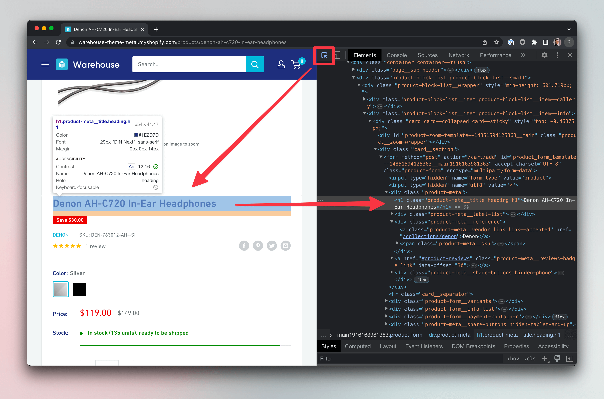

# Scraping data {#scraping-data}

**Learn how to add data extraction logic to your crawler, which will allow you to extract data from all the websites you crawled.**

---

At the [very beginning of this course](../index.md), we learned that the term web scraping usually means a combined process of data extraction and crawling. And this is exactly what we'll do in this lesson. We will take the crawling code from the previous lesson, and we will combine it with data extraction code and turn everything into a web scraper.

## Extracting data from a product detail page {#extracting-data}

The term product detail page (or PDP) is commonly used on e-commerce websites to describe the page where you can find detailed information about a product. In the Warehouse store, it's, for example, [this page describing Denon headphones](https://warehouse-theme-metal.myshopify.com/products/denon-ah-c720-in-ear-headphones).

Let's start writing a script that extracts data from this single PDP. We can use this familiar code as boilerplate.

```js
// product.js
import { gotScraping } from 'got-scraping';
import cheerio from 'cheerio';

const productUrl = 'https://warehouse-theme-metal.myshopify.com/products/denon-ah-c720-in-ear-headphones';
const response = await gotScraping(productUrl);
const html = response.body;

const $ = cheerio.load(html);

// Attribute extraction code will go here.
```

We will use the techniques learned in the [Basics of data extraction](../data_extraction/index.md) section to find and extract the following product attributes:

- title
- vendor
- price
- number of reviews
- description



> For brevity, we won't explain how to extract every attribute step-by-step. Review the [Basics of data extraction](../data_extraction/index.md) section to learn about DevTools and extracting data.

### Title

Getting the title is quite straightforward. We recommend using `h1` for titles where available, because it's the semantically correct way and therefore unlikely to change.

```js
const title = $('h1').text().trim();
```

### Vendor

Vendor name is available as a link with the `product-meta__vendor` class. We're only interested in the text though.

```js
const vendor = $('a.product-meta__vendor').text().trim();
```

### Price

We will take a shortcut here and only extract the price as a string that includes currency. In production scrapers, you might want to split it into two fields.

```js
const price = $('span.price').contents()[2].nodeValue;
```

### Number of reviews

For the review count, we use the `parseInt()` function to get only the number. Otherwise, we would receive a string like **2 reviews** from this element.

```js
const reviewCount = parseInt($('span.rating__caption').text());
```

### Description

Getting the description is fairly straightforward as well, but notice the two selectors separated by a space: `div[class*="description"]` `div.rte`. This is called a [descendant combinator](https://developer.mozilla.org/en-US/docs/Web/CSS/Descendant_combinator), and it allows you to search for child elements within parent elements. Using any of the selectors separately would lead to unwanted strings in our result.

```js
const description = $('div[class*="description"] div.rte').text().trim();
```

### Complete extraction code

This is the final code after putting all the extractors together with the initial boilerplate. It will scrape all the requested attributes from the single URL and print them to the terminal.

Save it into a new file called `product.js` and run it with `node product.js` to see for yourself.

```js
// product.js
import { gotScraping } from 'got-scraping';
import * as cheerio from 'cheerio';

const productUrl = 'https://warehouse-theme-metal.myshopify.com/products/denon-ah-c720-in-ear-headphones';
const response = await gotScraping(productUrl);
const html = response.body;

const $ = cheerio.load(html);

const title = $('h1').text().trim();
const vendor = $('a.product-meta__vendor').text().trim();
const price = $('span.price').contents()[2].nodeValue;
const reviewCount = parseInt($('span.rating__caption').text());
const description = $('div[class*="description"] div.rte').text().trim();

const product = {
    title,
    vendor,
    price,
    reviewCount,
    description
}

console.log(product)
```

## Crawling product detail pages {#crawling}

Let's compare the above data extraction example with the crawling code we wrote in the last lesson:

```js
// crawler.js
import { gotScraping } from 'got-scraping';
import cheerio from 'cheerio';

const WEBSITE_URL = 'https://warehouse-theme-metal.myshopify.com';
const storeUrl = `${WEBSITE_URL}/collections/sales`;

const response = await gotScraping(storeUrl);
const html = response.body;

const $ = cheerio.load(html);
const productLinks = $('a.product-item__title');

const productUrls = [];
for (const link of productLinks) {
    const relativeUrl = $(link).attr('href');
    const absoluteUrl = new URL(relativeUrl, WEBSITE_URL)
    productUrls.push(absoluteUrl);
}

for (const url of productUrls) {
    try {
        const productResponse = await gotScraping(url);
        const productHtml = productResponse.body;
        const $productPage = cheerio.load(productHtml);
        const productPageTitle = $productPage('h1').text().trim();
        console.log(productPageTitle);
    } catch (error) {
        console.error(error.message, url)
    }
}
```

We can see that the code is quite similar. Both scripts download HTML and then process the HTML. To understand how to put them together, we'll go back to the [original process of crawling](./index.md).

1. Visit the start URL.
2. Extract next URLs (and data) and save them.
3. Visit one of the collected URLs and save data and/or more URLs.
4. Repeat step 3 until you have everything you need.

Using this flow as guidance, we should be able to connect the pieces of code together to build a scraper which crawls through the products found in the [Sales category of Warehouse](https://warehouse-theme-metal.myshopify.com/collections/sales), and then scrapes the **title**, **vendor**, **price**, **review count**, and **description** of each of them.

## Building the final scraper {#building-scraper}

Let's create a brand-new file called **final.js** and write our scraper code there. We'll show the code step by step for easier orientation. At the end, we'll combine the pieces into a runnable example.

We'll start by adding our imports and constants at the top of the file, no changes there.

```js
// final.js
import { gotScraping } from 'got-scraping';
import cheerio from 'cheerio';

const WEBSITE_URL = 'https://warehouse-theme-metal.myshopify.com';
```

Then we need to **visit the start URL**. To scrape all the on-sale product links, we need the Sales page as the start URL.

```js
// ...
const storeUrl = `${WEBSITE_URL}/collections/sales`;

const response = await gotScraping(storeUrl);
const html = response.body;
```

After that, we need to **extract the next URLs** we want to visit (the product detail page URLs). So far, the code is exactly the same as the **crawler.js** code.

```js
// ...
const $ = cheerio.load(html);
const productLinks = $('a.product-item__title');

const productUrls = [];
for (const link of productLinks) {
    const relativeUrl = $(link).attr('href');
    const absoluteUrl = new URL(relativeUrl, WEBSITE_URL)
    productUrls.push(absoluteUrl);
}
```

Now the code will start to differ. We will use the crawling logic from earlier to visit all the URLs, but we will replace the placeholder extraction logic we had there. The placeholder logic only extracted the product's title, but we want the vendor, price, number of reviews and description as well.

```js
// ...

// A new array to save each product in.
const results = [];

// An optional array we can save errors to.
const errors = [];

for (const url of productUrls) {
    try {
        // Download HTML of each product detail.
        const productResponse = await gotScraping(url);
        const $productPage = cheerio.load(productResponse.body);

        // Use the data extraction logic from above.
        // If copy pasting, be careful about $ -> $productPage.
        const title = $productPage('h1').text().trim();
        const vendor = $productPage('a.product-meta__vendor').text().trim();
        const price = $productPage('span.price').contents()[2].nodeValue;
        const reviewCount = parseInt($productPage('span.rating__caption').text());
        const description = $productPage('div[class*="description"] div.rte').text().trim();

        results.push({
            title,
            vendor,
            price,
            reviewCount,
            description,
        });
    } catch (error) {
        // Save information about the error to the
        // "errors" array to see what's happened.
        errors.push({ url, msg: error.message });
    }
}
```

Finally, let's combine the above code blocks into a full runnable example. When you run the below code, it will scrape detailed information about all the products on the first page of the [Warehouse Sales category](https://warehouse-theme-metal.myshopify.com/collections/sales). We added a few console logs throughout the code to see what's going on.

```js
// final.js
import { gotScraping } from 'got-scraping';
import * as cheerio from 'cheerio';

const WEBSITE_URL = 'https://warehouse-theme-metal.myshopify.com';
const storeUrl = `${WEBSITE_URL}/collections/sales`;

console.log('Fetching products on sale.');
const response = await gotScraping(storeUrl);
const html = response.body;

const $ = cheerio.load(html);
const productLinks = $('a.product-item__title');

const productUrls = [];
for (const link of productLinks) {
    const relativeUrl = $(link).attr('href');
    const absoluteUrl = new URL(relativeUrl, WEBSITE_URL)
    productUrls.push(absoluteUrl);
}

console.log(`Found ${productUrls.length} products.`);

const results = [];
const errors = [];

for (const url of productUrls) {
    try {
        console.log(`Fetching URL: ${url}`)
        const productResponse = await gotScraping(url);
        const $productPage = cheerio.load(productResponse.body);

        const title = $productPage('h1').text().trim();
        const vendor = $productPage('a.product-meta__vendor').text().trim();
        const price = $productPage('span.price').contents()[2].nodeValue;
        const reviewCount = parseInt($productPage('span.rating__caption').text());
        const description = $productPage('div[class*="description"] div.rte').text().trim();

        results.push({
            title,
            vendor,
            price,
            reviewCount,
            description,
        });
    } catch (error) {
        errors.push({ url, msg: error.message });
    }
}

console.log('RESULTS:', results);
console.log('ERRORS:', errors);
```

And here's an example of the results you will see after running the above code. We truncated the descriptions for readability. There should be 24 products in your list.

```js
[
  {
    title: 'JBL Flip 4 Waterproof Portable Bluetooth Speaker',
    vendor: 'JBL',
    price: '$74.95',
    reviewCount: 2,
    description: 'JBL Flip 4 is the next generation in the ...'
  },
  {
    title: 'Sony XBR-950G BRAVIA 4K HDR Ultra HD TV',
    vendor: 'Sony',
    price: '$1,398.00',
    reviewCount: 3,
    description: 'Unlock the world of ultimate colors and ...'
  },
  {
    title: 'Sony SACS9 10" Active Subwoofer',
    vendor: 'Sony',
    price: '$158.00',
    reviewCount: 3,
    description: 'Put more punch in your movie ...'
  }
]
```

That's it for the absolute basics of crawling, but we're not done yet. We scraped 24 products from the first page of the Sales category, but the category actually has 50 products on 3 pages. You will learn how to visit all the pages and scrape all the products in the following lessons.

## Next up {#next}

In the [next lesson](./pro_scraping.md) we will rewrite the scraper using an open-source web scraping library called [Crawlee](https://crawlee.dev). It will make the scraper more robust while speeding up development at the same time.
