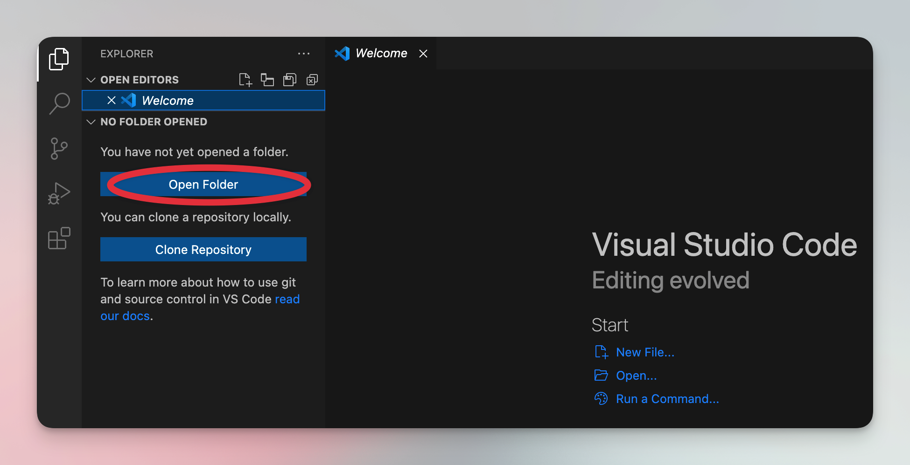
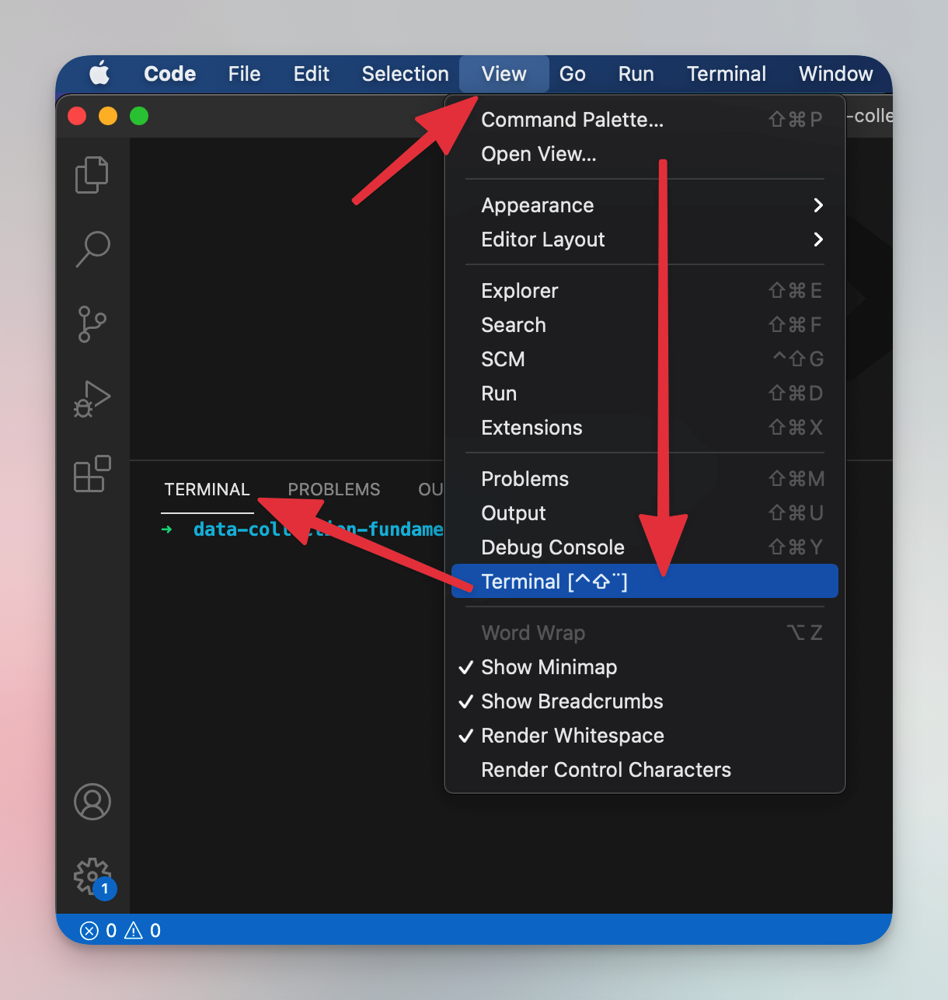
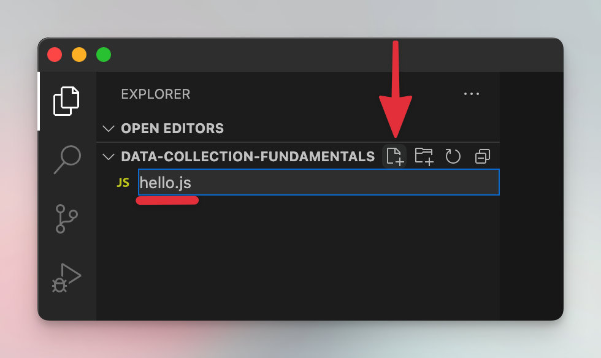
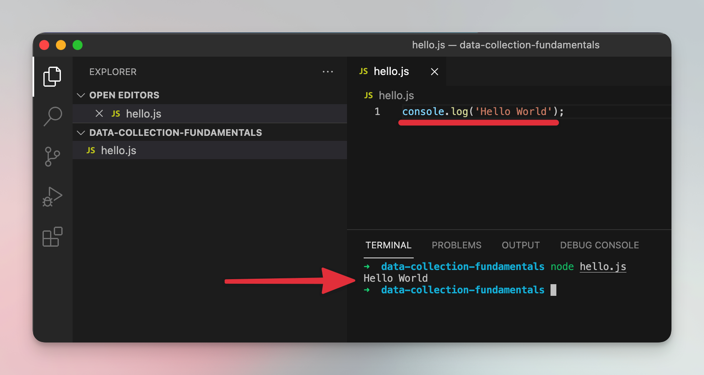

# Prepare your computer for programming {#prepare-computer}

**Set up your computer to be able to code scrapers with Node.js and JavaScript. Download Node.js and NPM and run a Hello World script.**

---

Before you can start writing scraper code, you need to have your computer set up for it. In this lesson, we will show you all the tools you need to install to successfully write your first scraper.

## Install Node.js {#install-node}

Let's start with installation of Node.js. Node.js is an engine for running JavaScript, quite similar to the browser console we used in the previous lessons. You feed it JavaScript code, and it executes it for you. Why not just use the browser console? Simply put, because it's limited in its capabilities. Node.js is way more powerful and is much better suited for coding scrapers.

If you're on macOS, use [this tutorial to install Node.js](https://blog.apify.com/how-to-install-nodejs/). If you're using Windows [visit the official Node.js website](https://nodejs.org/en/download/). And if you're on Linux, just use your package manager to install `nodejs`.

## Install a text editor {#install-an-editor}

There are many text editors you can choose from for programming. You might already have a preferred one so feel free to use that. Just make sure it has syntax highlighting and support for Node.js. If you don't have any text editor, we suggest starting with VSCode. It's free, very popular, and well maintained. [Download it here](https://code.visualstudio.com/download).

Once you downloaded and installed it, you can open a folder where we will build your scraper. We recommend starting with a new, empty folder.



## Hello world! 👋 {#hello-world}

Before we start, let's confirm that Node.js was successfully installed on your computer. To do that, run those two commands in your terminal and see if they correctly print your Node.js and NPM versions. The next lessons **require Node.js version 16 or higher**. If you skipped Node.js installation and want to use your existing version of Node.js, **make sure that it's 16 or higher**.

```shell
node -v
npm -v
```

If you installed VSCode in the previous paragraph, you can use the integrated terminal.



> If you're still wondering what a "terminal" is, we suggest googling for a terminal tutorial for your operating system because individual terminals are different. Sometimes a little, sometimes a lot.

After confirming that `node` is correctly installed on your computer, use your text editor to create a file called **hello.js** in your folder.



Now add this piece of code to **hello.js** and save the file.

```js
console.log('Hello World');
```

Finally, run the below command in your terminal:

```shell
node hello.js
```

You should see **Hello World** printed in your terminal. If you do, congratulations, you are now officially a programmer! 🚀



## Next up {#next}

You have your computer set up correctly for development, and you've run your first script. Great! In the [next lesson](./project_setup.md) we'll set up your project to download a website's HTML using Node.js instead of a browser.
