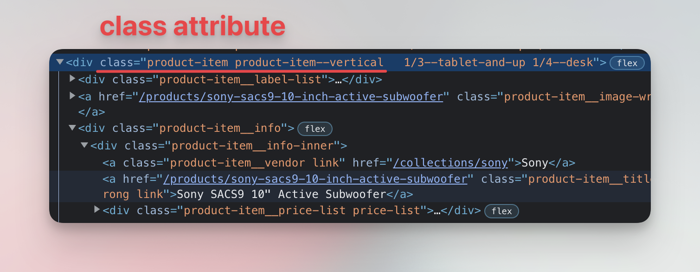
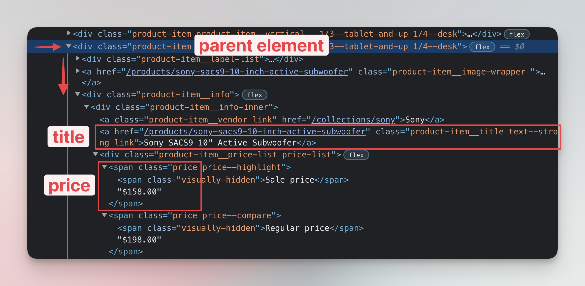

# Finish Node.js scraper {#finish-scraper}

**Continue learning how to create a web scraper with Node.js and Cheerio. Learn how to parse HTML and print the results of the data your scraper has collected.**

---

In the first part of the Node.js tutorial we downloaded the HTML of our [Warehouse store](https://warehouse-theme-metal.myshopify.com/collections/sales) and parsed it with Cheerio. Now, we will replicate the extraction logic from the [Extracting Data with DevTools](./using_devtools.md) lessons and finish our scraper.

## Querying data with Cheerio {#querying-with-cheerio}

As a reminder, the data we need for each product on the page is available in the elements that have the `product-item` class attribute.



To get all the elements with that class using Cheerio, we call the `$` function with the appropriate CSS selector. Same as we would with the `document.querySelectorAll()` function.

```js
// In browser DevTools Console
const products = document.querySelectorAll('.product-item');

// In Node.js with Cheerio
const products = $('.product-item');
```

We will use the same approach as in the previous DevTools lessons. Using a `for..of` loop we will iterate over the list of products we saved in the `products` variable. The code is a little different from DevTools, because we're using Node.js and Cheerio instead of a browser's native DOM manipulation functions, but the principle is exactly the same.

Replace the code in your **main.js** with the following, and run it with `node main.js` in your terminal.

```js
// main.js
import { gotScraping } from 'got-scraping';
import cheerio from 'cheerio';

const storeUrl = 'https://warehouse-theme-metal.myshopify.com/collections/sales';

// Download HTML with Got Scraping
const response = await gotScraping(storeUrl);
const html = response.body;

// Parse HTML with Cheerio
const $ = cheerio.load(html);

// Find all products on the page
const products = $('.product-item');

// Loop through all the products
// and print their text to terminal
for (const product of products) {
    const productElement = $(product);
    const productText = productElement.text();

    console.log(productText);
}
```

After you run this script, you will see data of all the 24 products printed in your terminal. The output will be messy, but that's ok. Next, we will clean it.

## Extracting product data {#extracting-data}

To clean the output, we need to repeat the process from the DevTools lessons and add individual data point extraction to the loop. From those lessons, we know that each of our product cards includes an `<a class="product-item__title ...">` element which holds the product's title, and a `<span class="price ...">` element which includes the product's price.



We will loop over all the `products` and extract the data points from each of them using the `for..of` loop. For reference, this a part of the code from the DevTools lesson, where we collected the data using the browser **DevTools Console**:

```js
// This code will only work in the browser, and NOT in Node.js
const results = [];

for (const product of products) {
    const titleElement = product.querySelector('a.product-item__title');
    const title = titleElement.textContent.trim();

    const priceElement = subwoofer.querySelector('span.price');
    const price = priceElement.childNodes[2].nodeValue.trim();

    results.push({ title, price });
}
```

And this snippet shows the same piece of code when using **Node.js and Cheerio**:

```js
const results = [];

for (const product of products) {
    const titleElement = $(product).find('a.product-item__title');
    const title = titleElement.text().trim();

    const priceElement = $(product).find('span.price');
    const price = priceElement.contents()[2].nodeValue.trim();

    results.push({ title, price });
}
```

The main difference is that we used the [`.find()`](https://cheerio.js.org/classes/Cheerio.html#find) function to select the title and price elements and also the `.contents()` function instead of the `childNodes` attribute. If you find the differences confusing, don't worry about it. It will begin to feel very natural after a bit of practice.

The final scraper code looks like this. Replace the code in your **main.js** file with this code and run it using `node main.js` in your terminal.

```js
// main.js
import { gotScraping } from 'got-scraping';
import cheerio from 'cheerio';

const storeUrl = 'https://warehouse-theme-metal.myshopify.com/collections/sales';

// Download HTML with Got Scraping
const response = await gotScraping(storeUrl);
const html = response.body;

// Parse HTML with Cheerio
const $ = cheerio.load(html);

// Find all products on the page
const products = $('.product-item');

const results = [];
for (const product of products) {
    const titleElement = $(product).find('a.product-item__title');
    const title = titleElement.text().trim();

    const priceElement = $(product).find('span.price');
    const price = priceElement.contents()[2].nodeValue.trim();

    results.push({ title, price });
}

console.log(results);
```

After running the code, you will see this output in your terminal:

```json
[
  {
    title: 'JBL Flip 4 Waterproof Portable Bluetooth Speaker',
    price: '$74.95'
  },
  {
    title: 'Sony XBR-950G BRAVIA 4K HDR Ultra HD TV',
    price: 'From $1,398.00'
  },
  { title: 'Sony SACS9 10" Active Subwoofer', price: '$158.00' },
  { title: 'Sony PS-HX500 Hi-Res USB Turntable', price: '$398.00' },
  {
    title: 'Klipsch R-120SW Powerful Detailed Home Speaker - Unit',
    price: '$324.00'
  },

...
```

Congratulations! You completed the **Basics of data extraction** section of the Web scraping for beginners course. A quick recap of what you learned:

1. The basic terminology around web scraping, crawling, HTML, CSS and JavaScript.
2. How to use browser DevTools and Console to inspect web pages and manipulate them using CSS and JavaScript.
3. How to install Node.js and set up your computer for building scrapers.
4. How to download a website's HTML using Got Scraping and then parse it using Cheerio to extract valuable data.

Great job! 👏🎉

# Next up {#next}

What's next? While we were able to extract the data, it's not super useful to have it printed to the terminal. In the [next, bonus lesson](./save_to_csv.md), we will learn how to convert the data to a CSV and save it to a file.
