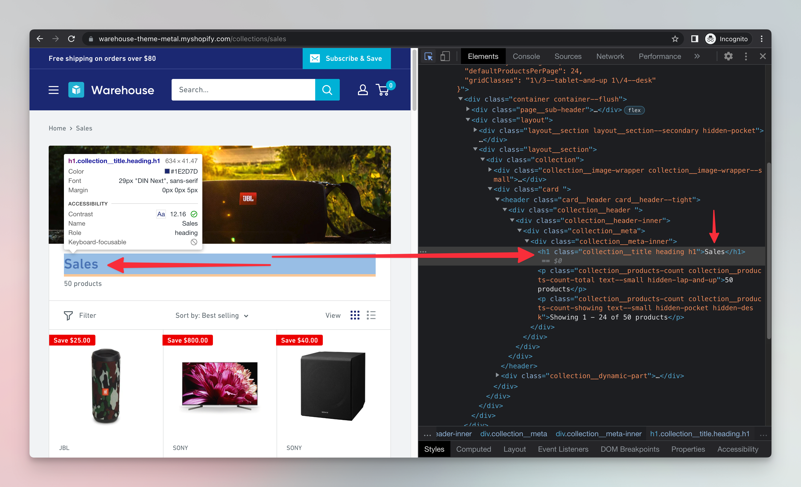

# First Node.js scraper {#first-scraper}

**Learn how to use JavaScript and Node.js to create a web scraper, plus take advantage of the cheerio and got-scraping libraries to make your job easier.**

---

Finally, we have everything ready to start scraping! Yes, the setup was a bit daunting, but luckily, you only have to do it once. We have our project, we have our **main.js** file, so let's add some code to it.

## Downloading HTML {#downloading-html}

We will use the `got-scraping` library to download the HTML of products that are [on sale in the Warehouse store](https://warehouse-theme-metal.myshopify.com/collections/sales). We already worked with this page earlier in the [Extracting Data with DevTools](./using_devtools.md) lessons.

Replace the contents of your **main.js** file with this code:

```js
// main.js
import { gotScraping } from 'got-scraping';

const storeUrl = 'https://warehouse-theme-metal.myshopify.com/collections/sales';

const response = await gotScraping(storeUrl);
const html = response.body;
console.log(html);
```

Now run the script using the `node main.js` command from previous lesson. After a brief moment, you should see the page's HTML printed to your terminal.

> `gotScraping` is an `async` function and the `await` keyword is used to pause execution of the script until it returns the `response`. [Learn more about `async` and `await`](https://javascript.info/async-await)

## Parsing HTML {#parsing-html}

Having the HTML printed to the terminal is not very helpful. To extract the data, we first have to parse it. Parsing the HTML allows us to query the individual HTML elements, similarly to the way we did it in browser in the [Extracting Data with DevTools](./using_devtools.md) lessons.

To parse the HTML with the `cheerio` library. Replace the code in your **main.js** with the following code:

```js
// main.js
import { gotScraping } from 'got-scraping';
import cheerio from 'cheerio';

const storeUrl = 'https://warehouse-theme-metal.myshopify.com/collections/sales';

// Download HTML with Got Scraping
const response = await gotScraping(storeUrl);
const html = response.body;

// Parse HTML with Cheerio
const $ = cheerio.load(html);
const headingElement = $('h1');
const headingText = headingElement.text();

// Print page title to terminal
console.log(headingText);
```

When you run the above script, **Sales** will be printed to the terminal. That's because it's the heading of the Sales page of the Warehouse Store which is located in a `h1` element.



Great, we successfully parsed the HTML and extracted the text of the `<h1>` element from it using Node.js and Cheerio. Let's break the code down.

The script first downloaded the page's HTML using the Got Scraping library. Then, it parsed the downloaded `html` with `cheerio` using the `load()` function, and allowed us to work with it using the `$` variable (the `$` name is an old convention). The next `$('h1')` function call looked inside the parsed HTML and found the `<h1>` element. Finally, the script extracted the text from the element using the `.text()` function and printed it to the terminal with `console.log()`.

> `$('h1')` is very similar to calling `document.querySelector('h1')` in the browser and `element.text()` is similar to `element.textContent` from the earlier DevTools lessons. [Visit the cheerio documentation](https://github.com/cheeriojs/cheerio#readme) to learn more about its syntax.

## Next up {#next}

In the [next lesson](./node_continued.md) we will learn more about Cheerio and use it to extract all the products' data from Fakestore.
