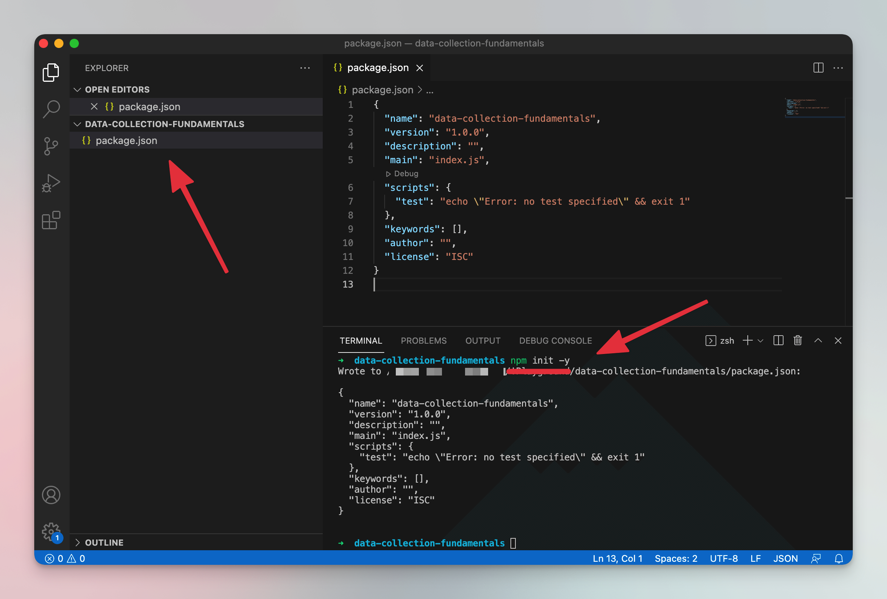
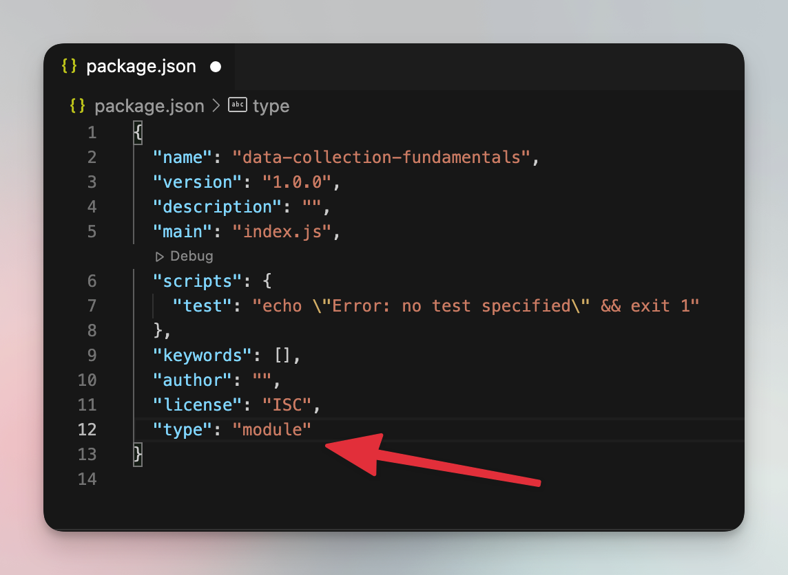
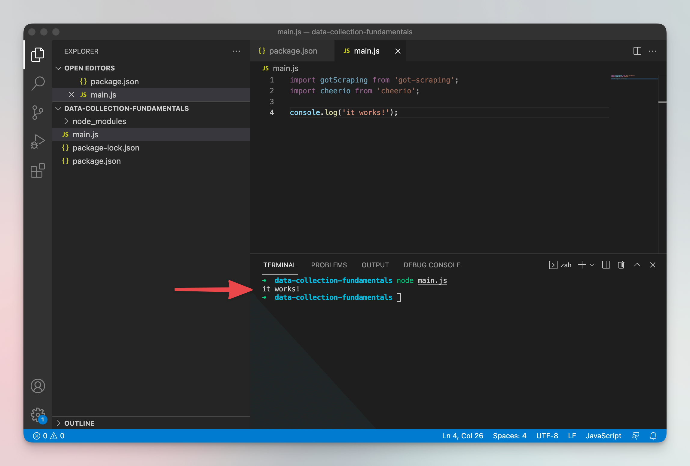

# Setting up your project {#setting-up}

**Create a new project with NPM and Node.js. Install necessary libraries, and test that everything works before starting the next lesson.**

---

When you open a website in a browser, the browser first downloads the page's HTML. To do the same thing with Node.js, we will install a program - an NPM module - to help us with it. NPM modules are installed using `npm`, which is another program, automatically installed with Node.js.

> [NPM](https://www.npmjs.com/) has a huge collection of open-source libraries for Node.js. You can (and you should) utilize it to save time and tap into the amazing open-source community around JavaScript and Node.js.

## Creating a new project with NPM {#creating-a-project}

Before we can install NPM modules, we need to create an NPM project. To do that, you can create a new directory or use the one that you already have open in VSCode (you can delete the **hello.js** file now) and from that directory run this command in your terminal:

```shell
npm init -y
```

It will set up an empty NPM project for you and create a file called **package.json**. This is a very important file in Node.js programming as it contains information about the project.



### Use modern JavaScript {#modern-javascript}

Node.js and NPM support two types of projects, let's call them legacy and modern. For backwards compatibility, the legacy version is used by default. To switch to the modern version, open your **package.json** and add this line to the end of the JSON object. Don't forget to add a comma to the end of the previous line 😉

```text
"type": "module"
```



> If you want to learn more about JSON and its syntax, we recommend [this tutorial on MDN](https://developer.mozilla.org/en-US/docs/Learn/JavaScript/Objects/JSON).

## Installing necessary libraries {#install-libraries}

Now that we have a project set up, we can install NPM modules into the project. Let's install libraries that will help us easily download and process websites' HTML. In the project directory, run the following command, which will install two libraries into your project. **got-scraping** and Cheerio.

```shell
npm install got-scraping cheerio
```

[**got-scraping**](https://github.com/apify/got-scraping) is a library that's made especially for scraping and downloading page's HTML. It's based on the very popular [**got** library](https://github.com/sindresorhus/got), which means any features of **got** are also available in **got-scraping**. Both **got** and **got-scraping** are HTTP clients. To learn more about HTTP, [visit this MDN tutorial](https://developer.mozilla.org/en-US/docs/Web/HTTP/Basics_of_HTTP).

[Cheerio](https://github.com/cheeriojs/cheerio) is a very popular Node.js library for parsing (processing) HTML. If you're familiar with good old [jQuery](https://jquery.com/), you'll find working with Cheerio really easy.

## Test everything {#testing}

With the libraries installed, create a new file in the project's folder called **main.js**. This is where we will put all our code. Before we start scraping, though, let's do a simple check that everything installed correctly. Add this piece of code inside **main.js**.

```js
import gotScraping from 'got-scraping';
import cheerio from 'cheerio';

console.log('it works!');
```

Those `import` statements tell Node.js that it should give you access to the **got-scraping** library under the `gotScraping` variable and the Cheerio library under the `cheerio` variable.

Now run this command in your terminal:

```shell
node main.js
```

If you see **it works!** printed in your terminal, great job! You set up everything correctly. If you see an error that says **Cannot use import statement outside a module**, go back to the [Use modern JavaScript](#modern-javascript) paragraph and add the `type` property to your **package.json**. If you see a different error, try copying and pasting it into Google, and you'll find a solution soon.



## Next up {#next}

With the project set up, the [next lesson](./node_js_scraper.md) will show you how to use **got-scraping** to download the website's HTML and extract data from it with Cheerio.
