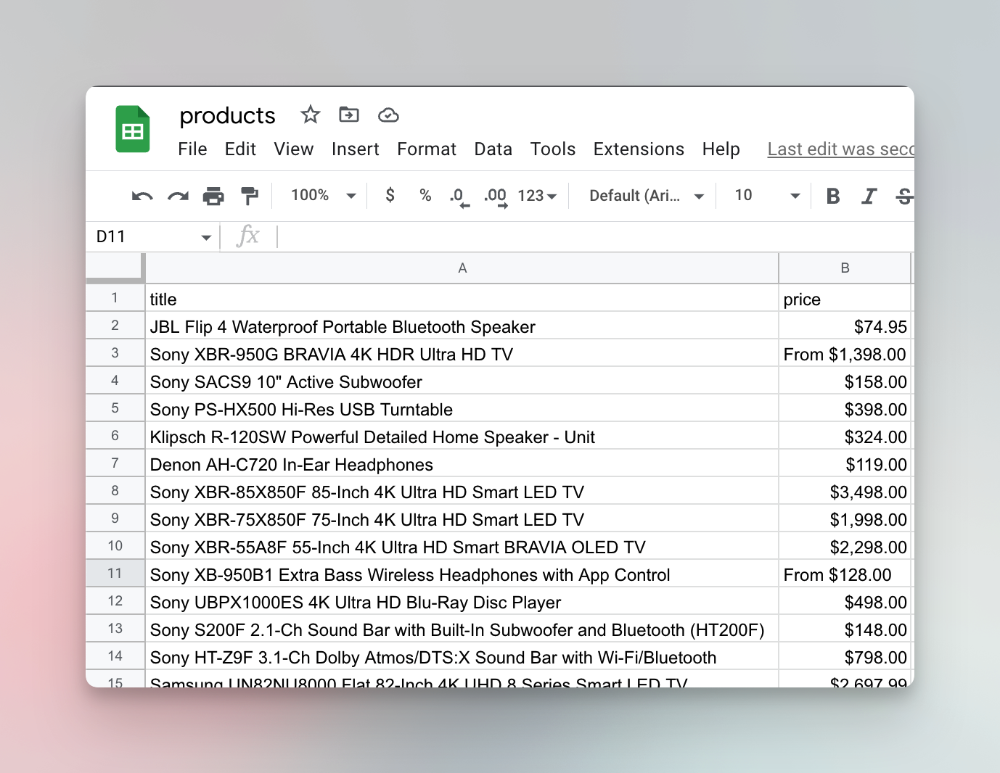

# Saving results to CSV {#saving-to-csv}

**Learn how to save the results of your scraper's collected data to a CSV file that can be opened in Excel, Google Sheets, or any other spreadsheets program.**

---

In the last lesson, we were able to extract data about all the on-sale products from [Warehouse Store](https://warehouse-theme-metal.myshopify.com/collections/sales). That's great. But we ended up with results printed to the terminal, which is not very useful for further processing. In this lesson, we'll learn how to save that data into a CSV file that you can then open in Excel or Google Sheets.

## Converting to CSV {#converting-to-csv}

It might look like a big programming challenge to transform a JavaScript object into a CSV, but thanks to NPM, this is going to be a walk in the park. Google search **json to csv npm**. You will find that there's a library called [`json2csv`](https://www.npmjs.com/package/json2csv) that can convert a JavaScript object to CSV format with a single function call. _Perfect!_

To install `json2csv`, run this command in your terminal. You need to be in the project's folder - the folder which has the `package.json` file.

```bash
npm i json2csv
```

First, we need to import the `parse()` function from the library.

```js
import { parse } from 'json2csv';
```

Next, we need to parse the `results` array from the previous lesson with the imported function.

```js
const csv = parse(results);
```

The full code including the earlier scraping part now looks like this. Replace the contents of your **main.js** file with this code:

```js
// main.js
import { gotScraping } from 'got-scraping';
import cheerio from 'cheerio';
import { parse } from 'json2csv'; // <---- added a new import

const storeUrl = 'https://warehouse-theme-metal.myshopify.com/collections/sales';

const response = await gotScraping(storeUrl);
const html = response.body;

const $ = cheerio.load(html);

const products = $('.product-item');

const results = [];
for (const product of products) {
    const titleElement = $(product).find('a.product-item__title');
    const title = titleElement.text().trim();

    const priceElement = $(product).find('span.price');
    const price = priceElement.contents()[2].nodeValue.trim();

    results.push({ title, price });
}

const csv = parse(results); // <---- added parsing of results to CSV
console.log(csv);
```

Now run the script with `node main.js`. The newly created CSV will be printed to the terminal.

```text
"title","price"
"JBL Flip 4 Waterproof Portable Bluetooth Speaker","$74.95"
"Sony XBR-950G BRAVIA 4K HDR Ultra HD TV","From $1,398.00"
"Sony SACS9 10"" Active Subwoofer","$158.00"
"Sony PS-HX500 Hi-Res USB Turntable","$398.00"
"Klipsch R-120SW Powerful Detailed Home Speaker - Unit","$324.00"
"Denon AH-C720 In-Ear Headphones","$119.00"
"Sony XBR-85X850F 85-Inch 4K Ultra HD Smart LED TV","$3,498.00"
"Sony XBR-75X850F 75-Inch 4K Ultra HD Smart LED TV","$1,998.00"
"Sony XBR-55A8F 55-Inch 4K Ultra HD Smart BRAVIA OLED TV","$2,298.00"
...
```

## Writing the CSV to a file {#writing-to-file}

The final task that remains is to save our CSV formatted data to a file on our disk, so we can open it or send it to someone. For this, we don't need any extra NPM packages because functions for saving files are included in Node.js.

First, we import the `writeFileSync` function from the `fs` (file system) package.

```js
import { writeFileSync } from 'fs';
```

and then call it with a file name and the CSV data.

```js
writeFileSync('products.csv', csv);
```

When we complete the code, it looks like this. Replace the code in your **main.js** file with this new code.

```js
// main.js
import { gotScraping } from 'got-scraping';
import cheerio from 'cheerio';
import { parse } from 'json2csv';
import { writeFileSync } from 'fs'; // <---- added a new import

const storeUrl = 'https://warehouse-theme-metal.myshopify.com/collections/sales';

const response = await gotScraping(storeUrl);
const html = response.body;

const $ = cheerio.load(html);

const products = $('.product-item');

const results = [];
for (const product of products) {
    const titleElement = $(product).find('a.product-item__title');
    const title = titleElement.text().trim();

    const priceElement = $(product).find('span.price');
    const price = priceElement.contents()[2].nodeValue.trim();

    results.push({ title, price });
}

const csv = parse(results);
writeFileSync('products.csv', csv); // <---- added writing of CSV to file
```

Finally, run it with `node main.js` in your terminal. After running it, you will find the **products.csv** file in your project folder. And when you open it with Excel/Google Sheets – voila!



This marks the end of the **Basics of data extraction** section of Web scraping for beginners. If you enjoyed the course, give us a thumbs up down below and if you're eager to learn more...

## Next up {#next}

Next up are the [**Basics of crawling**](../crawling/index.md). You already know how to build a scraper that finds all the products on sale in the [Warehouse Store](https://warehouse-theme-metal.myshopify.com/collections/sales). In the [**Basics of crawling**](../crawling/index.md) section you will learn how to open individual product pages of those products and scrape information that's not available on the listing page, like SKUs, descriptions or reviews.
