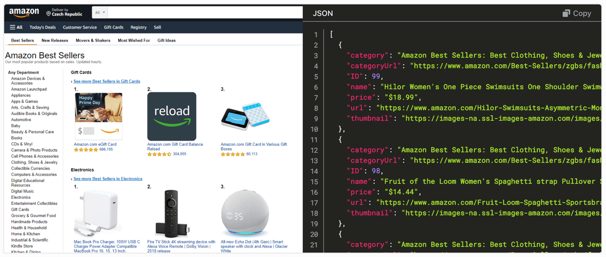

# Introduction {#introduction}

**Start learning about web scraping, web crawling, data collection, and popular tools to start developing your own scraper.**

---

Web scraping or crawling? Web data extraction, mining, or collection? You can find various definitions on the web. Let's agree on simple explanations that we will use throughout this beginner course on web scraping.

## What is web data extraction? {#what-is-data-extraction}

Web data extraction (or collection) is a process that takes a web page, like an Amazon product page, and collects useful information from the page, such as the product's name and price. Web pages are an unstructured data source and the goal of web data extraction is to make information from websites structured, so that it can be easily processed by data analysis tools or integrated with computer systems. The main sources of data on a web page are HTML documents and API calls, but also images, PDFs, and so on.

## What is crawling? {#what-is-crawling}

Where web data extraction focuses on a single page, web crawling (sometimes called spidering 🕷) is all about movement between pages or websites. The purpose of crawling is to travel across the website to find pages with the information we want. Crawling and collection can happen simultaneously, while moving from page to page, or separately, where one scraper focuses solely on finding pages with data and another scraper collects the data. The main purpose of crawling is to collect URLs or other links that can be used to move around.

## What is web scraping? {#what-is-web-scraping}

We use web scraping as an umbrella term for crawling, web data extraction and all other activities that have the purpose of converting unstructured data from the web to a structured format ready for integration or data analysis. In the advanced courses, you'll learn that modern web scraping is about much more than just HTML and URLs.

## Next up {#next}

In the [next lesson](./data_extraction/index.md), you will learn about the basic building blocks of each web page. HTML, CSS and JavaScript.
