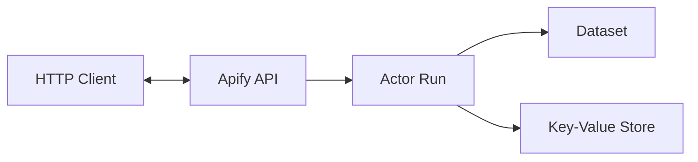

The Apify API provides programmatic access to the [Apify platform](https://docs.apify.com). The API is organized around [RESTful](https://en.wikipedia.org/wiki/Representational_state_transfer) HTTP endpoints.



The diagram illustrates the basic workflow when using the Apify API:

1. Your application communicates with the Apify API by sending requests to run Actors and receiving results back.
1. When you request to run an Actor, the Apify API creates and manages an Actor run instance on the platform.
1. The Actor processes data and stores results in Apify's storage systems:
   * **Dataset**: Structured storage optimized for tabular or list-type data, ideal for scraped items or processed results.
   * **Key-Value Store**: Flexible storage for various data types (including images, JSON, HTML, and text), perfect for configuration settings and non-tabular outputs.

## Prerequisites

Before you can start using the API, check if you have all the necessary prerequisites:

* An Apify account with an API token.
* A tool to make HTTP requests (cURL, Postman, or your preferred programming language).

## Authentication

You must authenticate all API requests presented on this page. You can authenticate using your API token:

`Authorization: Bearer YOUR_API_TOKEN`

You can find your API token in the Apify Console under **[Settings > Integrations](https://console.apify.com/settings/integrations)**.

## Basic workflow

A most common workflow involving Apify API consists of the following steps:

1. Running an Actor.
1. Monitoring the status of a run.
1. Retrieving the results.
1. Retrieving log for troubleshooting purposes. - optional

### 1. Run an Actor

#### Asynchronously

```http title="Endpoint"
POST https://api.apify.com/v2/acts/{actorId}/runs
```

```json title="Request body"
TODO
```

```json title="Response"
TODO
```

Expected response codes:

* 201

#### Synchronously

For shorter runs where you need immediate results:

```http title="Endpoint"
POST https://api.apify.com/v2/acts/{actorId}/run-sync
```

The request body is the same as for asynchronous runs, but the response will include the complete results once the Actor finishes.

Expected response codes:

* 201
* 400
* 408

### 2. Monitor run status

```http title="Endpoint"
GET https://api.apify.com/v2/actor-runs/:runId
```

``` json title="Response"
TODO
```

Expected response code:

* 200

### 3. Retrieve results

#### From a Dataset

Most Actors store their results in a dataset:

```http title="Endpoint"
GET https://api.apify.com/v2/datasets/{datasetId}/items
```

Optional query parameters:

* `format=json` (default), other possible formats are:
  * jsonl
  * xml
  * html
  * csv
  * xlsx
  * rss
* `limit=100` (number of items to retrieve)
* `offset=0` (pagination offset)

Expected code responses:

* 200

#### From a Key-value store

```http title="Endpoint"
GET https://api.apify.com/v2/key-value-stores/{storeId}/records/{recordKey}
```

Expected response codes:

* 200
* 302

### Get log

You can get a log for a specific run or build of an Actor.

```http title="Endpoint"
GET https://api.apify.com/v2/logs/:buildOrRunId
```

Expected code responses:

* 200

### Additional operations

#### Store data in Key-value store

To store your own data in a Key-value store:

```http title="Endpoint"
PUT https://api.apify.com/v2/key-value-stores/{storeId}/records/{recordKey}
```

Include your data in the request body and set the appropriate `Content-Type` header.

Expected response codes:

* 201

#### Verify your account

To check your API credentials or account details:

```http title="Endpoint"
GET https://api.apify.com/v2/users/me
```

Expected response codes:

* 200

## Next steps

* Explore more advanced API endpoints in our full [API reference](/api/v2).
* Learn about webhooks to get notified when your runs finish.
* Check out Apify client libraries for the following programming languages:
  * [JavaScript](/api/client/js/)
  * [Python](/api/client/python)
