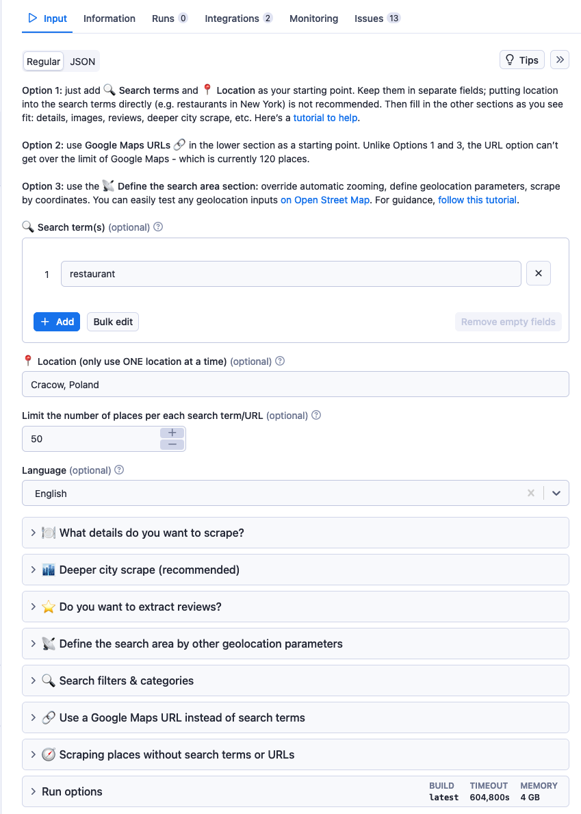
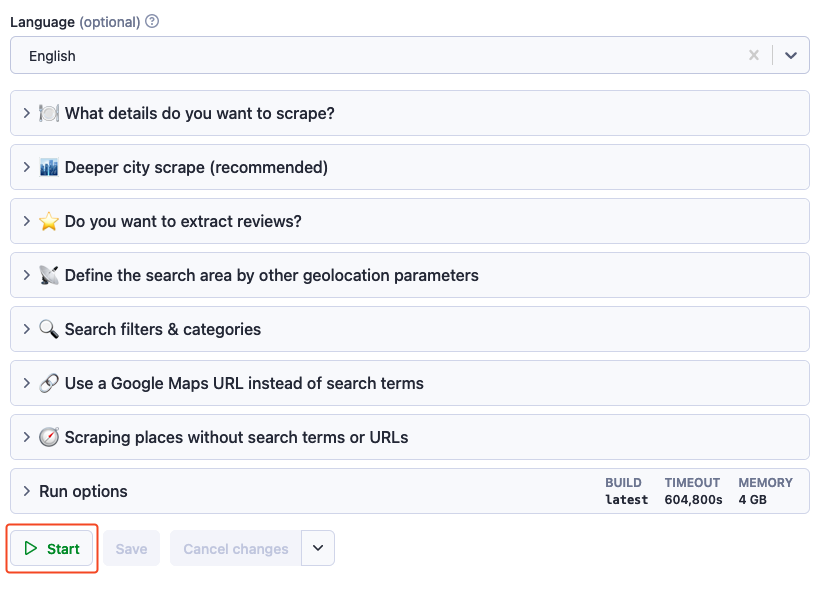

**Create and save reusable configurations of Apify Actors tailored to specific use cases.**

---

Actor tasks let you create multiple reusable configurations of a single Actor, adapted for specific use cases. For example, you can create one [_Web Scraper_](https://apify.com/apify/web-scraper) configuration (task) that scrapes the latest reviews from IMDb, another that scrapes nike.com for the latest sneakers, and a third that scrapes your competitor's e-shop. You can then use and reuse these configurations directly from [Apify Console](https://console.apify.com/actors/tasks), [Schedules](/platform/reference/schedules), or [API](/api/v2/actor-task-runs-post).

You can find all your tasks in the [Apify Console](https://console.apify.com/actors/tasks).

## Create

To create a task, open any Actor from [Apify Store](https://console.apify.com/store) or your list of [Actors](https://console.apify.com/actors) in Apify Console. At the top-right section of the page, click the **Create task** button.

## Configure

You can set up your task's input under the **Input** tab. A task's input configuration works just like an Actor's. After all, it's just a copy of an Actor you can pre-configure for a specific scenario. You can use either JSON or the visual input UI.

An Actors' input fields may vary depending on their purpose, but they all follow the same principle: _you provide an Actor with the information it needs so it can do what you want it to do._

You can set run options such as timeout and [memory](/platform/using-actors/usage-and-resources) in the **Run options** tab of the task's input configuration.

### Naming

To make a task easier to identify, you can give it a name, title, and description by clicking its caption on the detail page. A task's name should be at least `3` characters long with a limit of `63` characters.

## Run

Once you've configured your task, you can run it using the **Start** button on the top-right side of the screen.

Or using the **Start** button positioned following the input configuration.

You can also run tasks using:

- [Schedules](/platform/reference/schedules).
- Directly via the [Apify API](/api/v2/actor-task-runs-post).
- The [JavaScript API client](/api/client/js/reference/class/TaskClient).
- The [Python API client](/api/client/python/reference/class/TaskClient).

## Share

Like any other resource, you can share your Actor tasks with other Apify users via the [access rights](/platform/collaboration) system.
