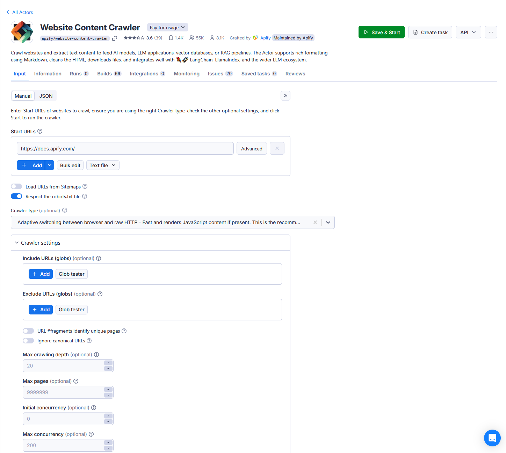

**Learn how to define and validate a schema for your Actor's input with code examples. Provide an autogenerated input UI for your Actor's users.**

---

The input schema defines the input parameters for an Actor. It's a `JSON` object comprising various field types supported by the Apify platform. Based on the input schema, the Apify platform automatically generates a user interface for the Actor. It also validates the input data passed to the Actor when it's executed through the API or the Apify Console UI.

The following is an example of an auto-generated UI for the [Website Content Crawler](https://apify.com/apify/website-content-crawler) Actor.



With an input schema defined as follows:

```json5
{
    "title": "Input schema for Website Content Crawler",
    "description": "Enter the start URL(s) of the website(s) to crawl, configure other optional settings, and run the Actor to crawl the pages and extract their text content.",
    "type": "object",
    "schemaVersion": 1,
    "properties": {
        "startUrls": {
            "title": "Start URLs",
            "type": "array",
            "description": "One or more URLs of the pages where the crawler will start. Note that the Actor will additionally only crawl sub-pages of these URLs. For example, for the start URL `https://www.example.com/blog`, it will crawl pages like `https://example.com/blog/article-1`, but will skip `https://example.com/docs/something-else`.",
            "editor": "requestListSources",
            "prefill": [{ "url": "https://docs.apify.com/" }]
        },
        "crawlerType": {
            "sectionCaption": "Crawler settings",
            "title": "Crawler type",
            "type": "string",
            "enum": ["playwright:chrome", "cheerio", "jsdom"],
            "enumTitles": ["Headless web browser (Chrome+Playwright)", "Raw HTTP client (Cheerio)", "Raw HTTP client with JS execution (JSDOM) (experimental!)"],
            "description": "Select the crawling engine:\n- **Headless web browser** (default) - Useful for modern websites with anti-scraping protections and JavaScript rendering. It recognizes common blocking patterns like CAPTCHAs and automatically retries blocked requests through new sessions. However, running web browsers is more expensive as it requires more computing resources and is slower. It is recommended to use at least 8 GB of RAM.\n- **Raw HTTP client** - High-performance crawling mode that uses raw HTTP requests to fetch the pages. It is faster and cheaper, but it might not work on all websites.",
            "default": "playwright:chrome"
        },
        "maxCrawlDepth": {
            "title": "Max crawling depth",
            "type": "integer",
            "description": "The maximum number of links starting from the start URL that the crawler will recursively descend. The start URLs have a depth of 0, the pages linked directly from the start URLs have a depth of 1, and so on.\n\nThis setting is useful to prevent accidental crawler runaway. By setting it to 0, the Actor will only crawl start URLs.",
            "minimum": 0,
            "default": 20
        },
        "maxCrawlPages": {
            "title": "Max pages",
            "type": "integer",
            "description": "The maximum number pages to crawl. It includes the start URLs, pagination pages, pages with no content, etc. The crawler will automatically finish after reaching this number. This setting is useful to prevent accidental crawler runaway.",
            "minimum": 0,
            "default": 9999999
        },
        // ...
    }
}
```

The actual input object passed from the autogenerated input UI to the Actor then looks like this:

```json
{
    "debugMode": false,
    "proxyConfiguration": {
        "useApifyProxy": true
    },
    "saveHtml": false,
    "saveMarkdown": false,
    "saveScreenshots": false,
    "startUrls": [
        {
            "url": "https://docs.apify.com/"
        }
    ]
}
```

Next, let's take a look at [input schema specification](/platform/building-actors/actor-definition/input-schema/specification/v1), and the possibility of using input schema to enable users to pass [secrets](/platform/building-actors/actor-definition/input-schema/secret-input).
