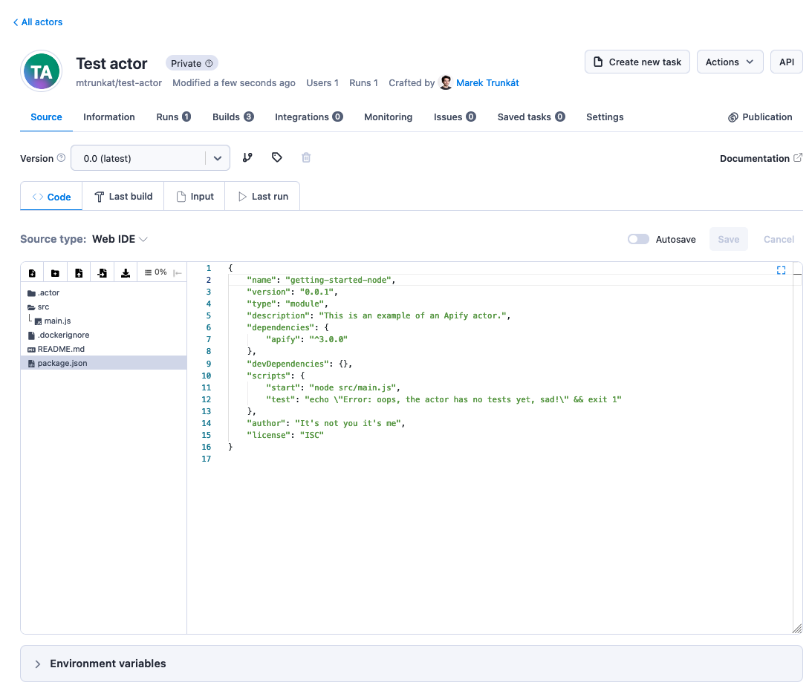
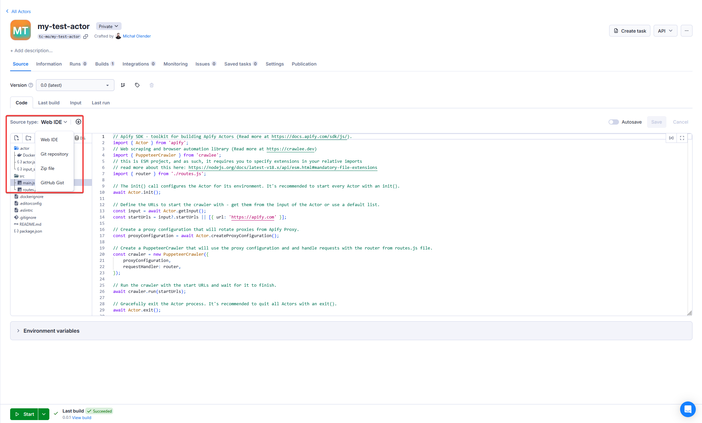

**Learn how to deploy your Actors to the Apify platform and build them.**

---

Deploying an Actor involves uploading your [source code](/platform/actors/development/actor-definition) and [building](/platform/actors/development/builds-and-runs/builds) it on the Apify platform. Once deployed, you can run and scale your Actor in the cloud.

## Deploy using Apify CLI

The fastest way to deploy and build your Actor is by using the [Apify CLI](/cli). If you've completed one of the tutorials from the [academy](/academy), you should have already have it installed. If not, follow the [Apify CLI installation instructions](/cli/docs/installation).

To deploy your Actor using Apify CLI:

1. Log in to your Apify account:

    ```bash
    apify login
    ```

1. Navigate to the directory of your Actor on your local machine.

1. Deploy your Actor by running:

    ```bash
    apify push
    ```

When you deploy using the CLI, your source code is uploaded as "multiple source files" and is visible and editable in the Web IDE.



:::note Source files size limit

The CLI deploys code as multiple source files up to 3 MB. Beyond that, it deploys as a Zip file.

:::

### Pull an existing Actor

You can also pull an existing Actor from the Apify platform to your local machine using `apify pull` command

```bash
apify pull [ACTORID]
```

This command fetches the Actor's files to your current directory. If the Actor is defined as a Git repository, it will be cloned, for Actors defined in the Web IDE, the command will fetch the files directly.

You can specify a particular version of the Actor to pull by using the `--version` flag:

```bash
apify pull [ACTORID] --version=1.2
```

If you don't provide the `ACTORID`, the command will update the Actor in the current directory based on its name in the `.actor/actor.json` file.

## Alternative deployment methods

To deploy using other methods, first create the Actor manually through Apify CLI or Apify Console, then change its source type:



You can link your Actor to a Git repository, Gist, or a Zip file.

For more information on alternative source types, check out next chapter.

